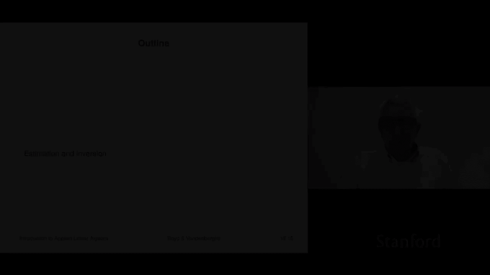
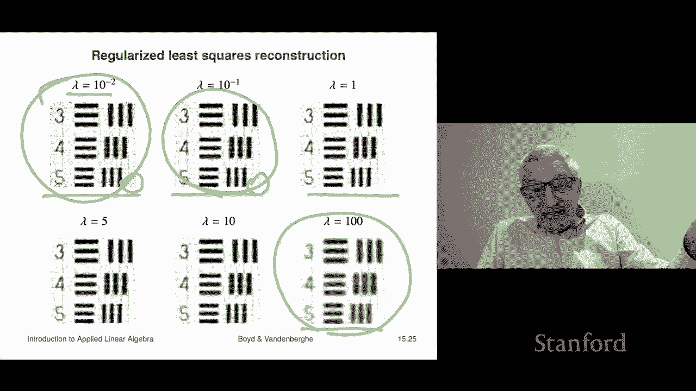
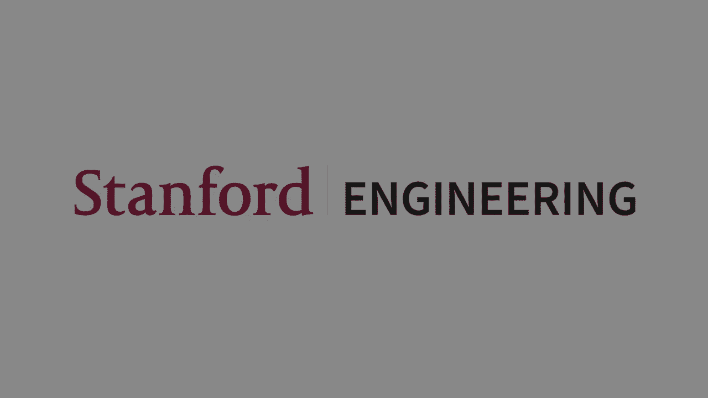

# 43：L15.3 - 预估与正则化 📊

在本节课中，我们将学习如何利用多目标最小二乘法进行参数估计和反演。我们将从一个基础的测量模型出发，探讨如何通过观测数据来估计未知参数，并引入正则化技术来处理实际问题中的先验信息。课程内容将涵盖最小二乘估计的基本思想、正则化的概念及其应用，并通过图像去模糊和断层扫描重建两个具体实例，展示这些方法在实际问题中的强大作用。

---

## 测量模型与最小二乘估计 📐

上一节我们介绍了多目标最小二乘法的基本框架。本节中，我们来看看它在参数估计问题中的应用。

在许多科学和工程领域，我们常常无法直接测量我们感兴趣的参数。例如，我们可能想了解地下岩层的密度，但无法在每个位置都进行钻孔测量。相反，我们只能在地表进行一些间接的观测。

这种情况可以用一个线性测量模型来描述：
`y = Ax + v`
其中：
*   `x` 是一个 `m` 维向量，代表我们想要估计的未知参数。
*   `y` 是一个 `n` 维向量，代表我们实际观测到的测量值。
*   `A` 是一个 `n x m` 的矩阵，它根据物理原理或其他知识，描述了参数 `x` 如何映射到无噪声的理想观测值。
*   `v` 是一个 `n` 维向量，代表测量噪声、误差或干扰。

我们的目标是：在已知矩阵 `A` 和观测向量 `y` 的情况下，猜测出参数 `x`。

一个直观的想法是，假设噪声 `v` 很小。如果我们猜测了一个 `x`，那么对应的噪声估计就是 `v = y - Ax`。为了使噪声最小化，我们选择使这个差值最小的 `x`。这引出了**最小二乘估计**：通过最小化 `||Ax - y||` 来猜测 `x`。

换句话说，我们选择一个 `x`，使得模型预测的输出 `Ax` 尽可能接近我们实际观测到的 `y`。这完全符合直觉。

---

## 🛡️ 正则化估计

上一节我们介绍了基础的最小二乘估计。然而在实际问题中，我们通常对参数 `x` 有一些先验知识。例如，我们可能知道 `x` 的数值不应该太大，或者 `x` 的变化应该是平滑的。这些先验信息可以通过**正则化**技术融入到估计过程中。

以下是两种常见的正则化项及其数学表达：

1.  **Tikhonov 正则化**：用于表达 `x` 本身应该较小的先验信念。
    公式为：`J₁ = ||x||²`

2.  **平滑正则化**：用于表达 `x` 应该平滑变化的先验信念。通常通过一个差分算子 `D` 来实现。
    公式为：`J₂ = ||Dx||²`
    例如，如果 `x` 是一个时间序列，`D` 可以是差分矩阵，那么 `Dx` 就代表了序列的差分（变化率）。最小化 `||Dx||²` 就意味着寻找一个变化平缓的 `x`。

我们将这些先验信息与原始的数据拟合目标结合起来，形成一个多目标优化问题：最小化 `||Ax - y||² + λJ`，其中 `J` 是正则化项（如 `J₁` 或 `J₂`），`λ` 是一个正的正则化参数。

参数 `λ` 控制着我们对先验信息的重视程度：
*   `λ` 很小时，解主要致力于拟合观测数据 `y`。
*   `λ` 很大时，解会更多地满足先验约束（如更小、更平滑）。

在实际应用中，`λ` 的选择常常是经验性的：调整 `λ` 直到结果在视觉上或物理上看起来合理。也可以在有真实数据的情况下，通过交叉验证等更有原则的方法来选择。

一个有趣的性质是，即使矩阵 `A` 的列不是线性独立的（即测量数量少于参数数量，形成一个“宽”系统），加入正则化项后，最小二乘问题仍然是良定义的。这意味着正则化允许我们在数据不足的情况下进行估计。

---

## 🖼️ 实例一：图像去模糊

现在，让我们通过一个具体例子来看看正则化最小二乘的应用。第一个例子是**图像去模糊**。

假设 `x` 代表一张原始的灰度图像（按像素排列成一个长向量）。矩阵 `A` 是一个模糊算子（例如，一个卷积矩阵），它模拟了相机或光学系统对图像的模糊效果。观测值 `y` 就是一张模糊且带有噪声的图像。

我们的目标是：从模糊噪声图像 `y` 中，恢复出清晰的原始图像 `x`。

我们构建以下正则化最小二乘问题：
最小化 `||Ax - y||² + λ||Dx||²`
其中：
*   第一项 `||Ax - y||²` 要求去模糊后的图像 `x` 在经过模糊模型 `A` 后，应该接近观测到的模糊图像 `y`。
*   第二项 `||Dx||²` 是正则化项。这里 `D` 是一个差分算子矩阵，它计算图像水平和垂直方向的梯度。最小化这项意味着我们希望恢复的图像 `x` 是平滑的（没有过多噪声和伪影）。这符合我们对自然图像的先验认知。

我们通过调整 `λ` 来获得不同的结果。下图展示了从模糊噪声图像出发，使用不同 `λ` 值进行去模糊重建的效果：

以下是不同 `λ` 值对应的效果分析：
*   **λ = 10⁻⁶**：正则化权重极低，重建图像虽然锐利，但充满了噪声和不平滑的斑点，因为算法几乎只专注于拟合数据。
*   **λ = 10⁻⁴**：增加正则化权重，图像在保持锐利的同时变得平滑了一些。
*   **λ = 10⁻²**：进一步平滑，去模糊效果良好，是视觉上较好的结果。
*   **λ = 1**：正则化权重过高，图像过于平滑，丢失了许多重要的边缘和细节。
*   **λ = 100**（图中未展示）：图像会变成一个几乎无法辨认的灰色色块。

这个例子清晰地展示了正则化参数 `λ` 如何在“拟合观测数据”和“满足先验平滑性”之间进行权衡。

---

## 实例二：断层扫描重建 🧪

上一个例子展示了在图像处理中的应用。本节我们来看一个在医学和工业检测中非常重要的应用：**断层扫描重建**。

在断层扫描（如CT）中，`x` 代表感兴趣区域内各体素（三维）或像素（二维）的某种物理属性（如密度）。我们无法直接测量每个体素的值，但可以测量穿过该区域的许多“线积分”。例如，一束X射线穿过物体，其衰减程度就是沿路径密度的线积分。

设我们有 `n` 条测量路径，`m` 个像素。矩阵 `A` 的每一行对应一条路径，`A(i,j)` 表示第 `i` 条路径穿过第 `j` 个像素的长度。观测向量 `y` 就是测量到的所有线积分值。

我们的任务是：从线积分测量值 `y` 中，反推出每个像素的属性值 `x`。

我们同样使用正则化最小二乘：
最小化 `||Ax - y||² + λ₁||x||² + λ₂||Dx||²`
这里我们甚至可以使用两个正则化项：
*   `||x||²`（Tikhonov正则化）：倾向于让像素值本身较小。
*   `||Dx||²`（平滑正则化）：倾向于让图像在空间上是平滑的。
`λ₁` 和 `λ₂` 是两个超参数，分别控制两种先验的强度。

下图展示了一个模拟的断层扫描重建例子。我们有一个包含特定形状物体的区域，通过从不同角度发射射线获取了4000个线积分测量值，目标是重建出100x100像素的图像。

以下是不同正则化强度下的重建结果：
*   **λ 较小**：重建图像能捕捉细节，但可能包含噪声和伪影。
*   **λ 适中**：在保持物体形状的同时，图像较为平滑清晰。
*   **λ 过大**：图像过于平滑，细节丢失严重，物体特征变得模糊。

在实际应用中（如医学诊断），参数的选择可能需要领域专家（如放射科医生）的参与，以判断哪种重建结果最有利于做出准确判断。

断层扫描的思想非常通用，其核心“从投影（线积分）重建内部结构”的理念，也适用于交通流量分析、网络探测等众多领域。

---

## 总结 📝

在本节课中，我们一起学习了多目标最小二乘法在预估与反演问题中的应用。

我们首先从基础的线性测量模型 `y = Ax + v` 出发，介绍了**最小二乘估计**的基本思想，即通过最小化 `||Ax - y||` 来估计未知参数 `x`。

接着，我们引入了**正则化**技术，它允许我们将关于参数的先验知识（如“值较小”或“变化平滑”）融入到估计过程中。通过解决形如 `最小化 ||Ax - y||² + λJ(x)` 的问题，并在 `λ` 和 `J(x)`（如 `||x||²` 或 `||Dx||²`）之间进行权衡，我们可以得到更稳健、更符合物理意义的估计结果。

最后，我们通过**图像去模糊**和**断层扫描重建**两个生动的实例，具体展示了正则化最小二乘法如何解决实际问题。这两个例子充分说明了，通过巧妙地构建模型和设计正则化项，我们可以从间接、嘈杂的观测数据中，有效地恢复出我们感兴趣的信息。