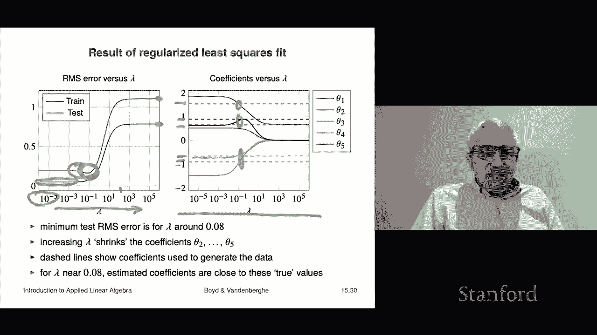

# 44：L15.4 - 正则化数据拟合 📊


在本节课中，我们将学习一种强大的模型拟合改进方法——正则化数据拟合。这是多目标最小二乘法的一个重要应用。

## 概述 🎯

上一节我们介绍了多目标最小二乘法的基本概念。本节中，我们将探讨如何利用它来解决一个实际问题：**正则化数据拟合**。这种方法通过在标准拟合目标之外，增加一个使模型系数“变小”的额外目标，来提升模型的泛化能力和稳定性。

## 动机与基本思想 🧠

首先，我们来理解正则化的动机。假设我们有一个数据模型，用于描述变量 `y` 和 `x` 之间我们猜测存在的关系，即 `y ≈ f(x)`，其中 `f` 是未知函数。

我们采用一个**参数线性模型**来拟合。具体做法是选择一组基函数 `f₁(x), f₂(x), ..., fₚ(x)`，然后拟合这些基函数前的参数 `θ₁, θ₂, ..., θₚ`。通常，我们假设 `f₁(x) = 1`，即常数项，这意味着模型的第一项 `θ₁` 是偏移量。

参数 `θᵢ` 的一个解释是：它衡量了我们的预测 `ŷ` 对基函数 `fᵢ(x)` 变化的敏感度。例如：
*   如果 `θ₃ = 0`，则 `f₃(x)` 对预测没有影响。
*   如果 `θ₄` 非常大，那么 `f₄(x)` 的微小变化会导致预测值 `ŷ` 的巨大变化，即模型非常敏感。

直觉上，我们不希望 `θ₂` 到 `θₚ` 这些系数过大，因为过大的系数意味着模型对输入数据（基函数值）的微小波动过于敏感，这通常不是好现象。我们一般不关心偏移量 `θ₁` 的大小。

基于此，正则化的核心思想是：在优化时同时考虑两个目标。
1.  第一个目标是传统的**最小二乘拟合误差**，我们希望它小。
2.  第二个目标是希望 `θ₂` 到 `θₚ` 这些系数本身也**小**。

## 正则化数据拟合公式 📝

假设我们有训练数据集。我们将训练数据上的预测误差表示为 `Aθ - y`，其中 `y` 是观测值向量，`A` 是由基函数在数据点上取值构成的矩阵。

正则化数据拟合问题定义如下：

**主要目标**是通常的最小二乘目标：
`J₁(θ) = ||Aθ - y||²`
我们希望这个目标小。

我们将其转化为一个双目标问题，增加**第二个目标**：
`J₂(θ) = θ₂² + θ₃² + ... + θₚ²`
这个目标希望系数 `θ₂` 到 `θₚ` 小。

我们将这两个目标结合，形成一个加权和的单目标优化问题：
```
最小化：||Aθ - y||² + λ (θ₂² + θ₃² + ... + θₚ²)
```
其中，`λ` 被称为**正则化参数**。这个过程就叫做**正则化**数据拟合。

对于回归模型 `ŷ = xᵀβ + ν·1`（其中 `ν` 对应 `θ₁`，`β` 对应 `θ₂` 到 `θₚ`），正则化问题可以具体写为：
```
最小化：||Xβ + 1ν - y||² + λ||β||²
```
这里我们不正则化偏移量 `ν`，只正则化系数 `β`。

## 正则化参数 λ 的影响 🔧

理解参数 `λ` 的影响至关重要：

*   当 **`λ = 0`** 时，我们完全恢复了标准的最小二乘数据拟合。
*   当 **`λ` 变得非常大**时，第二项的成本极高，会迫使 `θ₂` 到 `θₚ` 趋向于零。此时，模型会退化为一个常数模型（即 `ŷ` 等于 `y` 的均值）。此时的均方预测误差就是 `y` 的 RMS 值的平方。

正则化在统计学中也常被称为**收缩**，因为它会使系数向零收缩，变得比没有正则化项时更小。

## 如何选择正则化参数 λ 🧪

选择 `λ` 有一个很好的实践方法：

1.  我们通常在一系列 `λ` 值上构建模型。传统上，会尝试20到30个不同的 `λ` 值，这些值在一个很大的范围内（例如从 `10⁻⁵` 到 `10⁵`）呈对数均匀分布。
2.  对于每一个 `λ` 值，我们得到一个不同的模型。
3.  然后，我们在一个独立的**测试数据集**上评估每一个模型的表现（计算测试误差）。
4.  我们寻找使测试误差最小的那个 `λ` 值。实际上，人们有时会选择比最优值稍大一点的 `λ`，因为更大的 `λ` 通常意味着系数更小，模型对数据波动的敏感性更低，这通常被认为是更稳健的。

## 实例分析 📈

让我们通过一个简单的例子来直观理解正则化的效果。

我们有一个由正弦函数加噪声生成的“真实”函数。我们用10个蓝点作为**训练数据**，用20个红点作为**测试数据**。我们的模型使用一组正弦基函数进行拟合。

以下是观察结果：

*   当 **`λ` 非常小**（接近0）时，我们进行的是标准最小二乘拟合。训练误差很低（约0.05），但测试误差较高（约0.2）。
*   随着 **`λ` 增大**，训练误差自然上升（因为我们在两个目标间权衡）。但有趣的是，测试误差**先下降后上升**，在 `λ ≈ 0.1` 附近出现了一个明显的“谷底”。
*   当 **`λ` 非常大**（>100）时，模型退化为常数模型，测试误差稳定在一个较高的水平。

这个“谷底”表明，存在一个最优的 `λ` 值（本例中约为0.1），能显著提升模型在未见数据上的表现（泛化能力）。

我们还可以绘制**正则化路径**，即系数 `θ₁` 到 `θ₅` 随 `λ` 变化的曲线。在本例中，当 `λ` 取在测试误差最低点附近时，拟合出的系数值意外地接近生成数据时使用的“真实”参数值（图中虚线所示）。这展示了正则化如何帮助我们在数据有限（10个点拟合5个参数）的情况下，得到更接近真实情况的模型。

## 总结 💎

本节课我们一起学习了**正则化数据拟合**。

*   我们首先了解了其动机：防止模型系数过大，从而降低模型对输入数据的过度敏感。
*   然后，我们学习了其数学形式：在最小二乘损失函数基础上，增加一个对系数大小的惩罚项 `λ||β||²`。
*   我们探讨了正则化参数 `λ` 的作用：`λ=0` 对应普通最小二乘，`λ→∞` 对应常数模型。
*   接着，我们掌握了通过**在测试集上验证**来选择合适 `λ` 的实用方法。
*   最后，通过一个实例，我们直观看到了正则化如何通过权衡拟合优度与模型复杂度，有效降低测试误差，提升模型的泛化性能。




掌握带正则化的最小二乘数据拟合，就拥有了构建有效预测模型的强大基础工具。虽然未来从统计学等角度还会有更深入的理解，但这是实践中最核心、最实用的方法之一。