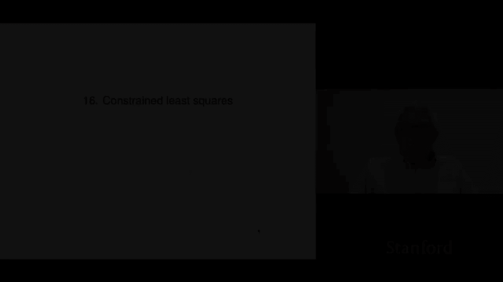
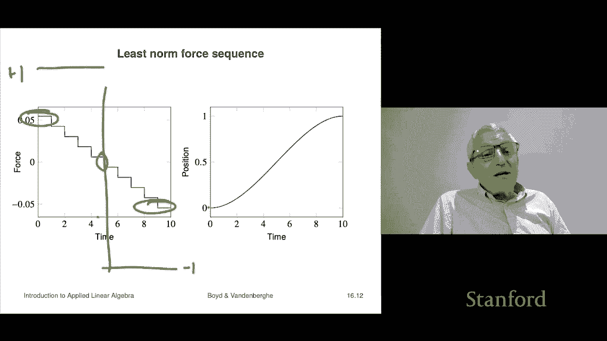

# 45：L16.1 - 受约束的最小二乘法 📘

在本节课中，我们将学习受约束的最小二乘法。这是对普通最小二乘法的一种扩展，允许我们在最小二乘问题中添加线性等式约束。这实际上将我们已知的两项技能——求解线性方程组和最小二乘法——结合在了一起。

## 问题定义与术语

首先，我们来定义什么是线性约束最小二乘问题，我们将其简称为 CLS。这是一个优化问题，描述如下：

**最小化**： `||Ax - b||²`
**约束条件**： `Cx = d`

这里的变量是我们希望求解的 n 维向量 `x`。目标函数 `||Ax - b||²` 越小越好。约束条件 `Cx = d` 意味着我们只考虑满足该等式的 `x`。满足约束的 `x` 称为可行解。在可行解中，目标函数值最小的那个就是最优解。

在这个问题中，矩阵 `A` 是 m×n 维，向量 `b` 是 m 维。矩阵 `C` 是 p×n 维，表示有 p 个线性等式约束，向量 `d` 是 p 维。`A`, `b`, `C`, `d` 是已知的问题数据。

一个向量 `x̂` 是此问题的解，需要满足两个条件：
1.  **可行性**： `Cx̂ = d`
2.  **最优性**： 对于任何满足 `Cx = d` 的向量 `x`，都有 `||Ax̂ - b||² ≤ ||Ax - b||²`

这个问题可以看作是双目标优化问题在权重趋于无穷大时的极限。考虑以下问题：
`最小化： ||Ax - b||² + λ||Cx - d||²`
当 λ → ∞ 时，为了最小化目标，必须迫使 `Cx = d`，这就回到了我们的 CLS 问题。

## 示例：分段多项式拟合

为了理解 CLS 的应用，我们来看一个拟合分段多项式的例子。

假设我们想用一个分段函数 `f̂(x)` 来拟合数据点 `(x_i, y_i)`。这个函数在 `x < a` 时是一个三次多项式 `P(x)`，在 `x ≥ a` 时是另一个三次多项式 `Q(x)`。我们不仅希望拟合误差小，还希望函数在连接点 `a` 处连续且导数连续（这构成了一个三次样条）。

因此，我们的优化问题是：
**最小化**： `∑ (f̂(x_i) - y_i)²`
**约束条件**：
1.  `P(a) = Q(a)` （连续性）
2.  `P'(a) = Q'(a)` （导数连续性）

我们可以将两个多项式的所有系数（例如 `θ₁, θ₂, θ₃, θ₄` 对应 `P`， `θ₅, θ₆, θ₇, θ₈` 对应 `Q`）组合成一个参数向量 `θ`。拟合误差可以写成 `||Aθ - y||²` 的形式。两个约束条件则是关于 `θ` 的线性方程，可以写成 `Cθ = d`（这里 `d` 是零向量）。这样，问题就完全转化成了标准的 CLS 形式。

通过求解这个 CLS 问题，我们得到的拟合曲线会在点 `a` 处平滑连接，避免了函数值或斜率的跳跃。

## 特例：最小范数问题

在深入如何求解一般 CLS 问题之前，我们先看一个重要的特例：**最小范数问题**。

当 CLS 问题中的 `A = I`（单位矩阵）且 `b = 0` 时，问题简化为：
**最小化**： `||x||²`
**约束条件**： `Cx = d`

其几何意义是：在所有满足线性方程组 `Cx = d` 的解中，寻找欧几里得范数（即长度）最小的那个 `x`。这在许多应用中意味着寻找“最省力”或“最经济”的解决方案，尤其当 `Cx = d` 有很多解时。

## 示例：质量块的最优控制

考虑一个在无摩擦面上的单位质量块，初始静止。我们可以在 10 秒内，每秒施加一个力 `f_t`（共10个力，构成向量 `f`）。目标是设计一个力序列，使得 10 秒后质量块恰好移动到位置 1 处，并且速度为零。

根据物理定律，最终位置和速度与力序列 `f` 的关系是线性的，可以写成 `Cf = d` 的形式，其中 `d = [0, 1]ᵀ`（速度为零，位置为1）。这个方程组通常有无穷多解。

一种简单的“砰砰”解是：前 1 秒施加 `+1` 牛顿的力，接着 1 秒施加 `-1` 牛顿的力，最后 8 秒施加 `0` 牛顿的力。这个解的范数平方为 `1² + (-1)² = 2`。

然而，我们可以寻找**最小范数解**，即最小化 `||f||²` 且满足 `Cf = d` 的力序列。通过求解这个最小范数问题（方法将在后面介绍），我们得到一个完全不同的力序列。它的范数平方仅为 0.0121，远小于“砰砰”解的 2。这个力序列从很小的正力开始，逐渐减小并过渡为负力，最终平滑地将质量块送到目标位置。这种平滑、能量效率高的解在实际控制工程中非常常用。

## 总结

本节课我们一起学习了受约束的最小二乘法的基本概念。我们首先定义了 CLS 问题，它结合了最小二乘拟合和线性等式约束。然后，我们通过分段多项式拟合的例子，展示了如何将实际问题建模为 CLS 形式。接着，我们探讨了一个重要的特例——最小范数问题，其目标是在满足线性方程组的解中找到范数最小的一个。最后，通过质量块控制这个生动例子，我们看到了最小范数解如何产生平滑、高效的解决方案。在接下来的课程中，我们将介绍求解这些问题的具体方法。

