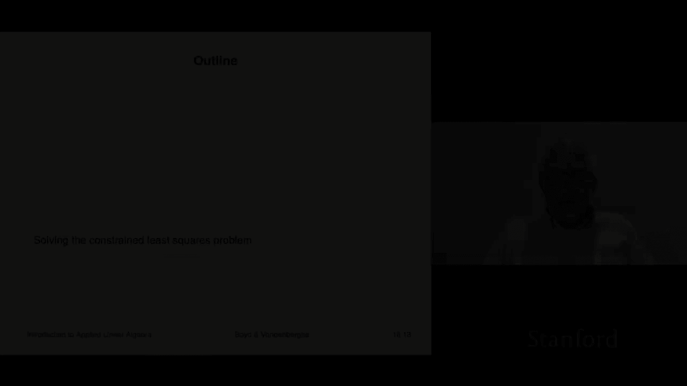
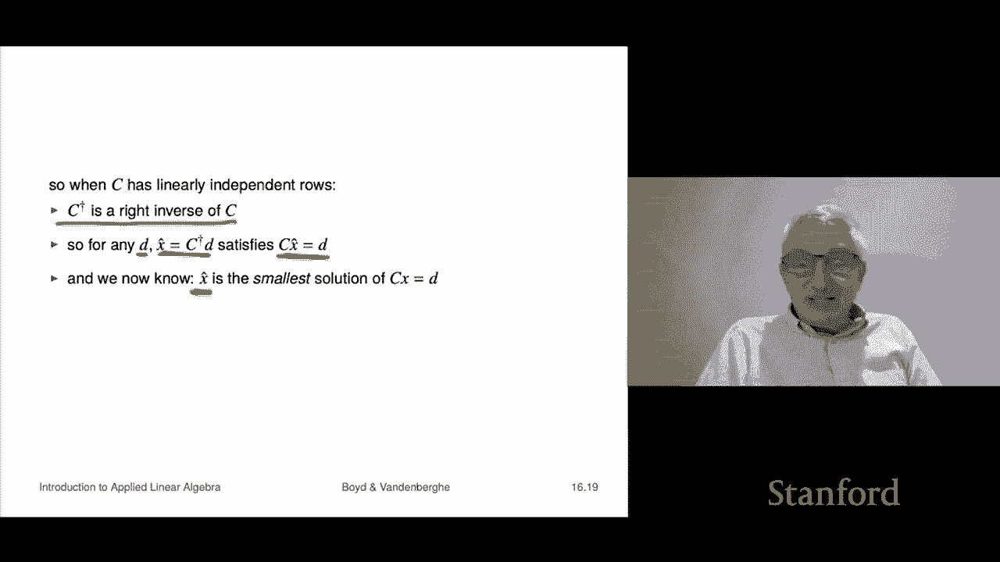

# 46：L16.2 - 受约束的最小二乘求解 📘




在本节课中，我们将学习如何求解受约束的最小二乘问题。我们将看到，这个问题可以转化为一个涉及线性方程组求解或QR分解的熟悉形式。课程将从传统的拉格朗日乘数法推导开始，然后介绍一个更清晰、更简单的直接验证方法。最后，我们会探讨一个特例——最小范数问题，并揭示它与伪逆之间的优美联系。

---

## 拉格朗日乘数法推导 🧮

上一节我们介绍了受约束的最小二乘问题。本节中，我们将使用微积分中的拉格朗日乘数法来推导其求解方法。这是一种传统方法，其核心思想是引入一组称为拉格朗日乘子的变量，将约束条件融入目标函数中。

首先，我们构造拉格朗日函数 **L(x, z)**：
```
L(x, z) = ||Ax - b||² + z₁(c₁ᵀx - d₁) + ... + zₚ(cₚᵀx - dₚ)
```
其中，**z₁, ..., zₚ** 是拉格朗日乘子，**cᵢᵀx = dᵢ** 是约束条件。

最优性条件要求拉格朗日函数对所有变量的偏导数为零。

以下是需要满足的条件：
1.  对 **x** 的偏导数为零：**∂L/∂x = 0**
2.  对每个拉格朗日乘子 **zᵢ** 的偏导数为零：**∂L/∂zᵢ = 0**

第二个条件直接给出了原始约束 **Cx = d**。第一个条件经过计算后，可以得到以下矩阵形式的方程：
```
2AᵀA x̂ + Cᵀz = 2Aᵀb
```

---

## ⚙️ KKT 条件与求解

上一节我们得到了两个最优性条件。本节中，我们将它们组合成一个统一的线性方程组，即著名的KKT（Karush-Kuhn-Tucker）条件。

将两个条件组合，我们得到以下**KKT方程组**：
```
[ 2AᵀA   Cᵀ ] [ x̂ ] = [ 2Aᵀb ]
[  C      0  ] [ z ]   [   d   ]
```
这是一个包含 **n + p** 个方程和 **n + p** 个变量（**x̂** 和 **z**）的方形线性系统。我们可以将其视为普通最小二乘问题中**正规方程**在受约束情况下的推广。

假设这个KKT矩阵是可逆的，那么求解受约束最小二乘问题就简化为求解这个线性方程组。我们通常只关心解 **x̂**，而乘子 **z** 在计算后可以丢弃。一个直接的求解方法是计算该矩阵的QR分解。

关于可解性，一个关键条件是矩阵 **C** 的行线性无关，且矩阵 **[A; C]** 的列线性无关。

---

## ✅ 一个更简单的直接验证

上一节通过拉格朗日方法得到了候选解。本节中，我们将提供一个更简单、更清晰的直接验证，证明由KKT方程给出的 **x̂** 确实是全局最优解。

这个验证不依赖复杂的微积分，只使用基本的向量范数性质。思路是：对于任意满足约束 **Cx = d** 的可行向量 **x**，证明其目标函数值都不小于 **x̂** 的目标函数值。

证明过程如下，我们比较 **||Ax - b||²** 和 **||A x̂ - b||²**：
```
||Ax - b||² = ||A(x - x̂) + (A x̂ - b)||²
            = ||A(x - x̂)||² + ||A x̂ - b||² + 2 (A(x - x̂))ᵀ (A x̂ - b)
```
利用 **x̂** 满足 **2Aᵀ(A x̂ - b) + Cᵀz = 0** 以及 **x** 和 **x̂** 都满足 **Cx = C x̂ = d** 的事实，可以证明交叉项 **2 (A(x - x̂))ᵀ (A x̂ - b)** 为零。因此：
```
||Ax - b||² = ||A x̂ - b||² + ||A(x - x̂)||²
            ≥ ||A x̂ - b||²
```
这就直接证明了 **x̂** 是最优解。这种方法无需担心拉格朗日方法可能找到的驻点并非极值点的问题。

---

## 特例：最小范数问题 🎯

上一节我们讨论了一般约束最小二乘的求解。本节中，我们来看一个重要的特例——最小范数问题，它将与我们之前学过的伪逆概念联系起来。

最小范数问题是：在满足 **Cx = d** 的条件下，最小化 **||x||²**。此时，矩阵 **A** 是单位矩阵 **I**，**b** 是零向量。其KKT方程组简化为：
```
[ 2I   Cᵀ ] [ x̂ ] = [ 0 ]
[ C     0  ] [ z ]   [ d ]
```
假设 **C** 行满秩，这个系统总是可解的。

我们可以手动求解这个简单的系统。以下是推导步骤：
1.  由第一个方程得：**x̂ = -(1/2) Cᵀz**
2.  代入第二个方程 **C x̂ = d**：**C(-(1/2) Cᵀz) = d**
3.  解得：**z = -2 (C Cᵀ)⁻¹ d**
4.  代回第一步得：**x̂ = Cᵀ (C Cᵀ)⁻¹ d**

最终解为：
```
x̂ = Cᵀ (C Cᵀ)⁻¹ d
```
这正是矩阵 **C** 的**伪逆 C†** 作用于 **d** 的结果。因此，最小范数问题的解就是 **x̂ = C† d**。

这个结论非常优美：对于行满秩矩阵 **C**，其伪逆 **C†** 不仅是一个右逆（保证 **C C† d = d**），而且给出的解 **x̂** 是所有满足方程的解中范数最小的那个。这完美地将最小范数解、伪逆和QR分解联系在了一起。

---

## 总结 📝

本节课中我们一起学习了受约束最小二乘问题的求解。
1.  我们首先通过**拉格朗日乘数法**将问题转化为求解**KKT线性方程组**。
2.  接着，我们介绍了一个更基础的**直接验证方法**，证明了KKT解的最优性。
3.  最后，我们探讨了**最小范数问题**这一特例，并发现其解就是约束矩阵的**伪逆**，这统一了之前学过的多个重要概念。




最终，求解受约束优化问题的核心被简化为求解一个特定的线性系统，这可以通过标准的数值线性代数方法（如QR分解）高效完成。