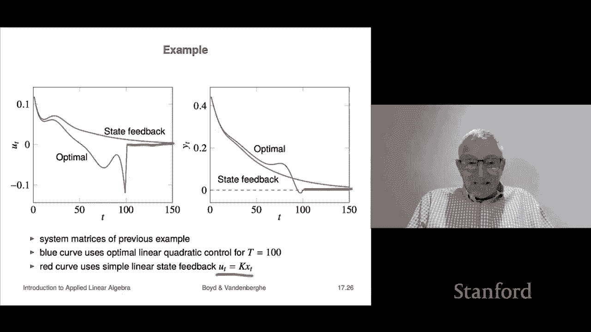

# 48：L17.2 - 线性二次控制 📈


在本节课中，我们将学习线性二次控制，这是约束最小二乘法的一个重要应用。我们将看到，一个看似复杂的控制问题，如何被优雅地转化为一个标准的约束最小二乘问题来求解。

## 概述

线性二次控制，例如投资组合优化，是一个应用广泛的领域。其核心思想是，对于一个线性动态系统，我们希望在给定的时间范围内，选择一系列控制输入，使得系统的输出（通常代表偏离期望状态的量）和控制输入的能量都尽可能小。这是一个多目标优化问题。

## 线性动态系统

首先，我们需要理解系统模型。我们有一个线性动态系统，其状态、输入和输出关系如下：

*   **状态**：`x_t` 是一个 n 维向量，代表系统在时刻 t 的状态。
*   **输入**：`u_t` 是一个 m 维向量，代表我们在时刻 t 施加的控制。
*   **输出**：`y_t` 是一个 p 维向量，通常与状态相关，代表我们实际关心的量。

它们之间的关系由以下公式描述：
`x_{t+1} = A_t * x_t + B_t * u_t`
`y_t = C_t * x_t`

其中，`A_t` 是动态矩阵，`B_t` 是输入矩阵，`C_t` 是输出矩阵。通常，这些矩阵不随时间变化，这样的系统称为线性时不变系统。

一个重要的细节是，这里的 `x_t`、`u_t`、`y_t` 通常表示实际物理量与其标准工作点（或期望值）的**偏差**。因此，我们希望这些偏差尽可能小（接近零），这意味着系统运行良好。

## 线性二次控制问题

现在，我们定义要解决的问题。我们考虑一个从 `t=1` 到 `t=T` 的时间范围。

我们的目标是选择一系列输入 `u_1, ..., u_{T-1}` 和对应的状态序列 `x_1, ..., x_T`，同时优化两个目标：

1.  **输出偏差小**：我们希望输出 `y_t` 的累积平方和尽可能小。这衡量了系统偏离期望状态的程度。
    `J_output = ||y_1||^2 + ... + ||y_T||^2 = ||C_1 x_1||^2 + ... + ||C_T x_T||^2`

2.  **控制输入能量小**：我们希望控制输入 `u_t` 的累积平方和尽可能小。这衡量了控制动作的“代价”或“能量”。
    `J_input = ||u_1||^2 + ... + ||u_{T-1}||^2`

显然，我们希望两者都小，但它们是相互冲突的（通常需要更大的控制动作才能更快地减小输出偏差）。因此，我们引入一个正参数 `ρ` 来权衡这两个目标，构成一个综合目标函数：
`J = J_output + ρ * J_input`

`ρ` 越大，表示我们越不希望使用大的控制输入；`ρ` 越小，表示我们更关注快速减小输出偏差。在实践中，`ρ` 通常通过仿真和观察效果来调整。

此外，问题还包含以下约束：

*   **动态约束**：状态必须遵循系统动力学方程 `x_{t+1} = A_t x_t + B_t u_t`。
*   **初始状态约束**：`x_1 = x_init`（给定初始状态）。
*   **终端状态约束**：`x_T = x_des`（给定期望终端状态）。当 `x_des = 0` 时，这被称为**调节器问题**，即让系统状态回归零点。

综上所述，线性二次控制问题就是在满足动态方程和边界条件的前提下，最小化综合目标函数 `J`，以求解最优的状态序列 `x_t` 和控制序列 `u_t`。

## 转化为约束最小二乘问题

上一节我们定义了线性二次控制问题。本节中，我们将看到这个复杂的问题可以精确地转化为一个标准的约束最小二乘问题。

我们定义决策变量 `z`，它是一个很长的向量，将所有变量堆叠在一起：
`z = [x_1; ...; x_T; u_1; ...; u_{T-1}]`

接下来，我们构造矩阵和向量，将原问题重写为：
`最小化 ||Ãz - b̃||^2， 满足 C̃z = d̃`

以下是各个部分的构造方法：

*   **目标函数部分 (Ã, b̃)**：
    我们构造一个块对角矩阵 `Ã`，使得 `||Ãz||^2` 恰好等于我们的目标函数 `J`。
    ```
    Ã = blkdiag(C_1, ..., C_T, sqrt(ρ)*I, ..., sqrt(ρ)*I)
    b̃ = 0
    ```
    计算 `||Ãz||^2` 会得到 `||C_1 x_1||^2 + ... + ||C_T x_T||^2 + ρ||u_1||^2 + ... + ρ||u_{T-1}||^2`，这正是 `J`。

*   **约束条件部分 (C̃, d̃)**：
    我们将所有线性等式约束（动态方程和边界条件）组合成一个大的矩阵方程 `C̃z = d̃`。
    *   动态方程 `x_{t+1} = A_t x_t + B_t u_t` 可以写成 `A_t x_t - x_{t+1} + B_t u_t = 0`。这些方程构成了 `C̃` 的大部分行。
    *   初始条件 `x_1 = x_init` 和终端条件 `x_T = x_des` 作为额外的行加入 `C̃`，对应的 `d̃` 部分分别为 `x_init` 和 `x_des`。

通过这种构造，原始的线性二次控制问题就完全等价于上面的约束最小二乘问题。值得注意的是，矩阵 `Ã` 和 `C̃` 都是**高度稀疏**的，这意味着对应的 KKT 系统也是稀疏的，可以利用高效的稀疏矩阵求解器快速计算，即使变量数量很大（例如数百甚至数千）。

## 示例：调节器问题

让我们通过一个简单例子来直观理解。考虑一个三维状态、一维输入的系统：
`A = [[0.8, 0.1, 0], [0, 0.9, 0.1], [0, 0, 0.7]]`
`B = [[0.1], [0], [0.3]]`
`C = [[1, 0, 0]]`
初始状态 `x_init` 是一个随机向量，期望终端状态 `x_des = 0`，时间范围 `T=100`。

我们解决这个约束最小二乘问题，并观察权衡参数 `ρ` 的影响。

以下是不同 `ρ` 值下的结果：
*   **ρ = 1.0**：较看重控制输入代价。控制输入 `u_t` 幅度较小，但输出 `y_t` 收敛到零的速度较慢。
*   **ρ = 0.2**：降低了对输入代价的权重。控制输入 `u_t` 幅度增大，但输出 `y_t` 能更快地被驱动到零。
*   **ρ = 0.05**：进一步降低输入权重。控制输入变得更大、更剧烈，以换取输出更迅速地归零。

这个例子清晰地展示了 `ρ` 如何在控制能量 (`J_input`) 和调节性能 (`J_output`) 之间进行权衡。

## 线性状态反馈控制

上一节我们解决了有限时间范围的优化问题。但在许多实际应用中（如飞机巡航），我们并不指定一个精确的终端时间，而是希望系统能持续、渐近地稳定在期望状态。这就引出了**线性状态反馈控制**。

线性状态反馈控制是一种极其广泛使用的策略，其形式非常简单：
`u_t = K * x_t`
其中 `K` 是一个固定的矩阵，称为**状态反馈增益矩阵**。它的思想是：根据当前时刻观测到的状态 `x_t`，直接通过矩阵 `K` 计算出应施加的控制输入 `u_t`。

那么，如何设计一个好的增益矩阵 `K` 呢？一个经典且有效的方法正是从我们刚刚解决的线性二次调节器问题中推导出来。

具体方法是：
1.  求解一个终端状态为零 (`x_des=0`)、时间范围 `T` 较长的线性二次调节器问题。
2.  观察其解：最优的**第一个**控制输入 `u_1` 总是初始状态 `x_init` 的一个线性函数，即存在某个矩阵 `K` 使得 `u_1 = K * x_init`。
3.  我们可以通过令 `x_init` 分别为单位向量 `e_1, e_2, ..., e_n`，多次求解该问题，从而拼凑出这个矩阵 `K`。

一旦得到 `K`，我们就可以实施 `u_t = K x_t` 的反馈控制律。与有限时间优化相比，这种反馈控制是**持续作用**的，并且通常能使状态渐近地趋于零，而不需要在某个特定时刻精确到达。

在下图中，蓝色轨迹代表有限时间 (`T=100`) 最优控制的结果，在 `t=100` 后控制停止。红色轨迹代表使用上述方法导出的状态反馈控制律 `u_t = K x_t` 的结果，它持续作用，使状态渐近收敛到零。
（注：此处应有一张对比图，展示有限时间最优控制与持续状态反馈控制下，状态 `y_t` 随时间变化的曲线对比。）

## 总结

本节课中，我们一起学习了线性二次控制的核心内容。

我们首先介绍了线性动态系统模型。然后，定义了线性二次控制问题，其目标是在满足系统动力学和边界条件的前提下，权衡最小化输出偏差和控制输入能量。

最关键的一步是，我们将这个复杂的控制问题**精确转化**为了一个**约束最小二乘问题**。通过构造适当的决策变量和稀疏矩阵，我们可以利用已知的数值方法高效求解。

最后，我们探讨了其与**线性状态反馈控制**的联系。通过求解一个特定的线性二次调节器问题，可以推导出广泛使用的状态反馈增益矩阵 `K`，从而实现持续、渐近稳定的控制。




这种方法将控制理论中的经典问题与数值优化紧密连接，展示了约束最小二乘法的强大应用能力。