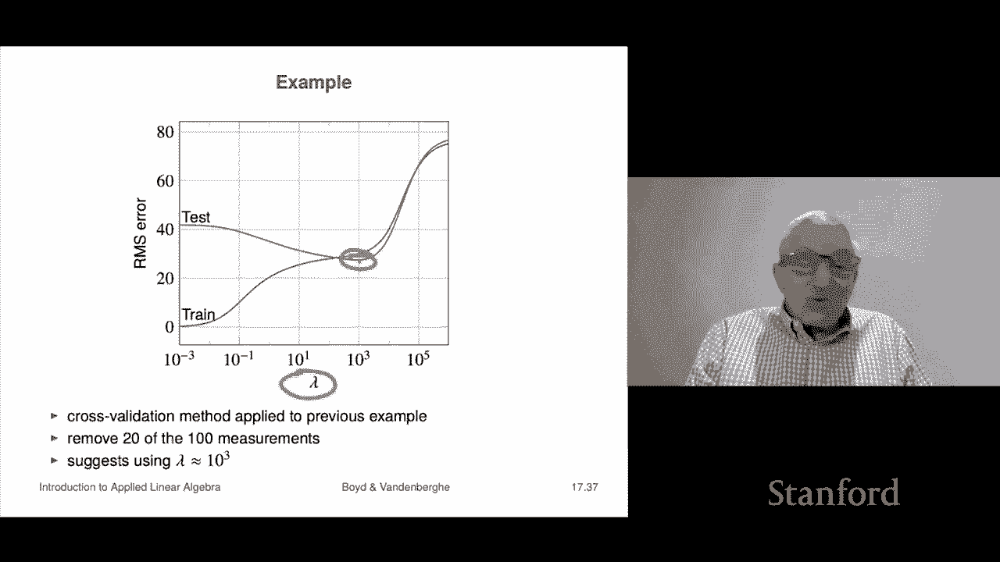

# 49：L17.3 - 线性二次约束状态预估 📊


在本节课中，我们将学习约束最小二乘法的最后一个应用：线性二次状态估计。我们将了解其基本概念、问题设定、数学公式，以及如何处理缺失测量值，并学习如何通过交叉验证来选择关键参数。

---

## 问题设定 🎯

上一节我们介绍了约束最小二乘法在控制问题中的应用。本节中，我们来看看它在状态估计问题中的应用。状态估计问题与控制问题在设定上非常相似，但目标却截然不同。

我们从一个线性动态系统模型开始。与控制问题不同，这里的输入 `W_t` 并非我们可以控制的量，它代表过程噪声或输入扰动。而输出 `Y_t` 除了包含 `C_t * x_t` 外，还附加了一个测量噪声 `V_t`。

在状态估计问题中，我们已知系统矩阵 `A_t`、`B_t`、`C_t` 以及一系列测量值 `y_1` 到 `y_T`。我们的目标是估计或猜测出对应的状态序列 `x_1` 到 `x_T`。过程噪声 `W_t` 和测量噪声 `V_t` 是未知的，但通常假设它们很小，这正是我们将状态估计问题构建为约束最小二乘问题的基础。

---

## 数学公式化 📝

接下来，我们看看如何将状态估计问题构建为一个优化问题。其核心思想是在两个目标之间进行权衡：使测量误差小，或使过程噪声小。

我们定义以下目标函数：
```
J = ||v_1||^2 + ... + ||v_T||^2 + λ * (||w_1||^2 + ... + ||w_{T-1}||^2)
```
其中，第一部分是测量误差的平方和，第二部分是过程噪声的平方和，`λ` 是一个用于权衡两者的正参数。

我们需要在满足系统动力学方程的约束下，最小化这个目标函数。优化变量包括整个状态序列 `x_1, ..., x_T` 和过程噪声序列 `w_1, ..., w_{T-1}`。

与控制问题类似，我们可以将这个问题重写为一个巨大的、稀疏的约束最小二乘问题。具体来说，我们将所有变量拼接成一个向量 `z`，并构建相应的矩阵 `C_tilde` 和向量 `d_tilde`，使得约束条件可以表示为 `C_tilde * z = d_tilde`。这个问题的结构与控制问题中的矩阵非常相似，体现了二者之间深刻的数学对偶关系，尽管它们解决的实际问题不同。

---

## 处理缺失测量值 🔍

现在，我们讨论一个更实际的情况：缺失测量值。这不仅是现实应用中常见的问题，也为我们提供了一种非启发式的、有原则的方法来选择参数 `λ`。

假设我们只在某些时间点 `t ∈ T`（其中 `T` 是时间索引的子集）获得了测量值 `y_t`。在其他时间点，测量值是缺失的。这在实际中可能由于传感器故障、通信中断等原因造成。

以下是处理缺失测量值的步骤：
1.  在构建目标函数 `J` 时，我们只对拥有实际测量值的时间点 `t ∈ T` 计算测量误差项。
2.  我们照常求解状态估计问题。
3.  对于没有测量值的时间点 `t ∉ T`，状态估计器会给出一个状态估计 `x_t_hat`，进而可以预测出“假设存在”的测量值 `y_t_hat = C_t * x_t_hat`。

这种处理方式的关键在于，它为实现交叉验证铺平了道路。我们可以故意将一部分已知的测量值“隐藏”起来，视为缺失，不提供给状态估计器。然后，用估计器预测的 `y_t_hat` 与真实隐藏的 `y_t` 进行比较，以此来评估估计器的性能。

---

## 示例与交叉验证 🧪

让我们通过一个具体例子来理解整个过程，并展示如何使用交叉验证来选择 `λ`。

考虑一个在二维平面中运动的质点模型。状态 `x_t` 是一个四维向量，包含位置和速度。我们获得的是带有噪声的位置测量值（绿色圆圈），真实轨迹是黑色实线。

我们尝试用不同的 `λ` 值进行状态估计：
*   当 `λ = 1` 时，估计轨迹（蓝色线）过于跟随噪声测量值，波动很大。
*   当 `λ = 10^3` 时，估计轨迹平滑且能很好地跟踪真实轨迹。
*   当 `λ = 10^5` 时，估计轨迹过于平滑，几乎忽略了测量值，导致估计不准。

这个例子中，我们恰好知道真实轨迹，所以能直观判断 `λ = 10^3` 是合适的。但在实际应用中，我们并不知道真实状态。

因此，我们需要一个系统的方法来选择 `λ`，这就是交叉验证：
1.  随机移除一部分（例如20%）的测量值，作为测试集。
2.  对于一系列候选的 `λ` 值，使用剩余的测量值（训练集）进行状态估计。
3.  对于每个 `λ`，计算状态估计器在测试集上的预测值 `y_hat` 与真实隐藏值 `y` 之间的均方根误差。
4.  选择能够使测试集均方根误差近似最小的 `λ` 值。

这个过程与数据拟合中的正则化参数选择完全一致。通过这种方法，我们可以在不知道真实状态的情况下，客观地选择一个性能良好的 `λ` 参数。

---

## 总结 📚




本节课中，我们一起学习了线性二次约束状态估计。
*   我们首先介绍了状态估计问题的设定，它旨在根据带有噪声的测量值来推测系统的内部状态。
*   接着，我们学习了如何将其公式化为一个权衡测量误差和过程噪声的约束最小二乘问题。
*   然后，我们探讨了如何处理缺失测量值，并指出这为实现交叉验证提供了可能。
*   最后，我们通过一个运动质点的示例，演示了不同 `λ` 值对估计结果的影响，并详细说明了如何使用交叉验证这一有原则的方法来自动选择最优的 `λ` 参数，从而在实际应用中实现有效的状态估计。