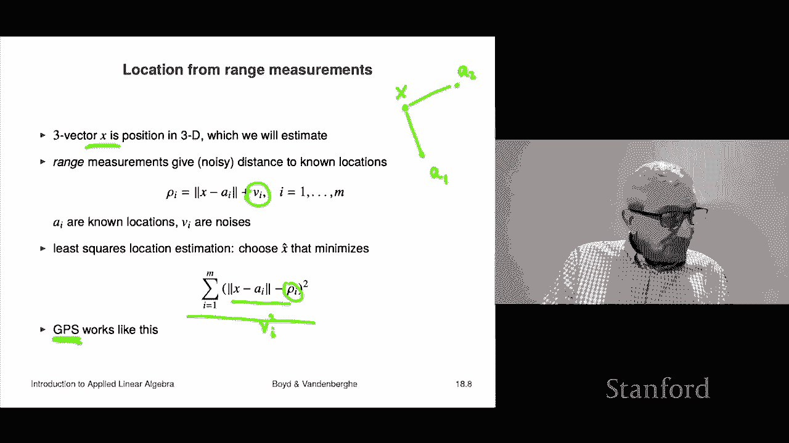

# 50：L18.1 - 非线性方程与最小二乘法 📘

在本节课中，我们将学习非线性方程与非线性最小二乘法的基本概念。我们将从非线性方程的定义开始，逐步探讨非线性最小二乘问题，并了解其最优性条件。最后，我们会通过几个实际例子来展示这些概念的应用。

---

## 非线性方程 📝

上一节我们介绍了课程概述，本节中我们来看看非线性方程的具体形式。

一组非线性方程的形式如下：我有一些变量 \( x_1 \) 到 \( x_n \)，这些是标量变量。我将它们整体视为一个向量 \( x \)。然后我有一组方程，形式为 \( f_i(x) = 0 \)，共有 \( M \) 个这样的方程。如果 \( f \) 是线性的，这就变成了一组线性方程。

我们将 \( f_i(x) = 0 \) 称为第 \( i \) 个方程。如果我选择一个 \( x \)，那么 \( f_i(x) \) 就是第 \( i \) 个残差。残差通常类似于误差，或者表示某个条件未能满足的程度。在这种情况下，如果 \( f_i(x) \) 是 0，意味着该方程成立；如果是 0.0003，意味着它几乎成立；如果是 -0.0001，也意味着它几乎成立。

我们可以用非常紧凑的格式来书写这个方程组，即 \( f(x) = 0 \)。这里 \( f \) 是一个从 \( R^n \) 映射到 \( R^m \) 的函数。这意味着它接受 \( n \) 个标量参数 \( x_1 \) 到 \( x_n \)，并返回一个 \( M \) 维向量，这些就是残差，即 \( M \) 个残差。有时可以这样写：\( f(x) = [f_1(x), ..., f_M(x)]^T \)。

如果 \( f \) 是线性的，方程组 \( f(x) = 0 \) 就是一组线性方程。我们将沿用线性方程的命名法来称呼这些非线性方程：如果方程数量多于变量数量（\( M > n \)），我们称之为超定；如果方程数量少于变量数量（\( M < n \)），称之为欠定；如果两者相等（\( M = n \)），称之为适定。

---

## 非线性最小二乘问题 🎯

上一节我们定义了非线性方程，本节中我们来看看非线性最小二乘问题。

非线性最小二乘问题是：找到一个向量 \( \hat{x} \)，使得以下范数最小化：
\[
\| f(x) \|^2 = f_1(x)^2 + ... + f_M(x)^2
\]
这本质上是方程残差的平方和。这包含了求解方程 \( f(x) = 0 \) 的问题，因为如果存在一个 \( x \) 使得 \( f(x) = 0 \)，那么这个 \( x \) 肯定能最小化上述范数，因为此时范数平方为 0，而范数平方不可能小于 0。所以这是一个特例。但就像线性最小二乘一样，它本身也非常有用。换句话说，即使不存在使 \( f(x) = 0 \) 的 \( x \)，这个方法也能找到一个很好的折衷方案，它最小化了残差的平方和。这与线性最小二乘非常相似，但这是非线性最小二乘问题。因此，我们有这些函数，目标就是最小化 \( f(x) \) 的范数平方，其中 \( f(x) \) 是从 \( R^n \) 到 \( R^m \) 的映射。

---

## 最优性条件 🔍

上一节我们提出了非线性最小二乘问题，本节中我们通过微积分来推导其最优性条件。

首先，微积分告诉我们，如果一个多变量函数在某点 \( x \) 处最优，那么在该点梯度为零。否则，你可以沿着某个轴的方向移动一个很小的量，从而找到一个目标值（即 \( \| f(x) \|^2 \)）更小的点。同时，需要记住，有些点梯度为零，但并非最小值点，例如可能是最大值点。

满足梯度为零的点有时被称为驻点，因为这意味着如果你向任何方向移动一点点，函数值不会快速下降（或仅下降极小的量）。\( \| f(x) \|^2 \) 的梯度可以展开计算。这个公式与标量情况下的公式完全类似。其结果是：
\[
\nabla \| f(x) \|^2 = 2 Df(\hat{x})^T f(x) = 0
\]
这就是最优性条件。如果 \( F \) 是标量函数，我们问最小化的条件是什么，我们会取这个函数的导数，得到 \( 2 f'(x) f(x) \)，并希望它为零。在标量情况下很简单：要么 \( f(x) = 0 \)，要么 \( f'(x) = 0 \)。上面的矩阵形式就是这个标量方程的类比。当然，标量情况下没有转置，因为都是标量。

这里的矩阵 \( Df(x) \) 在 \( \hat{x} \) 处取值，是函数 \( F \) 的导数或雅可比矩阵。它简单地是偏导数的矩阵，其第 \( ij \) 个元素是 \( F_i \) 对变量 \( x_j \) 的偏导数在 \( \hat{x} \) 处的值。

如果 \( F \) 是线性的，那么这个条件就简化为线性最小二乘中看到的正规方程。当我们讨论非线性最小二乘时，我们称普通最小二乘为线性最小二乘以示区分。

---

## ⚠️ 求解的困难性与启发式算法

上一节我们讨论了最优性条件，本节中我们承认求解非线性方程的困难性，并介绍启发式算法。

这里需要承认的是：求解非线性方程非常困难。即使只有 10 或 20 个变量，要最小化 \( \| f(x) \|^2 \) 也异常困难。特别是，它比求解线性方程要难得多。我们可以轻松求解具有数千个变量和方程组的线性方程，总能得到精确解，而且速度非常快。非线性方程和非线性最小二乘则是另一回事。事实上，即使我给出一个非线性函数 \( f \)，然后简单地问：是否存在一个解？即找到一个 \( x \) 使得 \( f(x) = 0 \)，这个问题本身也很难。

当我说它很难时，我是在解释“解决问题”意味着什么：找到一个点，其范数平方小于任何其他点。这实际上很难做到。但事实证明，仍然有一些方法在实践中表现很好，我们将使用所谓的启发式算法。启发式算法并不总是保证能找到真正最小化目标函数的点，但它们在实践中通常效果很好。即使它们未能找到真正最小化的点，也常常能找到一个相当好的点。事实上，它们常常确实能解决问题。我们之前遇到过这种情况。

K 均值算法就是解决二次聚类问题的一种启发式方法。这意味着，运行 K 均值算法时，绝对不能保证能找到最小化 K 均值问题目标函数的点。我们甚至看到过这种情况，因为我们会运行 K 均值几次，有时会发现一个值，后来又发现一个更低的值，这意味着第一次找到的不是最优解。后来找到的也可能不是最优的。然而，像这样的启发式方法在实践中仍然非常有效。这并没有阻止 K 均值的应用，K 均值在全世界数百个应用和领域中一直被使用，并且效果很好。

从实践意义上讲，如果有人问你是否真的最小化了目标函数，如果你在法庭上或者周围有数学家之类的人，你的回答可能必须是：技术上，我不知道我是否真的最小化了它，但这是一个相当好的聚类结果，不是吗？对于非线性方程也是如此，通常我们只是使用启发式方法，唯一的问题是，你不能肯定地说那确实是使 \( \| f(x) \|^2 \) 最小的点。

---

## 应用实例 📊

上一节我们讨论了求解的困难，本节中我们来看几个非线性最小二乘方程的例子，看看它们可能是什么样子。

以下是几个例子：

### 计算平衡点

这在许多领域都非常常见。一般情况是，你有一组变量（n 个），然后通常有某种平衡条件。平衡条件通常意味着消费与生产相匹配等。这被称为平衡点。我将看两个例子：一个来自经济学，一个来自化学。

**经济学中的均衡价格**：我有一个函数 \( S \)，它的作用是：当我们改变 n 种商品的价格（向量 \( p \)）时，\( S(p) \) 告诉我们这些商品的供应量。例如，当你提高某种商品的价格时，更多的人会制造或供应它，所以供应量会增加，这大致是直观的想法。我们也有需求函数 \( D \)，需求会朝另一个方向变化。如果我有一个需求函数，并且我增加一种商品的供应，其需求可能会下降。我们已经在价格弹性矩阵中看到过，当你提高一种价格时，对其他商品的需求可能上升或下降，这取决于它们是替代品还是互补品。

我们的目标是：找到一组价格，使得供应与需求平衡。这是一个非常经典的问题。我们将设 \( F(p) = S(p) - D(p) \)。当 \( F(p) = 0 \) 时，意味着价格使得供应恰好平衡需求。这被称为一组均衡价格，即均衡价格向量。这是求解非线性方程的一个例子。需要补充的是，如果供应和需求函数都是线性的，这就是一组线性方程，我们可以用课程前面学过的方法精确求解。

**化学平衡**：虽然表面上看起来完全不同，但实际上是一种类似的例子。我有一个 n 维浓度向量 \( c \)，代表 n 种不同物质的浓度。我有各种反应，有些反应消耗物质，有些反应生成新物质。这些是反应物和产物。它们由反应速率给出。函数 \( C(c) \) 告诉你作为浓度函数的物质消耗率。通常，如果反应物的浓度上升，那么消耗会更多，因为有反应消耗它。我们还有 \( G(c) \)，这是物质的生成率，这些本质上是产物。这意味着作为浓度的函数，它告诉你物质产生的速率，这意味着这些物质是反应右侧的产物，而不是反应物。

我们希望找到这些物质在溶液中的浓度，使得消耗恰好等于生成。这意味着反应物和产物达到平衡。化学反应可能仍在进行，但在平衡时，每秒消耗的某种氢离子量将恰好等于作为产物每秒生成的氢离子量（由于多个反应）。这就是化学平衡的概念。为此，我们将其设置为 \( F(c) = C(c) - G(c) \)。当 \( F(c) = 0 \) 时，意味着达到化学平衡。所以，计算平衡点通常就是非线性方程组，而且通常方程数量与变量数量相等，即通常是适定系统。

### 定位估计

这在很多领域都会出现，但它是全球定位系统（GPS）的一部分。这里我有一个三维位置向量 \( x \)，你的任务是估计它。我们有的是所谓的距离测量。例如，在二维中，这是 \( x \)，你可能有一个信标或卫星在这里，我们测量的是距离。我们知道距离，但带有噪声。\( v_i \) 是我们不知道的噪声，只是测量误差。

给定这些有噪声的距离测量（称为测距），你的任务是找出 \( x \) 是什么。最小二乘定位估计所做的就是：我们将最小化 \( v_i \) 的平方和。这里 \( \rho_i \) 是测量的距离或范围，这当然是 \( x \) 的函数，绝对不是线性的。我们想要最小化这个，这就是非线性最小二乘。GPS 中使用的是这个的一个变体。在 GPS 中，除了到卫星的距离外，还有一个额外的偏移项，取决于你的时钟与真实时钟的偏差，除非你碰巧带着原子钟（很少有人有）。所以那里有一个额外的变量，但除此之外基本上就是这个。事实上，GPS 使用的是这个与我们在上一讲中看到的卡尔曼滤波或状态估计的结合，但这是基本思想。

---

## 总结 🎓

在本节课中，我们一起学习了非线性方程与非线性最小二乘法的基本概念。我们首先定义了非线性方程组，并引入了非线性最小二乘问题，即最小化残差平方和。我们通过微积分推导了其最优性条件，即梯度为零的条件。同时，我们认识到求解非线性最小二乘问题非常困难，因此在实际中常常依赖启发式算法，这些算法虽不能保证找到全局最优解，但在实践中往往表现良好。最后，我们通过计算平衡点（如经济学中的均衡价格和化学平衡）以及定位估计（如 GPS 原理）等实例，具体展示了非线性最小二乘问题的广泛应用。