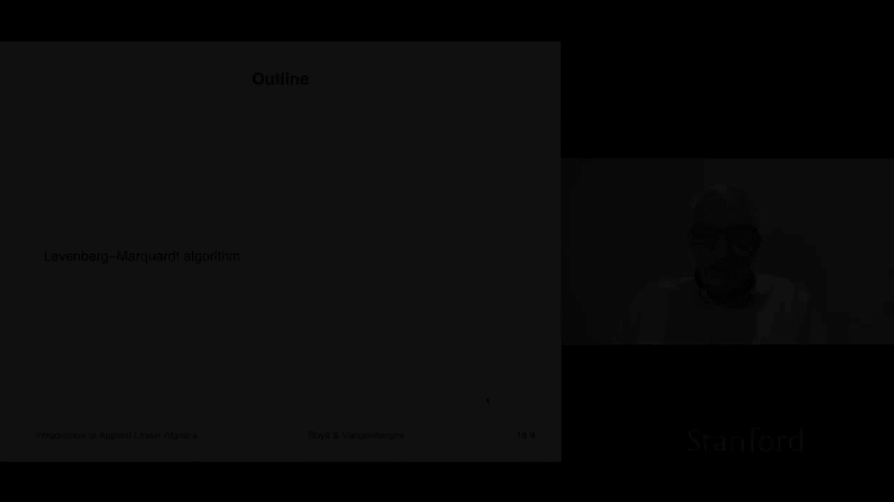
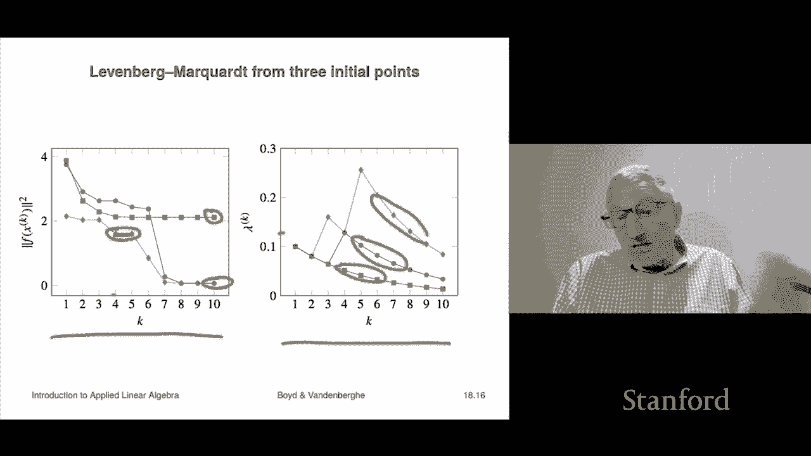

# 51：L18.2 - LM(Levenberg–Marquardt)算法 📘

在本节课中，我们将学习一种用于近似或启发式求解非线性最小二乘问题的方法——Levenberg–Marquardt（LM）算法。我们将探讨其基本思想、算法步骤，并通过一个实例来理解其工作原理。

---

## 概述 🎯

非线性最小二乘问题在许多科学和工程领域都有应用。我们无法直接求解这类问题，因此需要借助迭代方法进行近似。LM 算法结合了线性近似和信任域思想，在实践中表现优异。

---

## 基本思想 🔍

上一节我们介绍了非线性最小二乘问题。本节中我们来看看 LM 算法的核心思想。

我们想要最小化目标函数 **norm(F(x))²**，其中 **F** 是一个非线性函数。如果 **F** 是线性的，我们可以直接使用最小二乘法求解。但 **F** 是非线性的，因此我们需要在其当前点附近构建一个线性（仿射）近似。

以下是构建仿射近似的步骤：

1.  设当前点为 **z**。
2.  利用一阶泰勒展开（即微分）在 **z** 附近对 **F** 进行线性近似。
3.  得到的近似函数 **F̂(x; z)** 在 **x** 接近 **z** 时非常准确，远离时则不可信。

这个近似函数的形式为：
**F̂(x; z) = F(z) + Df(z) * (x - z)**
其中 **Df(z)** 是 **F** 在 **z** 处的雅可比矩阵（导数矩阵）。

---

## ⚙️ LM 算法步骤

基于上述思想，LM 算法通过迭代来寻找最优解。每次迭代，我们都会解决一个带正则化项的最小二乘子问题。

算法迭代过程如下：

1.  **初始化**：给定初始点 **x⁰** 和初始参数 **λ⁰**（通常设为 1）。
2.  **迭代**：对于第 **k** 次迭代：
    *   在当前点 **xᵏ** 处计算 **F** 的值 **F(xᵏ)** 和雅可比矩阵 **Df(xᵏ)**。
    *   求解以下子问题，得到候选点 **xᵏ⁺¹**：
        **xᵏ⁺¹ = argminₓ ( || F̂(x; xᵏ) ||² + λᵏ || x - xᵏ ||² )**
        这个子问题有解析解：
        **xᵏ⁺¹ = xᵏ - ( Df(xᵏ)ᵀ Df(xᵏ) + λᵏ I )⁻¹ Df(xᵏ)ᵀ F(xᵏ)**
    *   **参数更新**：根据新点的表现更新 **λ** 和 **x**。
        *   如果 **||F(xᵏ⁺¹)||² < ||F(xᵏ)||²**（目标函数下降），则接受该点，令 **xᵏ⁺¹ = xᵏ⁺¹**，并减小 **λ**（例如乘以 0.8），表示我们更信任模型，下次可以更大胆。
        *   否则（目标函数未下降），则拒绝该点，令 **xᵏ⁺¹ = xᵏ**，并增大 **λ**（例如乘以 2.0），表示我们需要更谨慎，缩小信任域。

**λ** 被称为“信任域”参数。**λ** 越大，算法越保守，步长越小；**λ** 越小，算法越激进，步长越大。

---

## 算法实例：距离定位问题 📊

为了更直观地理解 LM 算法，我们来看一个距离定位（Range Estimation）的例子。

**问题描述**：假设我们在一个平面上，有多个已知位置的信号塔（灯塔）。我们测量了自身到每个信号塔的距离（包含噪声），目标是估计出自己的位置 **x**。

这是一个典型的非线性最小二乘问题，目标函数是测量距离与计算距离之差的平方和。

以下是算法从三个不同起点运行的轨迹：

*   **轨迹1（蓝色）和轨迹2（棕色）**：算法成功收敛到了全局最优解（红色星标处），即目标函数值最小的点。
*   **轨迹3（红色）**：算法收敛到了一个“局部最优解”。该点的目标函数值比全局最优解大，算法在此处停止了改进。

这个例子说明，LM 算法的结果可能依赖于初始点，并可能收敛到局部最优解而非全局最优解。在实际高维问题中，我们无法可视化，因此算法的这种特性需要被考虑。

---

## ✅ 总结

本节课中，我们一起学习了 Levenberg–Marquardt 算法：

1.  **核心思想**：通过在当前迭代点构造线性近似，将复杂的非线性最小二乘问题转化为一系列可精确求解的带正则化线性最小二乘子问题。
2.  **关键参数**：信任域参数 **λ** 动态调整，平衡了“基于模型前进”和“保持可靠性”两者。目标函数下降时减小 **λ** 以加速，上升时增大 **λ** 以保证稳定。
3.  **算法特性**：LM 算法在实践中非常有效，但其解可能是一个局部最优解，收敛结果受初始点影响。

该算法巧妙结合了课程中学习的线性最小二乘、多目标优化和微积分的思想，是解决非线性优化问题的强大工具。