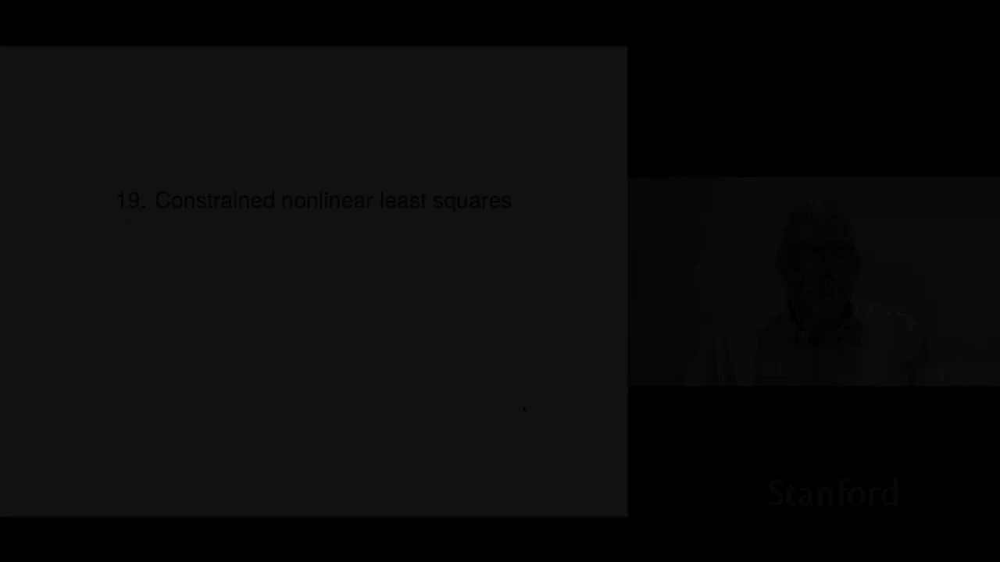
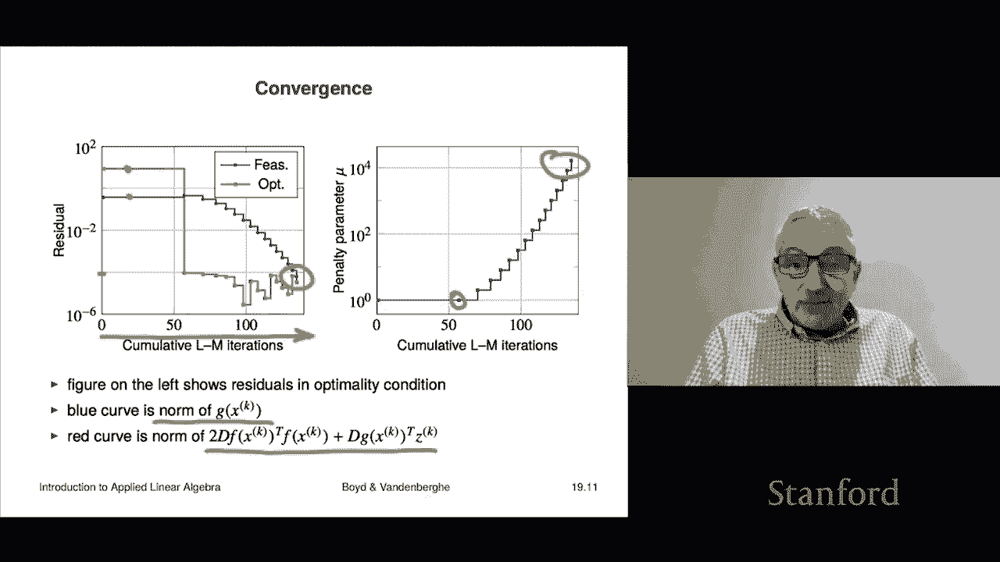

# 53：L19.1 - 受约束的非线性最小二乘法 📘

在本节课中，我们将学习**受约束的非线性最小二乘法**。与之前讨论的线性约束不同，这里我们将面对**非线性等式约束**。我们将探讨问题的定义、最优性条件，并介绍一种基础的求解方法——**惩罚函数法**。

---

## 问题定义 🎯

第19章的主题是受约束的非线性最小二乘法。这意味着我们不仅要处理非线性最小二乘问题，还要满足一组等式约束。这些约束不再是线性的，而是非线性的。

问题的数学形式如下：

**最小化**：
\[
\|f(x)\|^2
\]

**约束条件**：
\[
g(x) = 0
\]

其中：
*   \( f(x) \) 是一个向量函数，其范数的平方即为目标函数。
*   \( g(x) \) 是一个向量函数，代表 \( p \) 个标量等式约束。\( g(x) = 0 \) 表示所有约束必须同时满足。

我们称满足 \( g(x) = 0 \) 的点 \( x \) 为**可行点**。一个点 \( \hat{x} \) 是问题的**解**，当且仅当它是可行的，并且对于任何其他可行点，其目标函数值都不小于 \( f(\hat{x}) \) 的值。

与非线性最小二乘法类似，精确求解此类问题通常非常困难。但在实践中，存在一些非常有效的**启发式算法**，它们通常能给出足够好的解，从而在众多领域得到广泛应用。

---

## 最优性条件与拉格朗日函数 🔍

为了推导受约束非线性最小二乘问题的最优性条件，我们引入**拉格朗日函数**。

首先，构造拉格朗日函数。我们在目标函数 \( \|f(x)\|^2 \) 的基础上，为每个约束 \( g_i(x) = 0 \) 引入一个**拉格朗日乘子** \( z_i \)，并将约束乘以对应的乘子后加到目标函数上。

拉格朗日函数 \( L(x, z) \) 的向量形式为：
\[
L(x, z) = \|f(x)\|^2 + g(x)^T z
\]
其中 \( z \) 是拉格朗日乘子向量。

**拉格朗日乘子法**指出，如果 \( \hat{x} \) 是问题的一个解，那么必然存在一组最优拉格朗日乘子 \( \hat{z} \)，使得拉格朗日函数 \( L \) 对 \( x \) 和 \( z \) 的梯度在 \( (\hat{x}, \hat{z}) \) 处为零（同时需要满足一些技术性条件，本课程暂不深入讨论）。

满足此条件的点 \( \hat{x} \) 被称为**驻点**。需要注意的是，与无约束非线性最小二乘一样，驻点不一定就是全局最优解。

---

### 梯度计算

接下来，我们具体计算这两个梯度。

1.  **对 \( x \) 的梯度**：
    \[
    \nabla_x L = 2 Df(x)^T f(x) + Dg(x)^T z
    \]
    其中 \( Df(x) \) 和 \( Dg(x) \) 分别是 \( f \) 和 \( g \) 在 \( x \) 处的雅可比矩阵（导数矩阵）。第一项与无约束非线性最小二乘的梯度形式相同，第二项则来自约束条件。

2.  **对 \( z \) 的梯度**：
    \[
    \nabla_z L = g(x)
    \]
    这非常简单，因为拉格朗日函数中关于 \( z \) 的部分是线性的。

因此，最优性条件可以写为：
\[
\begin{cases}
2 Df(\hat{x})^T f(\hat{x}) + Dg(\hat{x})^T \hat{z} = 0 \\
g(\hat{x}) = 0
\end{cases}
\]
第一个条件被称为**对偶可行性条件**，第二个条件就是原始的**可行性条件**（即解必须满足约束）。如果去掉约束（即 \( g(x) \) 不存在），那么最优性条件就退化回我们熟悉的无约束非线性最小二乘形式。

---

## 线性约束作为特例 🔗

为了加深理解，我们来看一个特例：**线性约束最小二乘**。此时，函数 \( f \) 和 \( g \) 都是线性的（仿射函数）。

设：
\[
f(x) = Ax - b, \quad g(x) = Cx - d
\]
那么，它们的导数（雅可比矩阵）就是常数矩阵：\( Df(x) = A \), \( Dg(x) = C \)。

将上述定义代入一般形式的最优性条件，我们得到：
\[
\begin{cases}
2 A^T (A\hat{x} - b) + C^T \hat{z} = 0 \\
C\hat{x} - d = 0
\end{cases}
\]
这正是线性约束最小二乘问题的 **KKT 条件**。通常，我们会将其组装成以下的矩阵方程进行求解：
\[
\begin{bmatrix}
2A^TA & C^T \\
C & 0
\end{bmatrix}
\begin{bmatrix}
\hat{x} \\
\hat{z}
\end{bmatrix}
=
\begin{bmatrix}
2A^Tb \\
d
\end{bmatrix}
\]
左侧的矩阵称为 **KKT 矩阵**。对于线性问题，直接求解这个线性方程组即可得到精确解 \( \hat{x} \) 和对应的最优拉格朗日乘子 \( \hat{z} \)。

---

## ⚙️ 惩罚函数法简介

对于一般的非线性约束问题，我们无法直接求解。本节介绍一种基础的近似求解方法——**惩罚函数法**。其核心思想非常直观：既然约束要求 \( g(x) = 0 \)，我们可以将违反约束的“惩罚”直接加到目标函数中，通过增大惩罚系数来迫使解趋向可行域。

我们构造一个新的无约束优化问题：
\[
\text{最小化} \quad \|f(x)\|^2 + \mu_k \|g(x)\|^2
\]
其中 \( \mu_k > 0 \) 是一个**惩罚参数**。直观上，当 \( \mu_k \) 变得非常大时，为了使总目标函数值最小化，算法将不得不让 \( \|g(x)\|^2 \) 变得非常小，从而近似满足 \( g(x) \approx 0 \)。

---

### 算法步骤

以下是惩罚函数法的基本步骤：

1.  选择一个递增的惩罚参数序列，例如 \( \mu_1 = 1, \mu_2 = 2, \mu_3 = 4, \dots \)。
2.  对于每个 \( \mu_k \)，求解无约束问题 \( \min \|f(x)\|^2 + \mu_k \|g(x)\|^2 \)。
3.  求解时，使用 **Levenberg-Marquardt** 等非线性最小二乘算法。
4.  **关键技巧（热启动）**：在求解第 \( k+1 \) 个问题时，将第 \( k \) 个问题的解 \( x_k \) 作为迭代的初始点。这比每次都从零或随机点开始（冷启动）效率高得多。

---

### 与最优性条件的联系

惩罚函数法有一个有趣的性质。对于每个子问题，其最优性条件为：
\[
2 Df(x_k)^T f(x_k) + 2 \mu_k Dg(x_k)^T g(x_k) = 0
\]
如果我们定义 \( z_k = 2 \mu_k g(x_k) \)，那么上述条件可以重写为：
\[
2 Df(x_k)^T f(x_k) + Dg(x_k)^T z_k = 0
\]
这恰好与原始问题最优性条件中的第一个条件（对偶可行性）形式一致。而第二个条件（可行性 \( g(x)=0 \)）则通过 \( \mu_k \) 增大来逐渐逼近。

因此，惩罚函数法可以看作在产生一个序列 \( (x_k, z_k) \)，使得对偶可行性条件自动满足，而算法的主要任务是驱动 \( g(x_k) \) 趋向于零（即趋向可行性）。我们通常当 \( \|g(x_k)\| \) 足够小时停止算法。

---

## 算法示例 📊

考虑一个简单的二维示例问题：
*   目标函数：\( f(x) = [x_1 + e^{-x_2}, \quad x_1^2 + 2x_2 + 1]^T \)
*   约束条件：\( g(x) = x_1 + x_1^3 + x_2 + x_2^2 = 0 \) （单个约束 \( p=1 \)）

下图展示了求解过程。虚线是可行集 \( g(x)=0 \)，实线是惩罚函数 \( \|f(x)\|^2 + \mu_k g(x)^2 \) 的等高线。

随着 \( \mu_k \) 从 1 增大到 32，算法求得的解 \( x_k \) （图中点）沿着可行集移动，并最终收敛到真正的最优解 \( \hat{x} \) 附近。

收敛过程如下图所示，蓝线表示约束违反度 \( \|g(x)\| \)，红线表示对偶条件的残差。随着迭代进行（横轴是Levenberg-Marquardt算法的总迭代次数），两者都逐渐趋近于零。

---

## 本节总结 📝

在本节课中，我们一起学习了**受约束的非线性最小二乘法**。

*   我们首先定义了包含非线性等式约束的优化问题。
*   接着，通过引入**拉格朗日函数**，推导出了问题的最优性条件（KKT条件），并验证了线性约束情形是其特例。
*   最后，我们介绍了一种基础的求解算法——**惩罚函数法**。该方法通过将约束 violation 作为惩罚项加入目标函数，并逐步增大惩罚系数，来迫使解逼近可行域并满足最优性条件。我们还通过一个示例直观展示了该方法的运行过程。

惩罚函数法概念简单，但有一个潜在缺点：当惩罚系数 \( \mu_k \) 非常大时，优化问题的条件数可能变差，导致数值计算困难。在下一节中，我们将介绍一种改进的方法——**增广拉格朗日法**，它能更好地克服这个缺点。