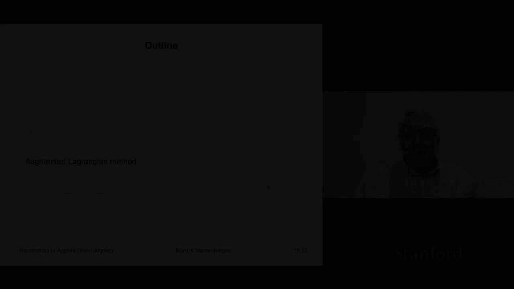
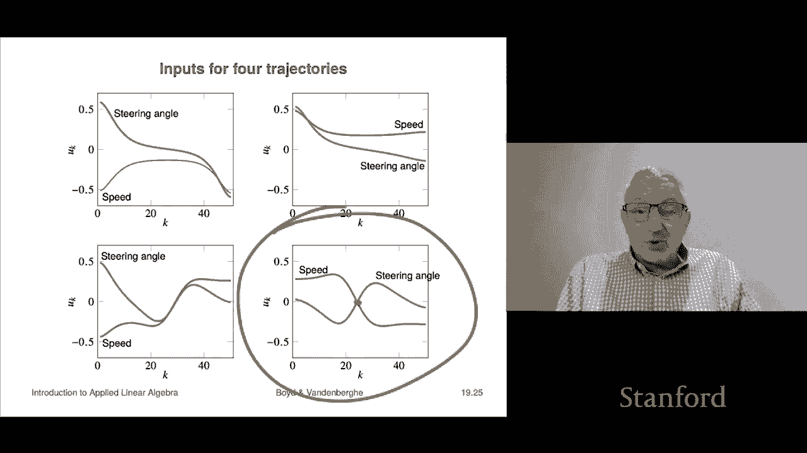

# 54：L19.2 - 拓展拉格朗日法 🚀




在本节课中，我们将要学习拓展拉格朗日法。这是一种对惩罚法的改进方法，它保留了惩罚法的优点，但克服了其关键缺陷，即无需将惩罚参数 `mu` 增大到无穷大也能获得良好解。在实践中，它的表现通常也更好。

## 惩罚法的缺陷

上一节我们介绍了惩罚法。惩罚法的一个缺点是，其惩罚参数 `mu` 需要迅速增大，并且必须变得非常大才能将约束 `g(x)` 驱动到零。当 `mu` 非常大时，非线性最小二乘子问题会变得难以求解。我们观察到，对于非常大的 `mu`，Levenberg-Marquardt 算法要么需要大量迭代，要么会失败（在实践中，这意味着计算时间过长或无法收敛）。

为了纠正这个问题，我们将展示一种方法，它实际上只是对惩罚法的一个微小修改，但通过维护并更新另一个向量，避免了惩罚法的上述缺陷。

## 拓展拉格朗日法介绍

这种方法被称为拓展拉格朗日法，是优化领域的标准方法。拓展拉格朗日函数定义如下：

```
L_aug(x, z, mu) = f(x) + z^T * g(x) + mu * ||g(x)||^2
```

其中，`f(x)` 是原目标函数，`z` 是拉格朗日乘子向量，`mu` 是惩罚参数，`g(x)` 是约束函数。最后一项 `mu * ||g(x)||^2` 是拓展项。

你可能会觉得这个拓展项是多余的，因为对于任何可行点（即满足 `g(x) = 0` 的点），这一项都为零。这意味着原问题与这个带拓展项的问题是等价的，它们具有相同的最优解集。那么，为什么添加这个项会有帮助呢？令人惊讶的是，它确实有效。

## 拓展拉格朗日函数的等价形式

我们可以重写拓展拉格朗日函数，使其结构更清晰。通过展开平方项并进行整理，可以得到以下等价形式：

```
L_aug(x, z, mu) = || [ sqrt(mu) * g(x) + z/(2*sqrt(mu)) ] ||^2 + f(x) - (1/(4*mu)) * ||z||^2
```

这个表达式表明，拓展拉格朗日函数看起来像一个非线性最小二乘目标（第一项），然后减去一个依赖于 `z` 的项。

**几点说明：**
*   当 `z = 0` 时，该方法退化为标准的惩罚法。
*   固定 `mu` 和 `z` 后，我们可以通过最小化 `L_aug(x, z, mu)` 来求解 `x`。这与惩罚法非常相似，只是在对应对可行性的部分（即 `g(x)` 相关项）增加了一个巧妙设计的项。

## 最优性条件与乘子更新

我们尚未确定 `z` 应该是什么。接下来，我们将从最优性条件中推导出 `z` 的更新规则。

最小化拓展拉格朗日函数 `L_aug(x, z, mu)` 得到的解 `x_tilde`，其最优性条件为：

```
∇f(x_tilde) + Dg(x_tilde)^T * (z + 2*mu * g(x_tilde)) = 0
```

我们定义一个新的乘子 `z_tilde`：

```
z_tilde = z + 2 * mu * g(x_tilde)
```

利用这个定义，上面的最优性条件可以重写为：

```
∇f(x_tilde) + Dg(x_tilde)^T * z_tilde = 0
```

这非常棒，因为第一个方程（关于目标函数和约束梯度的条件）自动满足了。剩下的就是驱动 `g(x)` 趋于零以满足可行性条件。

这个推导表明，如果 `g(x_tilde)` 不够小，那么 `z_tilde` 是对乘子 `z` 的一个很好更新。这直接引出了拓展拉格朗日算法。

## 拓展拉格朗日算法步骤

以下是拓展拉格朗日法的具体步骤：

1.  **初始化**： 选择初始点 `x0`，初始乘子 `z0`（通常设为0），初始惩罚参数 `mu0 > 0`，以及缩减因子 `ρ > 1`（例如 `ρ=10`）和进度阈值 `τ`（例如 `τ=0.25`）。
2.  **主循环**（对于 `k = 0, 1, 2, ...`）：
    *   **最小化子问题**： 以 `x_k` 为起点，使用 Levenberg-Marquardt 等方法，近似求解无约束优化问题 `min_x L_aug(x, z_k, mu_k)`，得到解 `x_{k+1}`。
    *   **乘子更新**： 使用公式 `z_{k+1} = z_k + 2 * mu_k * g(x_{k+1})` 更新拉格朗日乘子。
    *   **惩罚参数更新**： 检查可行性进展。如果 `||g(x_{k+1})|| > τ * ||g(x_k)||`（即可行性改进不足），则增大惩罚参数：`mu_{k+1} = ρ * mu_k`；否则，保持 `mu_{k+1} = mu_k`。
    *   **终止条件**： 如果 `||g(x_{k+1})||` 足够小，则停止迭代，输出 `x_{k+1}` 作为近似解。

与惩罚法每次都必须增大 `mu` 不同，拓展拉格朗日法只在必要时才增大 `mu`，因此 `mu` 的增长更缓慢，这使得子问题更容易求解。

## 算法示例

让我们看一个与之前惩罚法相同的简单例子。应用拓展拉格朗日法后，效果非常显著：

*   第一步后，我们未取得足够进展，因此将 `mu` 从1增加到2。
*   第二步后，进展仍不足，将 `mu` 增加到4。
*   从第三步开始，已经非常接近可行域。此时算法保持 `mu=4`，仅需几次迭代就得到了高质量的解。
*   在大约6步之后，残差就达到了 `10^{-4}` 量级。

**关键对比**： 在惩罚法中，`mu` 最终需要增长到 10000；而在拓展拉格朗日法中，`mu` 只增长到4就停止了。这体现了后者的优势。

## 应用实例：车辆轨迹规划 🚗

最后，我们通过一个车辆轨迹规划的例子来展示拓展拉格朗日法的实际应用。我们使用一个简化的车辆模型（如Dubins车模型），其连续时间动力学方程为：

```
dx/dt = v * cos(θ)
dy/dt = v * sin(θ)
dθ/dt = (v / L) * tan(φ)
```

其中 `(x, y)` 是位置，`θ` 是航向角，`v` 是速度，`φ` 是前轮转向角，`L` 是轴距。

我们将时间离散化（例如使用前向欧拉法），定义状态向量 `x_k = [x_k, y_k, θ_k]^T` 和控制输入 `u_k = [v_k, φ_k]^T`。离散化后的模型为 `x_{k+1} = f(x_k, u_k)`。

**控制问题**： 我们希望找到一系列控制输入，使车辆从给定的初始状态 `(x_init, y_init, θ_init)` 运动到期望的最终状态 `(x_final, y_final, θ_final)`，同时希望控制输入较小且变化平缓（避免急加速和急转弯）。

我们可以将其建模为一个**约束非线性最小二乘问题**：
*   **目标函数**：最小化控制量的平方和及其平滑度惩罚项。
*   **约束**：离散动力学方程 `x_{k+1} = f(x_k, u_k)`，以及初始和终端状态约束。

使用拓展拉格朗日法求解此问题，算法能够自动生成复杂的轨迹。例如：
1.  **平行泊车**： 算法规划出的轨迹包括前进、倒车、调整方向等一系列操作。
2.  **调头**： 从指向东变为指向北，算法规划出平滑的转弯路径。
3.  **复杂机动**： 对于某些起止点，算法甚至能规划出“先倒车再前进”的复合轨迹。

通过查看生成的控制输入序列（速度 `v` 和转向角 `φ` 随时间的变化），我们可以验证这些轨迹的合理性。例如，在倒车时，速度 `v` 为负值，同时转向角 `φ` 会相应变化以调整倒车方向。

这个例子表明，即使对于看似复杂的轨迹规划问题，拓展拉格朗日法这样的“笨”算法也能找到相当精巧的解决方案。它是自动驾驶、自动泊车等领域中轨迹规划算法的重要基础组件。

---

**本节课总结** 🎯




在本节课中，我们一起学习了拓展拉格朗日法。我们首先回顾了惩罚法需要无限增大惩罚参数的缺陷，然后引入了拓展拉格朗日函数，它通过增加一个拉格朗日乘子项和惩罚项来改进原拉格朗日函数。我们从最优性条件推导出了乘子的更新公式 `z_{k+1} = z_k + 2 * mu_k * g(x_{k+1})`，并阐述了完整的算法步骤。该算法的核心优势在于其惩罚参数 `mu` 仅在必要时才增大，使得子问题更容易求解，从而在实践中比纯惩罚法更高效、更稳定。最后，我们通过一个车辆轨迹规划的实例，直观展示了拓展拉格朗日法解决复杂约束优化问题的强大能力。