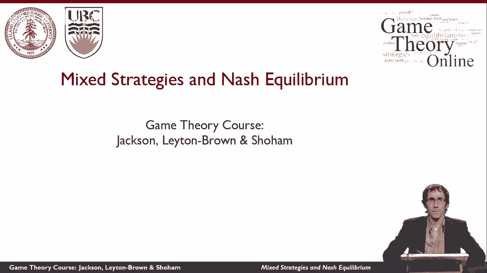

# P12：【斯坦福大学】博弈论（11）混合策略与纳什均衡 (I) - 自洽音梦 - BV1644y1D7dD

这段视频将介绍混合策略的想法，并解释为什么它们对纳什均衡很重要。

所以我想在这里考虑的例子，是联合国，你可以看到他们在路上设置了一个检查站，他们把所有的车都停在这里，就像这辆出租车一样，他们检查车里的东西，确保里面没有任何爆炸物或其他危险物质，现在。

让我们把这种情况想象成一个游戏，所以联合国可以选择各种不同的道路，每小时设置一个检查站，对于这些道路中的每一条，潜在的攻击者可能会决定攻击那条路，如果防守者保卫了那条路，攻击者攻击它。

那么攻击者就会得到很大的负回报，因为他们被捕获了，他们的攻击没有成功，另一方面，如果攻击者攻击任何其他道路，那么攻击就成功了，然后攻击者的效用取决于被攻击目标的值，现在没有人防守，很明显。

如果联合国致力于任何确定性战略，如果他们以任何确定性的方式选择他们的行动，事情对他们来说会很糟糕，因为防守者，我很抱歉，攻击者就能看到他们在做什么，他们可以看一会儿，看看联合国在采取什么策略。

然后攻击不同的东西攻击总是成功的，所以这肯定不是检查站的设置方式，而且确实，真正发生的是检查点是以随机的方式设置的，这样，即使攻击者观察了一会儿并弄清楚随机策略是什么，他们不能在给定的时间内知道。

检查站将在哪里，这意味着攻击的价值是有限的，所以像这样的博弈的纳什均衡将涉及防守者的防守，像这样随机的方式，这种随机策略被称为混合策略。

