# P18：【斯坦福大学】博弈论（17）数据职业体育与混合策略 - 自洽音梦 - BV1644y1D7dD

乡亲们，让我们来看看混合策略的一些数据，开始看到，我们之前谈到的一些微妙之处是否真的发挥了作用，在这些游戏的真实化身中发挥自己。

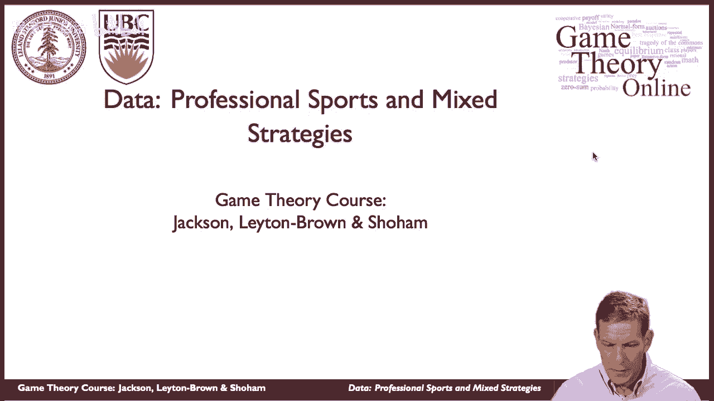

特别是，我们提到了混合策略，纳什均衡可能有一些违反直觉的特征，他们可能会有点微妙的解决，所以说，我们可能会想，在这些环境中，人们是否真的服从纳什均衡的预测。

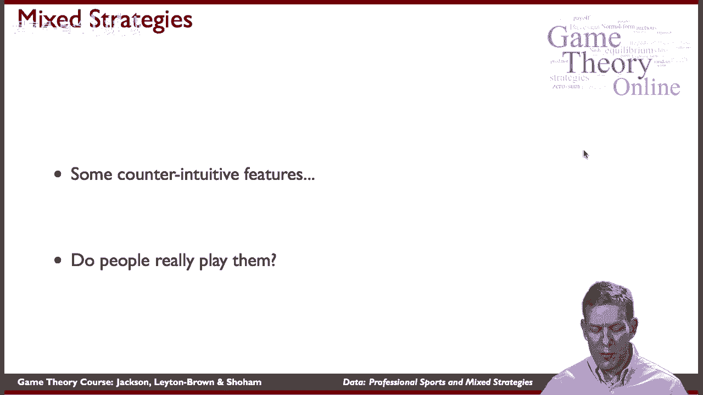

那么让我们来看看职业足球点球，我们来看看Ignacio收集的一些数据，2003年帕拉西奥·韦尔塔，嗯，他所做的是，他实际上看着我们一系列他记录的国际足联比赛，呃，电视，不同的，不同的节目。

他看了西班牙联赛的1417个点球，呃，嗯，英格兰和意大利等等，所以他关注高水平的足球，关注点球，他所做的就是记录人们是否踢向左边，他们踢到了中间，他们踢向右边，他们是用左腿还是右腿，嗯，我们只看简化版。

这与我们前面分析的一致，这只是一个左踢，右踢，守门员可以向左或向右移动，他实际上分析了402页数据的子集，我们会看看他实际上有什么数据。

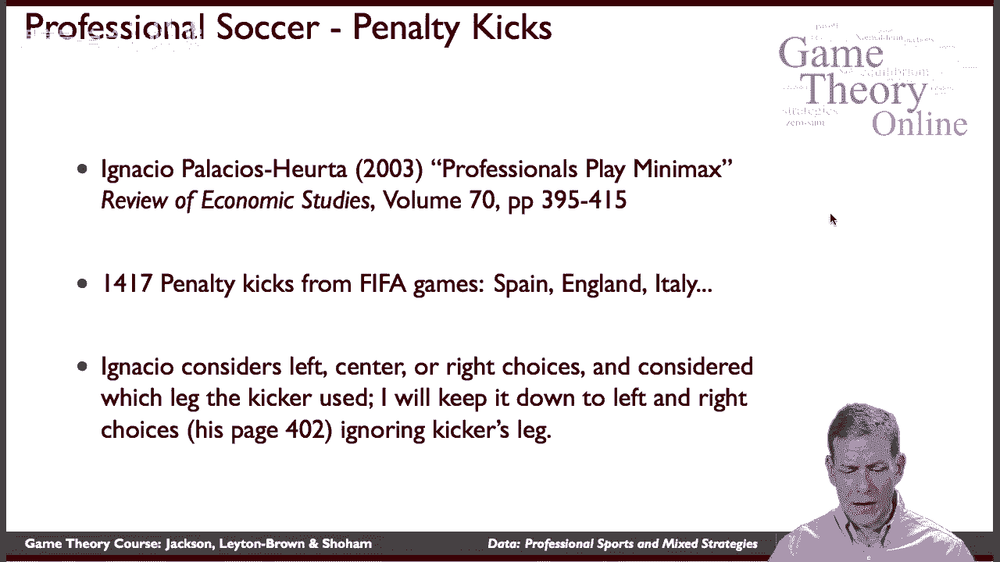

从那张纸上，好的，所以嗯，这里是基于，他从这1417个点球中发现了什么，这些是平均数，所以在踢球的人向左守门员向左的情况下，嗯，踢球者赢五场，百分之八的时间，守门员赢了，四，百分之二的时间。

在踢球的人向左的情况下，守门员向右，那么踢球的人95%的时间都赢了，如果踢球的人向右，守门员向左，他们赢了，踢球的人赢了93%的时间，等等，这些是Ignacio发现的实际数字。

根据1417场比赛的点球记录，好的，所以我们确实看到这里有偏见，有一些优点和缺点，嗯，所以对于一个踢球的人来说，左对右稍微好一点，比向右对向左，嗯，没有那么大的不同，但是离开了离开了嗯，与右右相比。

我们看到了更多的不同，所以这是一个不对称的游戏。

这是一个相当微妙的问题，嗯，所以我们得看看。

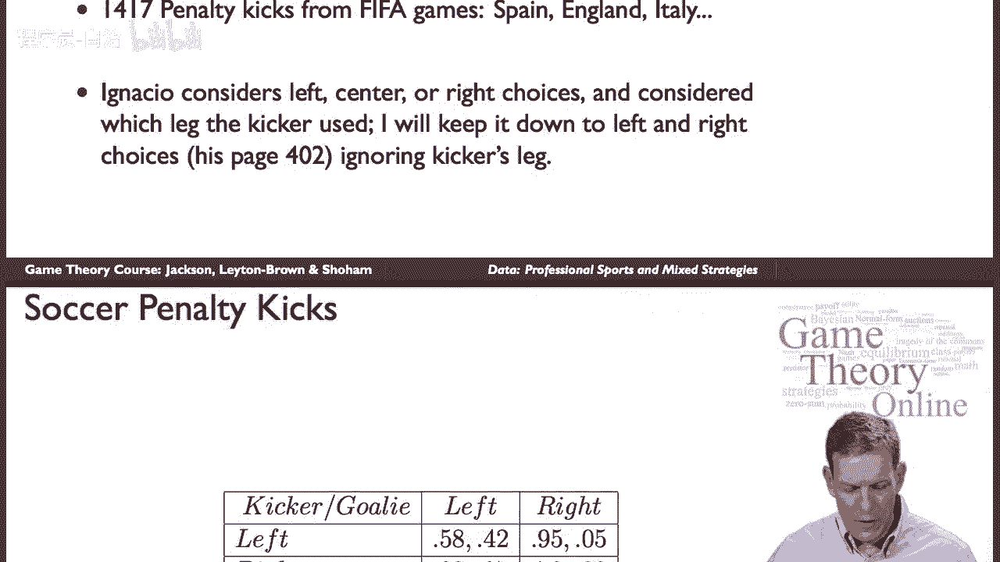

不管是不是，我们将在这个博弈中得到纳什均衡。

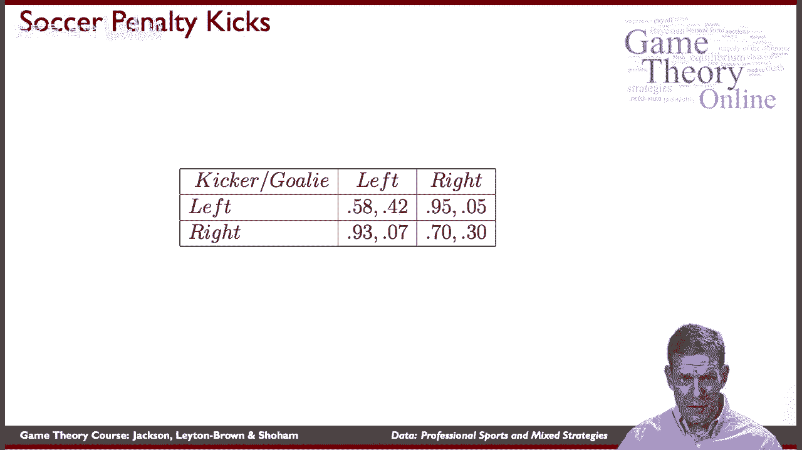

好的，那么我们为什么不这样做呢，考虑到这些数字，我们可以暂停视频，解决游戏，所以你可以看看这个，试着弄清楚守门员向左的可能性有多大，假设守门员向左移动的概率为pg，踢球的人有可能向左，用这个矩阵求解。

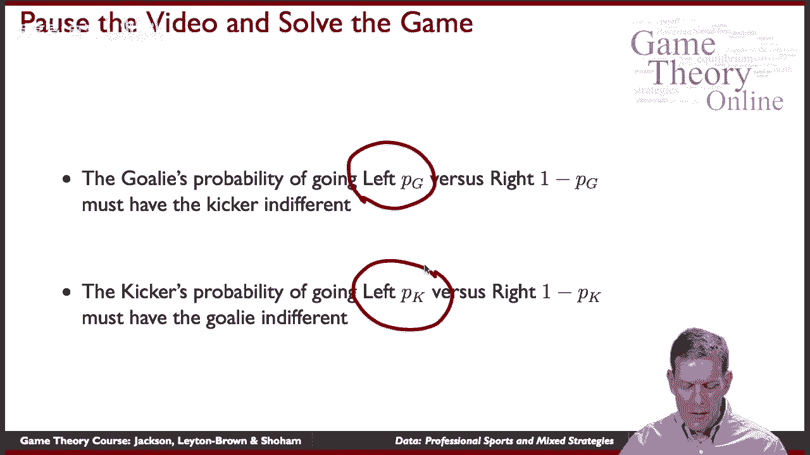

所以你要把PG放在这里，这里减去1皮克这里减去1皮克，这里是1减去pk，试着解决混合策略，这个博弈的纳什均衡，所以花几分钟，暂停视频，试着解决这个问题，然后我们再回来看看解决方案是什么样子的，好的。

所以你有机会看一下，现在让我们看看在，呃，在这个游戏中，所以我们需要的是，我们需要PG让踢球的人无动于衷，对呀，所以如果踢球者踢向左边，我们可以计算出他们得到的回报，如果踢球的人走对了。

我们可以计算出他们得到的回报。

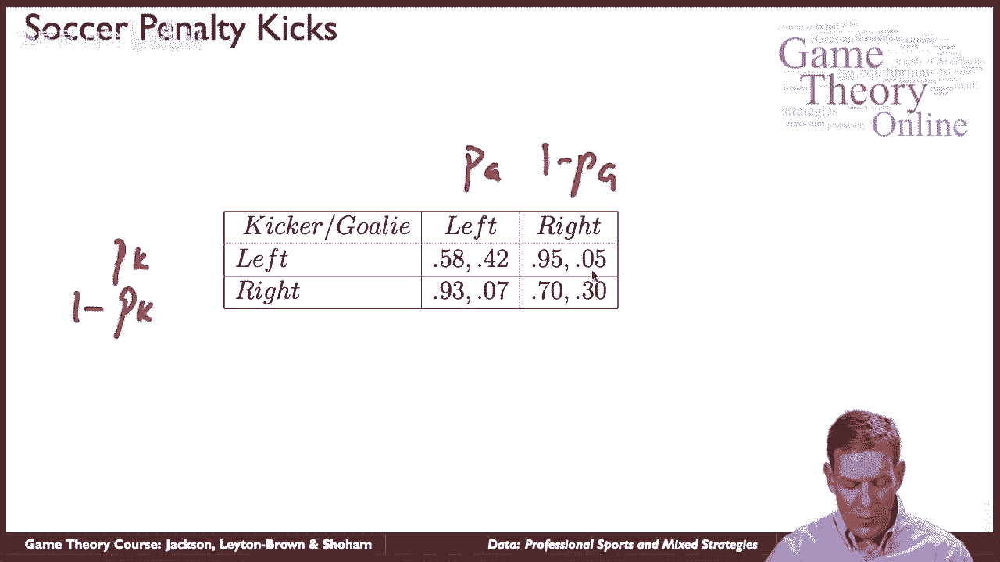

所以说，特别是，守门员左右逢源的概率，必须让踢球的人无动于衷，所以当我们看着踢球的人，向左的回报，与他们的回报相比，走对路必须是一样的，你解决这个问题，你最终得到的是什么，是呃。

在这种情况下大约是十二分之五或四点二，所以如果我们对向左的踢球者也这样做，相对于向右的踢球者，你可以穿过那个，你知道，设定守门员从左向右漠不关心中获得的回报。

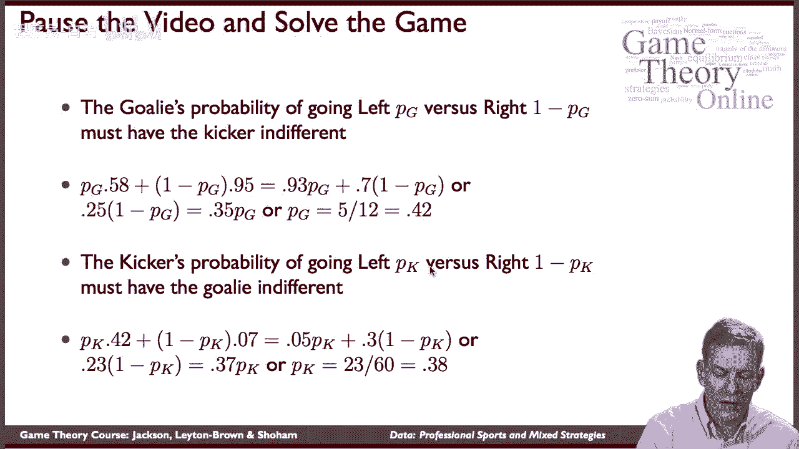

我们最终会得到什么，我们以PK结束，踢球的人向左跑的概率是三点八，所以就我们的发现而言，我们发现守门员应该走左边四个，百分之二的时间让他们走对了，五个，百分之八的时间踢球的人应该向左走，概率为三点八。

所以他们向右转的概率是6 2，所以我们有一个基于实际频率的简单预测，踢球的人和守门员在左路对左路时得分，对等等如此如此，如果他们这么做，嗯，面对左右逢源的人群，这些是收益，那么这就是他们应该有的行为。

好的，那么数据中发生了什么。

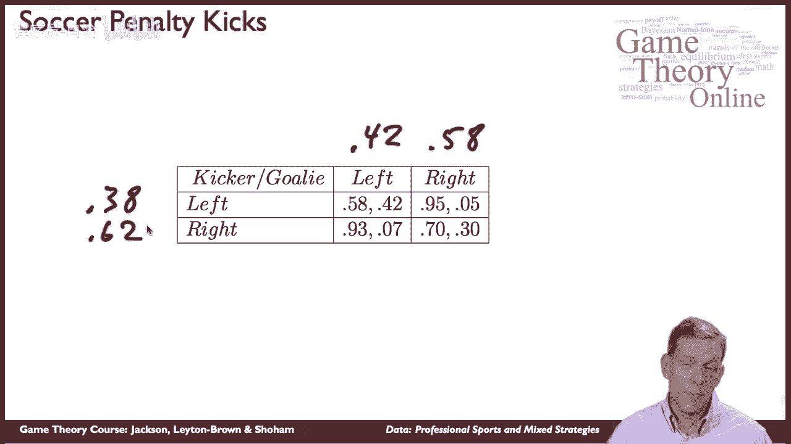

让我们看一看，所以纳什频率，守门员向左，四，2%的时间守门员应该走对，五个，8%的时间踢球的人应该向左走，三个，8%的时间踢球的人应该走对，六十，百分之二的时间。

在记录的1417场比赛中他们到底做了什么，所以我们这里有大量的数据，守门员四二，五八，就在钱上，所以非常，非常接近三八六十二，所以其实，当我们看到职业足球运动员在比赛，我们看看他们得到的回报。

就混合策略而言，他们几乎完全是在玩纳什均衡，或者在这种情况下，这是一个零和博弈，这与最大最小策略相同，然后呃，你知道的，如果我们问他们到底是如何学会这样做的，他们坐着看矩阵并不一定是真的。

直接计算这些东西，但随着时间的推移，他们得到了它，你知道他们应该对向左和向右漠不关心，所以如果其他玩家过于频繁地朝着一个方向或另一个方向前进，他们开始调整，他们可以从一个方向或另一个方向获得更好的回报。

他们会利用这一点，所以事情必须调整，随着时间的推移，保持它们的冷漠。

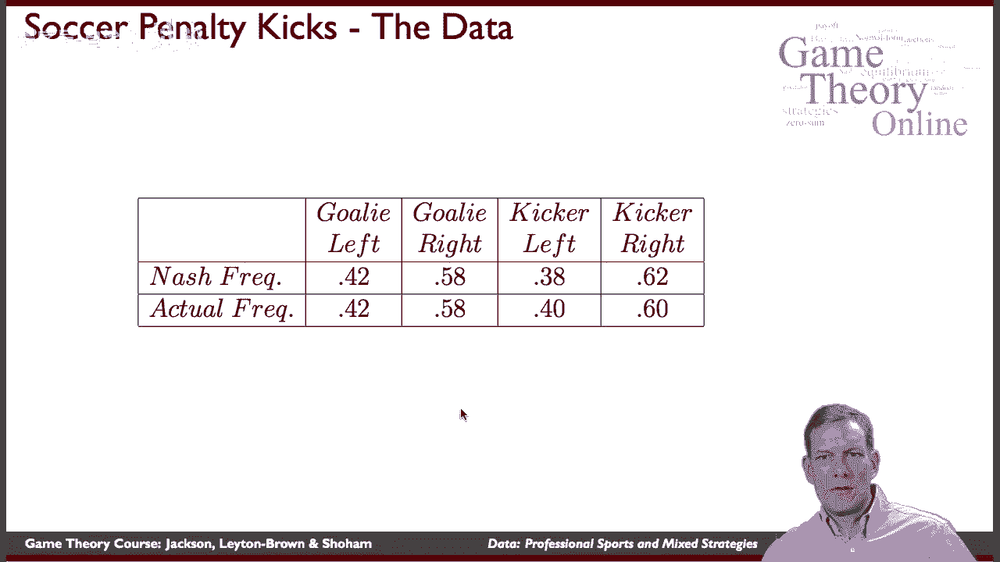

所以嗯，你知道的，随着时间的推移，玩家是否很好地随机化，是啊，是啊，很好，嗯，你知道，呃，Ignacio的论文对此进行了更详细的研究，你知道，在像这样的事情上，嗯，他们在混合方面做得有多好，你知道的。

他们是不是，如果你想五五开，一种方法，那就是向左走一次，那下次就对了，然后下一次右转，以此类推，只是交替，这显然不是随机的，所以取而代之的是一个问题，人们是否随机，所以随着时间的推移。

它们真的是不可预测的，伊格纳西奥发现他们做得相当好，即使就他们的踢腿弦而言，还有其他问题，你可以问，你知道吗，他们在压力下表现如何，如果这是一场重要的比赛，这是一个非常重要的踢腿。

他们倾向于走向他们更强壮的一只脚，它们变得可预测了吗，嗯好吧，你知道，事实上，现在你看到越来越多的专业运动队，雇用统计员，招聘游戏，准确地跟踪发生了什么，就其他球队的倾向而言，在这种情况下他们会怎么做。

在那种情况下他们会怎么做，我们的最佳策略是什么，作为对此的回应，所以你知道，经历和分析这些事情在其他运动中已经成为一种趋势，有类似的分析，马克写了一篇很好的论文，沃克和约翰·沃特斯，美国经济评论，嗯。

看网球，呃在爵士，所以嗯，你知道，你必须为哪边服务到给定的区域，你是朝它的左边发球吗，它的右边，这个中心，它是如何依赖于，不管你是右撇子，左手，你往哪个方向走？等等，所以他们分析了一系列职业网球比赛。

同样，他们发现极大极小游戏是一个相当好的预测，到底是怎么回事，嗯，你知道，随着时间的推移，人们真的混合得有多好也是一个问题。

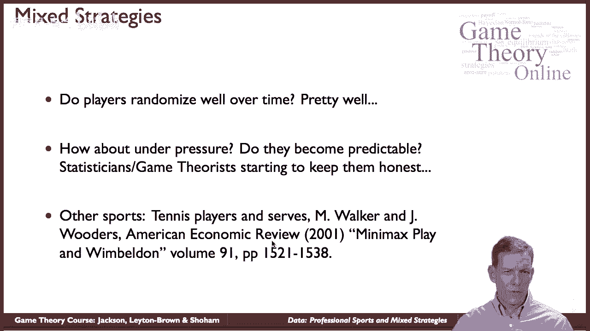

但均衡预测做得相当好，好的，嗯，你知道的，我们在那里看到，它们将是混合策略的游戏，均衡，特别是，零和和竞技游戏往往会让他们在很多情况下，玩家必须对什么漠不关心。

他们面对的球员给了你一些非常有趣的比较静态，你知道的，我们问了这个问题，我们真的看到随机化了吗，我们发现，你知道的，是呀，在职业体育中，我们确实看到了，呃，随机化，嗯。

世界上还有很多其他的事情你可以看到随机化，所以捕食者猎物小游戏，你知道在自然界，如果你走到松鼠的一角，松鼠以为你在抓它，它做什么它随机化了一点，所以说，这是非常不可预测的，弄清楚松鼠要向哪边飞奔。

当你走过它的时候。

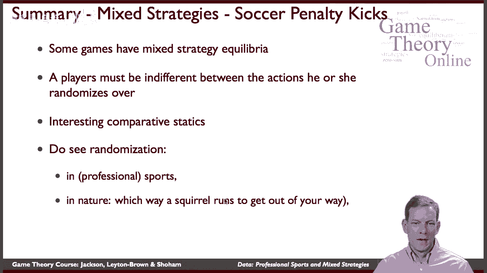

嗯，那是，呃，你知道，它基本上遵循随机策略，很多商业互动，所以如果我们看看审计之类的东西，税务审计，嗯，那是一个你将要看到的游戏，竞争激烈的情况，税务当局不一定想让你确切地知道，你是否要接受审计。

他们想要，你可能希望你有一些不确定性，所以他们不能审计每一个，如果他们不能审计人口中的每个人，如果审计有成本，这将是一个游戏，他们将混合，随机化可能有助于税务当局，所以有很多随机随机检查的设置。

随机审计本质上是最优策略，作为某些游戏的一部分，我们是下一个纳什均衡。

