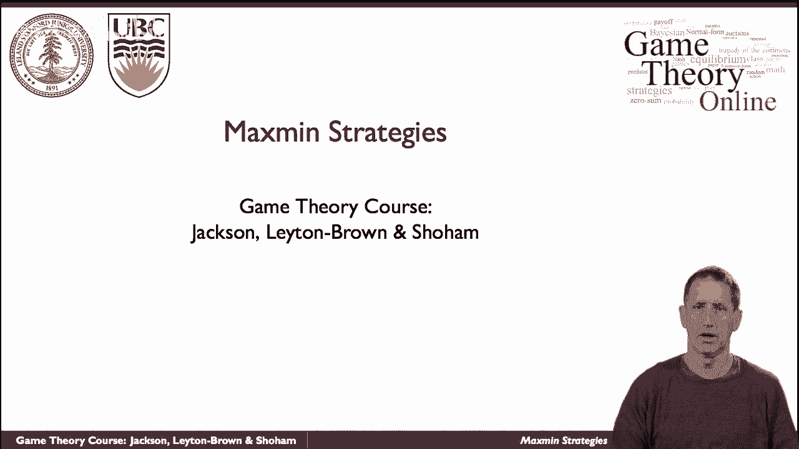
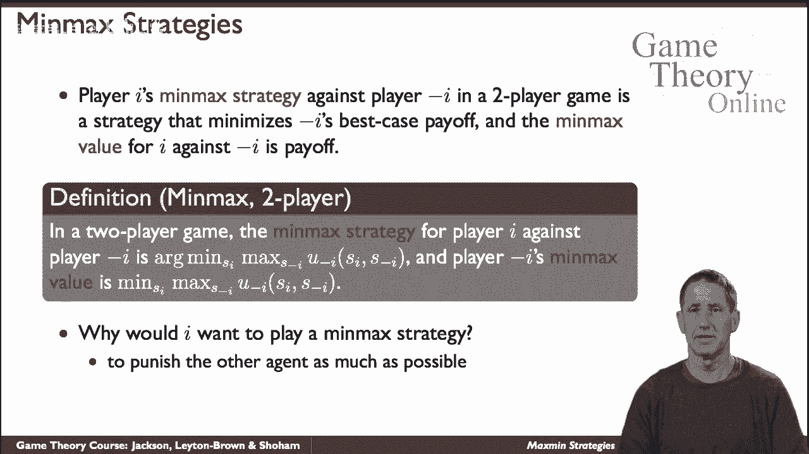
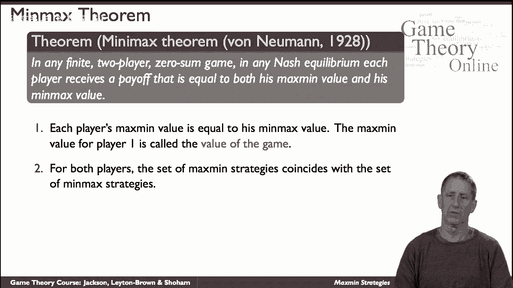
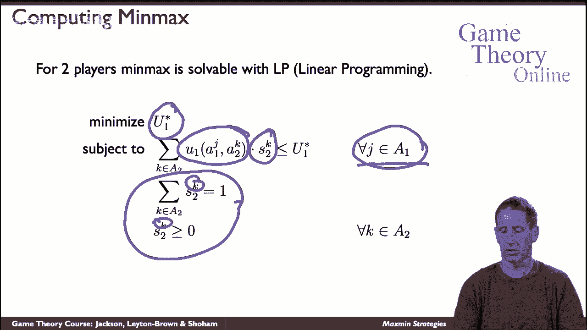

# P23：【斯坦福大学】博弈论（22）最大最小策略 - Advanced - 自洽音梦 - BV1644y1D7dD

我们现在来谈谈，呃，最大策略，这些在零和游戏的背景下特别有意义，但实际上适用于所有游戏。

什么是最大最小策略，它只是把玩家的策略最大化他们的回报，假设另一个玩家出去抓他们，我们就会，呃，我们将主要集中在真正的玩家案例上，因为当我们进行零和博弈时，它们对两个玩家的情况没有任何意义，但请记住。

人们可以更普遍地定义这种，呃，当我们谈到最大策略时，所以呃，最大化策略是一种最大化我最坏情况结果的策略，收益是由最大策略保证的吗，这里正式定义了，玩家的最大策略，我是一个最大化的策略，最低限度。

另一个玩家记住-i是我以外的玩家，会呃，保持嗯，把一个放下来，最大值的定义类似于该最大值策略的值，为什么我们要考虑最大策略，人们可以把它看作是一种简单的警告，也许呃，其他人会犯一些错误。

不按照自己的最大利益行事，嗯，也许我不确定他们的确切收益，有没有，大量的解读，虽然，你可以简单地，呃，偏执狂，想着他们是来抓你的，你知道，你知道俗话说，你知道的，呃，即使是，呃，偏执狂，有一个。

这是最大最小策略，只是为了混淆事情，我们还将讨论极大极小策略，最小最大策略是针对，如果你希望双人游戏中的另一个玩家，是一种使他们的回报最小化的策略，假设他们试图最大化它，这是正式的定义。

玩家I的最小最大策略是和另一个人比赛，你用负号知道，I是最小化最大收益的策略，作为回报的另一个人的尝试，给另一个人，最小最大值就是最小最大值策略的值，现在玩一个的价值，为什么呃。

为什么一号玩家想伤害另一个人，嗯，嗯，你可以，可能只是为了让他。

有这种可能，或者他们可能在玩一个零和游戏在一个零和游戏中，伤害别人就等于提高自己，你自己的回报，所以呃，在零和博弈的背景下，呃，最大输入和最小最大策略很有意义，事实上。

在约翰·冯·诺依曼的一个非常著名的定理中，嗯，它证明了呃，在零和游戏中，根据定义，我们认为只有两个玩家这样的游戏，任何纳什BM，玩家收到回报，等于他的最大值和最小最大值，这意味着我们称之为游戏的价值。

一号玩家的值称为游戏的值，这意味着最大策略集实际上是相同的。

一套最小最大策略，试图改善你最坏的情况，都是一样的，和任何最大策略配置文件或最小最大策略配置文件，因为他们是一样的，构成纳什均衡，而且这些都是自然存在的，所以所有自然平衡的收益都是一样的，即游戏的价值。

一种获得具体感觉的方法是图形化，这是一个匹配便士的游戏，这是一个你，我们每个人都选择头尾，有一定的概率，如果它出现了，呃如果我们如果如果如果是我们随机化的结果，我选正面，你选反面，你赢了并皈依。

反之亦然，如果我选尾巴你选脑袋，但如果我们都选了布什的尾巴，我赢了，这是你在这里看到的收益，策略空间，我是二号玩家，有点增加，玩人头的概率，这是呃，一号玩家，在这个维度上，你有游戏的价值，玩一个的PF。

唯一的纳什均衡是双方随机对半，就在这里，这是一种进入，通过切片来观察，这样的三维结构，你会看到，它必须是一个均衡，因为玩家，一号玩家可能在移动，这个，呃，这条曲线，但如果像他那样做，他的泄漏只会下降。

所以他试图最大化价值，你会这么做，反过来，玩家2只能沿着这个，但如果他那样做了，收益只会增加，他试图使价值最小化，所以你得到了一个稳定的点，由于显而易见的原因，它被称为鞍点。

因此，尽管有找到国家协议的一般目的程序，尤其是在二比二的比赛中，我们可以用最大最小定义直接在零和博弈中求它，让我们看看它是如何，呃，在游戏中是如何发生的，我们会打电话给呃，点球比赛。

所以在这个游戏中我们有一个A，呃呃，点球手和守门员，呃，这是一个零和游戏，和呃的目标，踢球的人是进球，进球，守门员的目标是阻止它，让我们假设他们每个人都有两种策略，向左踢，向右踢，跳到左边。

跳到右边给守门员，嗯，收益将是，每一个都将决定呃，踢球者进了一个球，我们就有可能得到回报，游戏的价值，这就是回报呃，一对一，因此减去玩家的收益a 2，就是守门员，所以他们在这里，比如说。

如果踢球者踢向左边，守门员猜对了，也向左跳了起来，那么守门员阻止射门的机会就不太大了，即概率点四，如果他跳到错误的一边，他阻止它的概率比第二点低得多，同样地，呃，如果踢球的人决定踢向右边。

如果守门员猜错了，他的概率很低，甚至比你在另一种情况下变得强壮时更低，如果他做对了，他的概率比较高，虽然没有左边箱子里的那么大，所以他更擅长阻止投篮，当踢球的人踢向左边时，那么踢球者是如何，呃。

最大化这些最小值，这就是我们要找的，所以这里是表达式对，我们希望下面的最大值，所以他们每个人都有一些左右逢源的混合策略，有一定的可能性，所以是一，L是踢球的人踢向左边的概率，我是守门员跳到左边的概率。

正如我们在那个案例中看到的，值是第六点，同样，如果他们，如果我们最终陷入这种境地，在这种情况下，第九点和第七点，所以这是我们需要计算的表达式，踢球者应该记住的最低限度是多少，所以踢球的人说，我要选。

我要玩我的策略是一，不管是什么，当我玩它的时候，2号玩家要玩2号，以尽量减少我的回报，所以让我写下整个表达式，我只是简单地复制它，替换um的表达式，例如s 1 r乘1减s 1病，这就是它所做的一切。

两个R也是一样的，所以我们有，嗯，这是我们的表达，一号玩家对自己说，如果我玩我的策略，只有一个和呃，这只是重新安排条款，这里没有其他的作为s，2，l的函数，因为一号玩家说我要把，我要挑一个。

什么是最佳反应，即它的最小值，所以这是把它安排成S 2策略的函数，现在剩下的就是寻找策略的最低限度，最小的是，通过一阶导数，例如：1为常数，所以我们有这个表达式，然后我们求解S 1。

我们得到L中的一个是一半，因此r的1也是一半，所以通过这个最大值计算，我们看到玩家，踢球者发现在平衡状态下，他们最好在左右之间随机分配一半，什么是呃，守门员是什么，有点呃，好好弄清楚。

他试图把踢球手的最大右路减到最小，这是看待它的一种方式，他在做最小最大策略，这是2号博弈者的最小最大策略，只是把它写下来，和以前一样，我们将简单地，嗯，r中的1是1减去s，l中的1，以此类推。

对于r的s 2，这次我们将重新排列这个术语，作为声音的函数，因为2号博弈者说，呃，一号玩家，2号博弈者说1号博弈者是我的选择，就是两个，一号玩家会想要最好的回应，就是最大化，所以让我把它写下来。

作为一个函数，现在弄清楚最大值是多少，这是最大值，当你解出L 2时，现在你得到平衡中的随机化，对2号博弈者来说是1/4和3/4，这说明了我们如何使用最大定理来实际计算，零和博弈中的纳什均衡。

至少在一般的二乘二的游戏中，我们可以用最小最大定理来计算，零和博弈的均衡，我们通过简单地设计一个线性程序来捕捉游戏，就在这里，所以你的一星将是游戏的价值，这是1号参与者在均衡状态下的收益。

所以我们将从玩家的角度来指定，我们也可以反过来做所以2号玩家说的是，一号选手，玩家可能考虑的每一个动作，我想找一个混合策略，这是我的混合策略，It’两点，它会看我所有纯粹的策略，k。

并确保概率--这是这些和的概率分布，它们相加为一，它们不是阴性的，所以我想做的是，对我的策略的最佳回应，被一号玩家，因为这些动作中的任何一个都不会超过游戏的这个价值，因为我想把它最小化，所以我要去找。

具有属性的最低U，那个玩家一号没有任何有利可图的偏差，他的纯策略，所以当我看到回报时，当我玩2K的时候，他用我现在正在考虑的那个J弹了一个1 J，在我的混合策略中，我乘以玩2K的概率，我想，我不想那样。

呃，那个玩家玩家，一个有有利可图的偏差，所以一定是这样，他的预期收益将不超过U的价值，一星，所以呃，很明显，这是游戏的正确表述，它是一个线性程序，我们都知道，线性规划是有效可解的，最坏情况下是指数级的。

