# P24：【斯坦福大学】博弈论（23）博弈的相关均衡 - 自洽音梦 - BV1644y1D7dD

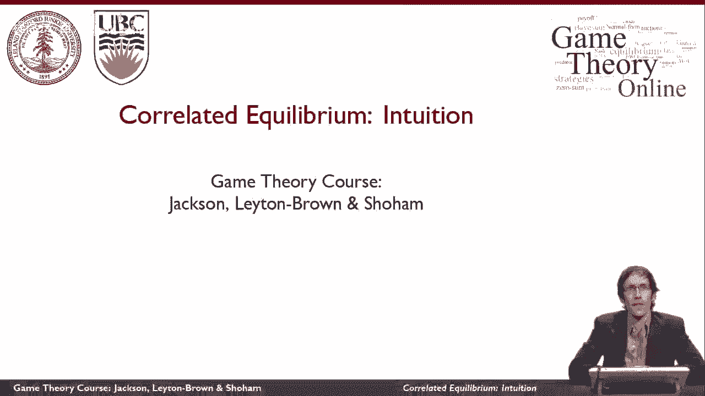

这段视频将向你解释一个新游戏背后的直觉，称为相关均衡的理论解概念。

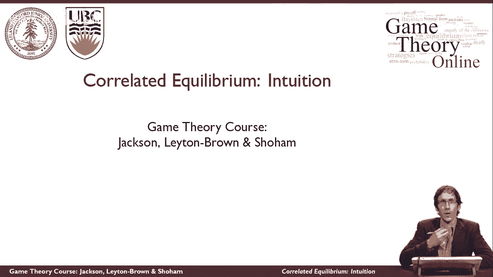

让我们再想想性别之战游戏，让我们考虑一下它的纳什均衡，记住有一个纳什均衡，双方都玩B，有一个纳什均衡，双方都玩f，还有另一个纳什均衡，双方参与者随机化，根据这些概率，这意味着所有四种结果都可能发生。

所以这两种结果都可能发生。

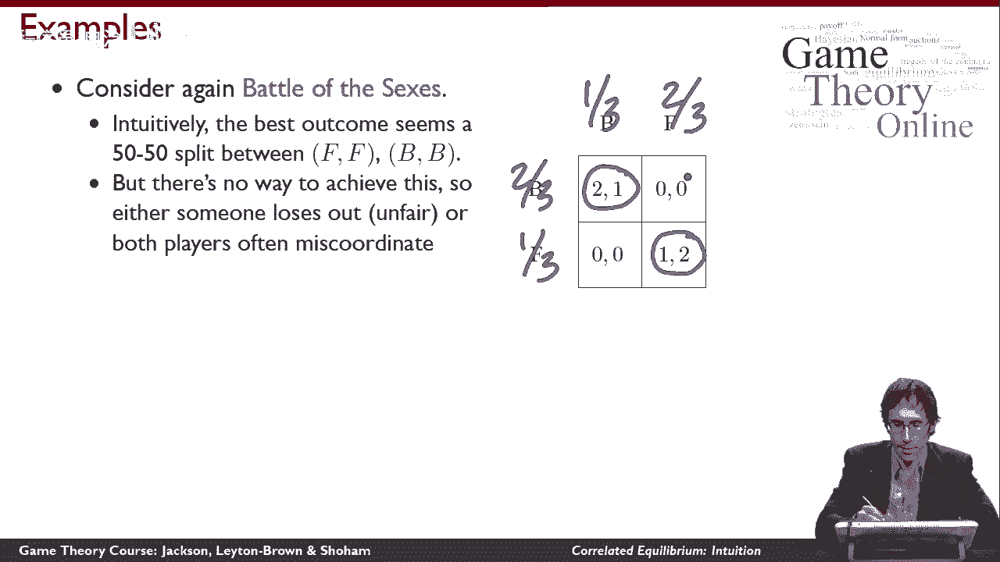

但这些也可能发生，现在让我们直观地考虑一下，对我们来说，性别之战最有意义的是什么，这种结果真的有一半的时间会发生，这种结果有一半的时间会发生，如果你和你的伴侣真的对做什么有不同的偏好，你想在一起。

你们会计算出你们每个人都赢了一半的时间，关于性别之战的一些事情可能会让你印象深刻，这并不能让我们说这是一个稳定的结果，我们不说它稳定的原因，如果这两件事都能发生。

那么两个玩家都必须在全力支持下玩混合策略，这意味着MIS协调动作也必须是可能的。

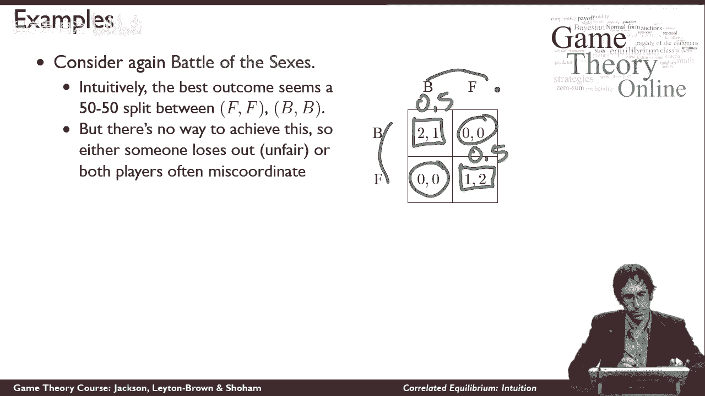

嗯，这是另一个我们可以思考的例子，它会给我们一些直觉，为什么这里到底发生了什么，以及我们如何对此做些什么，所以这是交通游戏，所以这个模型，两辆车一起开到十字路口的情况，他们必须决定是否要等其他人先通过。

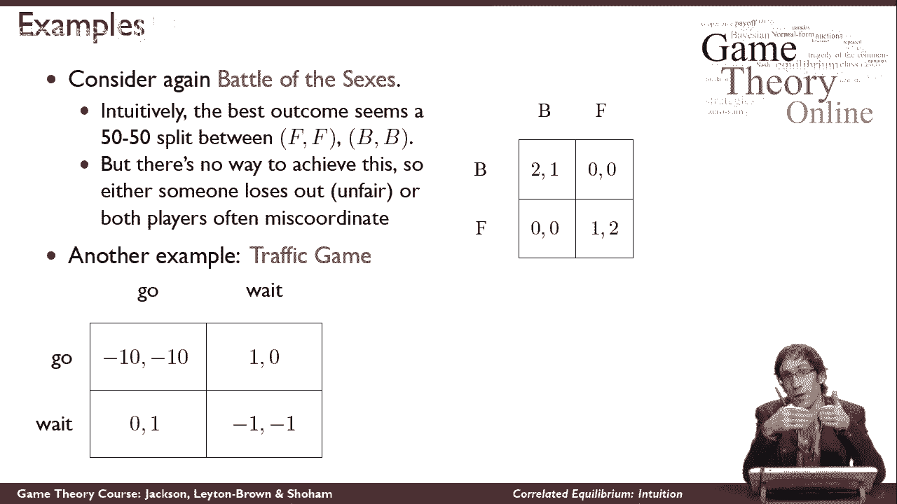

还是只是好好地度过，如果他们中的一个走了，另一个等着，然后去的那个得到最大的效用，如果他们都在等待，等待的人就会得到更少的效用，严格来说，他们都不那么快乐，因为他们都在等待。

他们仍然必须决定如果他们都去了该怎么办，最糟糕的事情发生了，因为他们撞在一起，所以总的来说，我们有两个纯策略均衡，它们又是不对称的，有点像性别之战，当然，这里也有可能有一个混合策略均衡。

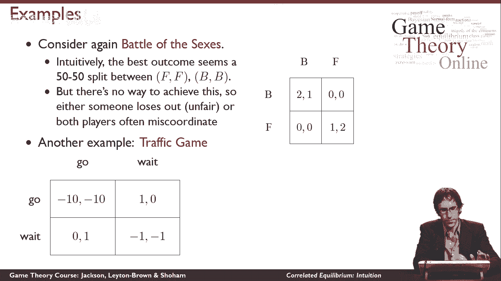

但让我们想想世界上到底会发生什么，当我们遇到这种情况时，我们有一个十字路口。

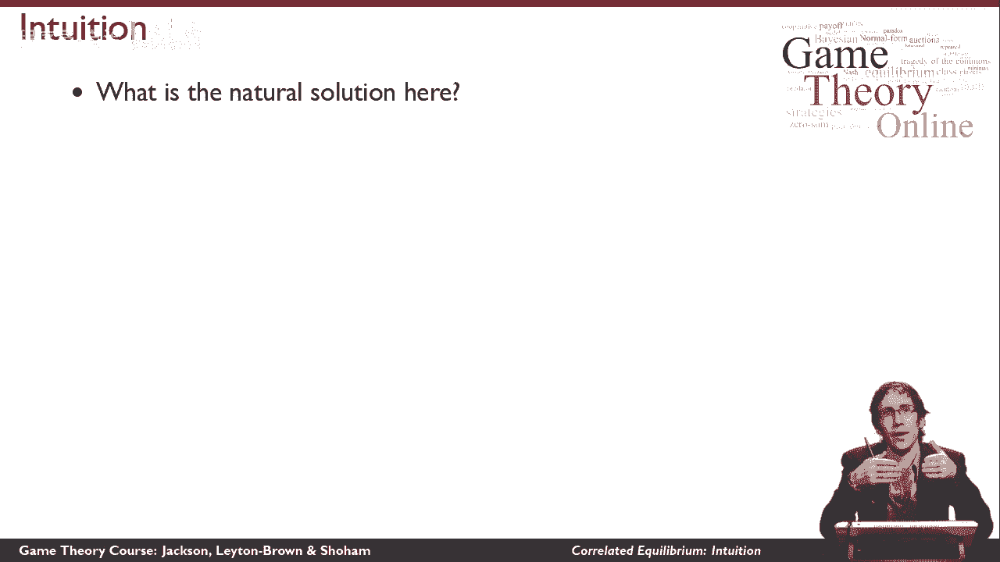

汽车有可能相撞，我们真正做的是我们有一个交通灯。

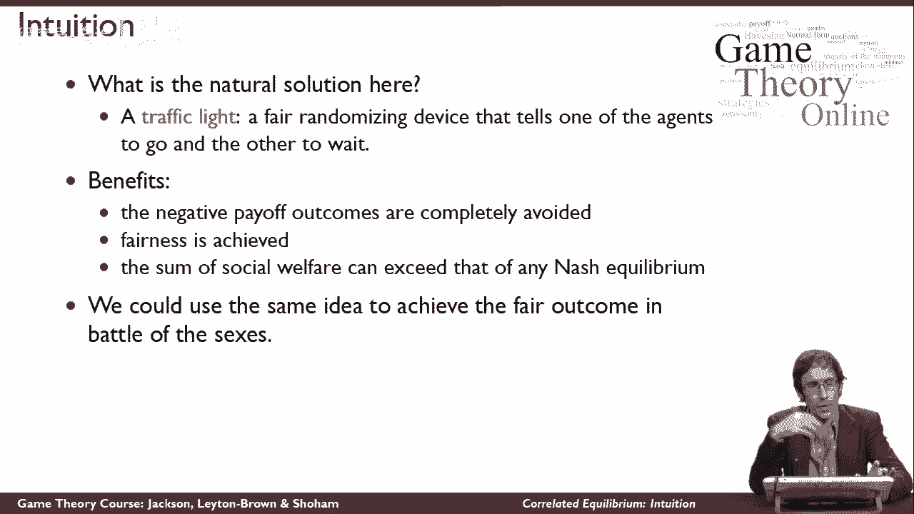

让我们想想交通灯意味着什么游戏，理论上，它是一个公平的随机设备，向代理推荐行动，它告诉其中一个去，它告诉另一个等待，这是公平的，因为它在不同的时间提出了不同的建议，嗯，这里的好处是完全避免了负回报结果。

我们可以实现公平和普遍的事情，虽然不是在本例中，最后有可能得到一笔社会福利，超过任何纳什均衡所能达到的，嗯，我们可以用同样的想法，在性别游戏的战斗中取得公平的结果。

所以我们可能会有丈夫和妻子抛硬币的情况，取决于硬币是如何出现的，他们不是一起去看芭蕾舞就是一起去看足球。

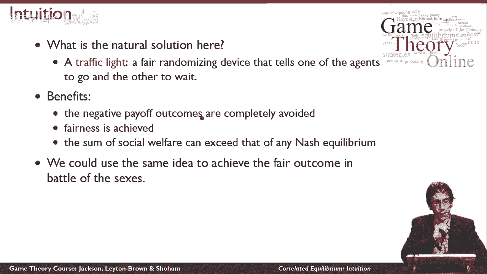

这本质上是一个相关均衡的想法。

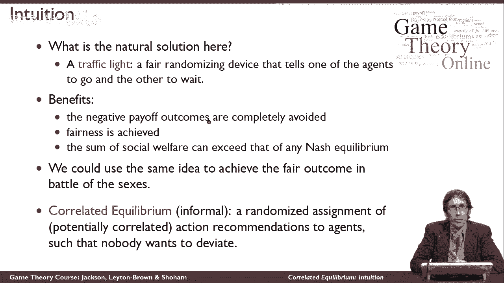

相关平衡是对代理人的行动建议的随机分配，这样每个人都想遵循行动建议，所以我们有一些随机设备告诉我有一些时间，在某些时候，它是以一种相关的方式，潜在相关方式，告诉你B一些时间，告诉你有一些时间。

所以抛硬币，如果是头，我们都得到了推荐，b，如果是尾巴的话，我们都得到了推荐，f是这样的随机化装置，虽然它可能会更复杂，原则上，如果出现正面，我们明白这意味着我们都得到了推荐。

B这并不能强迫我们两个都去看芭蕾舞，我们仍然可以自由决定如何解释这项建议，但这是一个相关的均衡，如果我们都不想偏离建议，你可以在这个例子中看到，我们都不想偏离的性别之战，因为如果另一个遵循建议。

而我偏离了，那我就会得到零的回报，而不是得到正的回报，所以相关平衡是这些的随机分配，可能相关的行动建议，让任何人都不想偏离，它是纳什均衡思想的推广，因为如果这些行动建议根本不相关。

然后我们就像以前一样回到混合策略，所以我们可以用这种方法捕捉任何纳什均衡，但我们也可以得到新的东西，就像我们刚刚看到的那样，所以这是纳什均衡概念的严格弱化，并包括更多的东西。

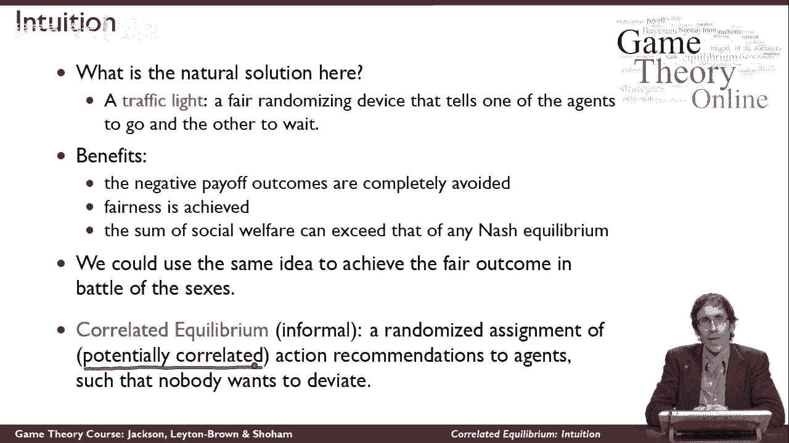