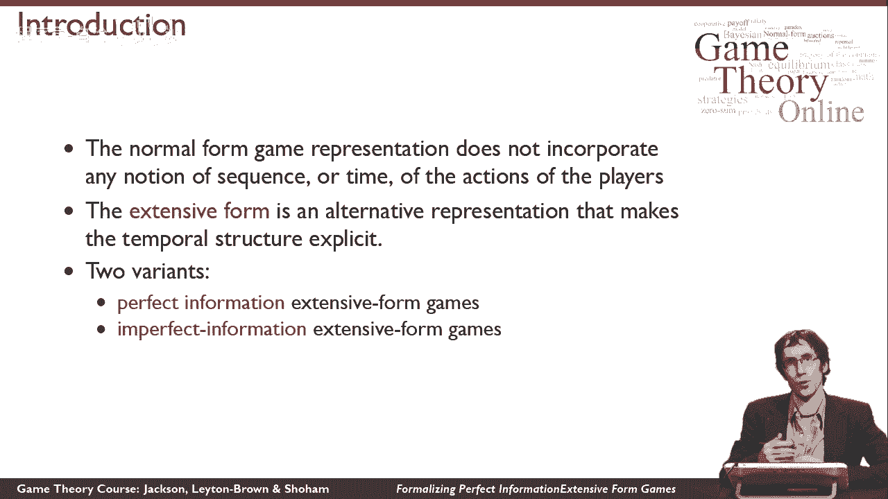
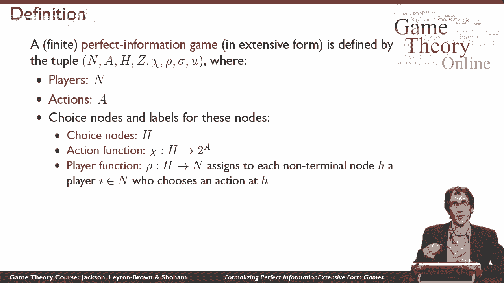
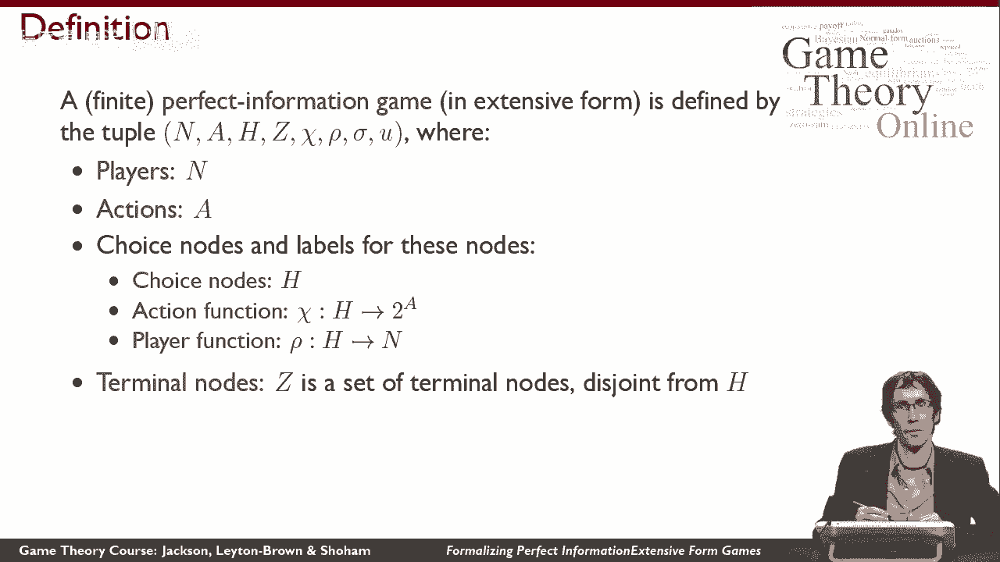
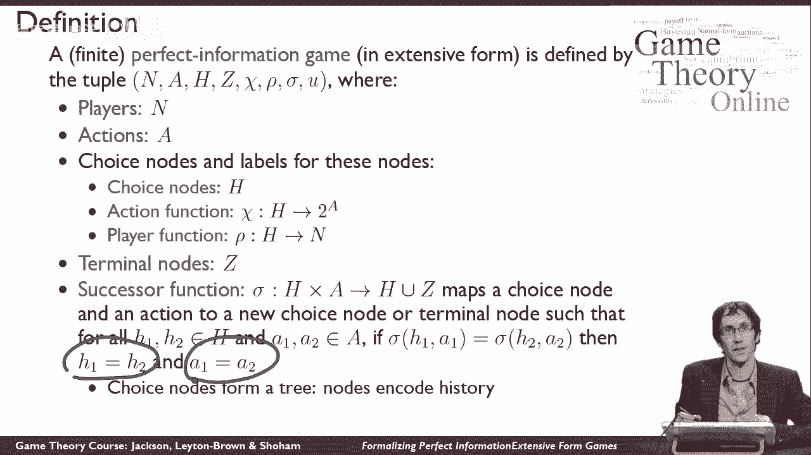
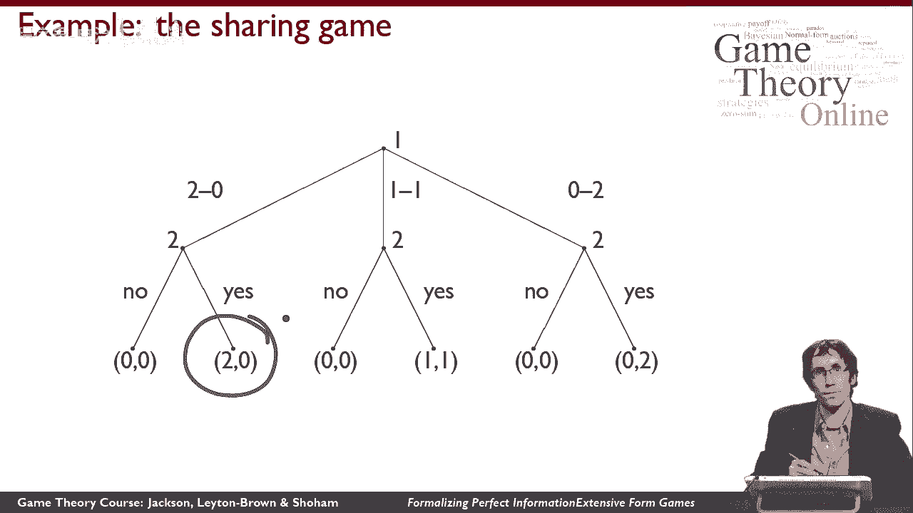

# P26：【斯坦福大学】博弈论（25）完美信息拓展形式的形式化表述 - 自洽音梦 - BV1644y1D7dD

我们将研究涉及时间的最简单的游戏，这就是所谓的完美信息。

广泛形式小游戏，所以回想一下正常形式的游戏模型所有玩家同时采取行动的情况，这意味着很难用它们来思考案件，人们真的在按顺序做某事，在设置中有某种明确的时间，在这里，我们要看另一个游戏表示，叫做扩展形式。

使时序结构显式，所以它让我们更自然地思考时间，有两种不同的广泛形式的游戏，我们将在这门课程中讨论，完善信息，形式粗放，信息不完善，广泛形式，我们从第一个案例开始，基本上。

他们的不同之处在于玩家是否能够对另一个玩家所做的一切进行推理，或者有时他们不能观察到。

所以一个广泛形式的完美信息游戏，是以一种比正常形式游戏复杂得多的方式定义的，我们需要更多的碎片才能让它发挥作用，所以我们需要所有这些不同的碎片，直觉上，这里发生的事情是我们有一组球员。

就像我们之前做的那样，我们有一套动作，现在只是所有玩家的一套，而不是每个人都有不同的动作，然后呢，所有剩下的东西都将被用来定义效用函数，为了得到公用事业，我们需要思考游戏的时间结构。

所以我们将有效地建立一个游戏树，玩家轮流，在游戏树中采取行动，最终他们在游戏结束的某个节点结束，我们将有一个实用程序标记该节点，所以让我们把直觉形式化，我们将从一组选择节点开始，所以这些将是树中的节点。

玩家采取行动的地方，发生事情的地方，我们将调用那组选择节点。

h现在使选择节点工作，我们需要分配给一个选择节点，在该选择节点中可以采取的所有不同操作，所以我们有一个叫做动作函数的函数，chi分配给每个选择节点，选择节点中的玩家可以使用哪些操作。

我们还有一个播放器功能，播放器函数告诉我们每个选择节点。

谁能在那个节点上做出选择，那是选择节点，我们有另一种节点，也就是游戏结束的节点我们称之为终端节点，所以这是一组不同的节点，它与h不相交，我们称之为。

所以这给了我们游戏树中所有不同的节点，现在我们需要游戏树中的边，我们使用后继函数建立这些边，后续函数的工作方式是，它是一个映射，选择节点和在该选择节点中对新节点采取的操作，该新节点可以是选择节点。

另一个选择节点，或终端节点，我们想要的是后续函数与节点结合定义一棵树，为了实现这一点，我们需要说，只有一种方法可以到达任何给定的新节点，所以我们正式说的方式，对于所有选择节点对。

对于所有可以采取的对动作，唯一的方法是，在这两种情况下，后继函数是相等的，就是如果这两个，如果两个选择节点相同，两个动作相同，所以这个条件意味着选择节点形成一棵树。

这就是我们想要的，所以现在在这一点上，我们终于可以讨论玩家在游戏中的效用了，所以我们将为每个玩家提供一个效用函数，它将为每个终端模式分配一个数字，所以对每个玩家来说，对于每个终端节点。

我们要把一个真正的价值，这将告诉我们玩家有多高兴，如果他们最终处于终端模式。

让我们看一个例子，这是分享游戏，讲述了一个哥哥和一个姐姐想在彼此之间做出决定的情况，他们将如何分享两美元，所以他们有两张美元钞票，它始于兄弟说，2。他打算怎样分配这笔钱，所以他从这里的首选节点开始。

兄弟一号玩家，所以他有三个动作可以在第一选择中采取不，他的第一个动作被标记为二零，意思是他留了两美元，他什么也不给他妹妹，第二个动作标记为一一，这意味着他愿意和他妹妹平分这笔钱，最后一个动作标记为零二。

这意味着他打算把所有的钱都给他妹妹，在每一种情况下，在哥哥采取行动后，我们过渡到一个新的选择节点，姐姐可以表演的地方，她可以采取两个行动中的一个，在每种情况下，她都有相同的两个动作，她可以接受他的提议。

或者她可以拒绝，它的工作方式正是你所期望的，所以如果她拒绝了这个提议，那么他们两个都得到零的回报，而如果她接受了这个提议。

