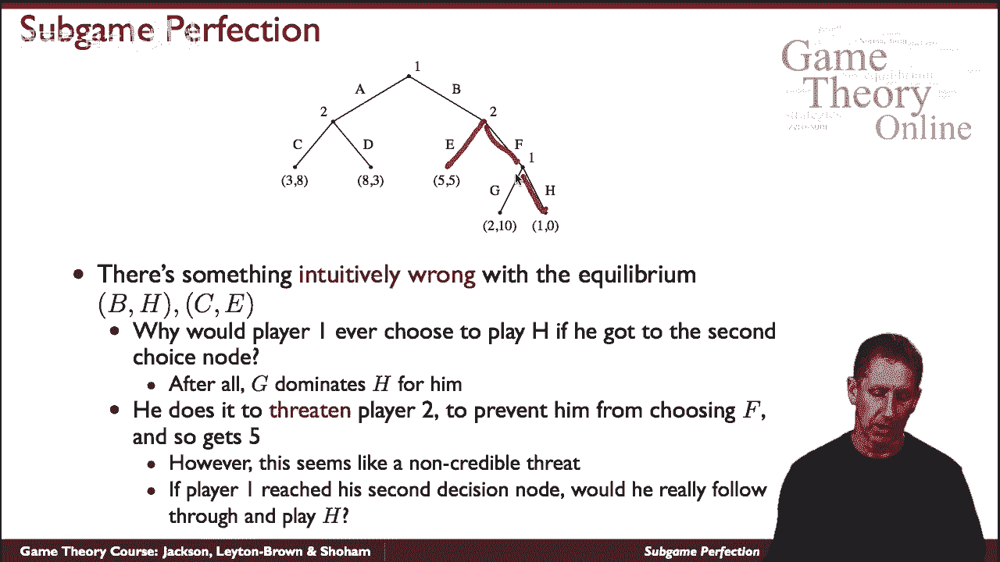
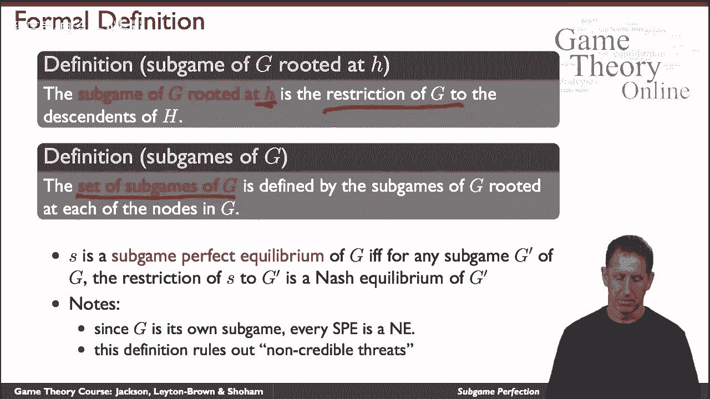
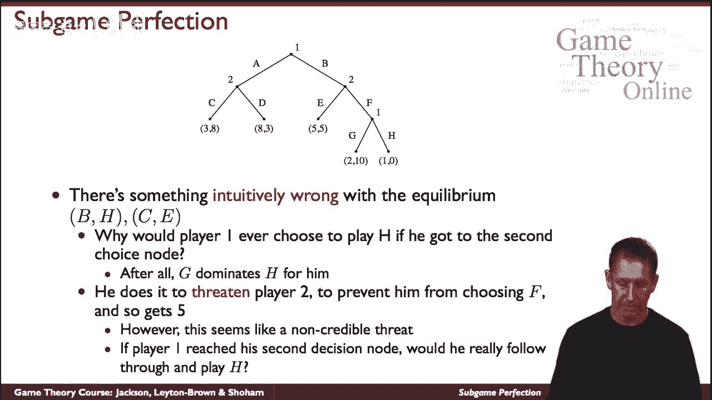
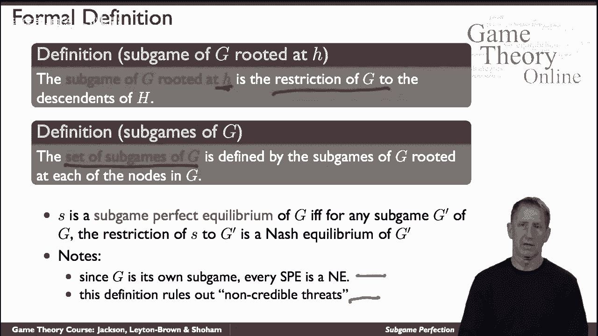
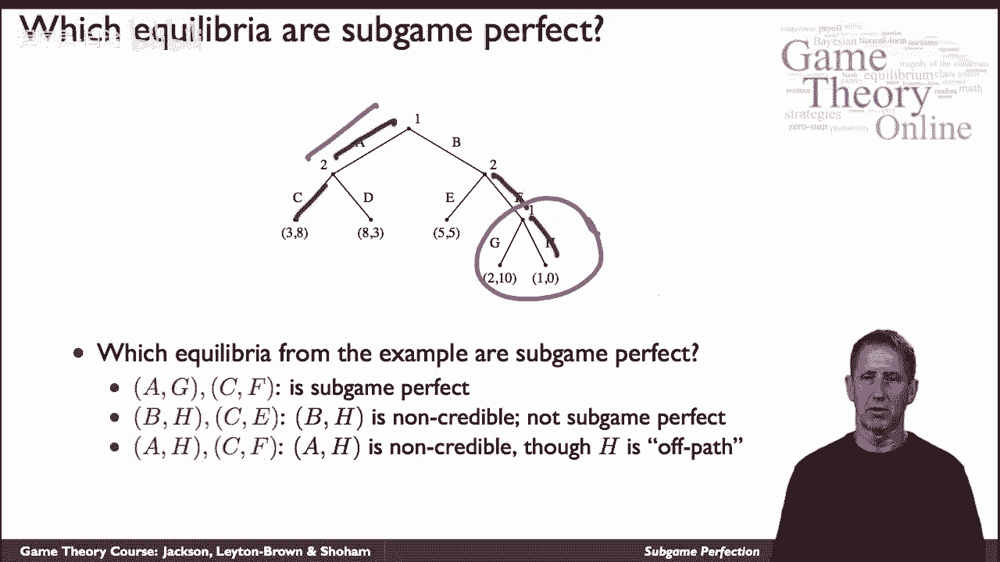

# P28：【斯坦福大学】博弈论（27）子博弈完美 - 自洽音梦 - BV1644y1D7dD

现在让我们重温广泛论坛游戏的解决方案概念，让我们从做开始，嗯，让我们从这个游戏中的以下示例开始，有许多纳什均衡，这是其中一个，什么是bh，一号玩家在这里和这里，而二号博弈者在这里和这里，在本战略简介下。

当然比赛的结果是这个，两个玩家的回报是五，让我们首先说服自己，这确实是一种自然平衡，所以让我们让玩家固定一个策略，看看2号玩家是否能从他们目前的反应中获利，嗯，他们能做什么，他们可以在这里说，我会的。

而不是去C，我会去，他们可以这么说，但这根本不会影响结果，假设2号博弈者倒下b，所以这不是一个有利可图的偏差，不会改变他们的收益，二号玩家的收益，他们能做的另一件事是说，我从这边下去。

但这实际上会恶化他们的回报，因为他们最终会得到零的回报，而不是他们得到的五个，玩家2不能从他们目前的策略中获利，播放器怎么样，一号玩家他们能很好地偏离吗，他们能做什么，他们可以说，好的，而不是去B。

我会去的，但他们会得到3英镑的回报，而不是他们得到的5英镑，那是无利可图的，他们也可以说我要从这里下去，但考虑到二号玩家要倒下了，那并不重要，他们无论如何都会以这种方式结束，呃，这个呃，五人路径的结果。

所以这也不是有利可图的偏差，所以两个玩家都没有有利可图的偏差，那么根据定义，这是一种自然平衡，但这种平衡有点令人不安，让我们清理幻灯片，它不那么凌乱了，我们再写下1号博弈者的策略。

让我们把重点放在这个节点上，就在那里，一个实际上是h，因为g占主导地位，在g中，他们得到一对两个而不是一个，所以即使它确实导致了自然平衡，这件事有点麻烦，理解它的方法是声称他们会从这里下去。

第一场比赛很有威胁，告诉他听着，别考虑到这里来，因为我要下去，因此，你会得到一个零，所以你最好去这里拿五分，是一号玩家对二号玩家说的话，但这是搜索不可信，因为呃，毕竟2号玩家说过，一号玩家说。

但事实上这不符合他们的利益，我相信1号玩家会来到这里。

那么我们如何在正式定义中捕捉这一点，这就把我们引向了子博弈完美均衡的概念，或者子游戏完美，所以让我们首先定义一个子游戏，这是一个非常明显的概念，看游戏中的某个节点，节点h，以h为根的g的子博弈。

是H对其后代的限制性限制，从那个节点，同样，G的所有子博弈的集合是什么，看看G中的所有节点和所有子博弈的集合，简单地说，所有的子博弈都根植于，g，如果它对每个子游戏的限制，也是那个子博弈的自然均衡。

例如，如果我们转到上一张幻灯片，如果我们看自然平衡b h c，我们刚刚看到这是一个自然平衡，但是在这个游戏的子游戏中，这棵树的子树，这棵树就是这棵子树，所以这里有一个子游戏，这是一个单人游戏，一号玩家。

这种自然平衡的限制只是H的作用，但这不是这个非常简单的树中的平衡，因为对玩家来说有一个有利可图的偏差，所以虽然这是整棵树的自然，它对这里子树的限制不是自然平衡，因此，这种自然平衡不是子博弈，完美。

我们看到事实上，捕捉到不可信威胁的直觉，还要注意，子树的一个特例是整个树，所以子博弈完美均衡也必须是纳什均衡。

让我们来测试一下我们对这个概念的理解，问问我们自己，那里的子博弈完美均衡是什么，比如说，1克cf怎么样，好吧，声称这实际上现在并不完美，为什么那是什么，所以这给了你这个结果。

你可以检查没有有利可图的偏差，但你也可以在所有的子游戏中问，有有利可图的偏差吗，让我们好好看看其中的一些子游戏，比如说，这里，有一个，呃，这里的偏差，但这对配对来说是无利可图的，因为他们会从。

有有利可图的偏差吗，比如说，到二号玩家，如果他们偏离了这里，他们最终会得到5分，而不是10分，这里呢在这个节点上是否有一个有利可图的偏差，嗯不，因为如果他们偏离了，他们会得到一个而不是两个。

所以在所有的子游戏中，策略剖面对子博弈的限制仍然是一个均衡，而CF实际上是一个子博弈完美纳什均衡，嗯，声称它不好，我们先把策略写下来，bh和c，由于我们之前看到的原因，这并不是完美的子游戏。

我们在这个子游戏中看到了，一号玩家有一个有利可图的偏差，就是偏离这里得到两个而不是一个，所以这不是完美的问题，事实上，出于同样的原因，AHCF不会是子游戏完美的，让我们写下什么是AHCF，看看能不能。

你可以检查它是纳什均衡，但它又不是完美的子游戏，它允许玩家一方有一个有利可图的偏差，所以即使所谓的偏离路径，尽管一号玩家确保他，他从来没有去过这个节点，即使如此，它也不会停止完美，因为如果他来了。

他不会做他声称的事，他会做的。

