# P30：【斯坦福大学】博弈论（29）子博弈完美例子：最后通牒博弈 - 自洽音梦 - BV1644y1D7dD

嗨，伙计们，又是马特·杰克逊，所以我们在这里，现在我们讨论的是子游戏的一个应用，完美推理，我们正在考虑所谓的最后通牒讨价还价。

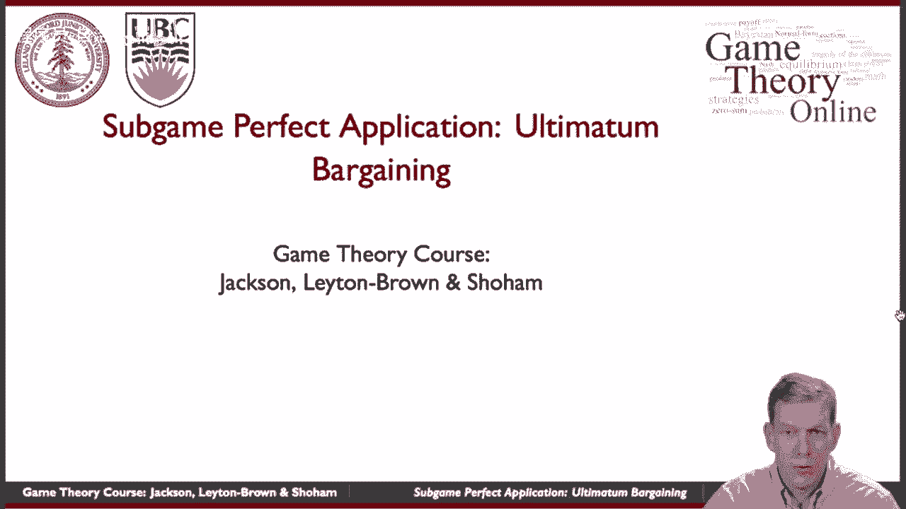

所以让我们来一个高峰，所以最后通牒讨价还价可能是最简单的讨价还价游戏之一，你可以想象这是一种要么接受要么离开，提供一种你可能听说过的讨价还价，和流行的民间传说，所以这里的想法是。

假设有十个单位在两个玩家之间分配，特别是，我们将把这些看作是说，整数单位，所以我们有发言权，十块钱，十欧元，十个在两个玩家之间平分的东西，他们必须同意才能得到任何东西，所以一号玩家出价，说好，看这里。

你可以有六个，剩下的我留着，然后2号玩家可以接受或拒绝，然后呃，根据当时发生的事情，如果2号玩家接受，如果x是出价，2号博弈者接受，然后2号玩家得到所有提供的东西1号玩家得到剩余的，如果它被拒绝。

那么每个人都得零分，所以在这种情况下，你只有在达成协议的情况下才能达成某种协议，这是一次讨价还价，从这个意义上说，只有一个报价，然后接受或拒绝，他们不能来来回回，所以它不会交替。

他们没有机会回到谈判桌前等等，就在这里，要不要随你，如果你不想要，算了吧，所以这就是我的想法，好的，所以让我们用子游戏完美来分析这个游戏。

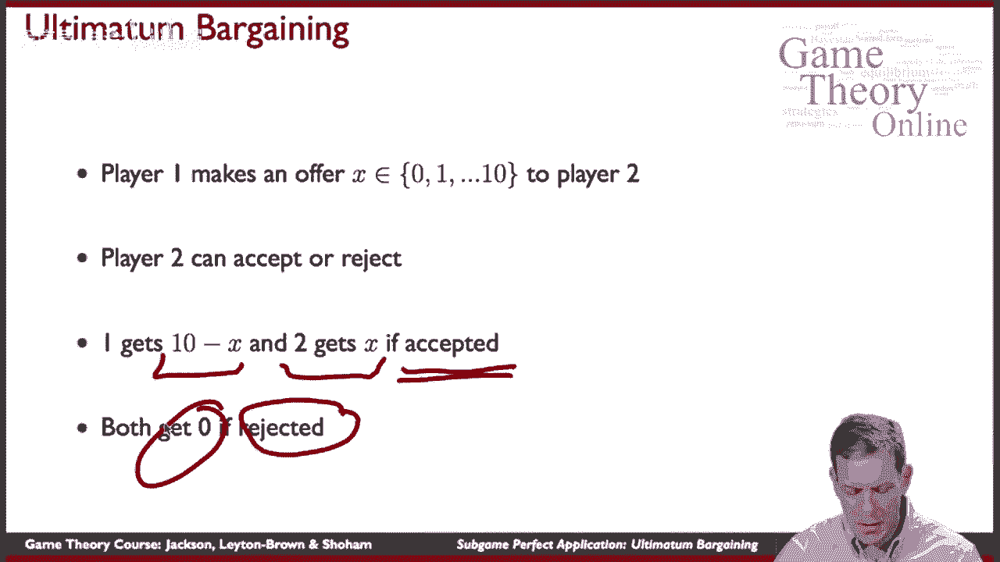

你可以把它写出来，这个树，你知道仍然可以管理，一号玩家先行动，他们可以提供，x等于零一二，等，一直到十个，然后玩家第二步，他们可以接受或拒绝这个提议，这样他们就可以拒绝，他们可以接受，根据报价。

他们会得到不同的收益，所以这里的收益，如果他们拒绝，每个人都得零分，在每种情况下，如果一个报价是十个，并被接受，2号玩家得10分，一号玩家得到零，六人出价，它被接受了，2号玩家得6分，一号玩家得到四个。

一个人的提议被提出并接受了，2号玩家得到1，一号玩家得到九，以此类推，这就是游戏的结构很简单，你可以直接用逆向归纳法来解决这个问题，嗯，还是一个子游戏的完美，什么是真的好吧，当我们想到二号玩家。

他们应该接受任何提议，这是积极的，对呀，所以任何积极的提议，你得到了正的回报，如果你接受它为零，如果你不，他们应该继续接受这些作者中的任何一个，嗯，在……，呃，在这种情况下。

看起来第二个玩家实际上无动于衷，所以在这一点上，他们做什么取决于他们，所以如果他们得到零分，他们可能会答应，他们可能会说不，他们可以混合，他们可以随机化，所以说，我们不确定树的那一部分到底会发生什么。

嗯，但事实是，既然他们应该接受所有这些东西，考虑到他们预计会发生什么，第二件事永远不应该是出价，这涉及到不止一个玩家对第二个玩家对吧，所以他们可以通过提供这个来得到九个，他们知道会被接受。

他们是否想下去取决于他们的信仰，2号玩家在这里要做什么，但基本上有一次，我们假设，一旦我们推断出2号博弈者会接受任何积极的报价，然后呢，玩家一号从尽可能低的金额中获得更高的回报。

他们会给2号玩家最多一个权利，所以我们得到了一个相当直接的预测。

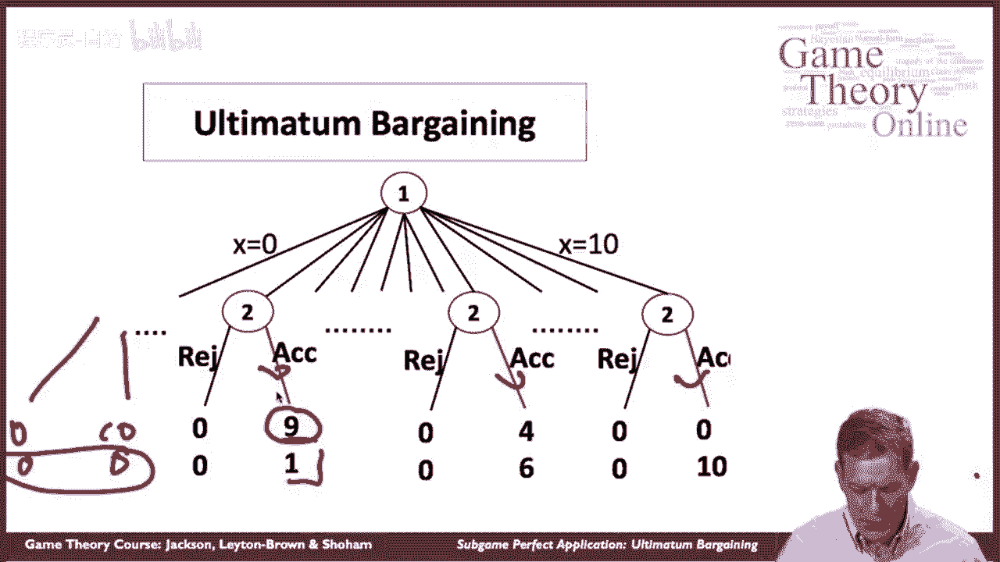

二号玩家接受任何积极的东西，一号玩家将提供0或1，取决于谁在零点的决定，但在子博弈完美均衡中，我们有一个预测，两个或更多的永远不会提供。

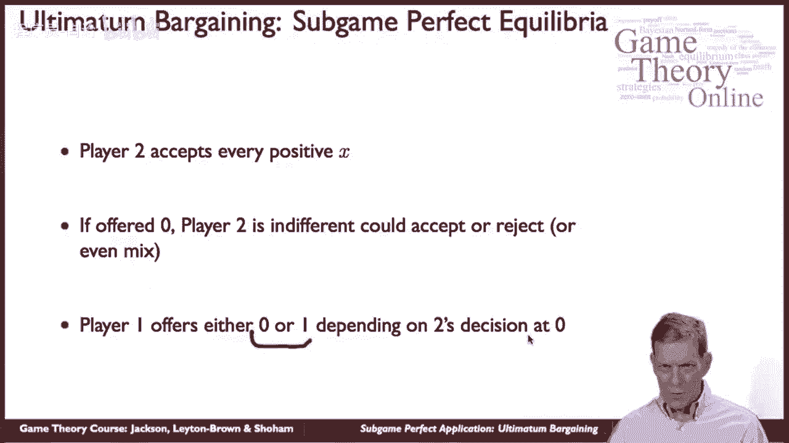

所以让我们来看看，嗯，这些是呃的一些数据，网络游戏玩呃，去年，在第三场比赛中，然后呃，让我们来看看到底是什么，嗯被玩了，所以这里是报价，给第二个玩家多少钱，事实上你可以看到，五是模态报价。

提供了两千多次，一个的次高报价，就是预测，或者子游戏的一个预测，完美平衡略低于一千，我们也可以看看接受度，所以这里，它的工作方式是玩家被要求，你们愿意接受的最低限额是多少，理论预测每个人都应该说零或一。

他们永远不应该拒绝至少一个，所以他们应该能接受的最低金额，至少应该抱歉，最多一个，在这里我们看到实际上大多数玩家实际上是，嗯，把他们的最低接受度设定在更高，他们中的许多人坚持5%的分数，所以其实。

当我们看这里的数据时，数据与什么子博弈不一致，完美，你知道当你考虑对一个给定的球员来说最好的报价是什么时，考虑到这里正在玩的嗯策略。

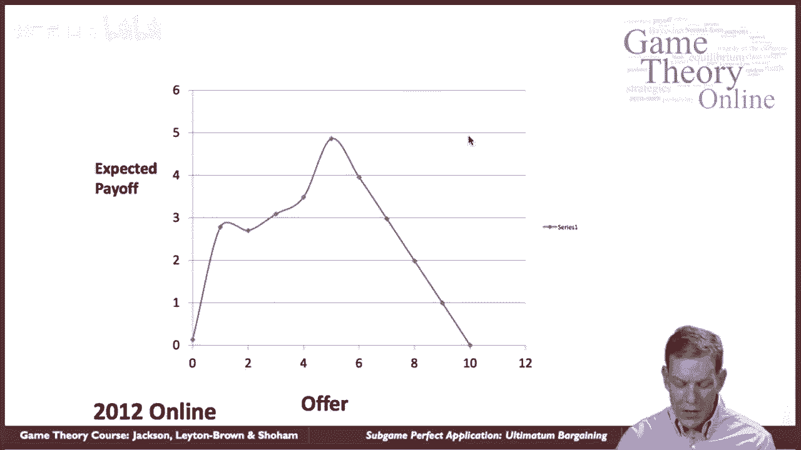

所以当我们看录取率时，所以如果我知道这是人口在做的事情，假设，我知道这就是人们的行为方式，就他们会接受什么而言，我应该提供什么，嗯，嗯，有一些机会，我要去见一个只收五块钱的人，至少五个。

我很有可能如果我出价超过5美元，几乎肯定会被接受，嗯，但是否必须是五个，还是我一直下降到一个，嗯，那要看我遇到谁了。

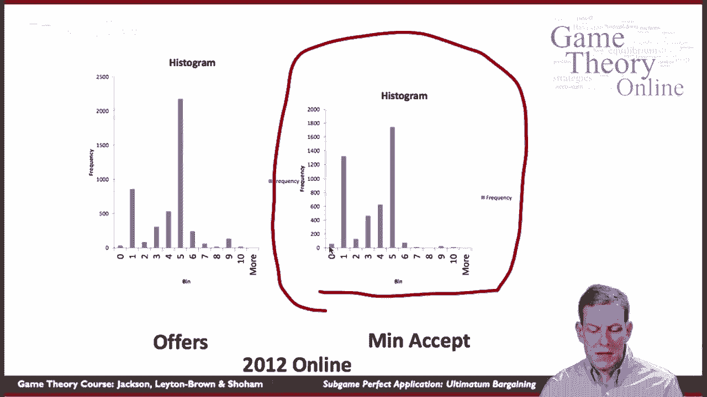

如果你看看我的预期回报，我的预期回报，我最好的回报实际上是，嗯提供提供五个，考虑到球员们在接受方面所做的。

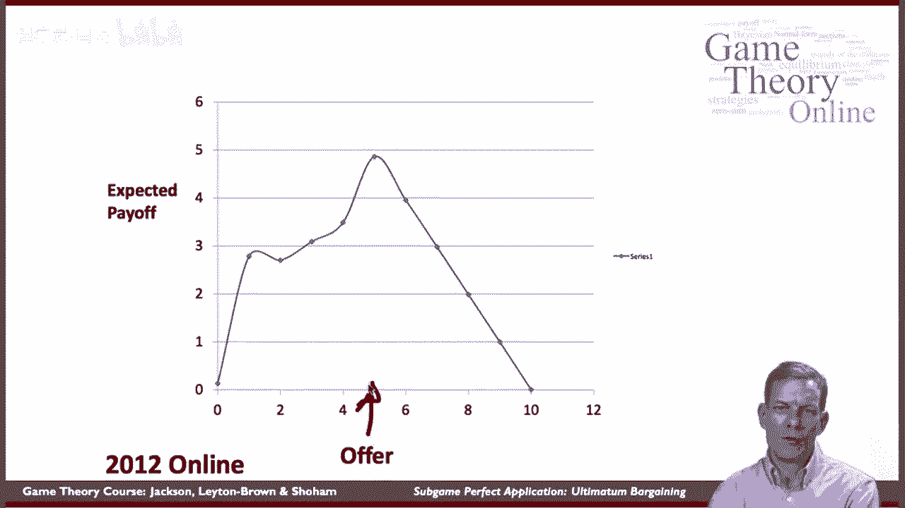

所以当我们回到这里的戏剧，事实上，这些球员打的是五个，与玩家在第二阶段所做的是一致的，所以子游戏完美缺失的地方，这里的东西，所以这里的玩家是，他们中的许多人最好地回答了他们面临的实际分布。

实际上是接受拒绝的部分，哪个是矛盾的，子游戏完美玩法会有什么，你知道对此有不同的解释。

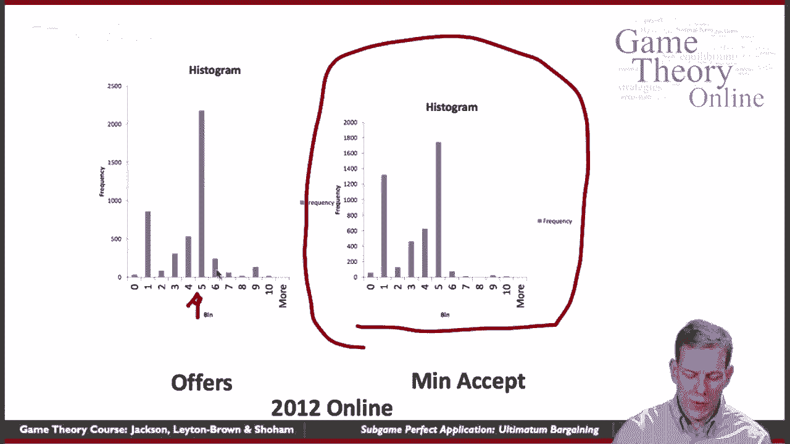

嗯，我们可以认为，呃，你知道吗。

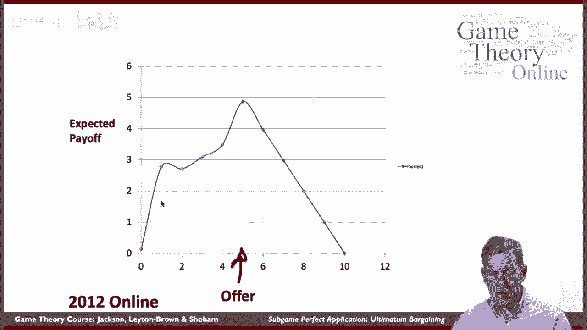

就我们为什么要看这部特殊的戏剧而言，可能是玩家，例如，a，你知道吗，对任何不平等的东西都有强烈的厌恶，那意味着什么，我们写在一个矩阵中的收益，两个，三个，四，5等等并不是人们的实际回报。

也许他们比另一个人得到的少，这让他们感觉很糟糕，他们想避免那种不好的感觉，例如，那是一种可能，嗯，你知道的，有很多不同的解释，可能是他们总是想要比其他玩家拥有更多，或者你可以想出不同种类的事情，嗯。

这将管理不同类型的游戏，所以有些球员似乎在尽其所能，其他似乎在推动平分的玩家，不知何故，我觉得这就是。

他们愿意接受的最低金额，嗯，另一个可能的猜想，人们已经多次提出，也许赌注不够大。

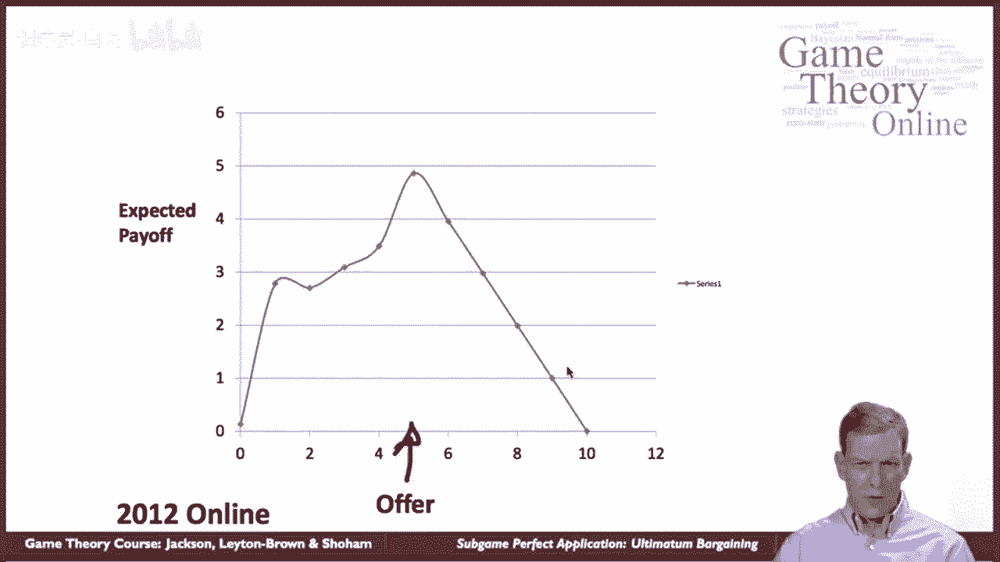

所以你知道，例如，当我们在网上玩这个的时候。

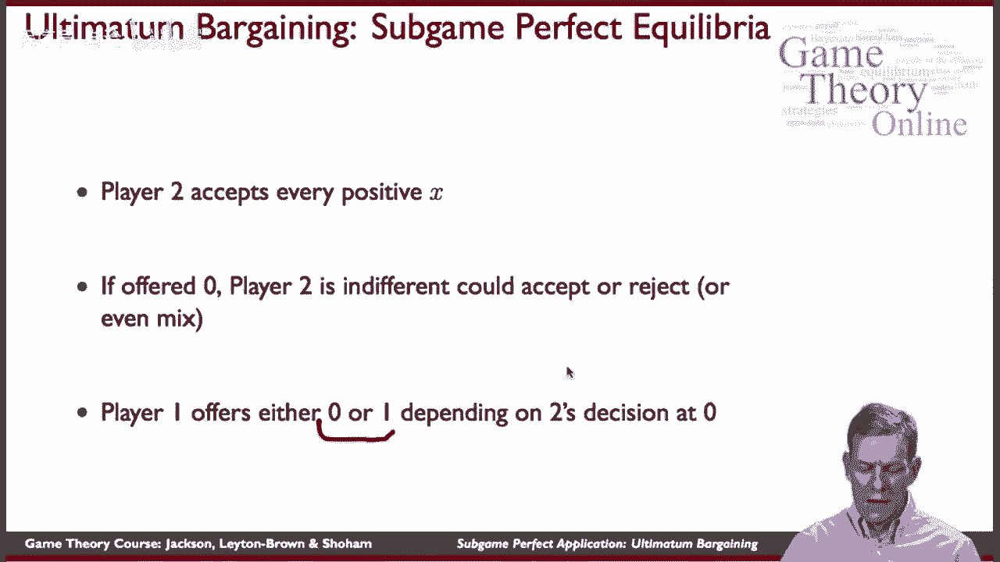

球员们在玩这个，呃，就一个问题而言，他们实际上没有得到报酬，也许如果我们付钱给他们，你知道的，假设你现在分裂而不是十个虚构的单位，你要分一千万或一千万欧元，你会拒绝其中四百万的出价吗，如果有人说好。

你可以有四百万，我要，我留下六百万，你要说，无，嗯，最终，那可能不是。

所以一种可能是，你知道看看馅饼的大小是否重要，所以这里有一些有趣的实验来尝试和检验这个假设，可能只是，你知道的，我们没有付给人们足够的钱，看到他们是真正理性的行为，罗伯特写了一篇很好的论文。

斯隆和阿尔罗斯和阿尔罗斯赢了，今年刚刚获得诺贝尔奖，最后通牒小游戏，让事情变得高风险，他们去了斯洛伐克，斯洛伐克共和国，他们做了三个不同的版本，所以人们可以平分60个斯洛伐克克朗。

一个他们可以分三百个斯洛伐克克朗的地方，另一个他们可以分1500，月平均工资权，所以每个月你得到五百，嗯，所以当你达到一千五百，你说的是一个多星期的工资，对呀，所以你是在考虑给某人一份微薄的工资来平分。

所以现在可以说，所涉及的资金是相当大的，对呀。

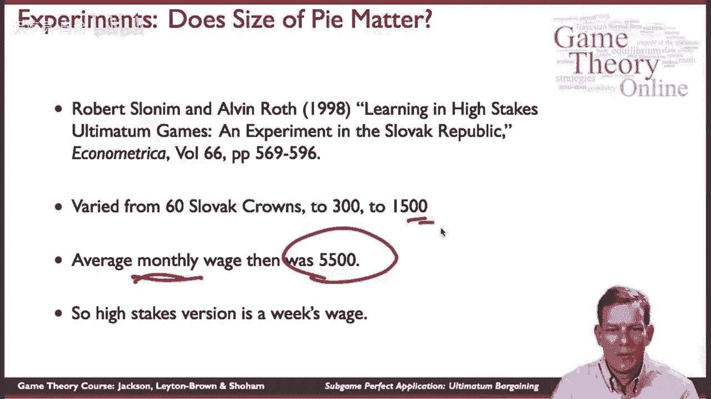

所以高风险版本大约是一周的工资，那么发生了什么，所以他们在这里做的是他们有一千个单位，所以不只是把东西分开，一二，三个，四五到十，你可以以千为单位，在哪里，你知道的，在第一场比赛中。

整整一千对应于六十克朗，在第二局到三百，等等对吧，所以这里的一个单位就是一个点，一千五百英镑的待遇中有五个斯洛伐克克朗，所以问题是平均给另一个玩家多少钱，嗯，嗯，第一局四五一，低赌注游戏，中间四六十。

嗯，在高赌注的游戏中，两个三个，所以它确实下降了一点，嗯，但肯定不是一个，这将是对，呃，当你看中间值的时候，他们65岁时很相似，四，八十四，五十，所以一点点，人们的阴影有点低于50%。

但他们不会推得太远，超过50%，嗯和嗯，当我们看到拒绝报价时，所以让我们看看，呃，举个例子，当人们在1000人中提供不到250人时，到第二个移动者，那被拒绝的频率是多少，它是，没有那么频繁地提供。

在低赌注游戏中，只提供过一次，被拒绝了，但在中间赌注游戏中，它被拒绝了大约一半的时间，十分之十，然后呃，在更高赌注的游戏中，大约是三分之一，三十二个中的十二个，所以三分之一多一点，但我们看到的是。

你知道，这里有统计意义的主题，基本上我们得到了这两者的比较，当我们加大赌注时，人们在推倒和拒绝，但它不会一直往下走，仍然呃，平均来说，报价相当高。

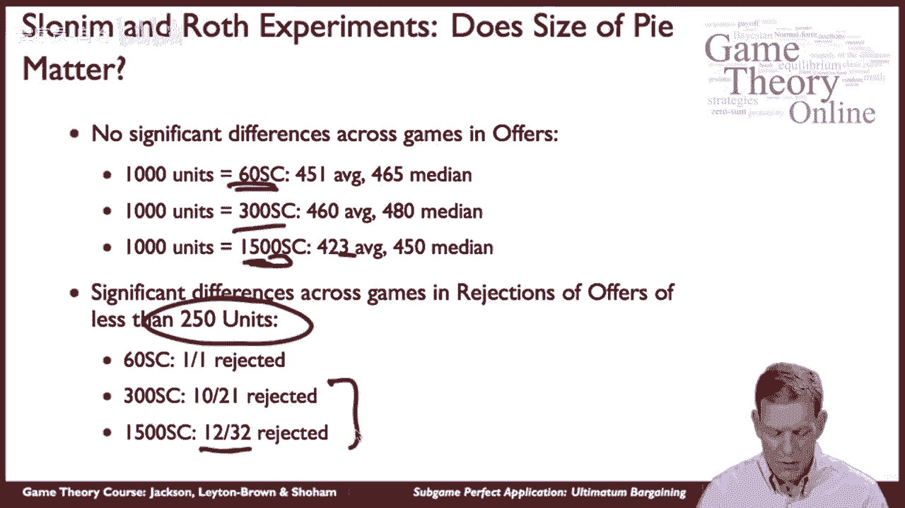

好的，那么我们从这口井中学到了什么，子博弈完美度并不总是与数据匹配，如果你回到这个游戏中，你想想纳什均衡，任何一个报价都可以作为纳什均衡的一部分得到支持，对呀，所以我可能会提出这个提议，因为。

我想这是唯一一个，对方会愿意接受，他们确实接受了，我不知道他们会不会拒绝其他的，所以这个博弈有很多纳什均衡，然后呃，子游戏的完美是挑选其中的一些，在某些情况下，你知道这些违反了理性，而是理性。

我们相信收益只是货币数量，而不是别的，对呀，所以我们的收益可能是不正确的，它写了下来，不正确，人们可以重视股权，他们可能会感觉到情绪，所以博弈论有一个完整的领域，基本上是扩张的。

在过去的几十年里或多或少地爆炸了，人们开始分析，呃，球员动机，他们可能称之为行为博弈论的其他类型的担忧，它远离了对理性的狭义定义，我们只是直接看一些非常具体的货币或简单的回报。

他们正在考虑扩大收益的方式，或者带来其他类型的偏见或倾向，人们可能必须理解一些事情。

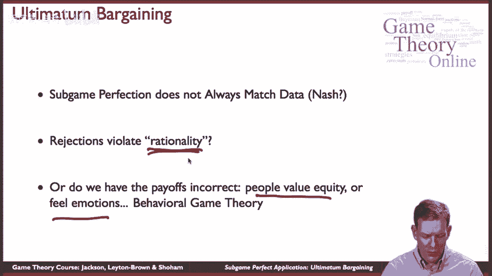

这可以扩展和帮助游戏，所以总的来说，当你知道，当我们看到子游戏的完美和我们从中学到的东西，嗯，基本前提，它强加了顺序理性，所以这是一种逻辑，人们是否这样玩，理解逻辑，帮助我们了解，游戏中的激励更好。

至少给了我们一些对游戏的感觉，所以它们导致了子博弈的完美和向后归纳法，我们通常会选择纳什均衡的一个子集，他们通过强加一种可信度来做到这一点，在从未达到正确的情况下，所以有一个关于发生了什么的想法。

平衡路径实际上在决定人们在做什么方面很重要，你要确保玩家要做的事情的处方，在所有这些情况下都是可信的，嗯，有一件事很有趣，开始思考，当你想到子游戏的完美，呃，国际象棋实际上是一种完全信息的游戏，对呀。

这样你就可以为国际象棋写下一棵树，如果你有很多时间，第一个玩家可以做出一堆动作，然后第二个玩家可以做出一堆动作，第三个玩家，对不起，第一个玩家再次开始行动，所以你有一棵树，可以写出来，然后呃。

它实际上是一个有限的游戏，一个非常大的，而是一个有限的游戏，在这个意义上，如果同一个棋盘达到了三次，游戏就结束了，所以有结束规则，确保游戏不会无限进行，所以它实际上是有限的，完全信息的广泛形式博弈。

所以至少，但显然我们还没有做到这一点，这是一个如此大的游戏，解决子游戏，完美的平衡似乎是不可能的，也许在另一个星球上，他们解决了国际象棋，他们可能认为这就像我们的井字游戏，这是一个简单得多的游戏来解决。

在你玩了几次之后，你对此感到很无聊，还有一件事很重要，你知道的，即使是在一个占优势的可解的博弈中，等等，对不起，不是显性可解，但可通过后向归纳法或次完美法求解，嗯，不完全清楚是否每个人都遵守逻辑。

尤其是你需要相信别人的理性，对呀，所以你需要为了真正解决这件事，向后，你得好好想想，我想另一个玩家在某种情况下会这么做，然后你后退，你知道的，对玩家的要求，在那种情况下，它可以相当。

随着游戏变得更加复杂，很难满足，另一件要说的是在博弈论中存在一些争议，关于逆向归纳法背后的思想，部分原因是你知道根据理论，游戏的某些部分你永远不应该看到自己，然后你可以开始问这个问题，好的，嗯。

让我们假设我们真的在那里结束了，我应该相信另一个球员什么，我们是怎么到那儿的？呃，所以有有，其实要非常仔细地写下一个基础并不容易，在逻辑思维方面做出这些预测，这是一个有趣的研究领域，所以下次总结一下。

我们会考虑一些不完整的信息。

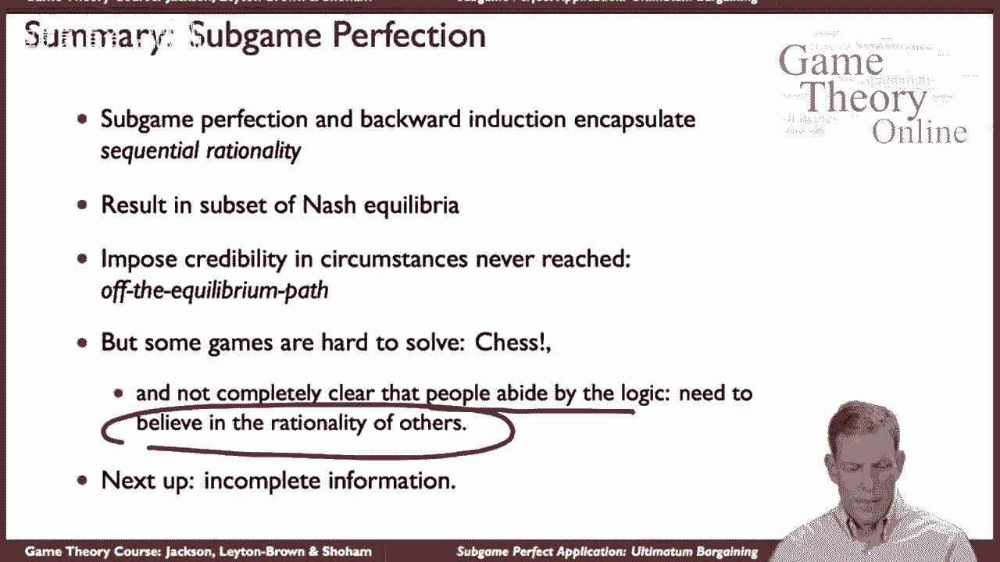