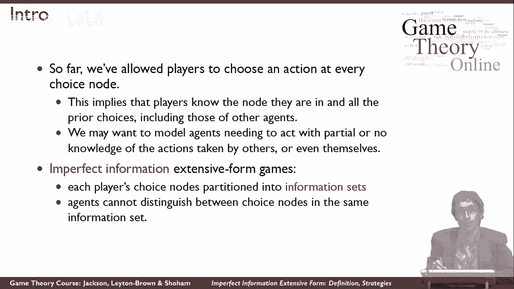
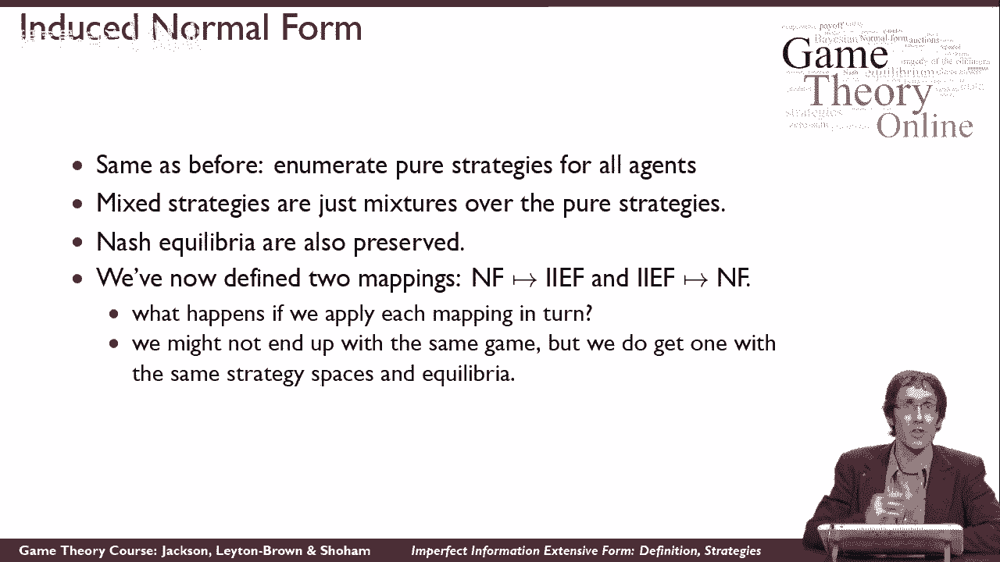

# P32：【斯坦福大学】博弈论（31）不完美信息拓展形式的相关定义与策略 - 自洽音梦 - BV1644y1D7dD

在这个视频里，我要告诉你们如何正式地定义不完全信息，广泛形式，以及如何推理这些游戏中的策略，所以在完美的信息中，广泛形式，我们让一个玩家在游戏中的每一个选择节点上采取行动，这个定义的一个结果是。

我们看到玩家知道哪个节点，他们一直都在，这意味着他们知道之前发生的所有移动的全部历史，在游戏中，这对于像国际象棋这样的游戏来说是合理的，在那里你可以看到你的对手在每一个不同的动作中做了什么。

像战列舰这样的游戏是不合理的，你玩的地方，你的对手可以做些什么，你看不到它是什么，这对你在游戏后期会发生什么很重要，这对你的回报很重要，这关系到游戏是停止还是继续，为了模拟这种更丰富的情况。

玩家不能观察到对手所做的一切，我们要给游戏增加一些新的东西，到游戏表示，所以我们称之为不完全信息，广泛形式，这样做的方式是，我们将采用以前的旧定义，但我们要说，玩家认为一些选择节点彼此等价。

所以有一些选择节点，玩家无法区分，这将意味着，他们不能完全弄清楚他们在树上的位置，因为他们不知道他们在几个选择节点中的哪一个，当他们必须做出选择的时候，和，我们要这么做，通过为给定的玩家取一组选择节点。

并将它们放入等价类，所以这意味着，如果这些是游戏中的一些不同的选择节点，当然属于同一个玩家，我们可以说这些是一个等价类，这些是另一个等价类，这是第三个等价类，这意味着。

玩家不知道他在这两个选择节点中的哪一个，当他被要求做出选择时，但他会知道他在这两个中的一个，而不是这两个中的一个，因为他们在不同的等价类。

所以让我们说得更正式一点，所以正式定义一个不完全信息扩展形式博弈，我们从一个完美的信息扩展形式游戏开始，我们以前已经学会了如何定义，然后我们要添加等价类的这个成分，所以我们要加这个元素i。

它是一组等价的，一组等价类，每个玩家一个，所以对于一号玩家来说，我们有一组等价类，或者说对于I号博弈者，我们有一组从1到k的等价类，所以这些都是不同的等价类，这些类中的每一个都是一些不同的选择节点。

一个或多个选择节点，这些将是不同的选择节点，那个玩家分不清，所以如果这些等价类中的每一个都只包含一个选择节点，我们带着完美信息案例回来了，如果这些等价类中的任何一个包含不止一个东西。

那我们就有了新的东西，我们有一个游戏，玩家不太知道发生了什么，现在无时无刻不在，为了使这个定义发挥作用，我们需要增加几个限制，这样才有意义，所以我们想说，如果两个不同的选择节点是同一个等价类的一部分。

那么首先它们必须属于同一个玩家，他们必须被贴上同一个球员的标签，因为如果他们不是，你就能把它们区分开来，因为他们不同的球员会表演，所以当球员出现的时候，他会知道他是哪个球员，他就会。

他真的不会对等价类中的所有节点感到困惑，我们的第二个限制是，两个选择节点必须具有相同的可用操作集，因为如果玩家不能区分它们，他必须知道该怎么做，这是唯一的限制。

所以说，让我们看看这里的一个示例游戏，看看什么是等价类，所以在这个游戏中，一号玩家有两个不同的等价类，这是一个等价类，这是另一个等价类，所以换句话说，我们将在这里用虚线将选择节点连接在一起。

属于同一等价类的，在这个游戏中我们想说的是1号玩家移动，如果他走对了，那么游戏就会结束，他们每个人都会得到一个回报，如果他向左，然后他们就可以做，2号玩家要做出选择，2号博弈者会选择A或B。

然后1号玩家将进行第二次移动，但是一号玩家无法观察二号玩家的动作，所以他必须采取同样的行动，不管他是在这个选择节点还是这个选择节点，事实上，你可以看到我们用同样的方式给它贴上了标签。

所以如果他说他想左转，他必须把它从这两张纸条上留下，只是为了完成我问题的答案，2号玩家的等价类是什么，二号玩家只有一个选择节点，实际上这里有个错别字，不应该有二，二号玩家只有一个选择节点。

所以他只有一个等价类，那么我们应该如何为这个游戏中的每个玩家定义纯粹的策略呢，作为纯战略的定义，什么是有意义的，直觉地记得以前，我们说的是我们有所有不同动作集的交叉积，对于每个玩家，我们不希望在这里。

因为我们不想让一号玩家做一些不同的事情，在这个选择节点和这个选择节点中，所以取而代之的是，我们要用什么作为定义，玩家I的纯策略是动作集的叉积，在他的每一个不同的等价类中。

所以一号玩家的纯策略在这里是一个独立的选择，这里有一个选择，所以一号玩家可以采取行动，或者他可以采取行动，或者你可以采取lr或r r的行动，所以1号博弈者有4种不同的纯策略而不是8种，就像他会做的那样。

如果我们这里没有这个等价类，所以在不完全信息范式中，我们有一个比完美信息案例更强大的代表，我们可以看到的一种方式是，也就是说，我们可以在这个表示中表示任何范式博弈，你可能还记得。

我们不能用完美的信息游戏，所以在这里我向你展示如何表示TCP后退游戏，或者换句话说，不完全信息广义形式下的囚徒困境博弈，那么这怎么工作得好呢，首先呢，一号玩家可以决定是合作还是叛逃。

之后2号玩家可以决定是合作还是叛逃，当然啦，在囚徒困境中，你看不到对方选择做什么，当你采取自己的行动，所以听起来可能有问题2号玩家第二个移动，但2号博弈者无法分辨1号博弈者采取了哪个动作。

所以尽管我们的游戏代表说他是第二名，他第二也没什么区别，因为他不知道一号玩家做了什么，然后一旦他们两个都采取行动，我们最终得到了一些回报，所以如果他们去CD，然后他们最终得到了这里的回报。

这些收益与我们在游戏矩阵中的收益相同，注意到我们可以让事情以同样的方式工作，如果我们把二号玩家放在根节点，一号玩家放在下面，因为时间在这个游戏中并不真正起作用。

我在上一张幻灯片上告诉你的是如何从一个正常形式的游戏开始，并利用它制作一个广泛的形式游戏，我仍然可以用完美的信息做我们谈论过的事情，广泛形式，从一个广泛的形式游戏开始，用它做一个正常的形式游戏。

它的工作方式和以前完全一样，所以我把一号玩家的所有纯策略，我把它们排成一行，我把2号玩家所有的纯策略，我把它们做成柱子，然后这就给出了我的矩阵，对于基质的每一个细胞，我说好。

如果1号博弈者采用这种纯策略2号博弈者采用这种纯策略，会有什么回报，我把它放进矩阵的单元格里，这样我就填满了整个矩阵，一旦我有了这样的矩阵，那我就完蛋了，我对混合策略的定义和以前一模一样。

这只是诱导范式中的混合策略，不完全信息广义形式对策的纳什均衡最佳对策的定义，再次，只是利用诱导范式，所以所有这些你已经从正常形式的游戏中理解的概念，直接延续到不完善的信息博弈，例如。

我们从纳什定理知道纳什均衡总是存在的，对于每一个不完全信息广泛形式博弈，因为我可以用它做一个有限范式游戏，现在，会是这样的，这种转变可以使游戏像以前一样成倍地扩大，即使有完美的信息案例，但例如。

为了平衡的存在，现在已经不重要了，最后，你可能想知道会发生什么，如果我把我给你们看的这两个变换，我把它们一起应用，例如，我可以从一个不完全信息扩展形式的游戏开始，把它变成一个正常形式的游戏。

然后再把它变成一个不完美的信息扩展形式的游戏，所以你可能会想，我最终会玩同样的游戏吗，答案是否定的，我不会的，因为我可能有一棵游戏树，这是相当深的，它可以有各种不同的等价类。

不同的玩家可能会有各种各样不同的顺序动作，当我把它变成一个正常形式的游戏，我要买一张平桌子，然后当我拿一张平桌子把它变成一个广泛的形式游戏，这将是一个只有两个关卡的广泛形式的游戏。

在一个大的等价类中使用所有这些东西，所以这将是一个广泛的形式游戏，看起来和我开始的不一样，但重要的是，它将有相同的策略空间，两个代理的相同的纯策略集，它将有相同的纳什均衡集。

所以尽管这些游戏可能从它们如何明确地谈论时间的角度来看是不同的，它们将是战略上等效的游戏。

