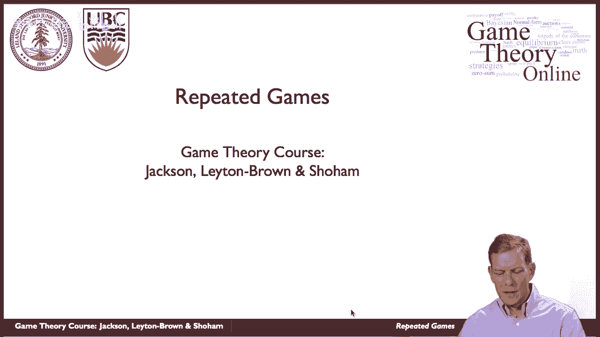
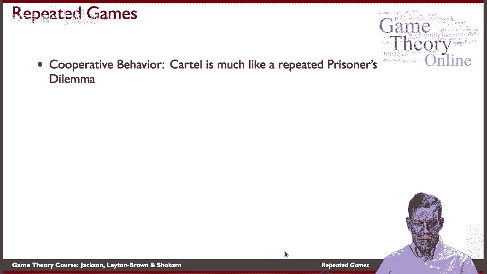
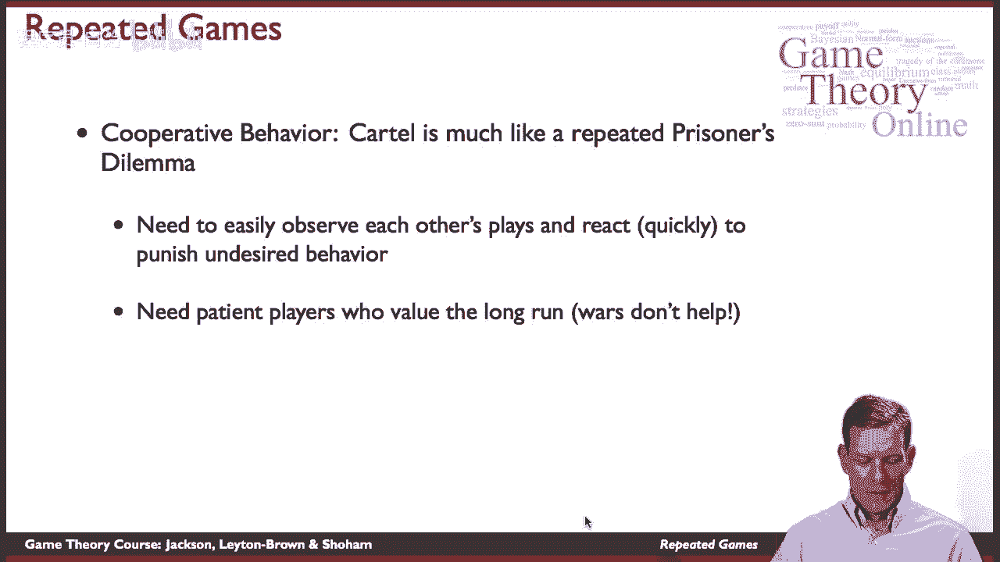
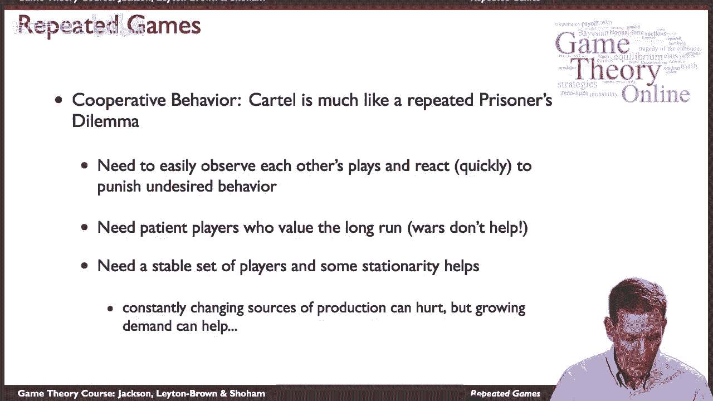

# P35：【斯坦福大学】博弈论（34）重复博弈 - 自洽音梦 - BV1644y1D7dD

嗨，伙计们，所以是时候开始一个新的话题了，这是一个非常有趣的问题，我们现在要讲的是重复博弈，所以这将使用我们的一些推理，在子博弈方面，完美和广泛的形式，但现在想想玩家在玩游戏的情况，但随着时间的推移。

他们在反复播放。

所以你知道当我们想到世界上大多数互动时，有很多不止一次发生的，所以你知道，当我们思考不同种类的事情时，你知道的，市场上的公司，他们在与竞争对手互动，他们日复一日地这样做，我们考虑政治联盟。

决定如何与其他国家谈判的国家，他们是否应该有冲突，等等，这些事情你知道，随着时间的推移，这种情况反复发生，所以他们有很长的历史和很长的未来，嗯，朋友，你知道，你们交换吗，你帮你的朋友吗。

当他们需要帮助的时候，他们帮你回来了吗，当你需要的时候，嗯，所以你知道你正在经历反复的互动，以及你过去的表现，如果你有为你做得很好的朋友，你更有可能回报，其中一些事情可能涉及重复的交互，工人，团队生产。

你有一个，有时你不得不做一些不被注意到的任务，有时他们确实会帮助你等等，所以在这些情况下，重复可以有所作为，理解它将是，并理解重复如何影响戏剧，涉及一系列不同种类的事情，让我们来谈谈欧佩克。

那是一个卡特尔，它形成于二十世纪七十年代初，就背景而言，如果你回到，你知道，十九到十九之间的时期，当欧佩克开始组建时，石油价格，所以这些都是调整后的数字，以反映，比如说两千零八美元。

所以我们根据通货膨胀和其他因素进行调整，但如果你把所有东西都调整到相同的水平来调整通货膨胀，你得到的价格大约是每桶20美元或更低，从1930年到大约1973年，欧佩克开始形成，发生了什么。

他们认为你知道他们只是在演戏，是一群球员，一群不同的制片人，他们开采了如此多的石油，价格相当低，很容易买到油，所以他们将从限制生产开始，削减产量，那就会抬高价格，好的，困难是什么，如果其他的产量很少。

价格就会上涨，4。我想在协议上做手脚，多加点油，所以你可以把这看作是一个巨大的囚徒困境游戏，我们都希望少抽油的地方，如果我们是欧佩克或产油国，推动价格上涨，但我们都有一个动机来欺骗一点，泵更多的油。

如果我们回来了，价格上升到每桶五十美元左右。到1982年的时候，这些也是实值的，所以这些是根据通货膨胀调整的，他们把价格提高到每桶九十美元，你知道，所以是在二十世纪八十年代初，就欧佩克而言。

它做得相当好，很多钱进来了，然后它崩溃了一段时间，所以当你看这个时期，大约在1986年到2002年之间，所以在八十二到八十六之间，它开始侵蚀，它，有点分崩离析，嗯，在八万六千到两万零二千之间。

价格基本上是每桶40美元或更低，然后他们又复合了，所以实际上在这一时期有一场两伊战争，中东发生了一系列的事情，这使得维持合作变得更加困难，事情恶化了，然后过了一段时间，到2008年晚些时候价格又回升了。

价格又回升到每桶一百多美元，好的，所以我们需要开始理解这一点，理解重复的相互作用，了解球员的动机等等对我们有很大帮助，所以当我们想到这个的时候，卡特尔很像一个反复出现的囚徒困境。

为了确保其他人的行为，如果你想让人们遵守这一点，你需要能够观察别人的游戏并对此做出快速反应，惩罚不受欢迎的行为，所以如果你组成卡特尔，每个人都在这里，我们的配额不能超过这个，你就可以。

你需要能够回应那些最终违反协议的人，抽得太多了，所以你需要能够观察发生了什么，嗯，你也需要关心未来，所以如果你不再关心未来只关心今天，那么对其中一个国家来说是非常诱人的，只是想说，好的，忘了约定。

我只是尽我所能地抽水，今天价格很高，我会抓住我能抓住的，战争当然对这一点没有帮助，所以如果你有战争，你需要预付现金，嗯，你是，你会想要泵更多的油，这使得遵守卡特尔协议变得更加困难。

你还需要一组稳定的球员和稳定性，所以设置越复杂，世界上石油的来源就越多，等等，所以不断变化的生产来源，嗯可以伤害，不断增长的需求实际上有助于正确，所以如果世界变得越来越依赖，各国上线。

对石油的需求越来越大，这会推高价格，所以在理解重复的游戏中，随着时间的推移，我们将不得不考虑很多事情，嗯，但我们可以开始用博弈论的工具来分析这一点，看看人们在玩游戏的情况，但他们一遍又一遍地播放。

并试着理解这样做的后果，未来的威胁是如何发挥作用的，所以这是基本的想法。

