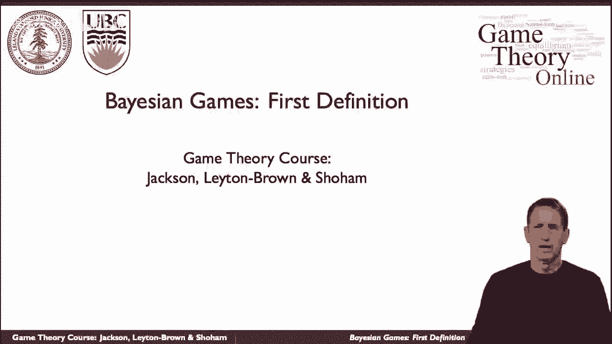
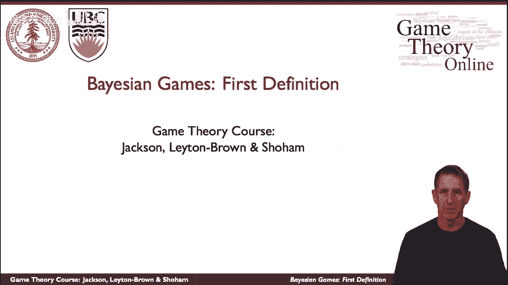
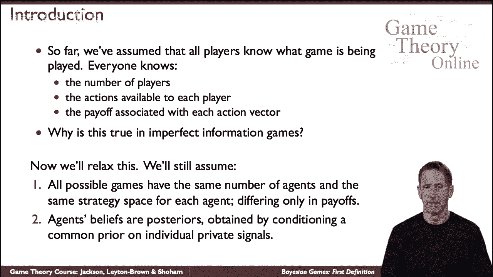
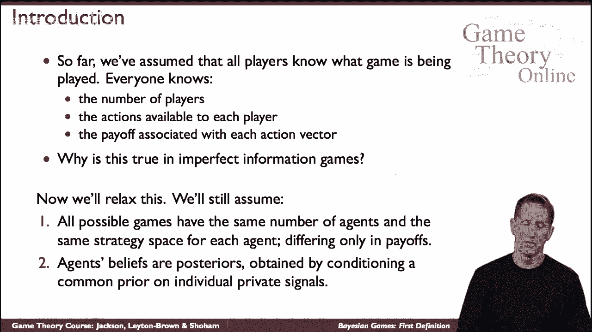
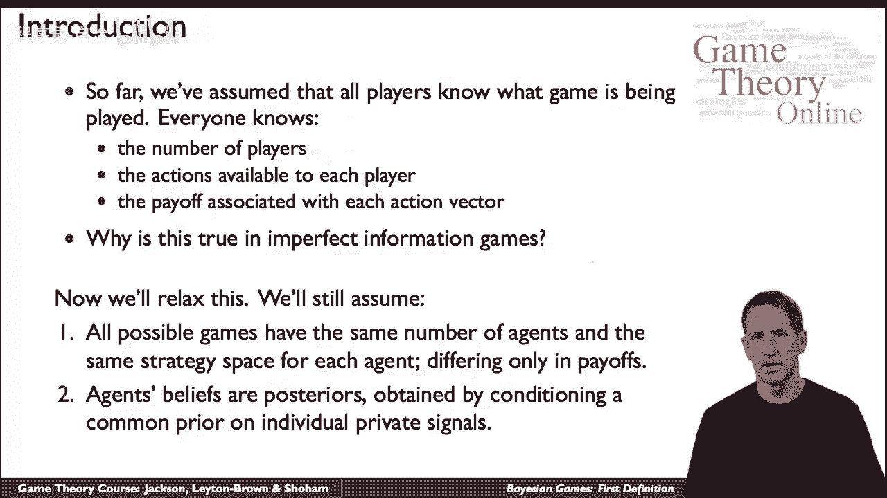
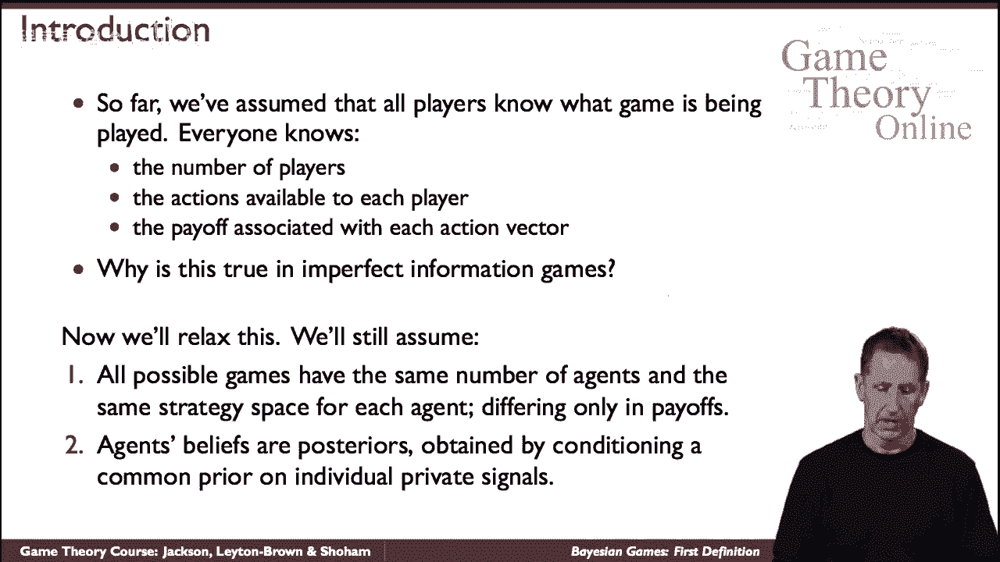
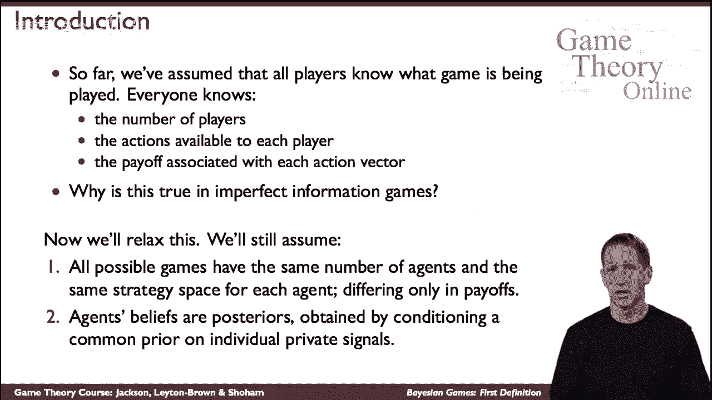
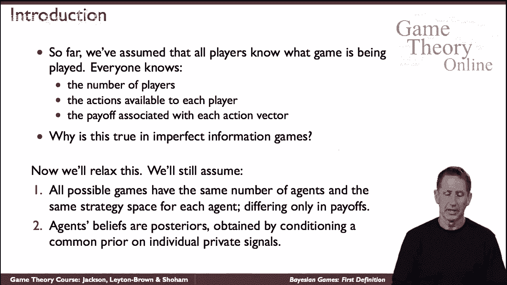
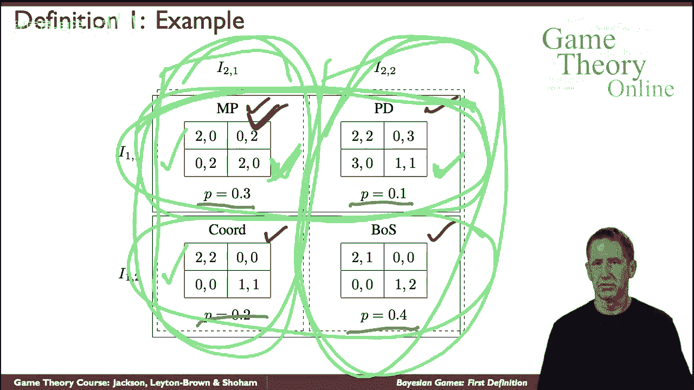

# P44：【斯坦福大学】博弈论（43）贝叶斯博弈：第一个定义 (yoav) - 自洽音梦 - BV1644y1D7dD

我们现在要看一个不同类别的游戏，称为贝叶斯博弈的博弈。

有时被称为不完全信息游戏，不要与不完全信息的游戏混淆。

到目前为止，我们看到的是所有特工都知道基本设置的游戏，也就是，他们知道谁是球员，他们知道玩家可以采取的行动，他们知道与每个策略配置文件或每个行动配置文件相关的收益，取决于每个人的所作所为。

所有的游戏都是如此，我不知道，它们到底是哪个州，尽管如此，他们知道会发生什么，考虑到所有代理人的策略，所以我们要放松一下，我们会假设我们所说的不一定总是常识。

现在，原则上，你可以想象放松各种假设，你不知道，玩家的数量。

你不知道，也许作为，他们有多少操作可用。

但在某种意义上，一些非正式的意思，所有这些形式的不确定性都可以归结为一种不确定性，这是关于游戏中的收益，所以我们会假设特工们对一切都有完美的常识。

除了游戏的收益是什么，而且有一些先验知识，所有代理人共有的先验信念，关于那些收益，简单地说，代理有不同的信号，导致不同的后部，基于这个共同的先验。

这听起来可能很模糊，让我精确一点。

让我先给出正式的定义，然后举一个例子，会让一切都清楚，所以我们有一套游戏，逃避游戏首先是由，一组相同的游戏，除了他们的收益，所以让我们再次开始正式的定义，所以我们有一个元组来定义游戏，我们有一组探员。

我们有G是一组常规的游戏，把这些看作是正常形式的游戏，比如说，呃，每个游戏都是由玩游戏的最终代理组成的，他们都有相同的策略空间在这一套的两个游戏中，他们有相同的策略空间，正如我所说，收益一般是不同的。

我们有一个先验，是对这些游戏的分布，某种先验性质会决定哪个游戏是基于这个先验性质进行的，即每个代理对每个代理在博弈中找到某种等价关系，探员会被告知，它们在哪个等价类中，基于此，他们需要玩游戏。

现在这是一口，我知道，但希望下面的例子能说明，让我们假设我们有四种可能的游戏，下面是熟悉的游戏，我们有匹配的便士，我们有波斯的困境，我们有纯协调的游戏，我们只有六人之战，每一个都是由他们的收益定义的。

现在大自然将决定这些游戏中的哪一个实际上是在玩，我们将根据这里列出的概率来决定，我们这里有第三点的概率，第一点在这里，这里点2，这里点4，一旦大自然做出了这个选择，经纪人会玩，但问题是什么会，他们知道。

他们会知道先驱者，但他们会知道一些事情，此外，他们所知道的将由这个分区定义，所以我们有两个探员在玩，对于这些代理中的每一个，都定义了一个等价关系，所以说，比如说，想想绳子运动员的角色球员。

有两个用粗体分区表示的等价类，现在把它变成绿色，这是为行代理定义的等价关系，例如，假设大自然决定，事实上玩匹配便士，代理人会知道，行代理将知道他要么在这个游戏中，要么在这个游戏中。

他就会知道他不在其他任何比赛中，所以这将是他的私人信号，他现在会有后验的信念，他会相信什么，他就会相信，呃，概率点八，他在玩这个游戏，点二五在玩这个游戏，为什么呢因为这是定义的三比一的比例。

在这两个收获之间，专栏玩家会很清楚什么，纵队球员，我们给她挑一个不同的颜色，她有一个不同的等价关系，这个，现在如果大自然再次选择了匹配的便士，她会很清楚什么，她会知道她不是在这个游戏里就是在这个游戏里。

然后呃，在这种情况下，嗯，她需要在反映这些信息之前更新她，和后面，对A列代理来说，她玩这个游戏的概率是六分，这又是概率概率点4，保持这两个博弈之间的比例，他们会更直观地知道，因为当代理人知道援助时。

比如说，行代理知道她在这里的某个地方，她不会知道专栏作者到底有什么信息，但她知道它可能有什么信息，她知道那是，角色扮演者知道她要么在这个游戏中，在这种情况下，她知道这将是专栏玩家拥有的信息。

或者她在这个游戏中，在这种情况下，她，玩绳子的人知道玩纵队的人知道她在这里的某个地方，所以这是一个复杂的故事，因为你可以继续前进，他们对另一个玩家的信仰有一些信念，关于他们现在什么等等。

但这是贝叶斯博弈的结构，在此基础上你可以开始建模一个玩家会做什么，但由于这很复杂，有另一种观点，呃上，关于不同的贝叶斯博弈。

