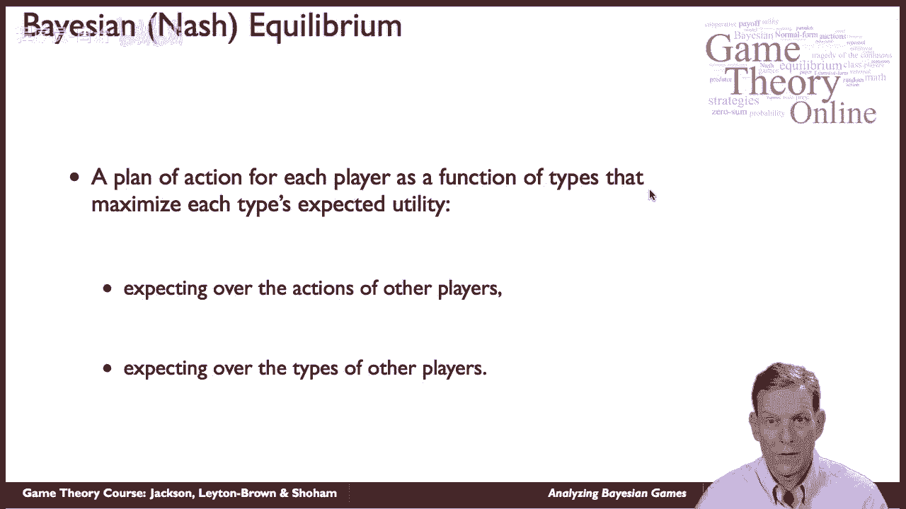
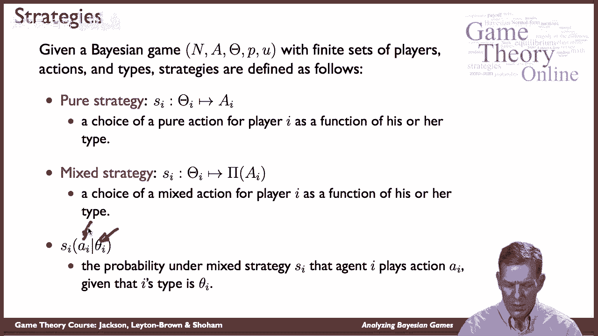
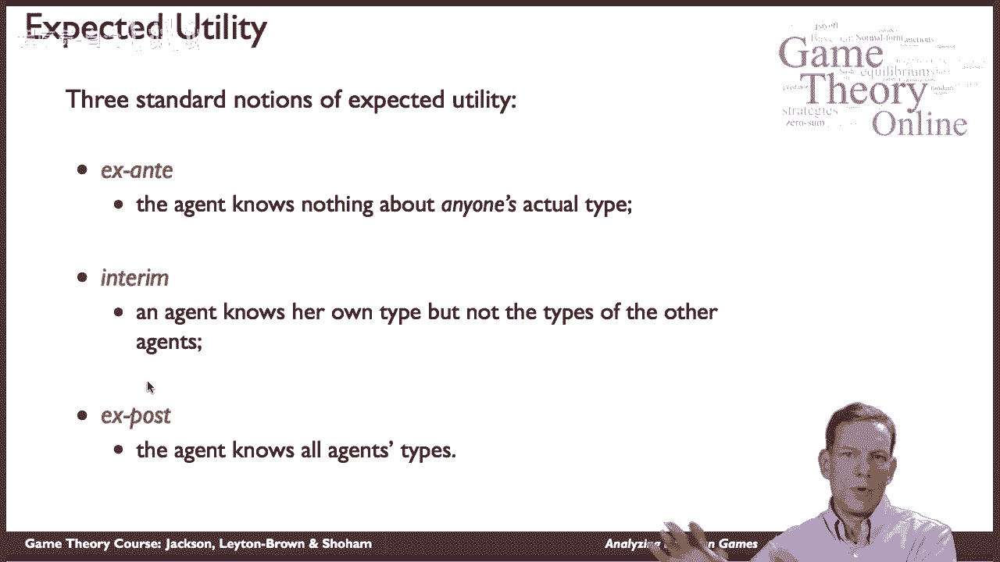
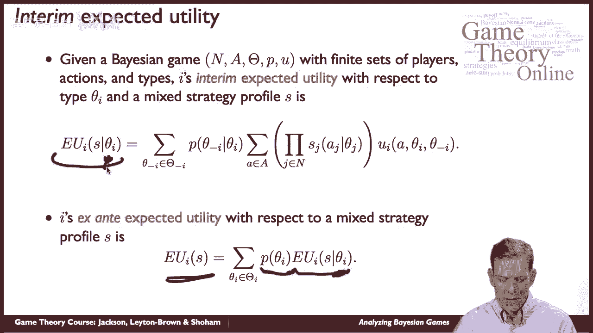
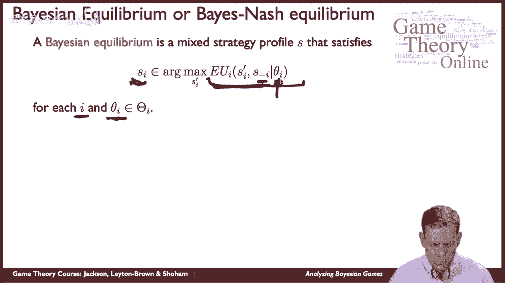
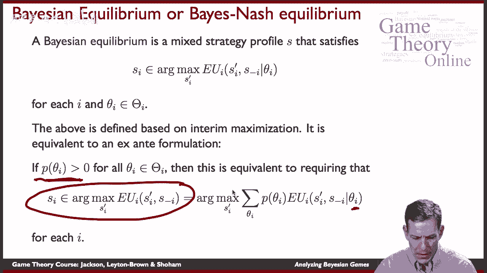
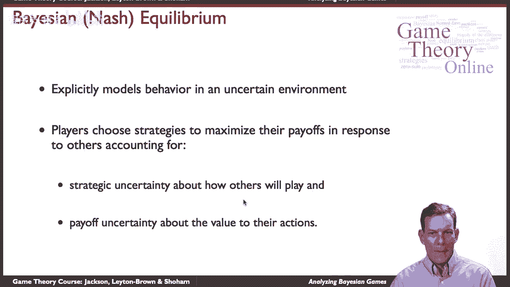

# P46：【斯坦福大学】博弈论（45）贝叶斯博弈分析 - 自洽音梦 - BV1644y1D7dD

嗨，伙计们，我是马特，我们现在要讲一点贝叶斯均衡，和均衡概念，贝叶斯博弈的一种解决方案，这个想法有时也被称为贝叶斯纳什，均衡，嗯，这个概念可以追溯到，呃。

哈里·约翰·哈索尼安在十九世纪末二十世纪六十年代，一九六七年和一九六八年，他在那里发展了这个概念，这个想法是现在每个玩家，你知道吗，当我们谈论贝叶斯博弈时，玩家有这些类型，它们决定了它们的收益。

并与不确定性有关，可以告诉他们他们对其他类型的人的期望，现在的均衡是每个参与者的行动计划，作为它们类型的函数，所以嗯，它会说，好的，如果我观察到某种类型，我在游戏中要做什么，它应该最大化它们的预期效用。

所以这将是一个最好的回答，嗯和嗯，他们现在在期待什么，而不是只是呃，就在纳什均衡中，然后你就最大化你的回报，嗯，在这里，我们期待其他球员的行动，所以在这里我们有一个情况，我们必须弄清楚。

基于我们期望他们的类型，他们可能在混合什么，他们在这些类型的基础上玩得怎么样，这导致了预期的动作分布，你将要面对，然后嗯，就类型而言，其他玩家的类型实际上也可以进入你的回报函数，因此。

您的实用程序可以依赖于其他人持有的信息，所以可能是别人知道，比如说股票的价值，我意识到其他人会有其他信息，这些信息可能会影响我和特定资产的价值，例如。

好的，所以给定一个贝叶斯博弈，我们有我们的球员，玩家动作，类型空间，类型空间上的概率分布，然后嗯，效用函数，对于我们将在这里提供的定义，我们将把这些看作是有限的玩家集，有限动作集。

类型的有限集和策略的有限集，好的，当你开始无限集合和连续的时候，你必须对一些细节更加小心，定义这些东西，特别是可计量性，对事物整合的各种考虑，所以我们要坚持有限集，在那里基本的原则和思想将相当容易理解。

对这些的扩展相当简单，虽然有一些技术细节你要担心，好的，纯战略，对给定的玩家来说，什么是策略，一个玩家现在的策略是一个映射，所以潜艇I，它说作为你类型的函数，你打算采取什么行动，那将是一个纯粹的策略。

从某种意义上说，你只是为每种类型选择一个动作，嗯，混合策略是显而易见的，呃，延伸到这里，而不是嗯，选择一个纯粹的动作，你在选择一个概率分布而不是作为你类型的函数的动作，嗯，还有一件事，这将是有用的。

那么如果我们有一种特定的类型，然后我们可以讨论行动的分布所以混合策略下的混合，S潜艇I，我扮演的那个人，行动AI被他们选择的概率有多大，如果它们碰巧是θ型，所以我们在一些计算中使用了这个符号。

当我们开始讨论贝叶斯均衡时，现在我们要谈谈一个人的期望效用是什么，当他们做出选择的时候，会有不同的时间我们可以想到所以一个是事前的，我是，我得为我的行为制定一个计划，但我实际上对任何人的类型都一无所知。

所以我们可能会想到这个，例如：你知道一家公司形成了一个长期的，它怎么说的计划，在即将到来的一系列拍卖中出价，但它还没有真正出去收集信息，它实际上没有看到其他玩家的价值观等等，所以它没有做任何计算。

但它正试图形成一种策略，它将如何表现，嗯第二种可能，临时阶段，所以一个人知道一些关于，呃，她是他或她自己喜欢的类型，但还没有其他代理的类型，或者其他玩家，所以这是一个场景，你已经看到了一些部分。

我做了功课，我知道我看到了什么，我必须制定一个在拍卖中出价的策略，但我不知道其他球员看到了什么，这些信息可能很有价值，不仅在确定他们的行动是什么，而且在决定是否，呃，我想继续。

是否遵循某种行为取决于我的收益，取决于他们可能掌握的信息，第三个是X柱，所以现在每个人都知道每个人类型的一切，事后嗯是相对最不有趣的，呃在在，在我们将要做的计算的基本意义上，因为在那种情况下。

如果人们事后做出选择，那么游戏将归结为我们以前拥有的完整的信息游戏，如果人们必须事先喝他们选择的酒，他们仍然希望他们事后工作，这是一个不同的故事，我们稍后会讲到。

好的，中期预期效用，所以呃，让我们谈谈玩家的预期效用，如果他们处于过渡阶段，嗯，我们可以说我期望的人是什么，如果它们是θ型的，我和战略S正在被遵循，我们最终得到一个如下所示的计算。

首先我们可以看看可能的类型是什么，所以我们要和，这个人知道他们的类型，那么这就可以告诉他们一些关于他们所相信的东西，其他人类型的概率，我们将总结这些事情，所以这是它的一个方面，嗯。

第二个方面是他们还要做什么的计算，然后他们相信其他玩家会做什么，如果他们在混合，嗯，根据将选择哪些操作作为类型的函数，所以它们在类型上有概率分布，那么要玩的策略是什么，我们看到不同行动的可能性有多大。

那么这些动作有什么用处呢，所以我们得到了收益作为行为的函数，我们有行动的概率，我们有类型的概率，好的，所以这给了我们一个预期的效用计算，然后玩家可以用它来评估，他们认为给定的策略在收益方面会导致什么。

这是中期预期效用，如果我们，如果我们把东西搬回来，然后必须在事前阶段进行操作，那么我们可以很简单地说，我认为他们是不同类型的可能性有多大，他们是怎么想的，它们的预期效用是这些类型的函数。

给你一个整体的预期效用，好的，所以我们有一个事前预期效用，这不取决于类型，在过渡期间，它以类型为条件，好的，在X柱一中，他们很清楚是什么类型，所以他们可以直接评估事物，就像我们之前做的那样。

所以贝叶斯纳什均衡或贝叶斯均衡背后的思想，约翰·哈辛作品中的概念，嗯是呃，我们在寻找一个混合策略配置文件，嗯，你也可以定义纯策略均衡，只限于此，纯粹的战略，而不是混合的战略。

但事实是每个人都应该选择一个最佳对策，所以他们的策略是次级I，它现在是从类型到操作的映射，嗯，这里是在临时阶段拍摄的，所以以一个θ为条件，我希望他们能看到，对于每一个i和每一种可能的类型都应该是正确的。

所以不管我是什么类型，我是，我选择的策略，应该最大化我的预期效用，嗯，考虑到我认为其他人会做什么，考虑到我根据这些策略计算的预期效用，好的，所以这完全类似于纳什均衡，只是呃，明确地考虑到这样一个事实。

即个人在不同的点上会看到不同的东西，在中间阶段的井中。

好的，上述定义，我们刚才讨论的这个定义是基于一种临时方法，所以它要求每个人最大化，关于它们在临时阶段所掌握的信息，不管这些信息是什么，如果它碰巧是真的，每一种类型都以正概率发生。

那么这也相当于只是看着事前的阶段，说，看，我的策略应该最大化我的整体事前预期效用，因为如果它对每一个可能的θ都是最大化的，同样地，如果它不是关于某个θ的最大化，所有的θ都有正概率。

那么它就不能最大化整体，所以你可以把这个贝叶斯均衡写下来，从事前的角度或从临时的角度，只要所有类型都有正概率，好的，嗯。

那么我们从贝叶斯纳什均衡中得到了什么，我们把纳什均衡扩展到一个设置，到贝叶斯游戏设置，它明确地在我们有这种不确定性的环境中建模行为，但概念很简单，玩家选择策略以最大化他们的收益，回应他人。

考虑这两个方面的不确定性，一是战略不确定性，我怎么想，其他玩家会做什么，作为类型和不确定性的函数，其次，收益不确定性，我一定期待着更多的类型，这可能会进入我的收益。

