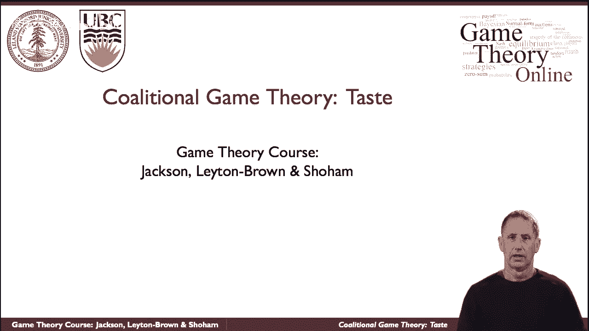
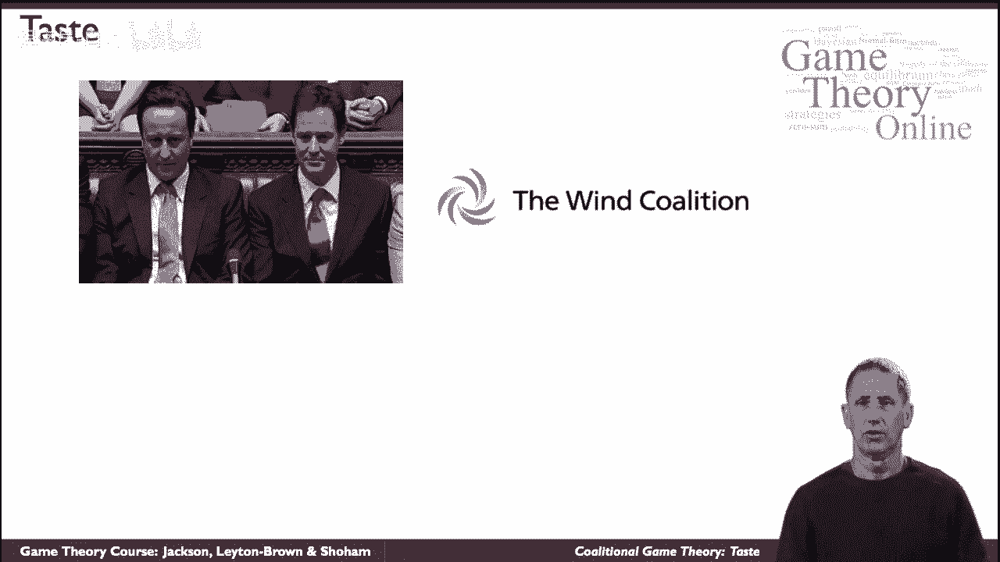
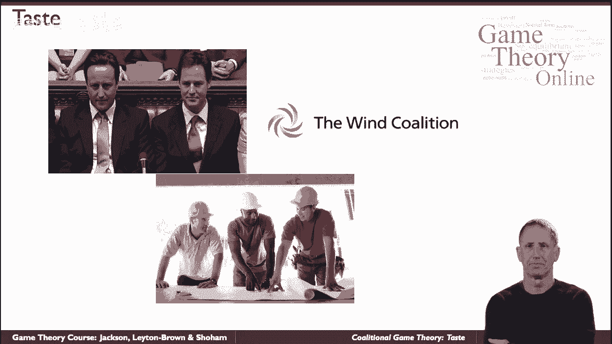

# P48：【斯坦福大学】博弈论（47）合作博弈 - 自洽音梦 - BV1644y1D7dD

联盟博弈论是一种模拟战略形势的方法，这与通常所说的非合作博弈论形成鲜明对比，事实上，联合博弈论常被称为合作博弈论，名字有点误导，我一会儿就回来，但让我们先谈谈，呃，联盟博弈论试图模拟什么情况。

你可能认识这两位英俊的先生，呃，左边的人是大卫卡梅隆，英国首相，在我们看的时候，在他的右边，他们坐着的时候，他的左边是尼古拉斯·克莱格，他的胁迫伙伴，他们还是走到一起，和，想必是有原因的。

他们可以一起完成一些事情，他们无法独自完成，特别是在这种情况下，在，呃，在议会中，这是一个经典的例子，联盟形成，事实上，我们通常当你想到联盟时，我们思考政党，但碰撞形成，呃，不仅在政治上。

他们当然是做生意的形式，所以风力联盟是一个，美国许多公司的联合，促进风的联合议程，能源和涡轮机，同样，这些公司，呃，竞争对手，尽管如此，他们觉得在一起他们可以做一些事情，他们一个人做不到，比如说，大堂。

政府，既定标准，和那种性质的事情，联盟并不总是在组织、政党或公司之间，或者重量级的事情我们作为个人经常聚集在一起共同完成事情，不管是结婚，或。

比如说，盖房子，当你有一个木匠一个电工和一个油漆工，他们一起可以完成他们不能完成的事情，呃，靠自己，现在，人们走到一起并不意味着他们的利益是一致的，或者他们给他们组成的联盟带来了同样多的价值，可能是。

比如说，施工队的制定者是不可替代的，但是电工很容易找到，一个可以很容易地取代，大概当他们为他们建造的房子得到报酬时，这应该反映在他们如何分配付款上，所以这里既有合作的竞争，也有竞争的竞争。

所以出于这个原因，将这些合作博弈称为通用术语，就像非合作博弈论一样误导人因为，比如说，如果你看一个正常形式的游戏，规范的呃，非游戏地毯的表示，人们可以很容易地描述所谓团队游戏的完全和谐的情况。

或者常见的回报游戏，代理人的利益完全一致，所以非合作博弈论和联盟或合作博弈论模型，竞争与协调，本质区别是联盟博弈论的基本建模单元，基本建模单元是组，团队和他们能完成的事情。

