# P5：【斯坦福大学】博弈论（4）游戏例子 - 自洽音梦 - BV1644y1D7dD

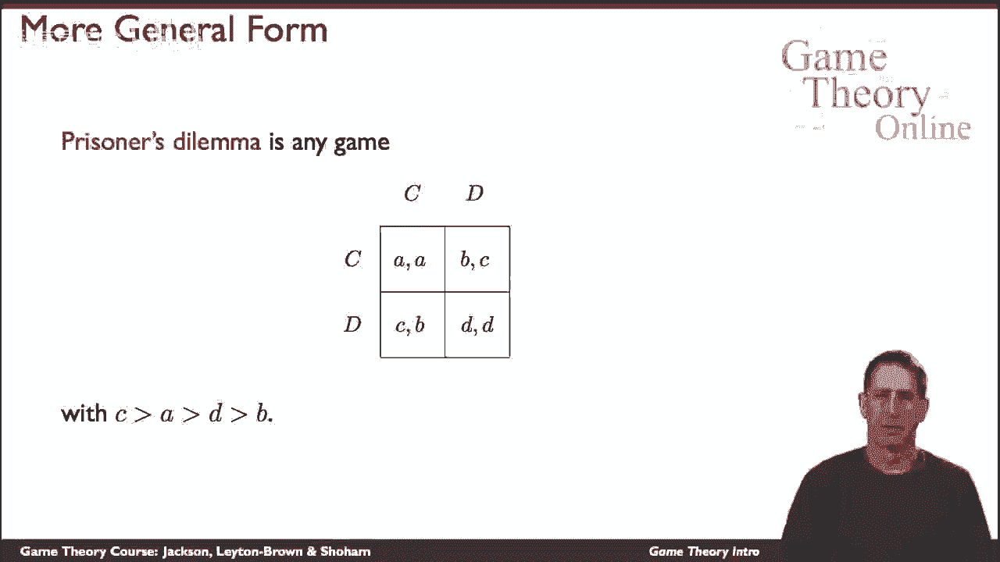

在著名的囚徒困境的例子中，我们有一个总体计划，两个囚犯要么合作，要么不叛逃，就像它所说的那样，如果他们都合作，他们得到了一些回报，如果他们都叛逃了，他们得到不同的回报，其中a大于d，然而。

如果他们不协调，其中一个合作，另一个缺陷，那么合作者得到的收益可能最低，叛逃者得到了最大的回报，这里也是对称的，还有这个，一个非常著名的例子，它具有相当违反直觉的悖论性质。

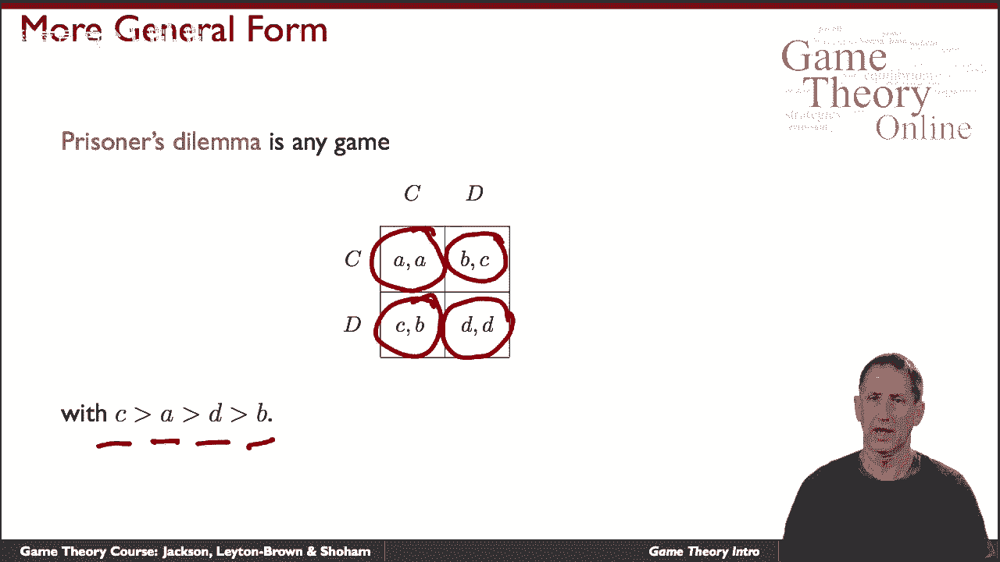

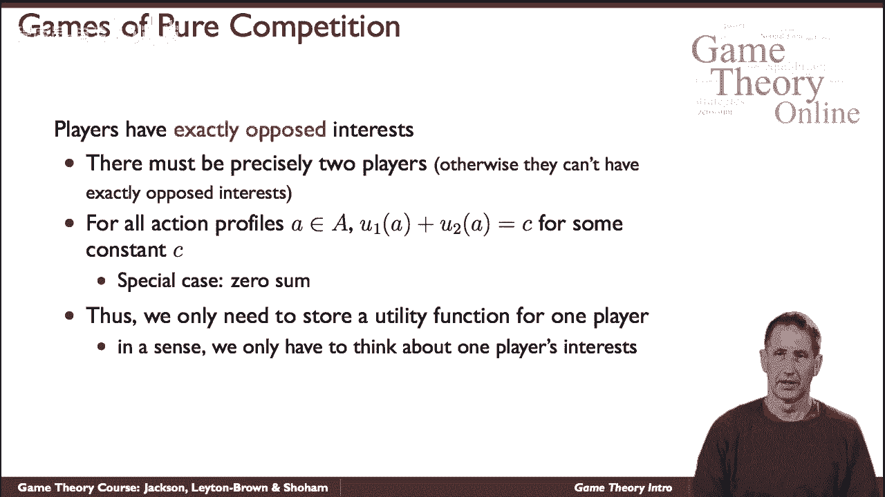

这里有一个概念上非常清楚的例子，这些都是纯粹竞争的游戏，这里的情况仅限于两名球员，其中一个玩家的收益正好是另一个玩家收益的补充。

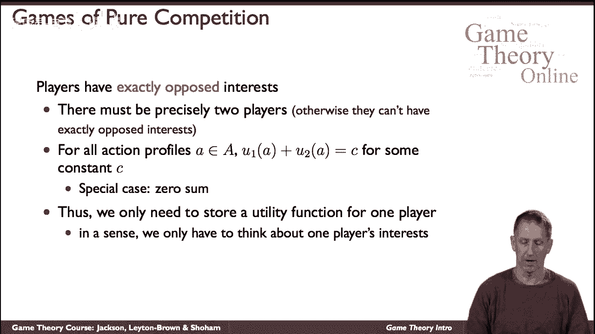

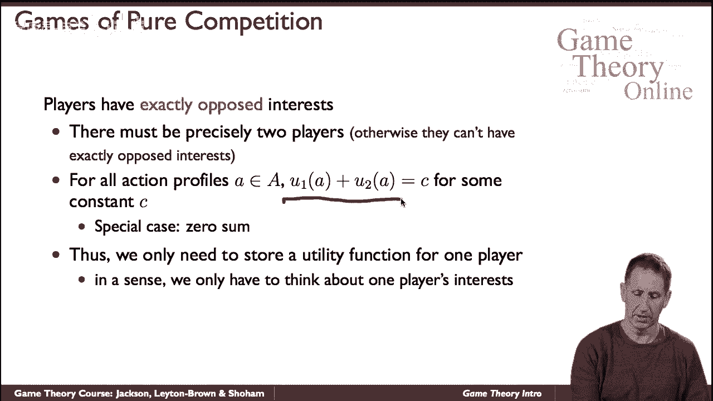

所以它们的和总是某个常数，通常这个概念是我们使用零，因此我们称它们为。

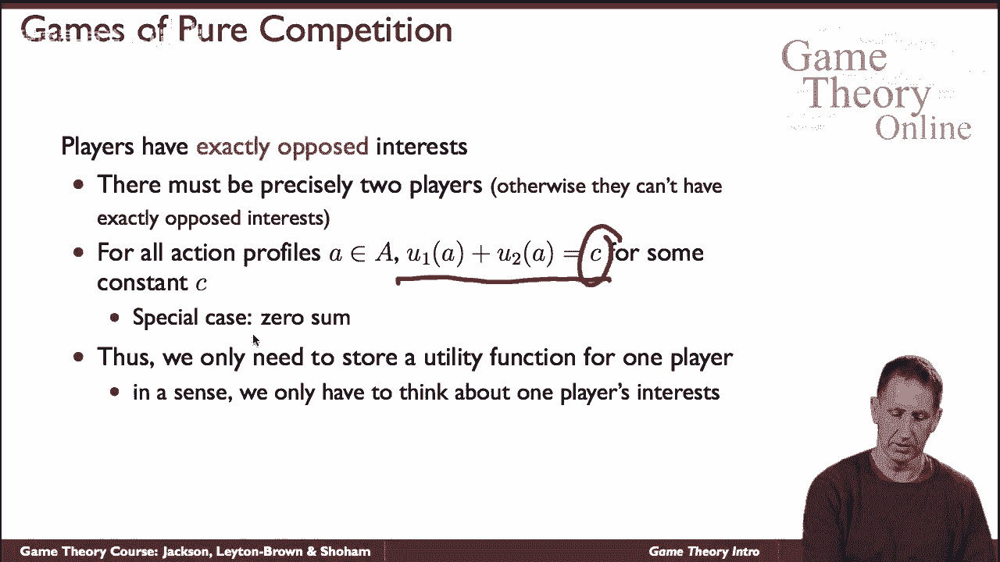

与常量相对的零和博弈，因为它们的和是零或常数，我们只需要记住一个数字，其中一个玩家的收益，我们可以从中推断出另一个参与者的收益。

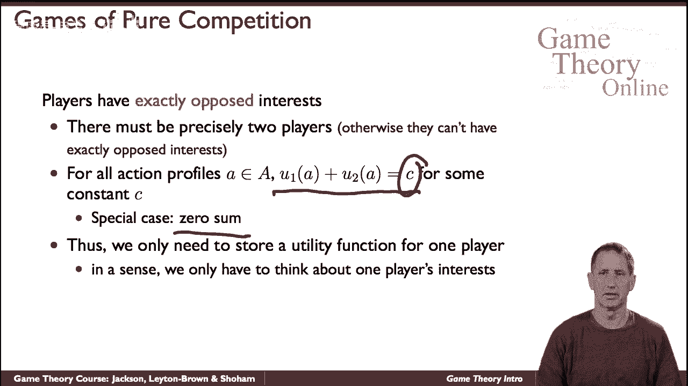

这是它最简单的版本，这是一个便士匹配的游戏，所以你和我都需要为，呃为了硬币，如果我们选择同一边，正面或反面我都赢，这意味着我得到了一个回报，你有负一个，如果我们不协调，所以我选了头，新的尾巴，或者相反。

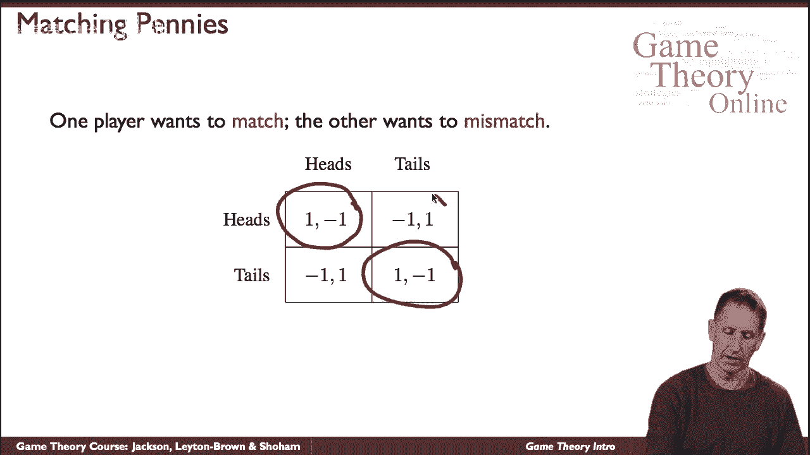

那么你就赢得了一个非常简单的纯粹竞争的游戏。

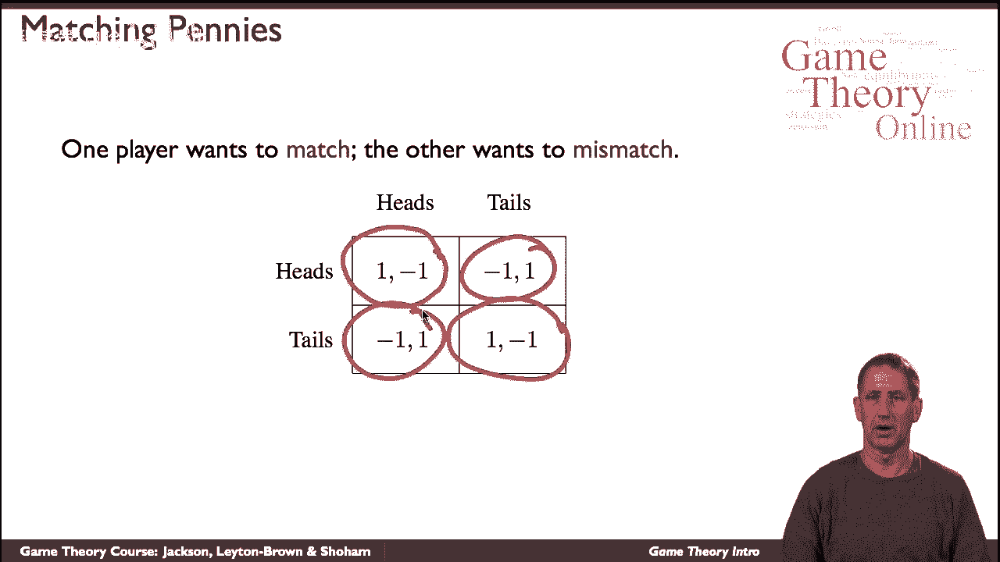

这里还有一个，那里是非常有名的，我们两个都有三个动作的类似游戏，这就是摇滚的游戏，纸和剪刀，也被称为罗尚博，所以如果我们选择同样的动作，那就平局了。

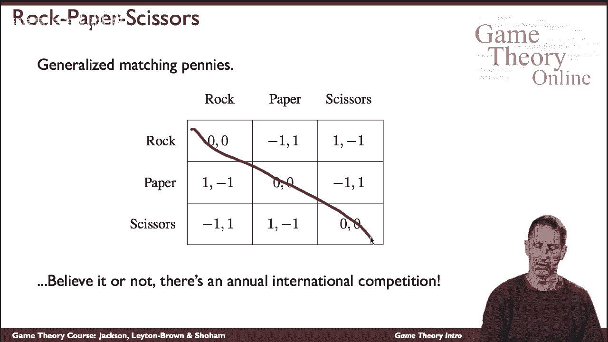

否则谁赢是有规则的，比如说，如果我挑一块石头和一张新纸，那你就赢了，如果我拿石头用剪刀，然后我赢了，以此类推，两种情况下的收益总和为零，实际上每年都有一场比赛价格高达一万美元。

当我们看到这个微不足道的游戏时，这实际上是一个发人深省的想法，那么也许可以检查一下我们是否真的参加了这场比赛。

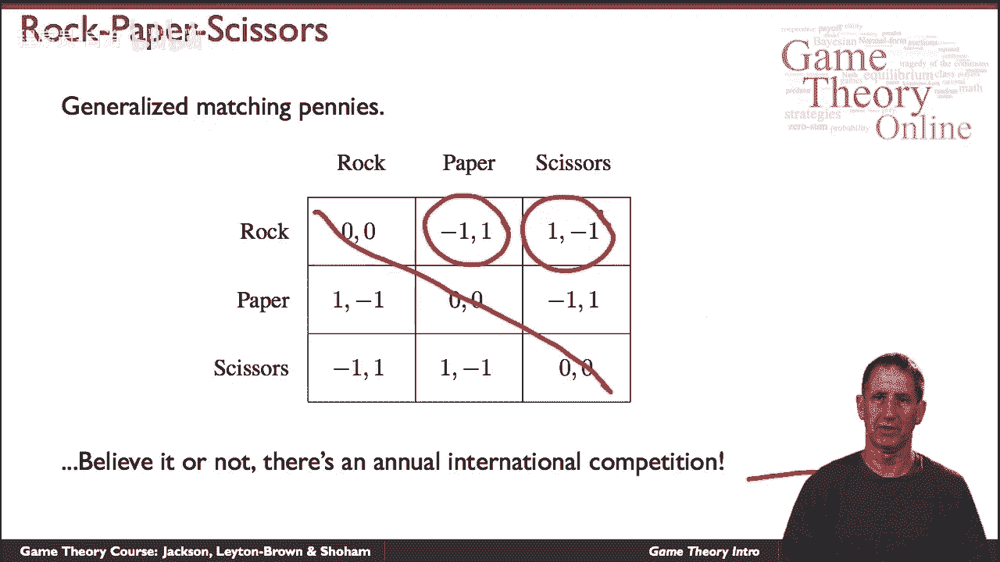

呃，我们实际上会努力思考如何演奏它，这是纯粹协调或纯粹合作游戏的另一个极端，在这种情况下，所有特工都有完全相同的兴趣，换句话说，他们采取的每一个行动向量的收益都是相同的。

所以参与人i的效用和参与人j的效用是一样的，对于每个动作序列，他们选择的动作矢量，又是这样，我们也在这里，我们只需要在矩阵的每个单元格中写一个数字，因为这对所有的球员来说都是共同的，它开车回家，的。

也许这个不幸的术语，呃，非，卡特博弈论，描述了我们正在讨论的博弈论的主要部分，就目前而言，它的名字会暗示这些是游戏，描述了内在冲突的情况，呃，但正如我们所看到的，它们也适用于玩家兴趣一致的游戏。

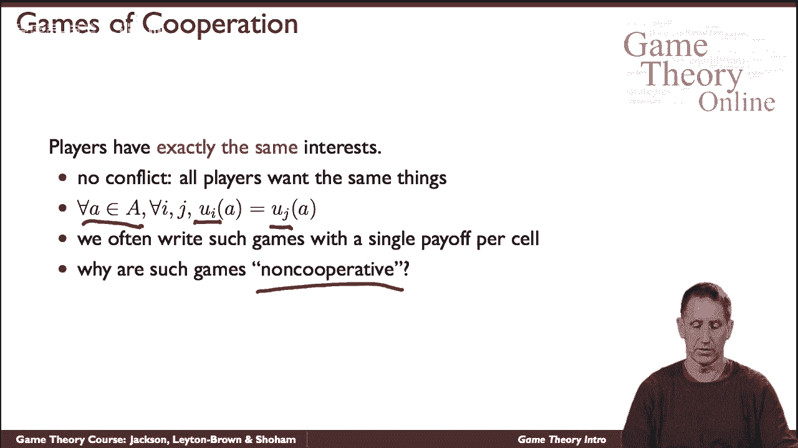

所以这里有一个，这里有一个游戏，你和我一起散步，呃，在人行道上互相靠近，我们每个人都可以决定是否走各自的左边，我们各自的权利，如果我们选择同一边，那么一切都好，我们避免了碰撞，如果我们不。

然后我们就碰撞了，这对我们俩都同样不好，当然啦，在一般情况下，游戏既不是纯粹的合作，也不是纯粹的合作。

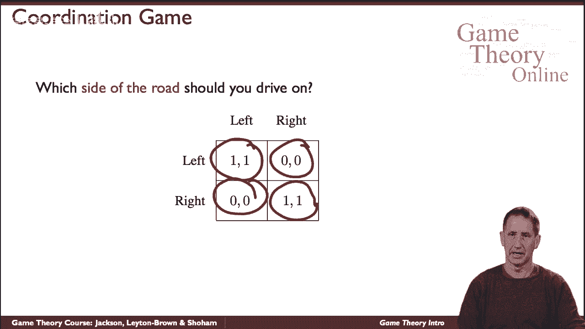

呃，冲突的，这里有一个游戏，呃就是例证，这是一个叫做性别之战的游戏，所以想象一下丈夫和妻子想出去看电影，他们可以从两部电影中选择，世界末日之战和一个花童，暴力战争片，另一个是浪漫喜剧，最重要的是。

他们想一起去看电影，如果他们去看不同的电影，然后他们同样不开心，所以他们想去看同一部电影，但他们有相互矛盾的偏好，妻子显然更愿意去参加世界末日之战，丈夫虽然浪漫，但他想去花童。

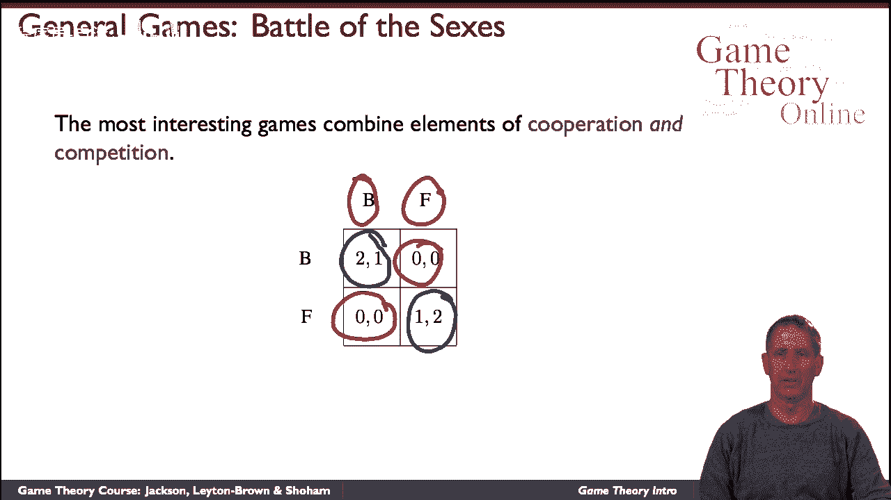