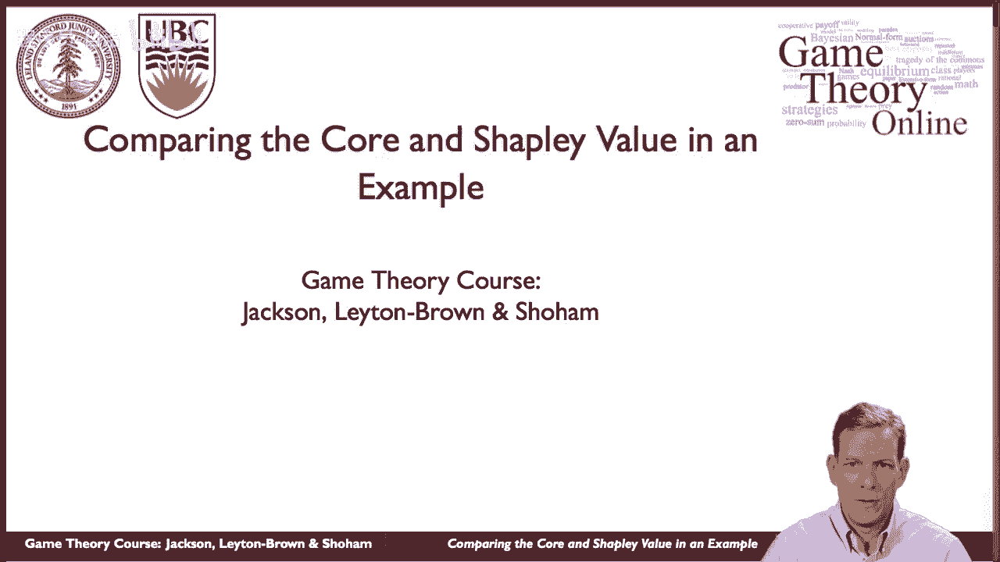
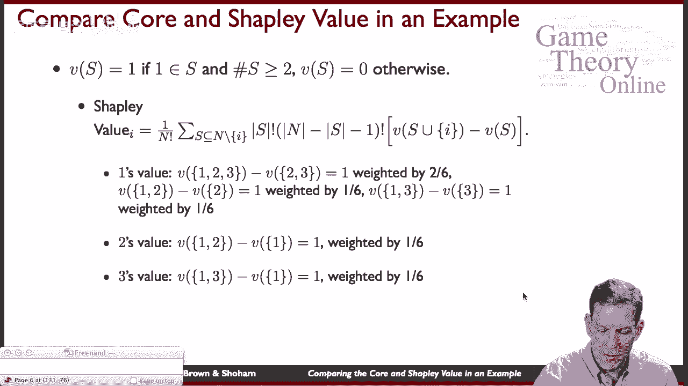
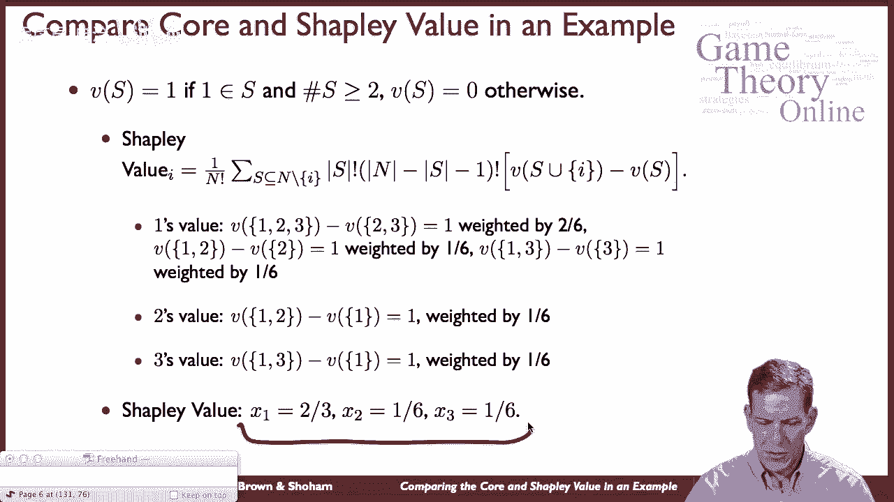

# P52：【斯坦福大学】博弈论（51）一个简单的实例来分别计算一下The Core和Shapley Value - 自洽音梦 - BV1644y1D7dD

嗨，伙计们，这次又见面了，和，我们现在要做的是，实际上是我们对联盟游戏的讨论的总结，在一群人之间分配价值，我们将通过看一个特定的例子来做到这一点，我们可以做一些比较，说核心和沙普利值。

看看到底发生了什么。

嗯，所以让我们，让我们来看看一个非常有趣的，嗯，所以联合国有一个安全理事会，它做出了一系列的传递和决心，在做其他事情中，嗯，这在国际政治中可能非常重要，这是怎么工作的，安理会有五个常任理事国。

这些是中国的法国的，俄罗斯，英国和美国，所以他们都，他们总是在安理会，有十个临时成员，因此，除了这五个国家之外，还有其他成员在安理会轮换进出，一般从联合国中选出，其中一个非常重要的方面。

五个常任理事国可以否决决议，好的，所以基本上如果你想在安理会内部通过一些东西，五个常任理事国实际上必须同意，这里面有些微妙之处，呃，可以是他们可以弃权，但忽视弃权，你基本上得让他们加入。

如果他们中的任何一个人对某事说不，它不会在安理会获得通过，但是十个，其他十个成员没有否决权，好的，所以如果我们开始考虑一个合作游戏来捕捉这个，安理会可以使用不同的投票规则，有时他们用多数决。

有时是三分之二规则等等，但我们将研究他们使用多数决的情况，所以如果我们想把它表现为一个合作游戏，为了达成决议，嗯，什么必须是真的，所以如果我们想想，你知道吗，标签，说中国法国，俄罗斯英国，而我们。

作为个人或球员，一二三四，那么联盟的价值是什么，所以联盟的价值，在这种情况下，联盟可以通过立法或决议，嗯，得到一个值，所以说，假设一个是成功的，你，你通过一项决议，你可以这样做，如果五个人都在船上。

所以你需要五个常任理事国，加上你需要多数，所以你至少需要一半的，所以你总共至少需要八名成员才能投票，是呀，但这五个，这些必须存在，如果你有一个联盟想通过一项决议，那你就得零分，好的。

所以这是一个合作游戏，这是一个非常特殊的，我们可以分析，那么对此的核心分配是什么，沙普利值是多少，等等，为了做到这一点，让我们从一个简单的三人游戏开始，它具有类似的结构，好的，这个是什么结构，说。

一个拥有否决权的常任理事国和两个临时理事国，我们仍然以多数决的方式运作，所以联盟的价值是一个，如果你有一个会员，嗯和嗯，你们船上至少有两个人，所以至少有两个同意，还有一个，呃，人物播放器。

一个是他们中的一个，你明白了，你可以通过一些东西，否则你不能好吧，所以这是一个简化的版本，嗯，那么发生了什么，让我们从核心开始，试着分析这个，所以我们有我们的游戏，猜一猜，如果你有一个在那里。

至少有两个成员，否则你得零分，所以现在核心必须满足什么，记住，核心必须给每个联盟分配一个总数，这至少是它得到的，所以这意味着如果你把1和2得到的，它们可以生成1的值，所以他们必须至少得到一个。

一个和三个加在一起至少要得到一个，一二三加在一起一定要做对一个，所以我们把总价值分给三个成员，必须是每个人至少得到零，因为您可以生成零，但你不能在这种情况下被迫参与，好的。

所以现在当我们考虑核心要做什么时，嗯，当我们想呃，看看这个事实呃，1和2必须至少得到一个，三者的总和必须等于一，没有人能得到一个负值，这些加在一起意味着，子三必须等于零，对所以嗯，没有办法给一个和两个。

至少一个，三个总共一个，然后呃，除了给三比零，好的，所以我们可以在这里做同样的事情，这意味着x2等于零，如果x 2等于零x 3等于零，这意味着x 1必须是1，所以在这种情况下，一个人是一个重要的参与者。

一个重要的球员，嗯，这意味着核心现在实际上给了一个完整的值，如果你为安理会做核心，有整整十五个成员，你可以解决这个问题，你会得到什么，你会得到的，基本上，全部价值的分配最终将完全由五个常任理事国承担。

所以你将得到五个常任理事国，x 1到x 5得到一个值，然后其他人得到的值为零，但你可以有很多不同的方式在这些成员之间分配这笔钱，仍然在核心，好的，这个游戏的核心是什么，好了，现在，让我们坚持同样的游戏。

做沙普利值，嗯，所以如果我们看这个游戏的沙普利值，我们最终会得到什么，嗯，我们可以做我们的计算，呃从沙普利值，我们知道i的值是根据这个公式给出的，尤其是在这方面，你知道，我们可以把这个建立起来，嗯。

我们可以先放一个，然后一二，然后一二三一一三一二三，一、三、二等等，在这种情况下，当一个进入这两个，他们什么也没加，嗯，在其他情况下，无论一个人从哪里进来，嗯，当至少有一个其他玩家在那里时，一个进来了。

呃，在所有这些其他情况下，他们增加了一个值，所以这将告诉我们，1的值应该等于三分之二，因为三分之二的时间他们增加了一个值，三分之一的时间他们增加了零的值。

如果你做这些计算，你可以，你知道你已经到了这个重量2 6，这个加权一六，按一六等加权，所以你能得到的是这里的三分之二，那么二得到六分之一，三会得到六分之一，以此类推。

所以我们最终得到的，这是一个三分之二的沙普利值，嗯，其他球员每人一个六，所以在这种情况下，核心和形状值都是独特的，他们给了我们不同的预测，一个核心是说一切都应该交给人，一个，沙普利值很好。

2和3确实产生了一些价值，我们应该给他们一些他们生产的成果，在这种情况下，一个更重要，所以他们得到了更多，但两个和三个仍然是这个社会有价值的成员，我们重视的章节反映了，但这些是非常不同的逻辑。

你可能会想到核心，在这种情况下，人们可能会脱离，一个人可以走开说，你知道没有我，你什么都得不到，嗯，而Shay价值是根据边际贡献进行计算的。

嗯好吧，在合作博弈方面，那我们做了什么，我们看过模特，相当复杂，多边谈判环境，你知道像，类似的东西，你知道，合作博弈背后的部分思想，理论是你知道我们可以做任何事情作为一个不合作的游戏。

我们本可以写一个正常的讨价还价的游戏，或者我们可以写下一个巨大的广泛的表格来说明安理会是如何运作的，谁能提出解决方案，然后计算这个博弈的纳什均衡是多少，或者子博弈完美均衡，然后试着弄清楚收益是什么。

合作博弈论的思想是，有时你想用一种更紧凑的方式来建模，实际上试图为讨价还价过程建立一个广泛的形式将是，这是一种不同的处理事情的方式，你知道这采取了一种公理的方法，一个非常简单的方法，最终，你知道的。

产生呃，预测，人们使用了许多不同的解决方案，嗯，所以你知道你可以做基于核心的想法，谢伊价值，还有其他解决办法，所以有相当丰富的关于合作博弈论的文献。

