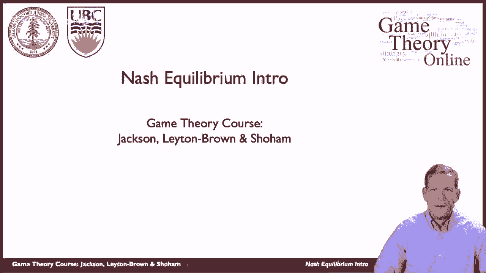
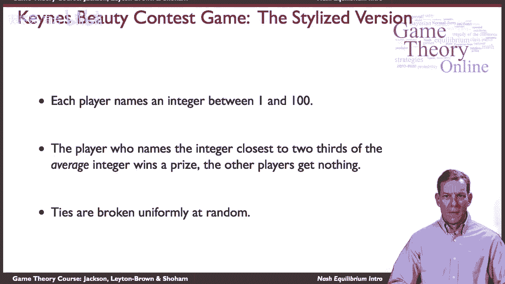

# P6：【斯坦福大学】博弈论（5）纳什均衡导论 - 自洽音梦 - BV1644y1D7dD

嗨，伙计们，又是马特，现在我们准备开始解决游戏了，并预测人们在不同的环境下会如何玩。

所以我们现在讨论的是纳什均衡，这可能是博弈论中最基本、最标准的解概念，它是以约翰纳什的名字命名的，他是普林斯顿的数学家，事实上，几年前，他因在这一主题上的工作获得了诺贝尔奖，它是一个。

这是一个非常基本和根本的概念，为了激励它，让我们先从一些，由另一个名人描述和发明的特定游戏，这是约翰·凯恩，约翰·梅纳德·凯恩斯选美比赛小游戏，那么这里的想法是什么。

所以让我们想一个你可能感兴趣的基本情况，这是凯恩斯详细描述的，所以你的想法是你有一只股票，你拿着它，股价也在上涨，那太好了，你是个投资者，你想从你持有的股票中获利，你开始相信也许股票太高了。

以公司的价值为理由，所以你认为这只股票可能被高估了，也许市场上有泡沫，你开始考虑出售，好吧好吧，你想卖掉它，但是你想等到价格到达最高点的时候再买，对呀，所以你想等到价格刚刚好，在你卖掉它之前。

它会达到最大值，嗯，所以你想赶在其他投资者之前离开市场，这是一个游戏，现在你必须预测其他人对股价的看法，他们要做什么，当他们想出去的时候，那么他们会如何行动，3。你对此作何反应？所以这是。

纳什平衡的基本成分，会预测其他玩家在做什么，然后选择最优策略，所以这将是我们拥有的两种关键成分，嗯，所以有一个非常程式化的版本，也就是众所周知的凯恩斯选美比赛，嗯，它是从哪里来的，嗯。

实际上凯恩斯描述了，里面有一份报纸，呃，在英国，有一场比赛，在那里玩家必须猜测几张呃，妇女，嗯，其他读者会认为是，嗯，最吸引人的，所以不是猜你在想什么，但是你的想法，其他人在想，所以凯恩斯把投资比作。

不仅仅是你对这件事的看法，股票，但你的想法，其他人在考虑股票，这对你的决定很重要，好的，所以现在这是由一个非常简单的游戏来代表的，许多人都在玩这个游戏，那么这个游戏是什么样子的，嗯。

每个人都可以说出一到一百之间的整数，好的，所以你可以在1到100之间选一个数字，它必须是一个整数，所以一个，两个，三个，等，玩家将同时移动，和命名整数的玩家。

而其他玩家什么都得不到所以要赢得这场比赛你必须，你得猜平均值，然后三分之二的权利，所以你想在任何东西的三分之二，平均猜测比平均猜测低一点，嗯，如果有两个人碰巧在同一个整数上，那是正确的，嗯。

那么领带就会被均匀地随机打破，所以我们就抛硬币，或者如果有三个人在掷骰子，三面模，等，好的，那么你会怎么玩这个游戏，你得想想其他球员会怎么做。

