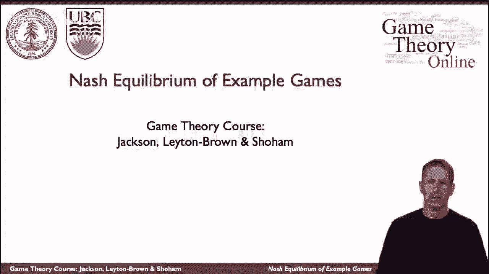
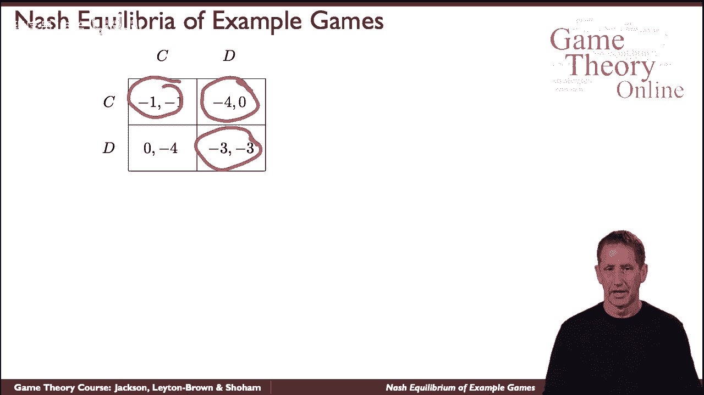
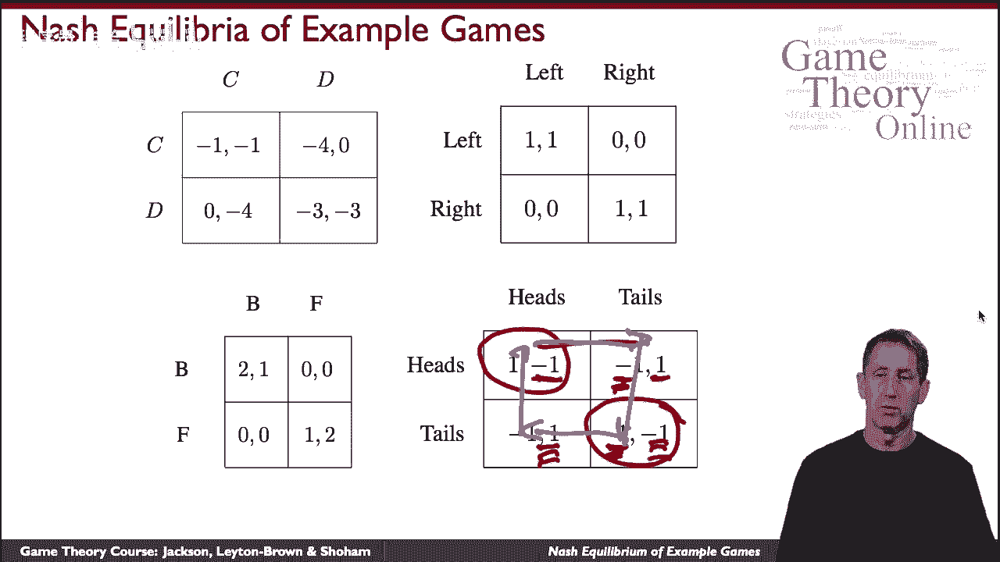

# P9：【斯坦福大学】博弈论（8）纳什均衡游戏的例子 - 自洽音梦 - BV1644y1D7dD

现在让我们来看看一些游戏的例子，和纳什均衡在这些博弈中，所以这是第一个游戏，熟悉的游戏，这是呃，当然是囚徒困境，如果两个囚犯都合作，然后他们得到了轻微的惩罚，如果他们不合作，他们得到了更严厉的惩罚。

如果一个合作而另一个不合作，然后他们合作了一个可怕的惩罚，还有呃，没有得到我们的人现在可以自由了，当然这个游戏有一个优势策略叛逃，不管对方怎么做，你更擅长不合作。

所以当然唯一占主导地位的战略结果是双方都叛逃。

事实上，这是这个博弈中唯一的纳什均衡，所以这是一个纳什均衡，这是最好的回应，如果对方有缺陷，那么这是对缺陷的最佳反应，但事实上它比那要强得多，最好叛变，不管对方是什么，呃，另一个代理有。

但这是一个独特的纳什均衡的例子，那碰巧是一个非常强烈的，占优势的战略。

纳什均衡，所以这里有另一个游戏，这是一个纯粹协调的游戏，我想到了，就像在人行道上走向对方一样，你们都可以决定是去各自的左边还是右边，在这两种情况下你都会做得很好，你不会碰撞，当然，如果你协调不当。

如果你一个向左另一个向右你就会撞到，所以这是一个自然的游戏，事实上，你看到你有两个自然的脂质，我写在这里的那个，如果有一个，呃，其中一名球员走到左边，向左是最好的反应，反过来，如果作为玩家向右。

你最好也往右边走，其他的不是纳什均衡，这里有一个游戏的例子，其中有两个或两个纳什均衡，特别是纯粹的策略，纳什均衡，我们稍后会讨论为什么我们称之为纯策略，这里有一个非常不同的游戏。

这通常被称为性别之战的游戏，想象一对夫妇，他们想去看电影，他们正在考虑两部电影，其中一个是一部非常暴力的电影，泰坦之战，另一部是非常轻松的电影，关于一朵花的生长，把这些叫做b和f，妻子。

当然更愿意参加泰坦之战，和，呃，丈夫更喜欢看花的生长，但最重要的是他们想一起去，这是收益，如果他们都去参加泰坦之战，那他们都很开心，妻子比丈夫多，如果他们都去看种花电影，然后丈夫稍微开心一点，妻子。

但如果他们去看不同的电影，他们两个都不高兴，那是一个，那是那是，那是，这就是游戏，嗯嗯，有多少，呃，我们这里有多少平衡点，好吧，再来一次，我们有两个纯策略，纳什均衡，为什么那口井。

如果他们中的任何一个去参加泰坦之战，然后另一个也会想去那里，因为如果他们去了另一个，他们会得到零，而不是他们在这里得到的任何东西，一两个，取决于丈夫还是妻子，相反，在花上看电影，花卉生长电影。

所以在这两种情况下，最好的回应是去看对方选择的电影，所以从表面上看，它看起来很像我们这里的纯协调游戏，但我们在这里看到了一点不同，我们以后会再讨论的，当我们谈到不纯粹的策略时，但混合策略。

这是另一个例子，我们要看的最后一个，这是一个叫做匹配便士的游戏，想象一下我们两个球员需要，只是需要在硬币的某一面做出决定，头或尾，如果我们决定同样的尺寸，正面或反面，但我们决定的是同一个，那我就赢了。

如果我们在不同的方面决定，你有尾巴，反之亦然，那你就赢了，所以我们在这里看到这个，如果我们双方都在头上，或者我们双方都在尾巴上，我赢了，否则你就赢了，我是说我有一个，你得负1分，所以这是一个零和游戏。

我们的收益总和为零，什么是纯粹的策略，这里的纳什均衡，嗯，让我们考虑一下，假设我挑头，你的最佳反应是什么，那么你最好的回应就是挑尾巴，因为你得到了一个而不是负一个，但如果你挑我的尾巴。

那我现在最好的反应就是玩尾巴，因为我想和你协调，因为这样我就会得到一个而不是负一个，但现在如果我玩尾巴，你宁愿玩人头，因为你会得到一个而不是负一个，你到这儿来了，但又一次，如果你在玩尾巴，我想。

如果你在玩人头游戏，我想玩人头来匹配，所以我们有一个循环，最好的反应，带领我们在循环中，所以没有纯粹的策略。

