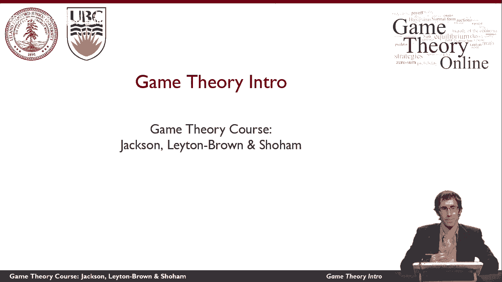
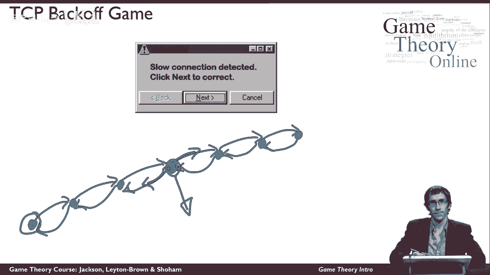
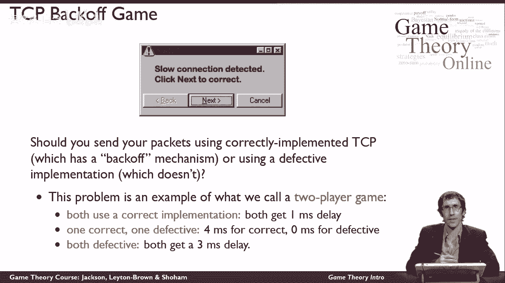
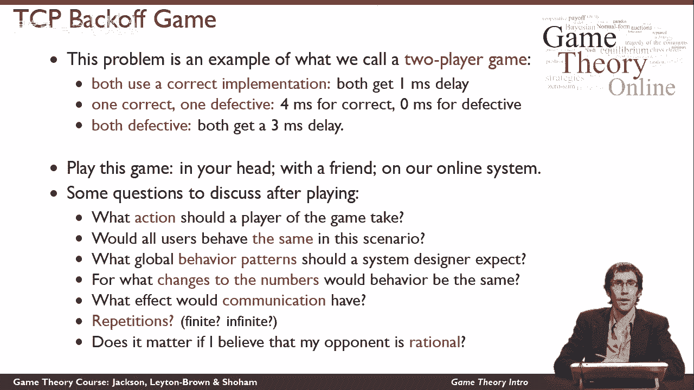

# 2：博弈论简介 🎲

在本节课中，我们将要学习博弈论的基本概念。我们将从一个计算机科学中的具体例子入手，探讨自私自利的个体在战略互动中如何决策，以及这些互动如何被设计以达成良好的整体结果。通过这个例子，我们将初步了解博弈论的核心思想及其应用领域。

---

## 什么是博弈论？

上一节我们介绍了课程目标，本节中我们来看看博弈论究竟是什么。

博弈论并非研究文字游戏或电子游戏。它是一种分析自私个体之间战略互动的理论框架。这对经济学至关重要，同时也广泛应用于计算机科学、政治学、心理学等多个学科。

将这些学科联系在一起的共同问题是：**追求自身利益的参与者，在战略互动中会如何行动？** 以及，我们应如何设计这些互动（例如，通过政府政策或计算机系统设计），以引导出理想的结果。

---

## 一个计算机科学实例：TCP协议与“后退”机制

为了具体说明，我们将从一个计算机网络的例子开始。请放心，你无需具备特别的计算机知识也能理解。

你可能在浏览器中见过类似下图的弹窗：

这个弹窗承诺能“检测到连接缓慢”，并邀请你点击“下一步”来“更正”。通常，人们会怀疑它可能安装病毒而选择不点击。但有趣的是，这个特定的弹窗程序可能真的会“帮助”你。我们将用这个例子来阐释博弈论的一些有趣观点。

在深入分析之前，需要先了解**TCP协议**的基本工作原理，它是互联网的支柱之一。

当你在互联网上通信时，你的信息被分割成多个**数据包**（类似于装有消息的信封），通过网络发送给接收者。实际上，你的计算机与接收者之间并无直接连接，信息是通过路径上的一系列计算机**逐跳传递**的。

接收者收到信息后，会发回一个**确认**信号，该信号同样经过整个路径传回发送者。

关键问题在于，网络中的计算机有时会因信息过载而**拥堵**。此时，它们会以一种令人意外的方式处理：**直接丢弃部分信息**，且不通知任何人。直到负载降低到可处理水平，它们才恢复正常工作。

那么，互联网如何实现可靠通信呢？机制如下：你的计算机在发送消息后会等待一段时间以确认是否收到回复。如果超时未收到确认，它就**假设消息丢失并重新发送**。

此外，你的计算机还会做另一件事：它会**降低未来发送消息的速率**，即实施“后退”机制。它假设网络某处存在拥堵，通过减少单位时间内的消息量来缓解拥堵。互联网上的其他计算机也遵循同样的规则。正是这种集体性的“后退”机制，防止了网络完全饱和，使得我们通常能获得合理的网络吞吐量。

---

## 将情境转化为“博弈”

关于“后退”机制，你只需要了解这些。现在，我们来思考你面临的一个战略决策问题：**是否应该安装那个看起来可疑的软件？**

更具体的问题是：你应该使用正确实现了“后退”机制的TCP协议来发送数据包，还是应该运行那个**关闭了“后退”机制、无视拥堵、持续轰炸网络**的有缺陷程序？这会导致他人（或许也包括你自己）的网络体验变差。

这类问题就是博弈论中所说的**博弈**。一个“博弈”泛指两个或更多参与者之间的任何互动，其**结果取决于每个人的行动**，且**每个人对不同结果的满意程度（收益）不同**。

让我们考虑这个互动的双人版本（即**两人博弈**）。你可能会担心互联网用户不止两个，但请相信，这个例子可以自然地扩展到更多参与者，其核心结论依然成立。

在双人情境下，我们需要分析：两位参与者是都使用正确实现，还是一方正确一方有缺陷，或是双方都使用有缺陷的实现？

为了分析，我们需要设定具体收益（这里用延迟时间表示）：
*   假设双方都使用正确实现，各经历 **1毫秒** 延迟。
*   假设一方正确，一方有缺陷。有缺陷的一方会用数据包淹没网络，导致实施“后退”的一方延迟大幅增加，设为 **5毫秒**；而有缺陷的一方几乎无延迟，设为 **0毫秒**。
*   假设双方都使用有缺陷的实现，则再次处于对称状态。但由于双方数据包在传递链路上丢失的概率都更大，他们都会经历比第一种情况更长的延迟，设为 **3毫秒**。

你可以和朋友在脑海中或通过我们提供的在线系统试玩这个游戏。这个游戏可能不如足球或国际象棋刺激，但本质上，所有博弈都具备相同结构：**玩家有一系列行动可选，在所有玩家做出选择后，产生一个结果，每个玩家获得相应的收益（或损失）**。

在这个简单游戏中，每位玩家选择“正确实现”或“缺陷实现”。根据上述规则，我们可以确定双方的延迟。由于没人喜欢延迟，玩家的目标是**最小化自身所经历的延迟**。

---

## 博弈论提出的核心问题

“玩家会如何玩这个游戏以最小化自身延迟？” 这是在博弈论设定下最自然的问题。但博弈论还引导我们思考其他更抽象、更具哲学性的问题，本课程也将涵盖这些内容。

以下是本课程将帮助你思考的一些问题示例：

*   **预测行为**：你认为在这种情况下，可以预期所有用户的行为都一致吗？
*   **系统设计视角**：如果你不是游戏参与者，而是关心整个系统如何运作的外部设计者（如网络架构师），你希望看到什么样的全局行为模式出现？
*   **参数敏感性**：我们设定的具体数字（1ms, 5ms, 0ms, 3ms）有些随意。游戏应该如何进行、会出现什么行为，是否强烈依赖于这些数字？如果数字稍有不同，行为模式会大相径庭吗？
*   **沟通的影响**：如果玩家在游戏前可以进行无约束的沟通，会有什么影响？
*   **重复博弈的影响**：如果玩家可以有限次或无限次地重复进行这个游戏，会有什么影响？
*   **对手模型的的重要性**：我对对手的看法重要吗？如果我认为对手是理性的、追求自身利益最大化的，我的策略会与我认为对手有不同想法时一样吗？

---

## 总结与展望

本节课中，我们一起学习了博弈论的基本定义，它是一门研究**战略互动**的科学。我们通过一个具体的**TCP“后退”游戏**实例，将现实问题抽象为博弈模型，并初步探讨了博弈论所关注的一系列核心问题，例如预测行为、系统设计、参数依赖、沟通与重复互动的影响，以及对对手信念的考量。

TCP后退游戏只是现实世界中众多可用博弈论分析的情境之一。在接下来的课程中，我们将描述更多现实世界的例子，并运用博弈论工具进行深入思考。

感谢你的加入，我们期待在接下来的课程中与你相见。

