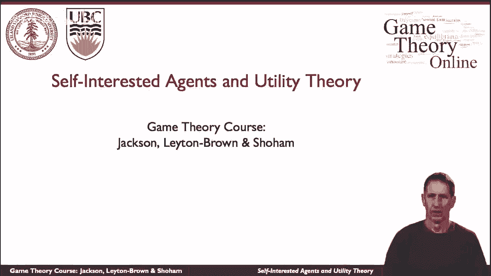
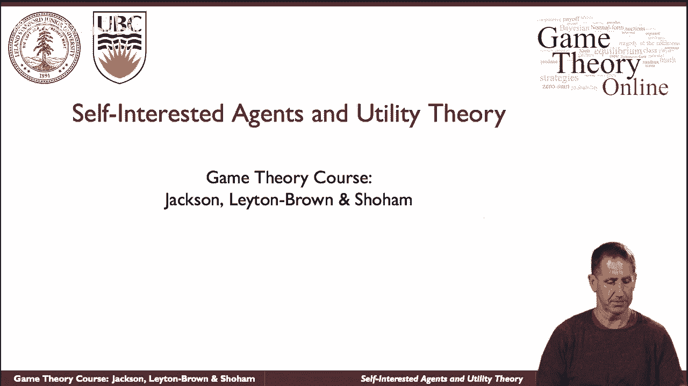
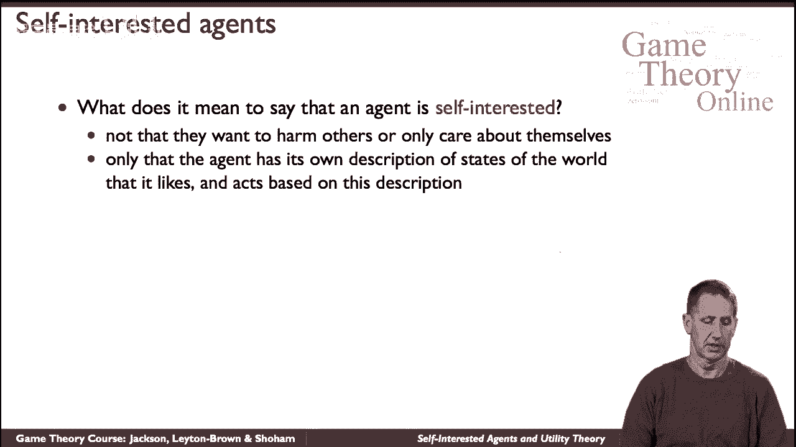
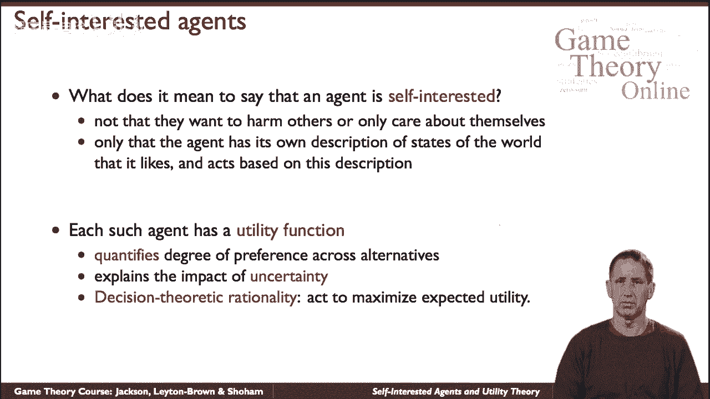
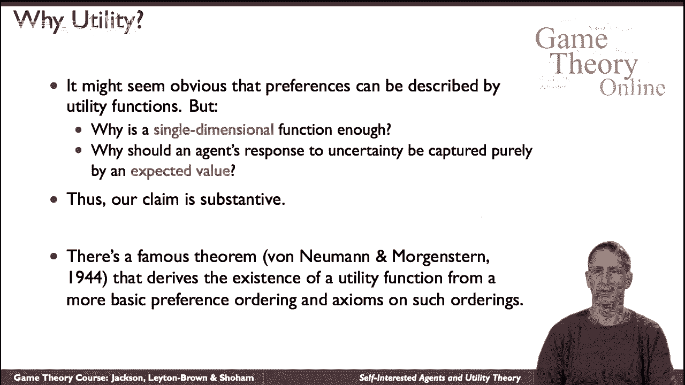

# 3：利己主义的代理人与效用理论 🎯



在本节课中，我们将要学习博弈论中关于“自利代理人”的核心概念，并深入探讨描述其偏好的“效用理论”。我们将理解效用函数如何量化代理人对不同结果的喜好程度，以及为何期望效用最大化是决策的基础。

---



## 自利代理人的含义 🤔

上一节我们介绍了博弈论的基本框架，本节中我们来看看“自利代理人”的具体含义。

我们所说的“自利”，并非指代理人一定是敌对的，或者完全不在乎其他代理人的遭遇。其核心含义是：代理人拥有自己的意见和偏好。对于世界可能呈现的不同状态（描述），代理人会有不同的喜好程度，并拥有不同的“效用”。



---

## 效用函数：偏好的数学度量 📊

理解了代理人有偏好后，我们需要一个工具来描述它。这就是“效用函数”。

效用函数是一个数学度量，它告诉我们代理人有多喜欢（或不喜欢）某个给定的情况或世界状态。它不仅描述代理人对确定性事件的态度（例如“明天气温是2.5摄氏度”），更重要的是，它描述代理人对**各种可能结果的概率分布**的偏好。这捕捉了代理人对事件不确定性的态度。

例如，如果告诉你“明天有70%的概率是2.5度，30%的概率是4度”，相比于另一个概率分布（比如50%对50%），你可能会对这两种分布有不同的喜好。现代博弈论所基于的决策理论方法指出：**代理人应努力以最大化其“期望效用”的方式行事**。

期望效用的计算公式如下，其中 `p_i` 是结果 `i` 发生的概率，`u_i` 是该结果对应的效用：
```
期望效用 = Σ (p_i * u_i)
```



---

## 效用函数的性质与讨论 ⚖️

在应用期望效用最大化原则时，我们需要理解效用函数的一些关键性质。

首先，效用值所处的尺度并不像概率那样固定（必须在0到1之间）。效用位于一个线性维度上，其绝对数值大小通常不重要，重要的是不同结果之间效用的**相对差值**。

然而，将不同维度的价值（例如财富和健康）合并到一个单一的效用尺度上是否合适？这是一个值得探讨的问题。同样，在面对不确定性时，仅考虑期望值是否足以恰当捕捉人们的态度？这些都不是微不足道或同义反复的陈述，它们提出了实质性的主张。

在经济学和决策理论中，有一个悠久的传统（最著名的参考文献之一是冯·诺依曼和摩根斯坦的著作），从人们选择行为所满足的更基本公理出发，推导出效用函数的存在性和期望效用最大化原则。虽然我们本节课不深入这些公理，但有必要意识到效用理论背后有着坚实的逻辑基础。

---

## 总结 ✨

本节课中我们一起学习了博弈论中“自利代理人”的概念及其核心工具“效用理论”。



我们了解到：
*   “自利”意味着代理人拥有自身独立的偏好。
*   **效用函数**是量化这些偏好的数学工具，它衡量代理人对不同结果乃至概率分布的喜好程度。
*   决策的核心原则是**最大化期望效用**。
*   效用函数的尺度具有线性性质，且其理论根基源于一系列关于理性选择的基本公理。

理解效用理论是分析后续博弈模型中参与者如何做出决策的基石。