# 4：定义游戏 🎮

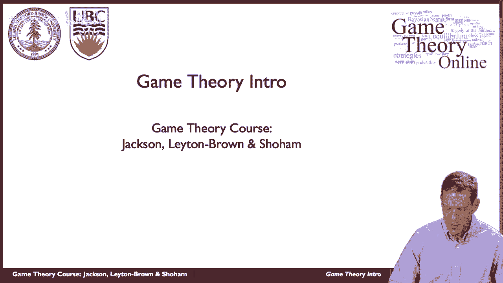

在本节课中，我们将学习如何正式地定义一个“游戏”。我们将探讨构成一个博弈论模型的核心要素，并介绍两种主要的游戏表示形式。

## 游戏的核心要素

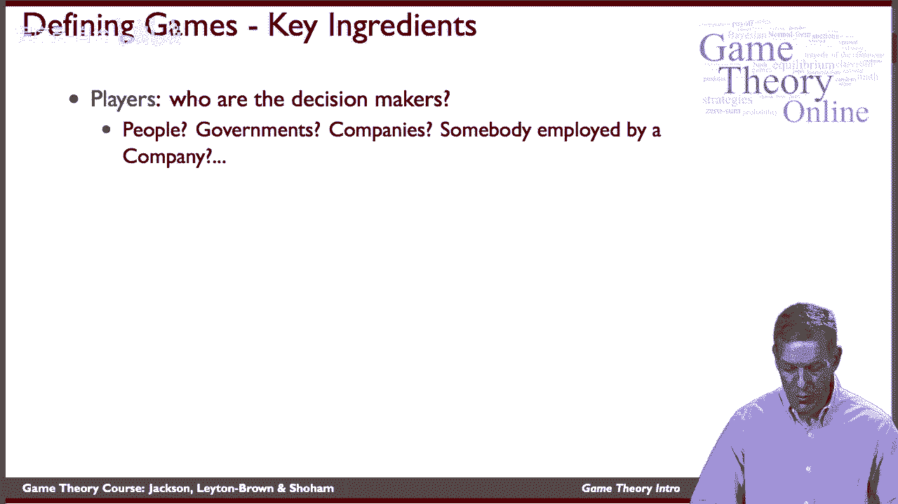

一个游戏由几个基本部分构成。我们必须明确这些部分，才能对战略互动进行建模。

### 玩家 👥

玩家是游戏中做决策的主体。他们可以是个人、公司、政府或其他实体。关键在于，我们需要明确模型中包含哪些决策者。例如，在分析贸易协定时，玩家可能是各国政府；在分析市场竞争时，玩家可能是不同的公司。

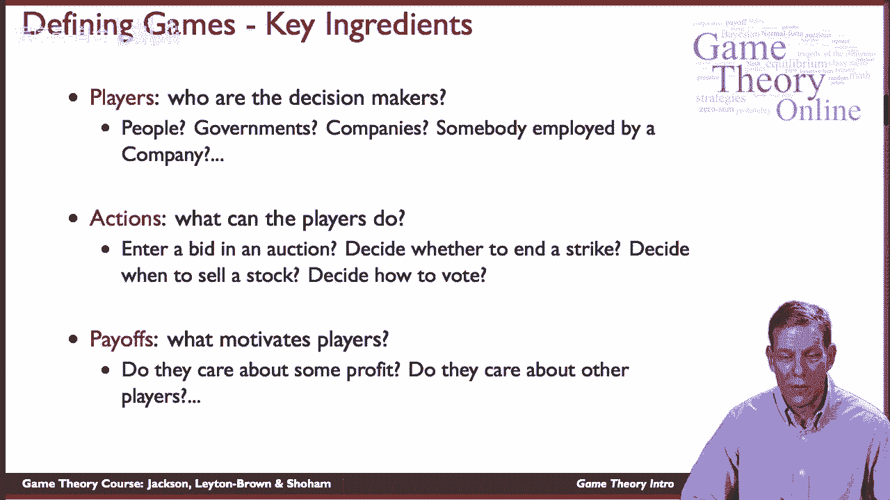

### 行动 🎯

行动是玩家在游戏中可以做出的具体选择。例如，在拍卖中，玩家的行动是出价；在投资中，行动是买卖股票；在投票中，行动是选择投给哪位候选人。我们必须仔细定义所有可能的行动，以确保模型能够准确反映现实情况。

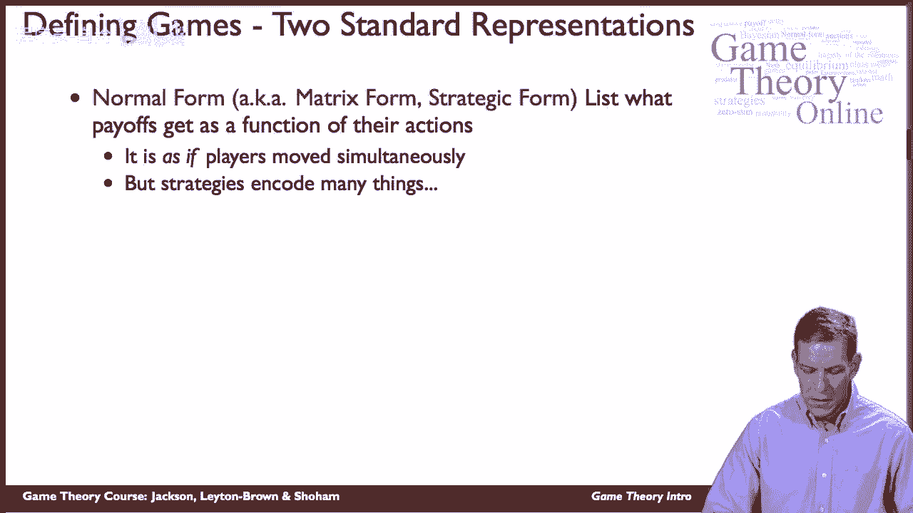

### 收益 💰

收益代表了玩家的动机或目标。它量化了玩家对不同游戏结果的偏好。收益通常以效用或利润来衡量。例如，公司可能追求利润最大化，个人可能同时关心自身收益和他人的福利。准确刻画收益函数对于预测玩家行为至关重要。

## 游戏的两种表示形式

游戏主要有两种标准的数学表示方法，它们适用于不同的情况。

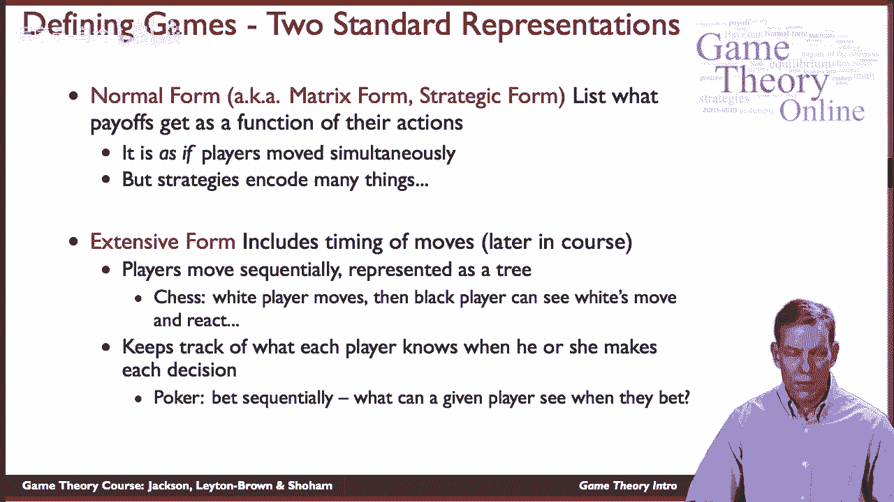

### 标准式（或策略式）📋

标准式是一种简洁的表示方法，它列出了所有玩家、他们的可选行动以及对应于每个行动组合的收益。它通常隐含地假设玩家是同时行动的（尽管策略可以编码更复杂的信息）。我们将从这种形式开始学习。

以下是标准式游戏的关键成分公式化表示：

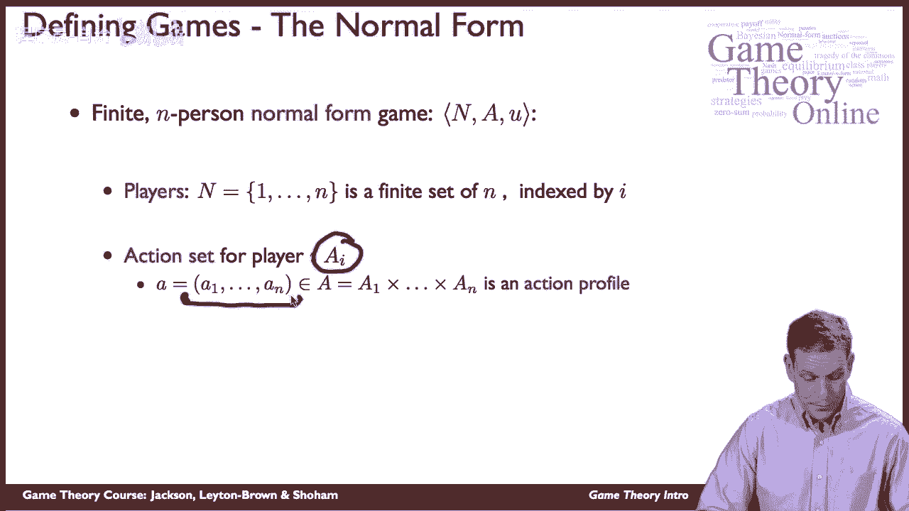

*   **玩家集合**：设共有 `n` 个玩家，用 `i ∈ {1, 2, ..., n}` 表示单个玩家。
*   **行动集**：玩家 `i` 所有可能行动的集合记为 `A_i`。
*   **行动组合**：所有玩家行动的一个列表，记为 `a = (a_1, a_2, ..., a_n)`，其中 `a_i ∈ A_i`。
*   **收益函数**：对于每个玩家 `i`，都有一个收益函数 `u_i(a)`，该函数为每个可能的行动组合 `a` 指定一个数值收益。

### 扩展式（或树形式）🌳

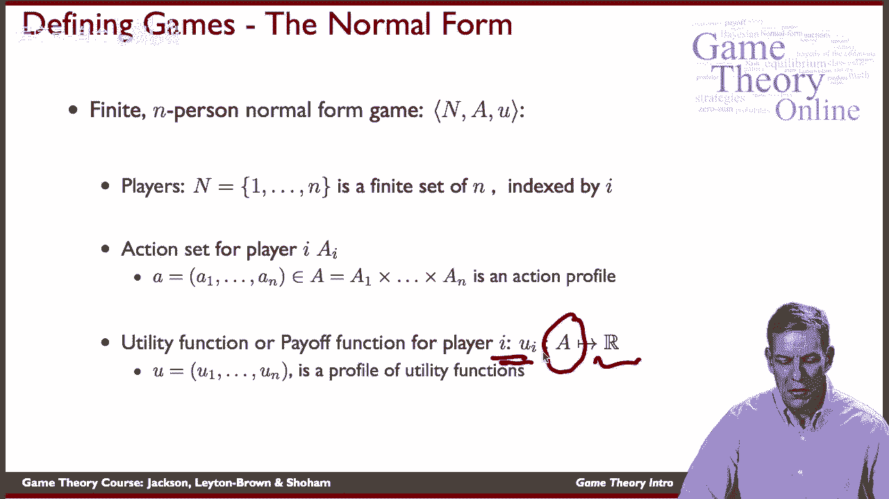

扩展式更适合表示有先后顺序、信息不对称（例如，某些玩家不知道其他玩家的行动）的游戏。它通常用一棵树来表示，节点代表决策点，分支代表可能的行动。例如，在国际象棋中，白方先走，黑方看到白方的走法后再回应。我们将在课程后期深入学习扩展式。

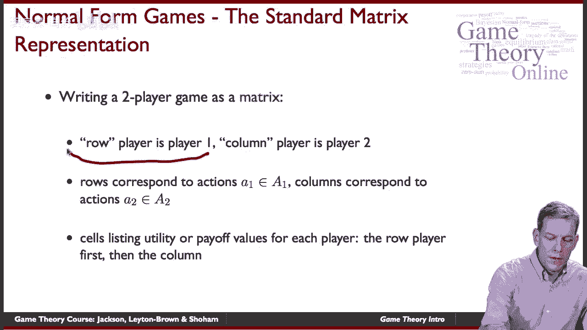

这两种表示形式密切相关，标准式可以看作是扩展式的一种简化摘要。我们将从标准式入手，打下基础。

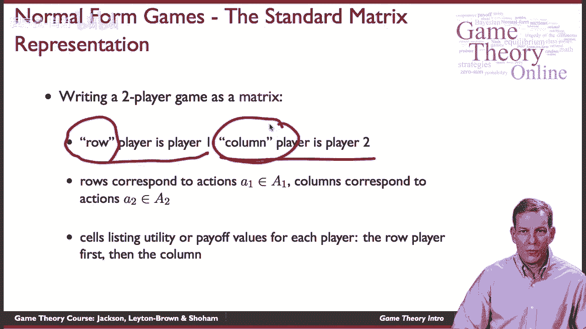

## 标准式游戏的矩阵表示

对于只有两个玩家且行动数量较少的游戏，我们可以用一个矩阵来直观地表示，这被称为收益矩阵。

假设有一个两人游戏：
*   玩家1（行玩家）的行动集为 {上， 下}。
*   玩家2（列玩家）的行动集为 {左， 右}。

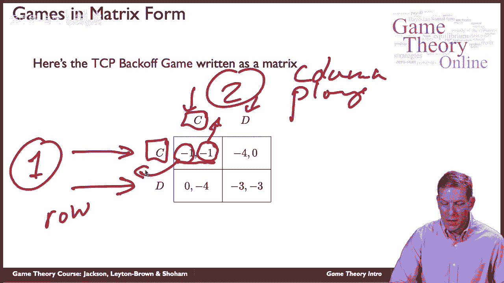

那么收益矩阵如下：

| 玩家1 \ 玩家2 | 左       | 右       |
| :------------ | :------- | :------- |
| **上**        | (x₁, y₁) | (x₂, y₂) |
| **下**        | (x₃, y₃) | (x₄, y₄) |

在矩阵的每个单元格中，括号内的第一个数字是玩家1的收益，第二个数字是玩家2的收益。例如，当玩家1选择“上”，玩家2选择“左”时，玩家1获得收益 `x₁`，玩家2获得收益 `y₁`。

## 更复杂的例子：集体行动博弈

并非所有游戏都能方便地用矩阵表示。考虑一个涉及大量玩家的“集体行动”博弈，例如是否参与反抗活动。

假设有1000万玩家，每个玩家 `i` 的行动是二元的：反抗（R）或不反抗（N）。即 `A_i = {R, N}`。

收益取决于总体结果和个人选择：
*   如果总反抗人数达到或超过200万，则反抗成功。
*   如果反抗成功，所有参与者（选择R的人）获得收益1。
*   如果反抗失败（总人数<200万），则参与者（选择R的人）获得收益-1（例如受到惩罚），而非参与者（选择N的人）获得收益0。

我们可以用以下方式形式化定义玩家 `i` 的收益函数 `u_i`：

```python
def utility_i(action_i, total_rebels):
    if total_rebels >= 2_000_000:  # 反抗成功
        if action_i == 'R':
            return 1
        else: # action_i == 'N'
            return 0 # 假设非参与者在成功时收益为0，此处可修改
    else:  # 反抗失败
        if action_i == 'R':
            return -1
        else: # action_i == 'N'
            return 0
```

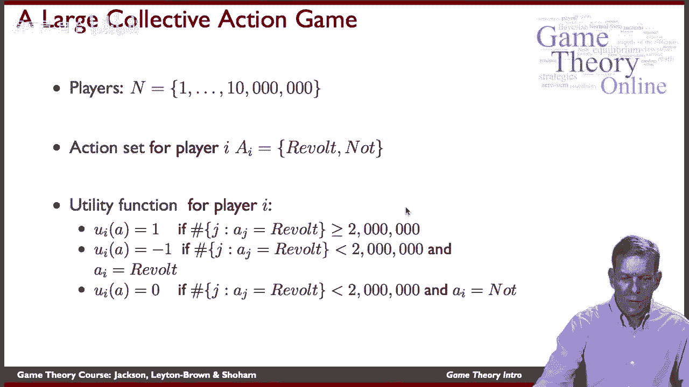

这个例子表明，玩家的收益不仅取决于自己的行动，还以复杂的方式依赖于所有其他玩家的行动。每个玩家都必须策略性地预测他人的行为才能做出自己的最优选择。

## 总结 📝

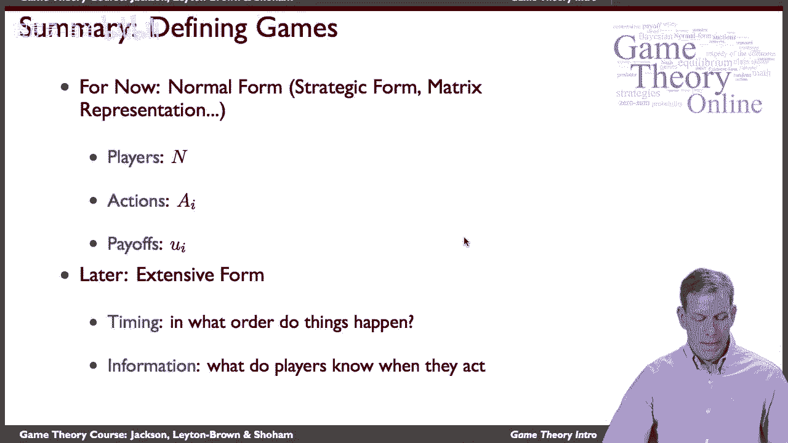

本节课中，我们一起学习了如何定义一场游戏。我们首先介绍了构成游戏的三个核心要素：**玩家**、**行动**和**收益**。接着，我们探讨了游戏的两种主要表示形式：**标准式**和**扩展式**，并说明本课程将从标准式开始。我们通过收益矩阵学习了如何表示简单的两人游戏，并通过一个集体行动博弈的例子，展示了如何用公式和代码描述更复杂的多玩家博弈情境。理解这些基本定义是分析任何战略互动的基础。