# 5：博弈论经典游戏示例 🎮

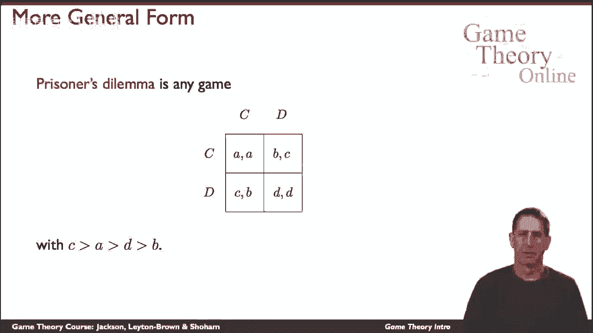

在本节课中，我们将学习博弈论中几个经典的、具有代表性的游戏模型。这些例子将帮助我们理解不同类型的博弈，包括纯粹冲突的零和博弈、纯粹合作的协调博弈，以及混合了合作与冲突的博弈。

---

## 囚徒困境 🤝

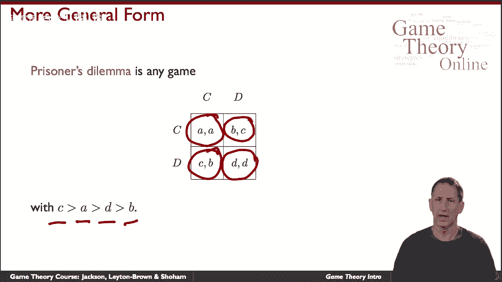

上一节我们介绍了博弈的基本概念，本节中我们来看看一个著名的例子——囚徒困境。这个博弈描述了两个囚犯面临的选择困境。

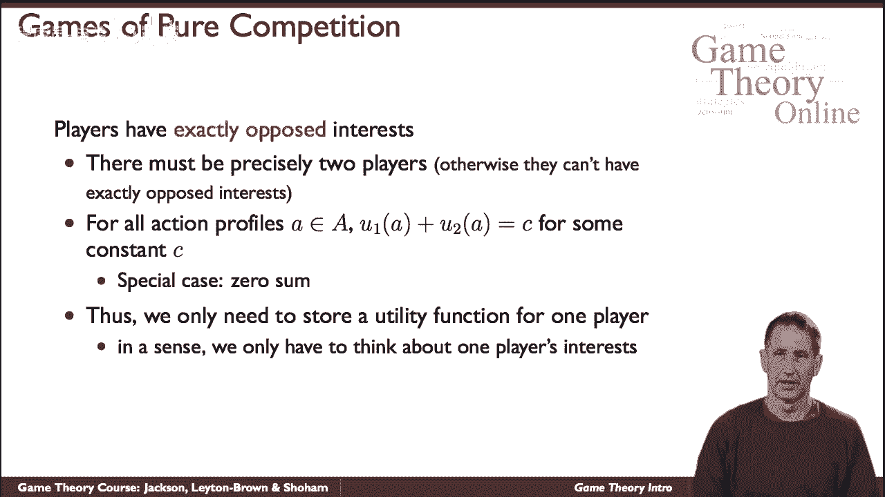

在囚徒困境中，两名囚犯可以选择“合作”（保持沉默）或“叛逃”（揭发对方）。收益矩阵通常设定如下：
- 如果两人都合作，每人获得中等收益 `b`。
- 如果两人都叛逃，每人获得较低收益 `d`。
- 如果一人合作而另一人叛逃，合作者获得最低收益 `a`，叛逃者获得最高收益 `c`。

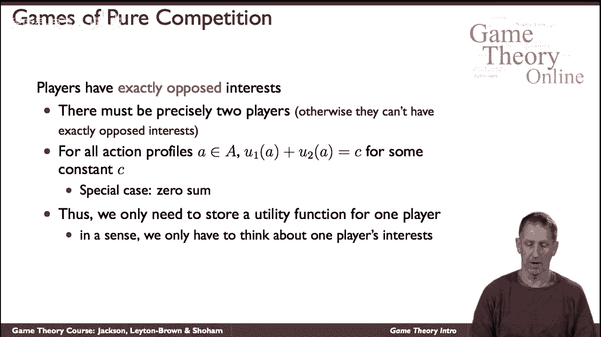

其中，收益关系通常满足 `c > b > d > a`。这个博弈的悖论在于，尽管双方合作能带来更好的集体结果，但个体理性的选择却会导致双方都叛逃的糟糕结局。

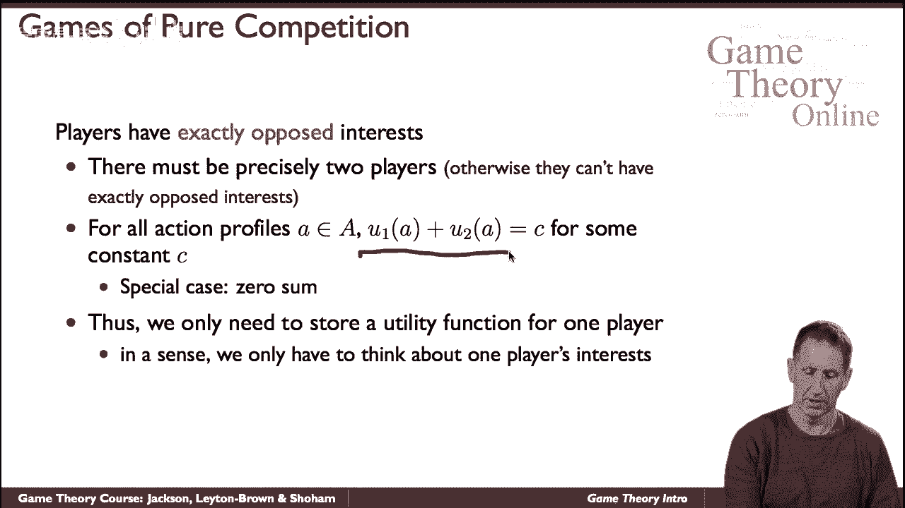

---

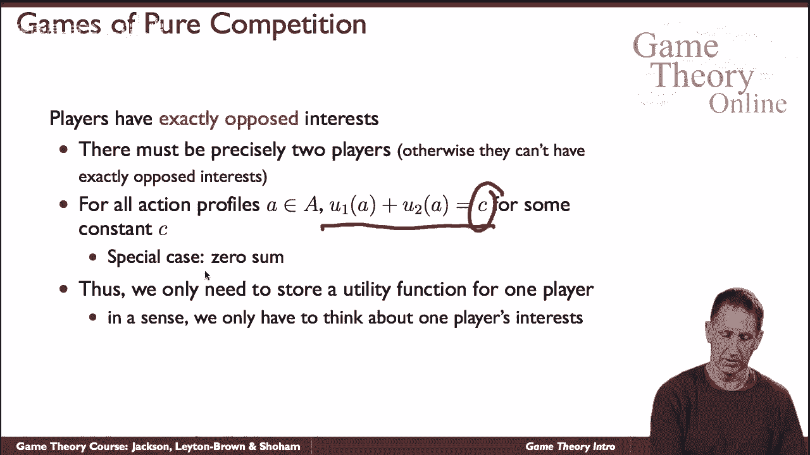

## 零和博弈 ⚖️

接下来，我们探讨一种概念清晰的博弈类型——零和博弈。这类博弈仅限于两名玩家，且具有纯粹的竞争性。

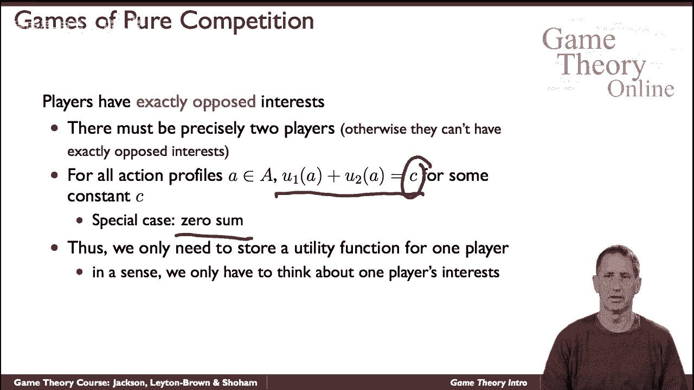

在零和博弈中，一名玩家的收益恰好是另一名玩家收益的相反数。它们的总和总是一个常数（通常简化为0）。因此，我们只需记录一名玩家的收益，就能推断出另一名玩家的收益。

以下是两个经典的零和博弈例子：

### 匹配硬币游戏

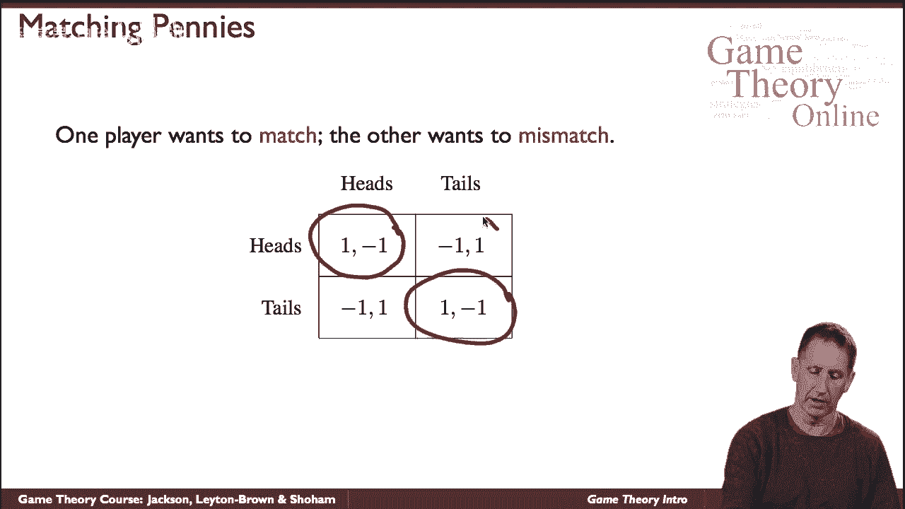

在这个简单的游戏中，两名玩家同时选择“正面”或“反面”。
- 如果双方选择相同，则玩家A获胜，收益为 `+1`，玩家B收益为 `-1`。
- 如果双方选择不同，则玩家B获胜，收益为 `+1`，玩家A收益为 `-1`。

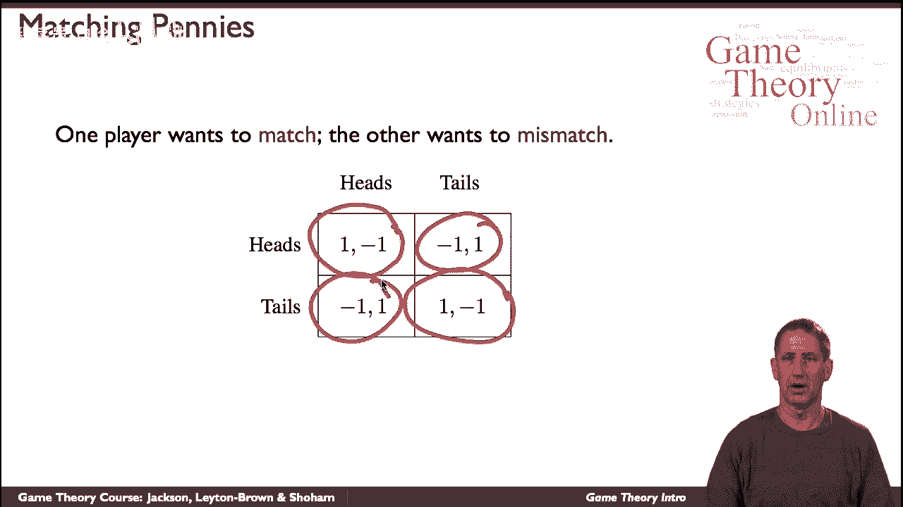

### 石头剪刀布游戏

这是一个更广为人知的游戏，每名玩家有三个动作：石头、布、剪刀。
- 如果双方选择相同，则为平局，双方收益为 `0`。
- 否则，根据“石头赢剪刀、剪刀赢布、布赢石头”的规则决定胜负，胜者收益为 `+1`，负者收益为 `-1`。

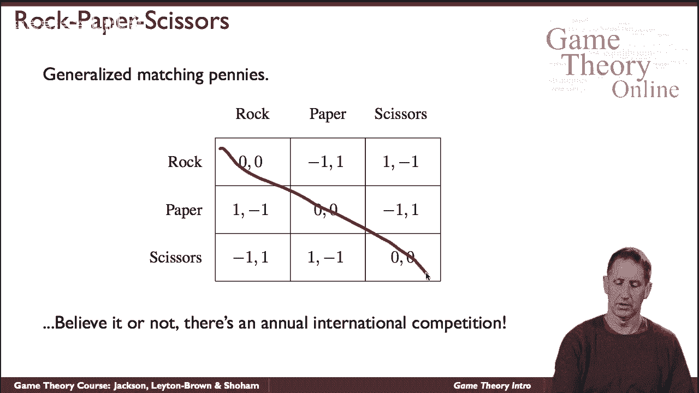

这个简单的游戏每年甚至举办奖金高达一万美元的比赛，促使我们思考如何制定策略。

---

## 纯粹合作博弈 🤝

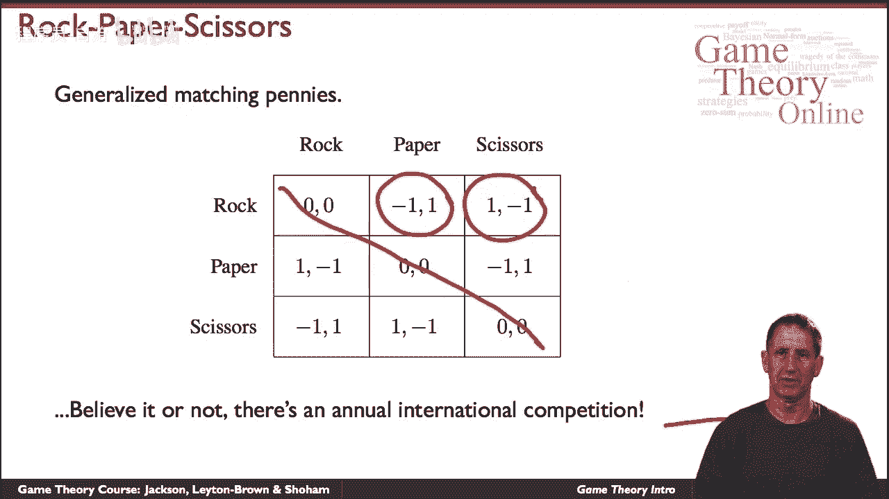

与零和博弈相反，另一个极端是纯粹合作或纯粹协调博弈。在这类博弈中，所有参与者的利益完全一致。

这意味着，对于每一个可能的行动组合，所有玩家获得的效用（或收益）都是相同的。因此，在收益矩阵中，每个单元格只需填写一个数字，因为它代表了所有玩家的共同收益。

一个典型的例子是“人行道行走”游戏：
- 两名行人相向而行，每个人都可以选择靠自己的左边走或靠自己的右边走。
- 如果双方选择同侧（都靠左或都靠右），则顺利通过，双方获得高收益。
- 如果双方选择不同侧，则发生碰撞，双方获得低收益。

这个游戏强调了协调一致的重要性。

---

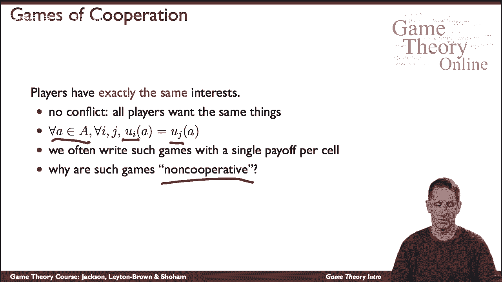

## 混合动机博弈：性别之战 🎬

在一般情况下，博弈往往既非纯粹合作，也非纯粹冲突，而是混合了两种动机。“性别之战”就是一个典型例子。

想象一对夫妻决定晚上看什么电影。有两个选择：一部动作片（《世界末日之战》）和一部爱情喜剧（《花童》）。
- 最重要的是，他们希望一起看电影。如果分开看不同的电影，双方都会不开心，获得低收益。
- 如果他们一起看同一部电影，双方都获得较高收益，但偏好有冲突：妻子更想看动作片，而丈夫更想看爱情喜剧。

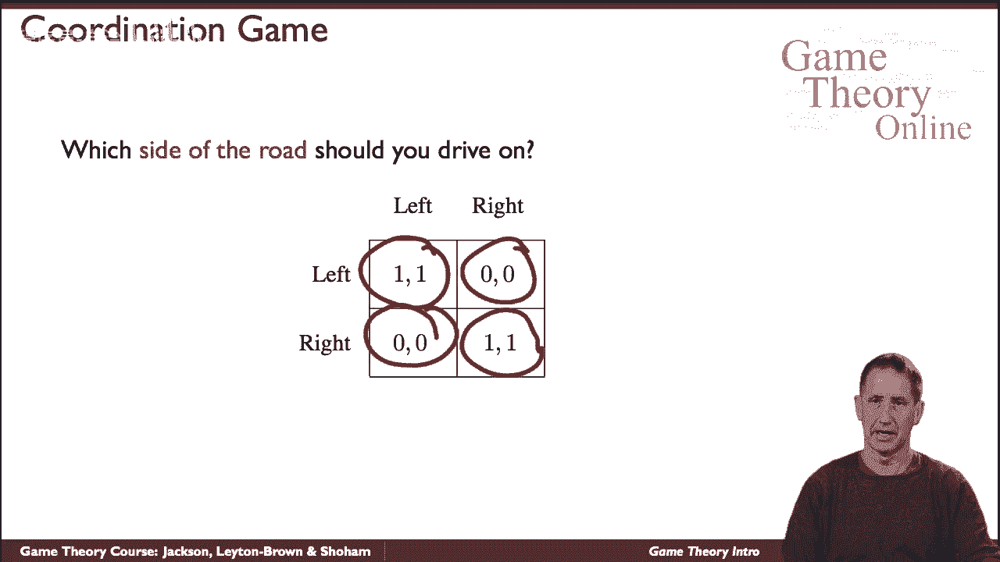

这个博弈体现了在需要协调合作的大前提下，个体偏好存在冲突的常见情况。

---

## 总结 📚

本节课中，我们一起学习了博弈论中几个基础而重要的游戏模型：
1.  **囚徒困境**：揭示了个人理性可能导致集体非理想结果的悖论。
2.  **零和博弈**（如匹配硬币、石头剪刀布）：描述了纯粹竞争、一方所得即另一方所失的情景。
3.  **纯粹合作博弈**（如人行道行走）：强调了利益完全一致时协调的重要性。
4.  **混合动机博弈**（如性别之战）：展示了现实世界中常见的、合作与冲突并存的复杂互动。

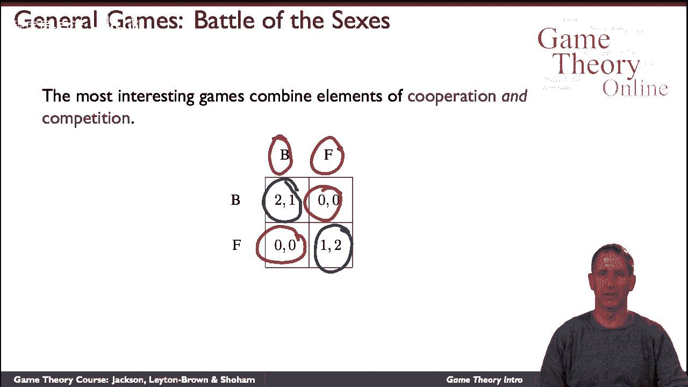

这些经典示例为我们分析更复杂的策略互动奠定了坚实的基础。