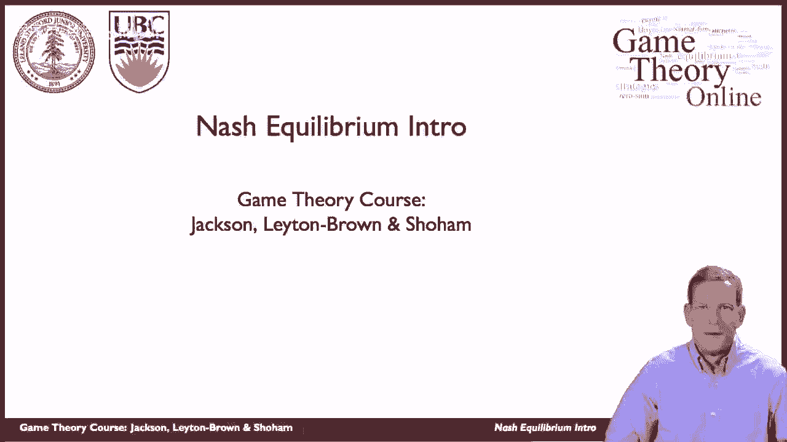
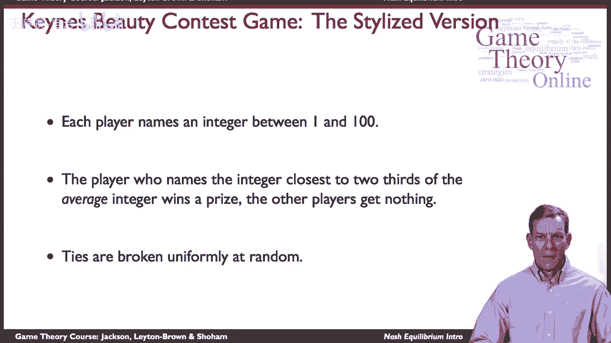

# 6：纳什均衡导论 🎯

在本节课中，我们将学习博弈论中最核心的解概念之一——**纳什均衡**。我们将从一个著名的思想实验“凯恩斯选美比赛”入手，理解为什么在策略互动中，预测他人行为并据此做出最优反应是如此重要。通过本课，你将掌握纳什均衡的基本思想及其构成要素。

---

## 从凯恩斯选美比赛说起

上一节我们探讨了博弈的基本形式，本节中我们来看看一个具体的思想实验，它完美地诠释了策略互动的本质。

这个思想实验由经济学家约翰·梅纳德·凯恩斯提出，用以类比金融市场中的投资行为。设想你持有一只股票，其价格正在上涨。你开始认为股价可能被高估，存在泡沫，因此考虑卖出。你的目标是在价格达到最高点前卖出，但这需要你预测其他投资者何时会卖出。你必须思考他人对股价的看法以及他们将如何行动，然后再决定自己的最优策略。

凯恩斯将其比作一场报纸举办的选美比赛：参赛者需要猜测其他读者认为哪位女性最有吸引力，而非自己认为谁最美。这揭示了在策略环境中，**预测他人的预测**至关重要。

---

## 一个简化的游戏模型

为了将上述思想具体化，我们引入一个高度简化的游戏模型，即“猜平均数的三分之二”游戏。

以下是游戏规则：
*   **玩家**：多人同时参与。
*   **行动**：每个玩家秘密选择一个1到100之间的整数。
*   **目标**：玩家需要猜测**所有玩家所选数字的平均值**的**三分之二**。
*   **获胜**：最接近这个“目标值”（即平均值的2/3）的玩家获胜。
*   **平局**：如果多人猜中相同的最接近数字，则通过随机方式（如抛硬币）平分奖励。

那么，你会如何玩这个游戏？关键在于思考其他玩家会怎么做。

---

## 纳什均衡的核心思想

通过上面的游戏，我们已经触及了纳什均衡的两个核心成分：
1.  **预测**：形成关于其他玩家将如何行动的信念。
2.  **最优反应**：在给定这些信念的前提下，选择能使自己收益最大化的策略。

当一个策略组合满足以下条件时，它就构成了一个**纳什均衡**：在该组合下，**每一位玩家选择的策略，都是针对其他玩家当前策略的最优反应**。这意味着没有人可以通过单方面改变自己的策略而获得更好的结果。这是一种策略上的“稳定状态”。

用公式化的语言描述，在由 `n` 个玩家构成的博弈中，设 `s* = (s1*, s2*, ..., sn*)` 是一个策略组合。对于任意玩家 `i` 及其任意其他可选策略 `si‘`，如果都满足：
**Ui(si*, s*-i) ≥ Ui(si‘, s*-i)**
那么 `s*` 就是一个**纳什均衡**。其中，`Ui` 代表玩家 `i` 的收益函数，`s*-i` 代表除 `i` 之外所有其他玩家的均衡策略。

---

## 本节课总结

本节课中，我们一起学习了纳什均衡的初步概念。我们从“凯恩斯选美比赛”这一经典例子出发，理解了在策略性思考中预测他人行为的重要性。随后，我们通过一个具体的数字猜测游戏，引出了纳什均衡的定义：即一种所有参与者都选择了针对彼此策略的最优反应，从而无人愿意单方面改变的策略状态。这是分析博弈结果最基础、最重要的工具之一。