# 7：战略推理与纳什均衡 🎯

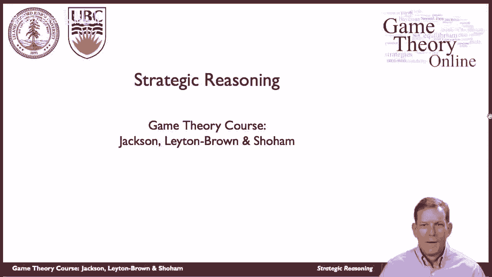

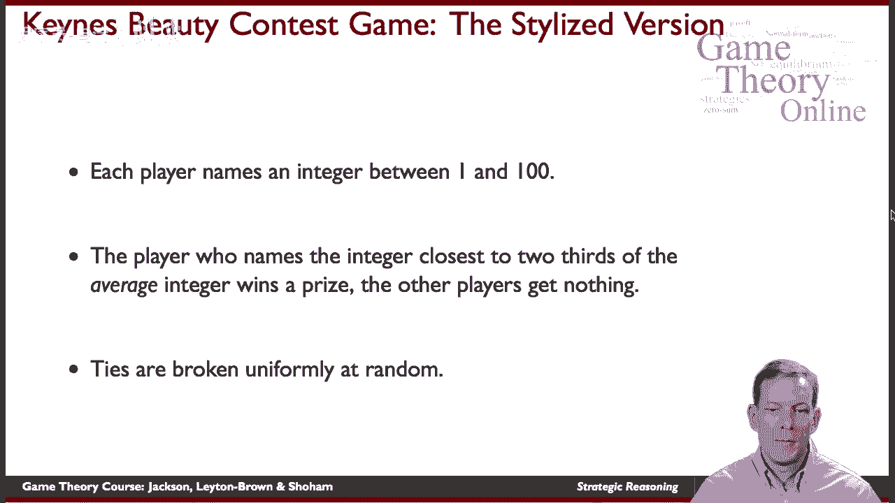

在本节课中，我们将学习博弈论中的战略推理，并深入探讨纳什均衡的概念。我们将以凯恩斯选美比赛为例，分析玩家如何做出最优决策，以及纳什均衡如何在实际游戏中体现。

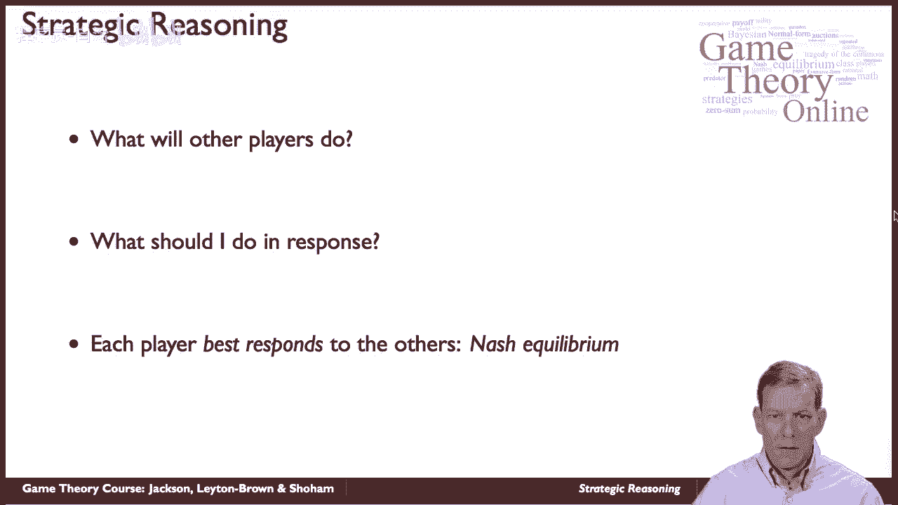

---

## 凯恩斯选美比赛游戏规则 📝

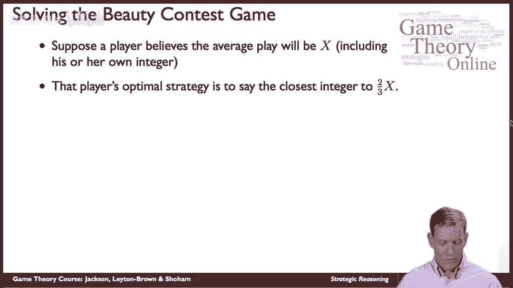

凯恩斯选美比赛是一个多人参与的博弈游戏。每个玩家需要选择一个介于1到100之间的整数。所有玩家提交数字后，系统会计算所有数字的平均值，并将该平均值乘以2/3。最接近这个结果的玩家获胜，其他玩家一无所获。如果出现平局，获胜者将被随机均匀地选出。

游戏的关键在于，玩家需要预测其他玩家的选择，并据此调整自己的策略，以最大化获胜机会。

---

## 纳什均衡的基本概念 ⚖️

纳什均衡是博弈论中的一个核心概念。在纳什均衡中，每个玩家都选择了针对其他玩家策略的最优反应。这意味着，在给定其他玩家策略的情况下，没有任何玩家可以通过单方面改变自己的策略来获得更高的收益。

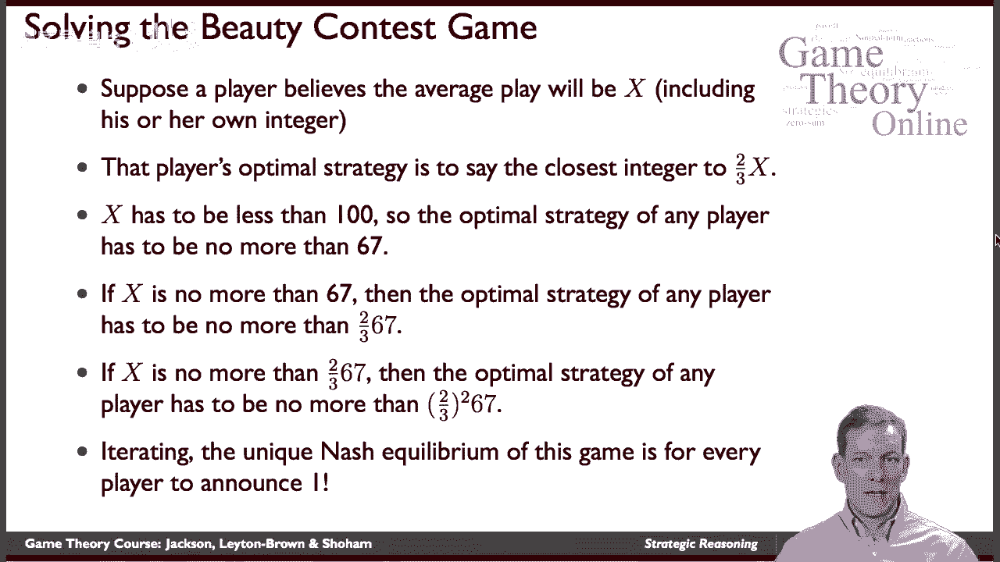

在凯恩斯选美比赛中，纳什均衡要求每个玩家的选择都是对其他玩家选择的最优反应。具体来说，如果所有玩家都选择相同的数字，并且这个数字是唯一的稳定点，那么这就是纳什均衡。

---

## 战略推理过程 🤔

在凯恩斯选美比赛中，玩家需要进行多层次的战略推理。以下是推理的基本步骤：

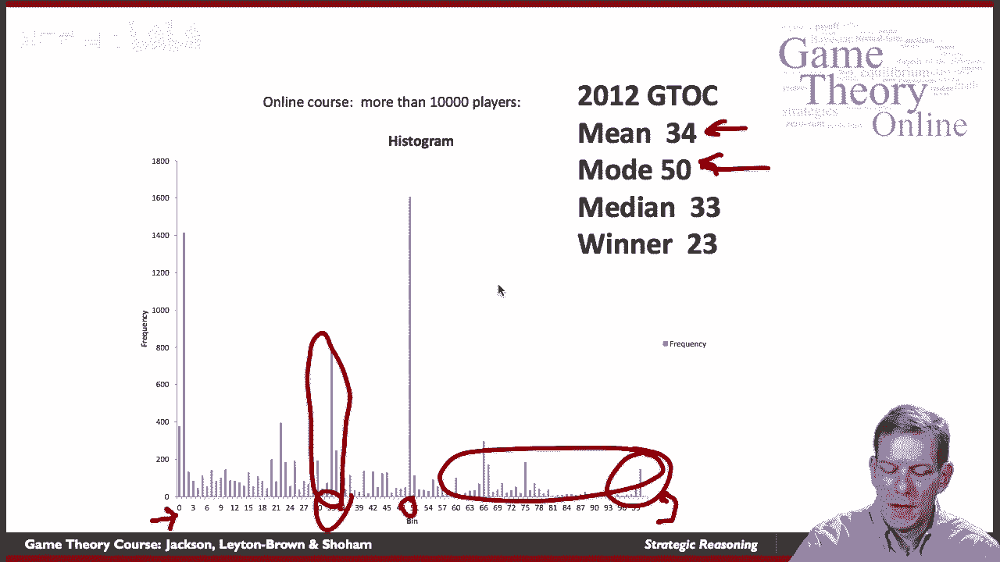

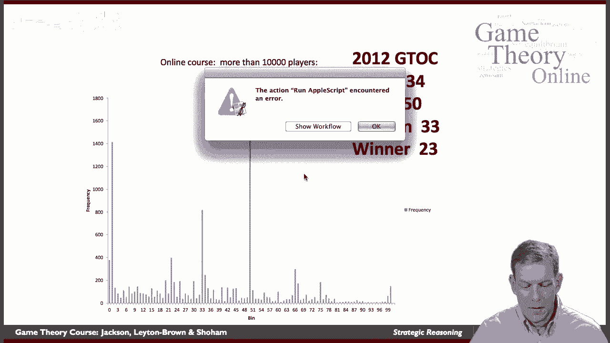

1. **初始假设**：假设所有玩家随机选择数字，平均值为某个数 \( x \)。
2. **最优反应**：根据平均值 \( x \)，玩家的最优策略是选择最接近 \( \frac{2}{3}x \) 的整数。
3. **理性推理**：如果所有玩家都是理性的，他们会意识到没有人会选择超过67的数字，因为 \( \frac{2}{3} \times 100 \approx 67 \)。
4. **迭代推理**：如果所有玩家都理解这一点，平均值 \( x \) 不会超过67，因此最优策略是选择不超过 \( \frac{2}{3} \times 67 \approx 45 \) 的数字。依此类推，最终所有玩家都会选择数字1。
5. **纳什均衡**：唯一的纳什均衡是所有玩家都选择数字1。在这种情况下，每个玩家的选择都是对其他玩家选择的最优反应。

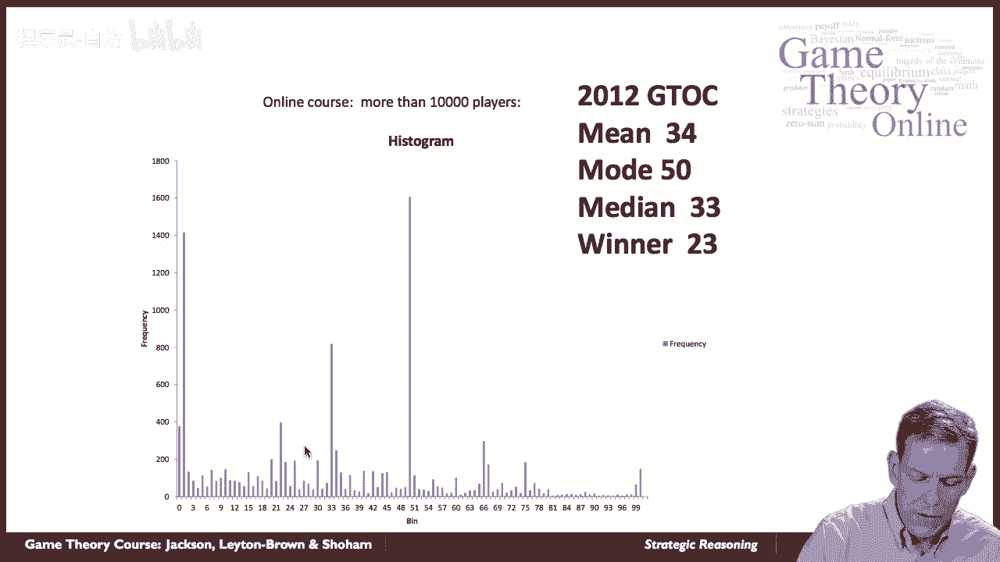

---

## 实际游戏结果分析 📊

在实际游戏中，玩家的选择往往与纳什均衡有所偏差。以下是斯坦福大学在线课程中的游戏结果分析：

- **第一轮游戏**：大多数玩家选择了50，这是最常见的数字。平均值为34，获胜数字为23。
- **第二轮游戏**：玩家们根据第一轮的结果调整策略，选择更低的数字。纳什均衡（数字1）的玩家数量显著增加。

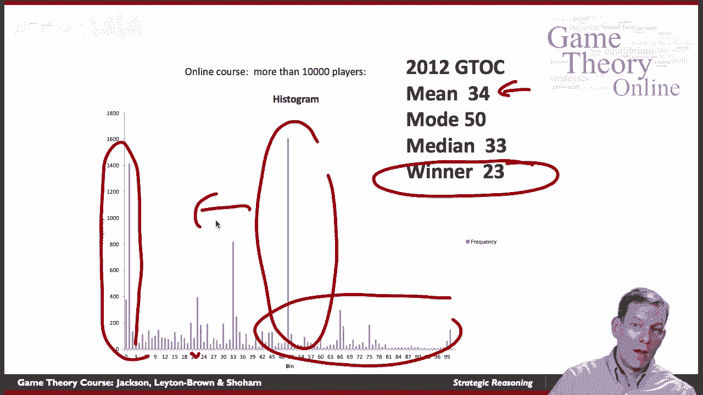

实际游戏结果表明，纳什均衡在玩家经验增加后逐渐显现。如果玩家理解游戏逻辑并多次参与，他们的选择会逐渐趋近于纳什均衡。

---

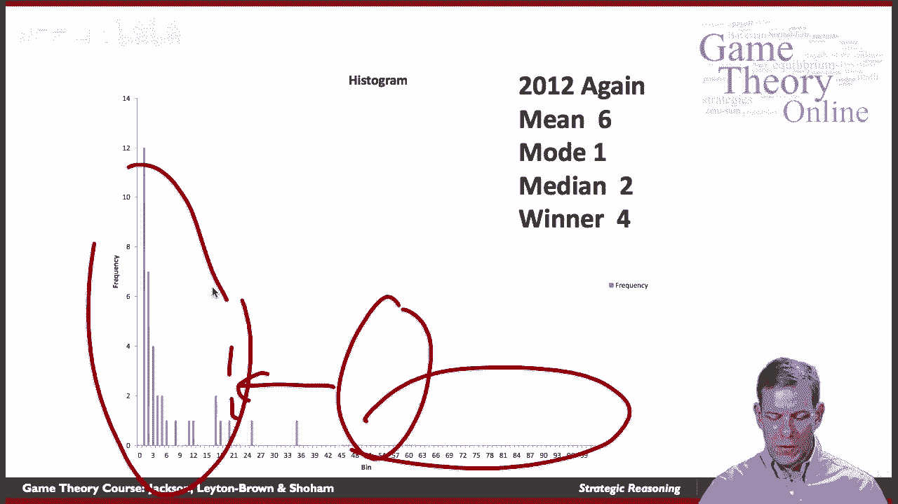

## 纳什均衡的意义与动态调整 🔄

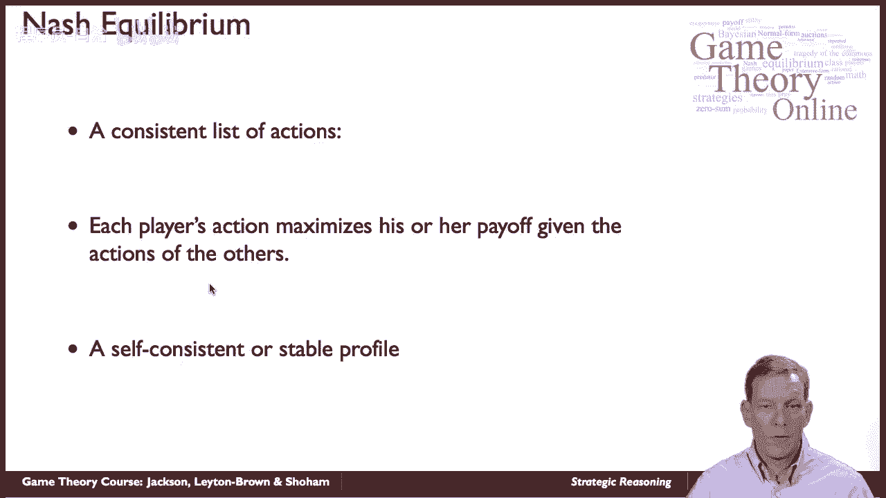

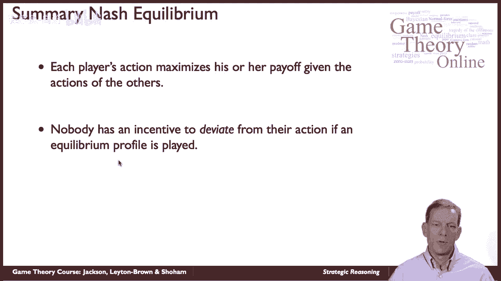

纳什均衡不仅是一个理论概念，在实际游戏中也有重要意义。以下是纳什均衡的几个关键点：

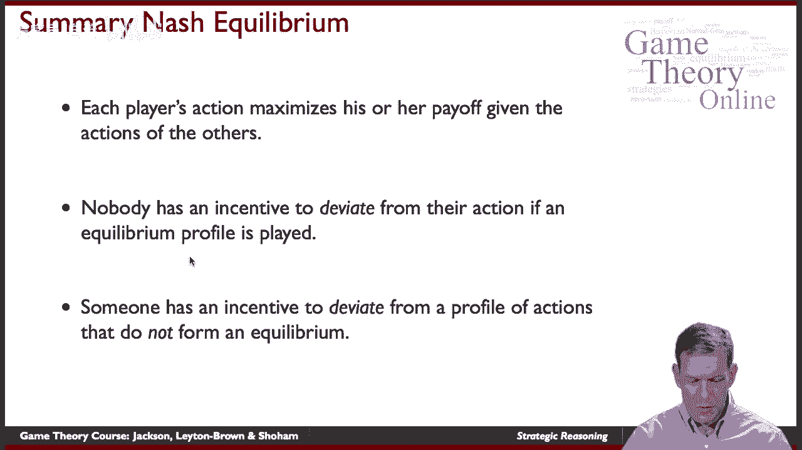

- **一致性**：在纳什均衡中，每个玩家的策略都是对其他玩家策略的最优反应，没有任何玩家有动机偏离。
- **稳定性**：如果玩家理解游戏逻辑，非均衡策略会逐渐被淘汰，玩家的选择会动态调整至均衡状态。
- **预测性**：纳什均衡可以作为预测玩家行为的工具，尤其是在玩家经验丰富或游戏重复进行的情况下。

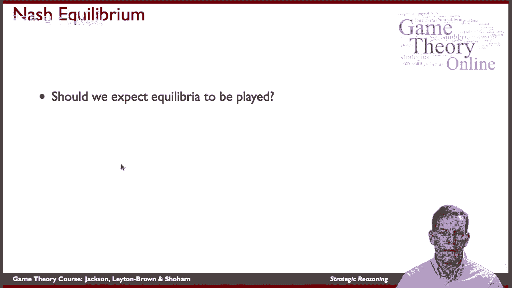

---

## 总结 📚

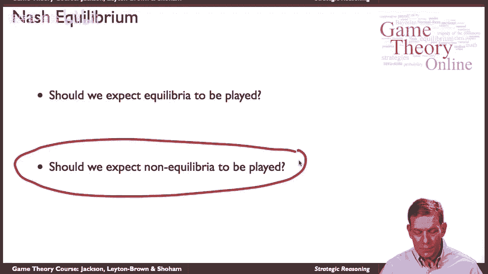

本节课中，我们一起学习了博弈论中的战略推理和纳什均衡。通过凯恩斯选美比赛的例子，我们了解了玩家如何通过多层次推理做出最优决策，以及纳什均衡如何在实际游戏中体现。纳什均衡不仅是一个理论概念，更是玩家行为预测和动态调整的重要工具。在后续课程中，我们将进一步探讨博弈论中的其他概念和实际应用。