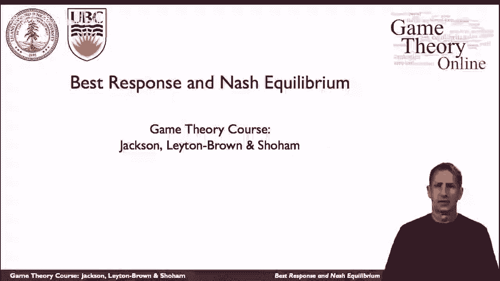
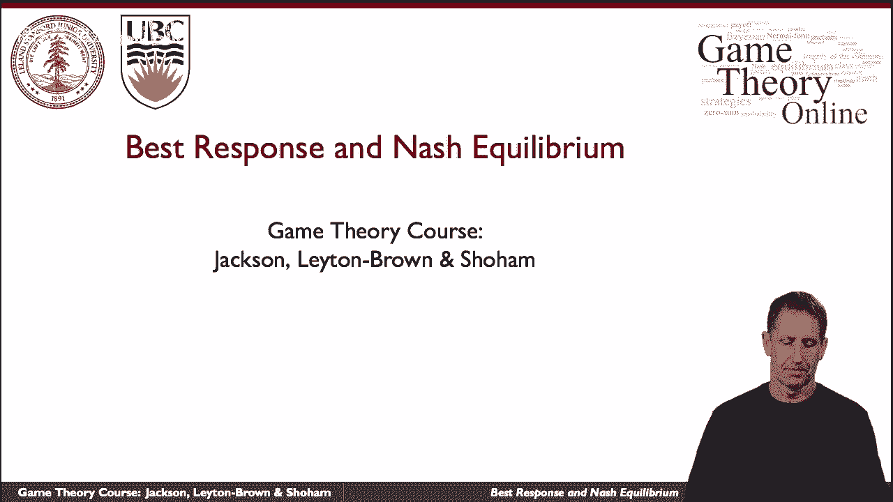
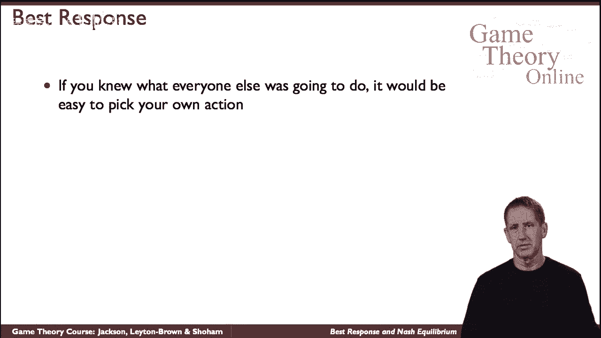
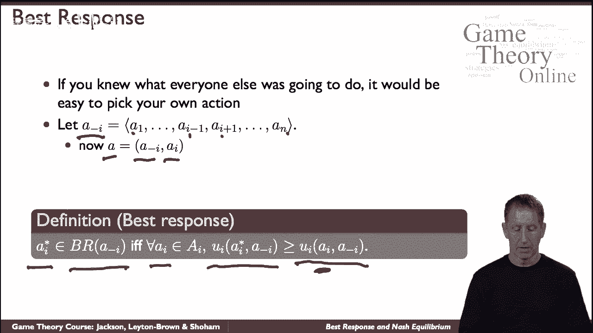
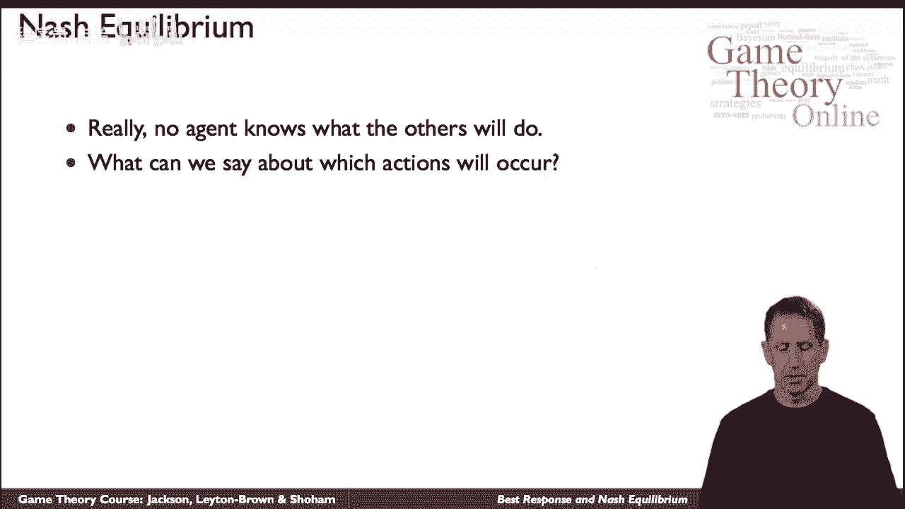
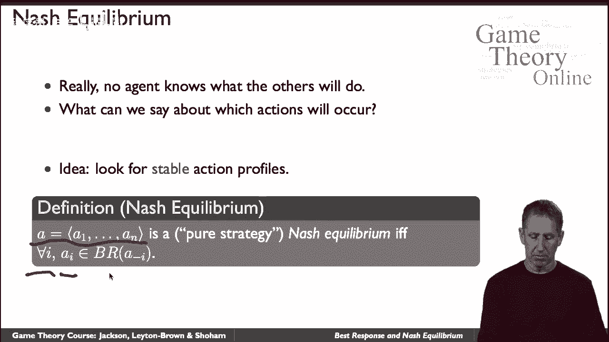

# 8：最佳对策与纳什均衡 ⚖️

在本节课中，我们将学习如何预测博弈中参与者的行为。核心概念是**最佳对策**和**纳什均衡**。我们将通过定义和例子来理解这些概念，并学习如何找到它们。

## 概述

假设你是博弈中的一名参与者。如果你知道其他所有参与者会采取什么行动，那么你就可以决定自己最好的应对策略。这个“最好的应对”就是**最佳对策**。

然而，在现实中，你通常并不知道其他人会怎么做。为了解决这个问题，我们引入**纳什均衡**的概念。纳什均衡描述了一种状态：当每个参与者选择的行动都是对其他所有人行动的最佳对策时，没有人有动机单方面改变自己的策略。本节课我们将详细探讨这两个核心概念。

## 最佳对策

上一节我们提到了在已知他人行动时选择最佳策略的想法。本节中，我们来正式定义**最佳对策**。

首先，我们需要一些符号来表示行动组合。假设有多个参与者，我们用 **a** 表示一个包含所有参与者行动的组合（即行动组合）。具体来说，**a-i** 表示除了参与者 **i** 之外所有其他参与者的行动组合。参与者 **i** 自己的行动记为 **ai**。

基于此，最佳对策的定义如下：

> 对于给定的其他参与者的行动组合 **a-i**，参与者 **i** 的行动 **ai*** 是其**最佳对策**，当且仅当：选择 **ai*** 给参与者 **i** 带来的收益（效用），不低于选择任何其他可能行动 **bi** 所带来的收益。

我们可以用公式更精确地描述。设 **Ui(ai, a-i)** 表示当参与者 **i** 采取行动 **ai**、其他人采取 **a-i** 时，参与者 **i** 获得的效用。那么，行动 **ai*** 是最佳对策的条件是：

**Ui(ai*, a-i) ≥ Ui(bi, a-i)**，对于所有可能的 **bi**。

最佳对策可能不止一个，所有满足条件的行动构成的集合，称为**最佳对策集**，记作 **BRi(a-i)**。

这个概念非常直观：在已知对手策略的前提下，你自然会选择能让自己获得最高回报的策略。

## 从最佳对策到纳什均衡

理解了最佳对策，我们就有了构建预测模型的基础。但正如开头所说，问题在于我们通常不知道其他人的行动。接下来，我们将使用最佳对策作为基石，来构建一个更强大的概念——**纳什均衡**。

纳什均衡描述了一种稳定的策略状态。在这种状态下，每个参与者的策略都是对其他参与者当前策略的**最佳对策**。因此，没有人可以通过单方面改变自己的策略而获得更高的收益。

具体定义如下：

> 一个行动组合 **a* = (a1*, a2*, ..., an*)** 是一个（纯策略）**纳什均衡**，如果对于**每一个**参与者 **i**，其所选择的行动 **ai*** 都是针对其他参与者行动 **a-i*** 的最佳对策。

换句话说，在纳什均衡点，每个人都选择了针对当前局面的最优策略，从而达到了一个“策略稳定”的状态。因为任何一个人单独改变策略，都不会让自己变得更好，所以大家都没有动机去改变。

## 总结

本节课我们一起学习了博弈论中两个核心的分析工具。

首先，我们定义了**最佳对策**：它是在已知其他参与者行动时，能使自身效用最大化的策略选择。

接着，我们利用最佳对策的概念，定义了**纳什均衡**。纳什均衡是一个策略组合，其中每个参与者的策略都是对其他参与者策略的最佳对策，从而构成一个稳定的策略状态，无人愿意单方面偏离。

理解最佳对策是寻找和分析纳什均衡的基础。在接下来的课程中，我们将学习如何在实际博弈中识别和计算纳什均衡。