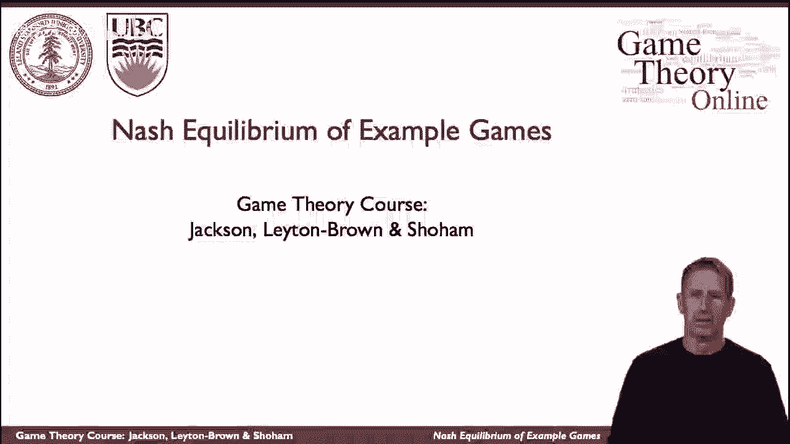
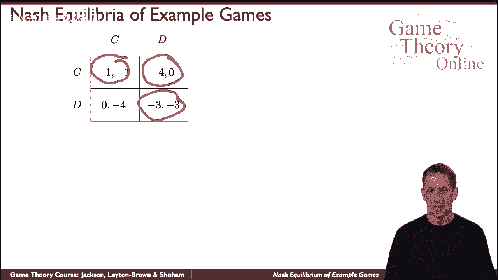
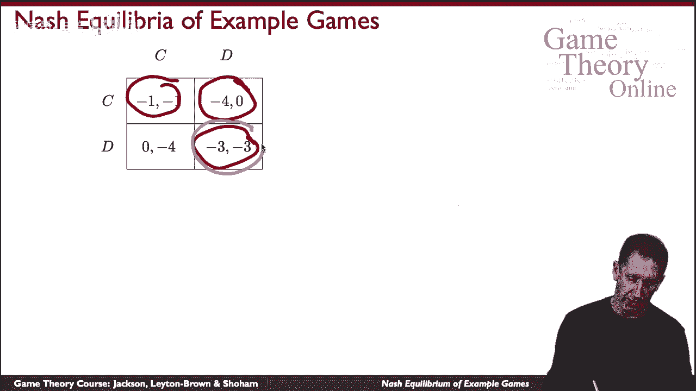
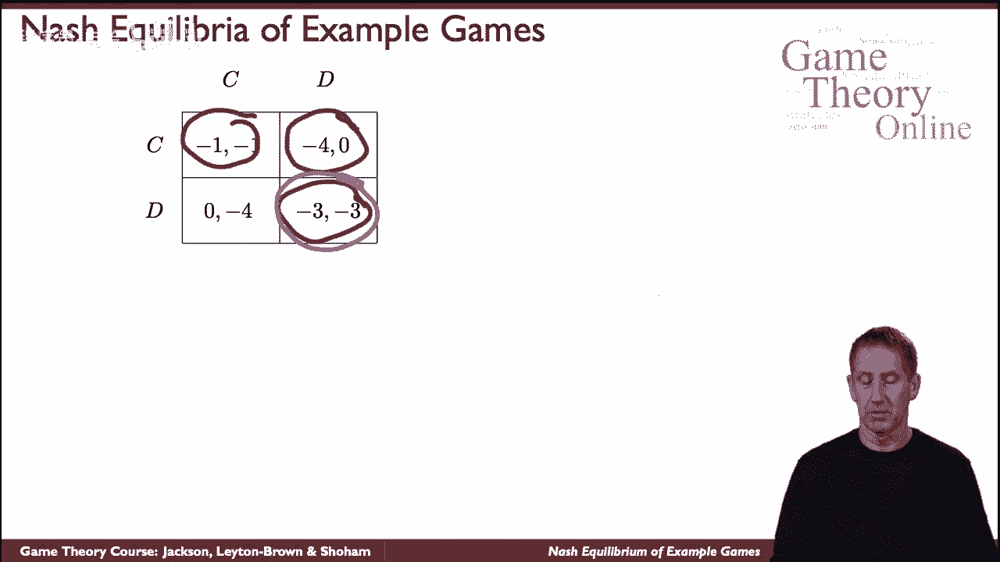
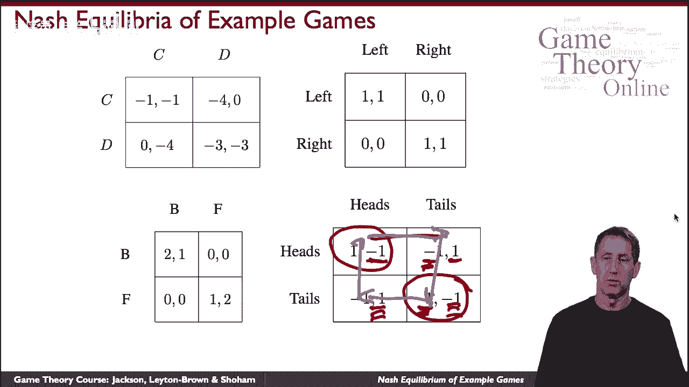

# 9：纳什均衡游戏示例 🎲

在本节课中，我们将通过几个经典游戏的例子，来具体理解纳什均衡的概念。我们将分析每个游戏的策略、收益以及其中存在的纳什均衡。

---

## 示例一：囚徒困境 ⛓️

上一节我们介绍了纳什均衡的定义，本节中我们来看看它在具体游戏中的应用。首先是一个熟悉的例子——囚徒困境。

在这个游戏中，两名囚犯被分别审讯。他们可以选择“合作”（保持沉默）或“叛逃”（揭发对方）。收益矩阵如下：

| 囚犯A \ 囚犯B | 合作       | 叛逃       |
| :------------ | :--------- | :--------- |
| **合作**      | (-1, -1)   | (-3, 0)    |
| **叛逃**      | (0, -3)    | (-2, -2)   |

*   `(-1, -1)`：双方都合作，各判1年。
*   `(-3, 0)` 或 `(0, -3)`：一方合作一方叛逃，合作者判3年，叛逃者释放。
*   `(-2, -2)`：双方都叛逃，各判2年。

以下是该游戏的分析：
*   对于每位玩家而言，“叛逃”是一个**优势策略**。无论对方选择什么，自己选择“叛逃”的收益（0或-2）总是优于选择“合作”的收益（-1或-3）。
*   因此，双方都选择“叛逃” `(叛逃， 叛逃)` 是唯一的**优势策略均衡**。
*   事实上，这也是该博弈中唯一的**纳什均衡**。因为给定对方选择“叛逃”，自己选择“叛逃”（收益-2）是最佳反应；选择“合作”的收益更差（-3）。

这个例子展示了一个具有唯一且很强的（优势策略）纳什均衡的游戏。

---

## 示例二：纯协调游戏 🚶‍♂️🚶‍♀️

接下来，我们看一个性质不同的游戏——纯协调游戏。

想象两个人在一条小路上迎面走来，他们需要决定靠左走还是靠右走以避免相撞。收益矩阵如下：

| 行人A \ 行人B | 左       | 右       |
| :------------ | :------- | :------- |
| **左**        | (1, 1)   | (0, 0)   |
| **右**        | (0, 0)   | (1, 1)   |

*   `(1, 1)`：双方选择同侧（都左或都右），顺利通过，获得收益。
*   `(0, 0)`：双方选择不同侧，发生碰撞，没有收益。

以下是该游戏的纳什均衡分析：
*   存在两个**纯策略纳什均衡**：`(左， 左)` 和 `(右， 右)`。
*   在 `(左， 左)` 均衡中，给定对方选“左”，自己选“左”是最佳反应（收益1），选“右”则收益为0。
*   在 `(右， 右)` 均衡中，逻辑相同。给定对方选“右”，自己选“右”是最佳反应。

这个例子展示了存在多个纳什均衡的游戏，且均衡结果对双方都同样有利。

---

## 示例三：性别之战 🎬

现在，我们分析一个更复杂的协调游戏——性别之战。

一对夫妇决定晚上看哪部电影：一部暴力动作片《泰坦之战》（B）或一部轻松文艺片《花的生长》（F）。丈夫更喜欢F，妻子更喜欢B，但最重要的是两人要在一起。收益矩阵如下：

| 丈夫 \ 妻子 | 选B       | 选F       |
| :---------- | :-------- | :-------- |
| **选B**     | (2, 3)    | (0, 0)    |
| **选F**     | (0, 0)    | (3, 2)    |

*   `(2, 3)`：都看B，妻子更开心（3 > 2）。
*   `(3, 2)`：都看F，丈夫更开心（3 > 2）。
*   `(0, 0)`：选择不同，各自观看，两人都不开心。

以下是该游戏的纳什均衡分析：
*   同样存在两个**纯策略纳什均衡**：`(B, B)` 和 `(F, F)`。
*   在 `(B, B)` 均衡中，给定妻子选B，丈夫选B（收益2）是最佳反应，选F则收益为0。
*   在 `(F, F)` 均衡中，给定妻子选F，丈夫选F（收益3）是最佳反应。
*   从妻子的角度分析，逻辑对称。

这个游戏表面类似纯协调游戏，但存在关键不同：在两个均衡中，双方的收益并不相等，存在偏好冲突。我们将在后续讨论混合策略时再深入探讨这个问题。

---

## 示例四：匹配硬币 🪙

最后，我们看一个没有纯策略纳什均衡的游戏——匹配硬币。

两个玩家同时出示硬币的正面（H）或反面（T）。规则是：如果两面相同（都H或都T），玩家1赢；如果两面不同，玩家2赢。这是一个零和游戏。收益矩阵如下（从玩家1视角）：

| 玩家1 \ 玩家2 | 选H       | 选T       |
| :------------ | :-------- | :-------- |
| **选H**       | (1, -1)   | (-1, 1)   |
| **选T**       | (-1, 1)   | (1, -1)   |

*   `(1, -1)`：两面相同，玩家1得1分，玩家2失1分。
*   `(-1, 1)`：两面不同，玩家1失1分，玩家2得1分。

以下是该游戏的纯策略分析：
*   假设玩家1选H，玩家2的最佳反应是选T（得1分 > 失1分）。
*   如果玩家2选T，那么玩家1的最佳反应变为选T（得1分 > 失1分）。
*   如果玩家1选T，玩家2的最佳反应又变为选H（得1分）。
*   如果玩家2选H，玩家1的最佳反应又变回选H（得1分）。

我们可以看到，最佳反应构成了一个循环：`(H, T) -> (T, T) -> (T, H) -> (H, H) -> (H, T)...`。在这个循环中，没有任何一个策略组合能稳定下来，使得双方都不愿单独改变策略。因此，**该游戏不存在纯策略纳什均衡**。要找到它的均衡，需要引入**混合策略**的概念，这将是后续课程的内容。

---

## 总结 📝

本节课中，我们一起学习了纳什均衡在几个经典游戏中的应用：
1.  **囚徒困境**：存在唯一的、也是优势策略的纳什均衡（叛逃，叛逃）。
2.  **纯协调游戏**：存在多个对双方都同样有利的纯策略纳什均衡（如都左或都右）。
3.  **性别之战**：存在多个纯策略纳什均衡，但在不同均衡中玩家的收益不同，体现了协调中的偏好冲突。
4.  **匹配硬币**：不存在纯策略纳什均衡，最佳反应构成循环。

这些例子展示了纳什均衡的多样性：它可能是唯一的，也可能是多重的；可能对应优势策略，也可能需要精妙配合；甚至在某些游戏中，根本不存在纯策略意义上的纳什均衡。理解这些基础模型，是分析更复杂博弈情境的关键。