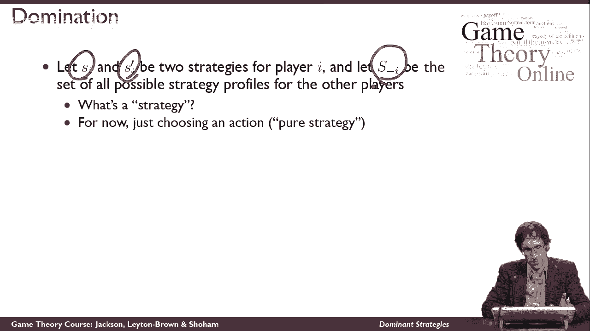
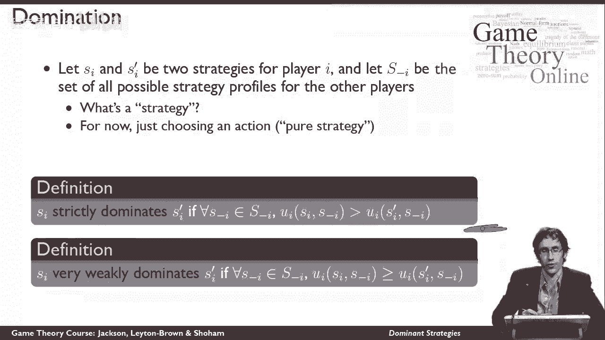
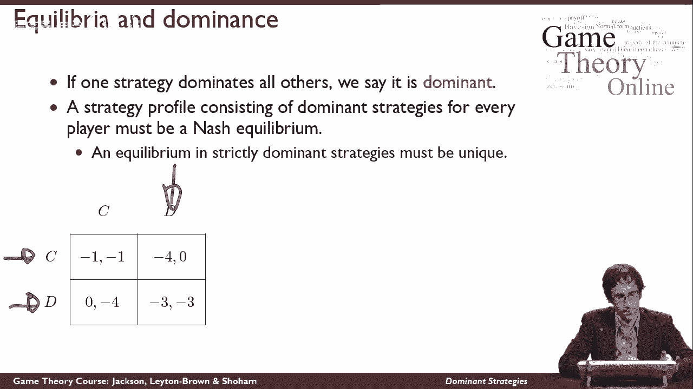

# 10：占优策略 🎯

在本节课中，我们将学习博弈论中的一个核心概念——**占优策略**。我们将了解什么是策略，以及如何判断一个策略是否“优于”另一个策略。理解占优策略是分析博弈和预测参与者行为的关键第一步。

---

## 策略的定义

首先，我们需要明确“策略”这个词的含义。在本课程中，当我们提到“策略”时，它指的是参与者在博弈中可以选择的**一个具体行动**。

> 目前，你可以将“策略”简单地理解为**行动的选择**。我们这里讨论的是“纯策略”。虽然未来会接触到其他类型的策略（例如混合策略），但本节课的所有概念同样适用于它们，现在你只需关注行动选择本身。

---

## 占优策略的概念

理解了策略的含义后，我们现在来探讨“占优”的概念。当一个策略在任何情况下都比另一个策略带来更好或至少不差的结果时，我们就说这个策略“占优”于另一个。

为了精确描述，我们引入两个定义：**严格占优**和**弱占优**。

### 严格占优

假设参与者 `i` 有两个不同的策略：`s_i` 和 `s'_i`。用 `S_{-i}` 表示所有其他参与者可能采取的策略组合的集合。

**定义**：如果对于其他参与者的**每一个**可能的策略组合 `s_{-i} ∈ S_{-i}`，参与者 `i` 选择策略 `s_i` 所获得的效用 **严格大于** 选择策略 `s'_i` 所获得的效用，那么我们就说策略 `s_i` **严格占优**于策略 `s'_i`。

用公式表示即：
> 对于所有 `s_{-i} ∈ S_{-i}`，都有 `u_i(s_i, s_{-i}) > u_i(s'_i, s_{-i})`

这意味着，无论其他参与者怎么做，选择 `s_i` 总是比选择 `s'_i` 让参与者 `i` 更满意。

### 弱占优

弱占优的条件比严格占优稍弱一些。

**定义**：如果对于其他参与者的**每一个**可能的策略组合 `s_{-i} ∈ S_{-i}`，参与者 `i` 选择策略 `s_i` 所获得的效用 **大于或等于** 选择策略 `s'_i` 所获得的效用，那么我们就说策略 `s_i` **弱占优**于策略 `s'_i`。

用公式表示即：
> 对于所有 `s_{-i} ∈ S_{-i}`，都有 `u_i(s_i, s_{-i}) ≥ u_i(s'_i, s_{-i})`

注意，这个定义允许相等的情况。即使两个策略在某些情况下带来完全相同的效用，`s_i` 仍然被认为弱占优于 `s'_i`。因此，我们称其为“非常弱”的占优。

> 在这两种占优概念之间，还存在其他强度的占优定义，但本节课我们聚焦于这两个核心概念。

---

## 占优策略的重要性

理解了占优的定义后，我们来看看为什么这个概念如此重要。

占优的**直觉**在于：如果一个策略 `s_i` 占优于另一个策略 `s'_i`，那么参与者 `i` 在决策时就**无需考虑其他参与者会怎么做**。因为他知道，选择 `s_i` 的效用永远不会比选择 `s'_i` 更差。

这个概念可以进一步强化。如果一个策略占优于参与者的**所有其他可能策略**，那么这个策略就是他的**占优策略**。拥有占优策略极大地简化了决策过程：

*   参与者无需猜测或分析对手的行为。
*   他只需选择自己的占优策略，这就是他能做的最好的事情。

---

## 占优策略与纳什均衡

上一节我们介绍了占优策略如何简化个人决策，本节我们来看看它与整个博弈的平衡状态——**纳什均衡**——有何联系。

我们可以得出一个重要结论：**如果在一个博弈中，每个参与者都选择自己的（弱或严格）占优策略，那么由此构成的策略组合必然是一个纳什均衡。**

**原因如下**：在纳什均衡中，没有参与者愿意单方面改变自己的策略。既然每个人都在玩自己的占优策略，那么对于任何参与者来说，改变策略（即选择非占优策略）都不会带来更好的结果，因此没有人有动机改变。

此外，如果每个参与者都有**严格占优**策略，那么这个纳什均衡**一定是唯一**的。因为严格占优意味着其他任何策略都严格更差，不可能存在另一个所有人都满意的策略组合。

---

## 实例分析：囚徒困境

理论需要结合实际。现在，我们以经典的“囚徒困境”博弈为例，来看看占优策略是如何起作用的。

以下是囚徒困境的收益矩阵（玩家1为行，玩家2为列，收益格式为 (玩家1收益， 玩家2收益)）：

|          | 玩家2: 合作(C) | 玩家2: 背叛(D) |
| :------- | :------------: | :------------: |
| 玩家1: 合作(C) |     (-1, -1)     |     (-4, 0)     |
| 玩家1: 背叛(D) |     (0, -4)     |     (-3, -3)    |

我们将证明，对于玩家1来说，策略 **D（背叛）** 是一个**严格占优策略**。

**证明方法：案例分析**
我们需要检查，无论玩家2选择什么，玩家1选择D的收益是否总是严格大于选择C的收益。

以下是具体的分析步骤：

1.  **情况一：假设玩家2选择合作(C)**
    *   此时玩家1面临第一列。
    *   若玩家1选C，收益为 -1。
    *   若玩家1选D，收益为 0。
    *   因为 0 > -1，所以在此情况下，玩家1**严格偏好**于选D。

2.  **情况二：假设玩家2选择背叛(D)**
    *   此时玩家1面临第二列。
    *   若玩家1选C，收益为 -4。
    *   若玩家1选D，收益为 -3。
    *   因为 -3 > -4，所以在此情况下，玩家1也**严格偏好**于选D。

**结论**：无论玩家2选择合作(C)还是背叛(D)，玩家1选择背叛(D)的收益都严格高于选择合作(C)。因此，策略D严格占优于策略C。由于玩家1只有这两个策略，所以D就是他的严格占优策略。

基于博弈的对称性，同样的分析也适用于玩家2，策略D同样是玩家2的严格占优策略。

因此，在囚徒困境中，(D, D) 是唯一的纳什均衡，也是由双方严格占优策略构成的策略组合。

---

## 总结

本节课我们一起学习了博弈论中的核心概念——**占优策略**。

我们首先明确了“策略”即行动选择。然后，我们深入探讨了两种占优关系：**严格占优**（在任何情况下都更好）和**弱占优**（在任何情况下都不更差）。占优策略的重要性在于它能简化决策，让参与者无需顾虑对手行为。我们进一步了解到，当所有参与者都选择占优策略时，其结果必然构成一个**纳什均衡**；若占优策略是严格的，则该均衡唯一。最后，我们通过**囚徒困境**的实例，具体演练了如何识别和分析占优策略。

理解占优策略是分析更复杂博弈的坚实基础。