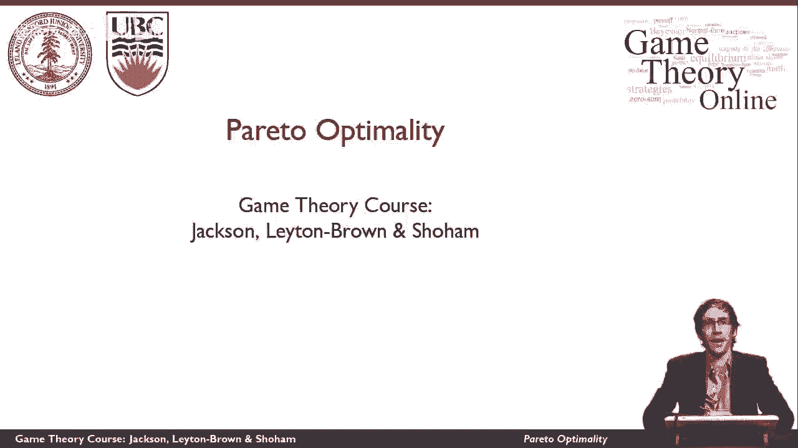
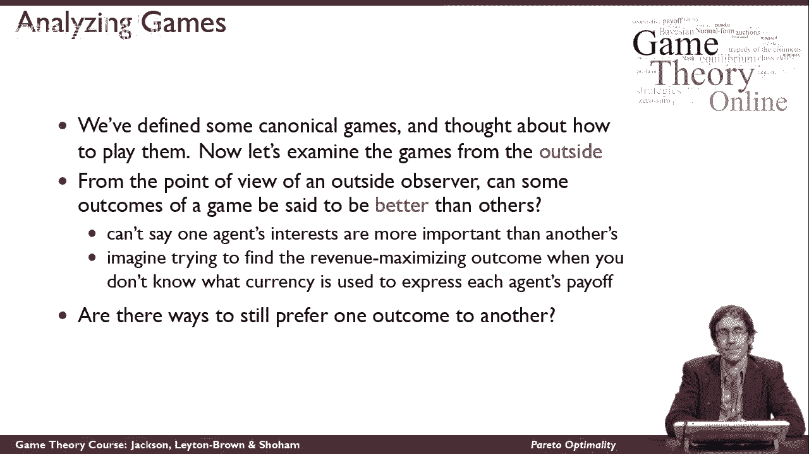
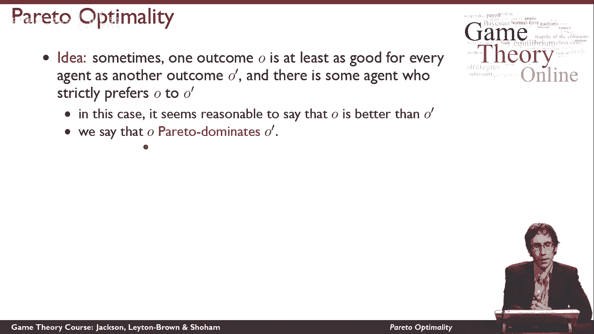
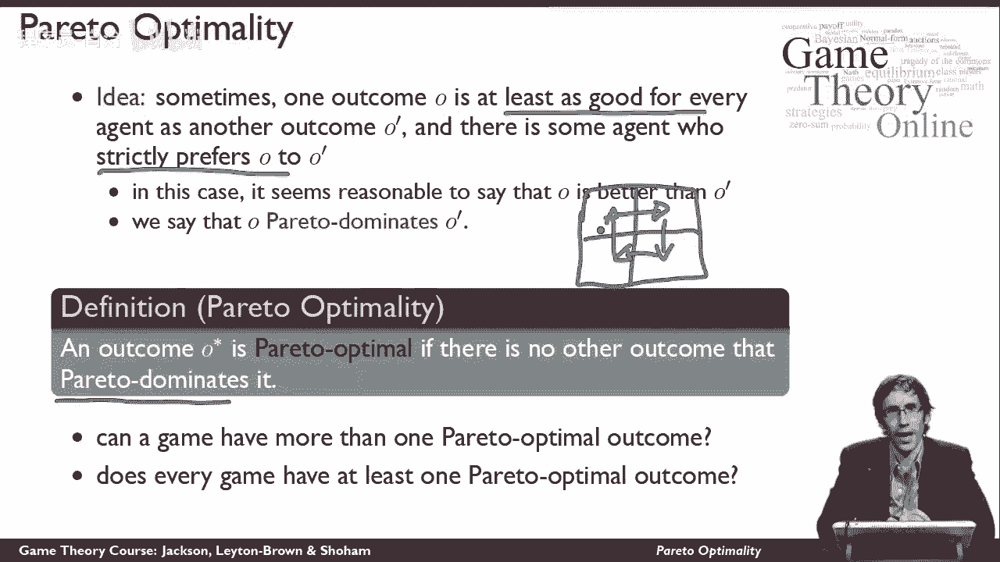
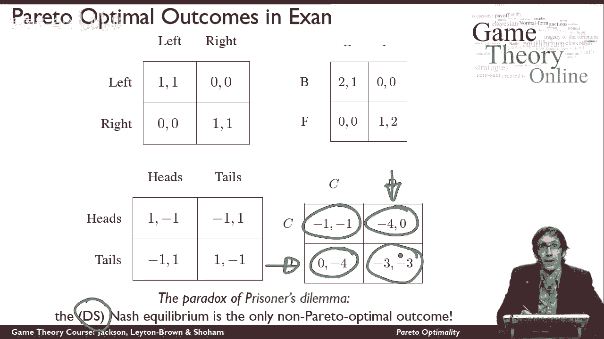

# 11：帕累托最优 ⚖️

在本节课中，我们将学习一个从外部观察者角度评估博弈结果的重要概念——**帕累托最优性**。我们将理解如何判断一个博弈结果是否“更好”，以及这个概念与纳什均衡等策略的关系。

---

## 概述：从外部视角看博弈

到目前为止，我们主要从玩家的角度思考博弈，分析如何行动才是“正确”的。现在，我们将退一步，从一个外部观察者的视角来审视博弈。我们想探讨的问题是：**是否存在一种方式，可以说某些博弈结果比其他结果“更好”？**

在思考这个问题时，我们面临一个核心限制：**我们不能比较不同玩家的利益重要性**，甚至不知道他们效用的衡量尺度是否相同。这就像试图最大化回报，但回报是用不同货币支付的，而我们不知道汇率。

那么，有没有一种方法可以识别出我们更偏好的结果呢？

---

## 帕累托支配：定义“更好”的结果

以下是判断一个结果是否“更好”的方法。虽然不能在所有情况下都适用，但在特定条件下是可行的。

**帕累托支配**的定义是：如果一个结果 **O** 至少对**所有**玩家来说都和另一个结果 **O'** 一样好，并且**至少有一个**玩家**严格**偏好 **O** 胜过 **O'**，那么我们就说结果 **O** **帕累托支配** 结果 **O'**。

用公式化的语言描述：
> 对于所有玩家 i，有 **U_i(O) ≥ U_i(O')**，并且至少存在一个玩家 j，使得 **U_j(O) > U_j(O')**。

**举例说明**：
*   结果 O：玩家1获得7个效用单位，玩家2获得8个效用单位。
*   结果 O‘：玩家1获得7个效用单位，玩家2获得2个效用单位。

在这个例子中，O 对玩家1来说一样好（都是7），但对玩家2来说**严格更好**（8 > 2）。因此，外部观察者有理由认为结果 **O 比 O' 更好**，即 **O 帕累托支配 O'**。

---

## 帕累托最优：定义“最好”的结果

理解了“更好”，我们就可以定义什么是“最好”的结果。

**帕累托最优**的定义是：一个结果 **O*** 被称为**帕累托最优**，当且仅当它**不被任何其他结果帕累托支配**。

换句话说，不存在另一个结果能让至少一个人变得更好，同时不让任何人变得更差。帕累托最优结果代表了资源配置的一种“效率”状态，无法在不损害他人利益的情况下使任何人的境况变得更好。

---

## 理解帕累托最优：关键问题

为了加深理解，我们来探讨几个关于帕累托最优性的关键问题。

**1. 一个博弈是否可能有多个帕累托最优结果？**
答案是**肯定**的。两种结果可能无法相互支配。例如，在一个所有玩家在任何结果下都获得相同回报的博弈中，没有任何结果能支配其他结果，因此所有结果都是帕累托最优的。

**2. 每个博弈是否都至少有一个帕累托最优结果？**
答案是**肯定**的。每个博弈都至少有一个帕累托最优结果。原因在于，帕累托支配关系**不可能形成循环**。根据定义，支配关系要求至少有一个玩家严格偏好前者，这阻止了“A支配B，B支配C，C又支配A”这种循环的出现。因此，博弈中必然存在至少一个不被任何结果支配的“终点”，即帕累托最优结果。

---

## 经典博弈中的帕累托最优分析

现在，让我们将这个概念应用到几个熟悉的博弈中，看看它们的帕累托最优结果是什么。

以下是几个经典博弈的分析：

*   **协调博弈**：两个（玩家选择相同行动的）结果都是帕累托最优的。
*   **性别之战**：两个（玩家协调成功的）结果也都是帕累托最优的。
*   **匹配便士**：这个博弈有点特殊。**每一个结果都是帕累托最优的**。因为这是一个零和博弈，一个玩家效用的增加必然意味着另一个玩家效用的减少，不存在一个让双方都至少不变好、且有人严格变好的其他结果。
*   **囚徒困境**：这是最引人深思的例子。在这个博弈中，**除了相互背叛的结果外，其他结果都是帕累托最优的**。相互背叛的结果被相互合作的结果所帕累托支配（因为双方合作时，每个人的收益都更高）。

---

## 核心洞见：囚徒困境的困境所在

上一节我们分析了各个博弈的帕累托最优性。现在，让我们聚焦于囚徒困境，它揭示了一个深刻的矛盾。

囚徒困境的**纳什均衡**（也是**占优策略均衡**）是双方都选择“背叛”。从策略分析上看，这是每个理性个体最应该采取的行动。

然而，从社会整体（外部观察者）的帕累托效率角度看，这个**唯一的纳什均衡结果，恰恰是游戏中唯一一个非帕累托最优的结果**。游戏中几乎所有其他结果（尤其是双方合作）都“更好”，但个体理性却将玩家们引向了那个对集体而言“更差”的结果。

这就是**囚徒困境**被称为“困境”的根本原因：个体理性与集体理性（或社会效率）之间存在着直接的冲突。

---

## 总结

本节课中，我们一起学习了**帕累托最优性**这一核心概念。

*   我们首先学会了如何从一个外部观察者的视角，使用**帕累托支配**来比较两个结果的优劣。
*   接着，我们定义了**帕累托最优**结果，即那些无法在不损害他人利益的前提下进一步改进的结果。
*   我们探讨了帕累托最优的存在性和多重性，并分析了多个经典博弈中的帕累托最优结果。
*   最后，通过对**囚徒困境**的深入分析，我们深刻理解了**纳什均衡（个体理性）与帕累托最优（集体效率）之间可能存在的矛盾**，这是博弈论解释许多社会现象的关键所在。