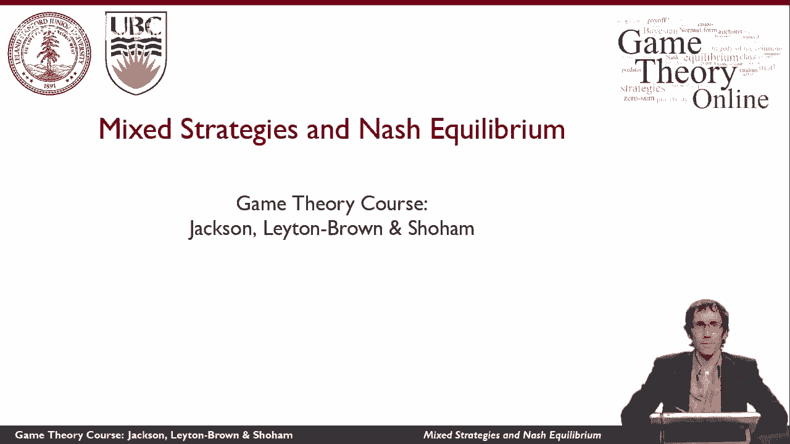

# 12：混合策略与纳什均衡 (I) 🎲

在本节课中，我们将要学习博弈论中的一个核心概念——**混合策略**。我们将通过一个具体的例子来理解为什么在纳什均衡中，参与者有时需要随机化自己的选择，而不是采取确定的行动。

---

上一段我们提到了博弈中确定性策略可能带来的问题。本节中，我们来看看一个具体的现实世界例子，以理解混合策略的必要性。

考虑联合国在道路上设置检查站的情景。他们需要拦截车辆，检查是否携带爆炸物等危险物品。

我们可以将这种情况建模为一个博弈。其中：
*   **防守方（联合国）** 可以选择在特定道路上设置检查站。
*   **攻击方（潜在袭击者）** 可以选择攻击哪条道路。

博弈的收益结构如下：
*   如果攻击方攻击的道路恰好有防守方设防，则攻击失败并被捕获，攻击方获得**很大的负收益**。
*   如果攻击方攻击的道路没有防守，则攻击成功，攻击方获得**正的收益**，其大小取决于目标的价值。

显然，如果防守方（联合国）采取一个**确定的、可预测的策略**（例如，总是守卫同一条路），那么攻击方只需稍作观察，就能发现规律并攻击其他道路，从而确保攻击总是成功。这对防守方极为不利。

因此，在实际操作中，检查站的设置并非确定不变。真正发生的情况是，检查站以**随机的方式**设置。这样，即使攻击方长期观察并弄清了随机策略的概率分布，他们在任何特定时刻也无法确切知道检查站的具体位置，从而限制了攻击的价值。

所以，在这类博弈的纳什均衡中，防守方的最佳策略是以某种**随机的方式**进行防守。这种随机选择的策略就被称为**混合策略**。

---

本节课中我们一起学习了混合策略的基本思想。我们通过联合国检查站的例子，说明了当参与者采取确定性策略容易被对手利用时，随机化自己的行动（即采用混合策略）可以成为一种有效的均衡策略。在后续课程中，我们将进一步探讨如何求解混合策略纳什均衡。