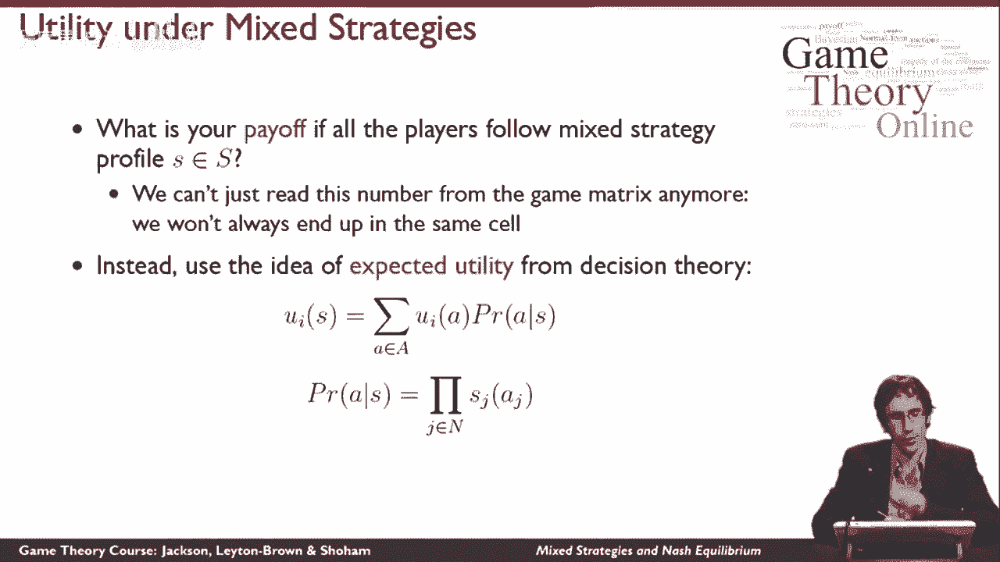
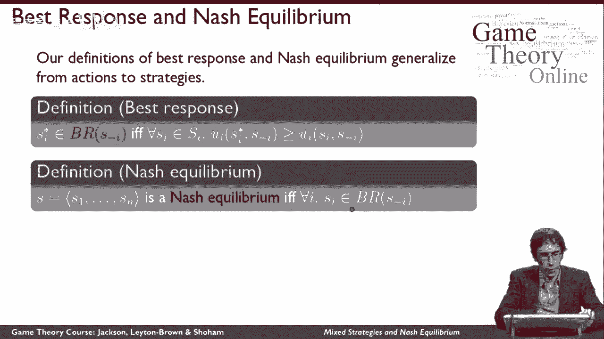
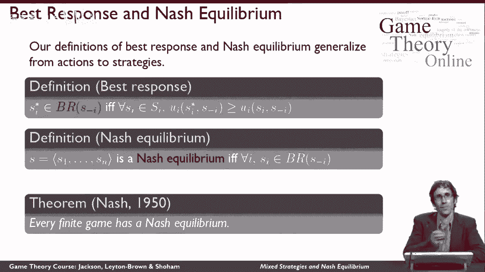
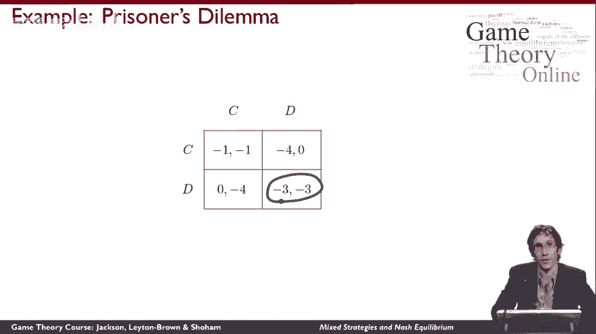

# 13：混合策略与纳什均衡(II) 🎲

在本节课中，我们将学习混合策略的概念，并将之前学习的纳什均衡定义扩展到包含混合策略的新框架中。我们将从分析“配对便士”游戏开始，理解为何需要引入随机化，并学习如何计算混合策略下的期望效用。最后，我们将介绍纳什的著名定理，并通过实例巩固对混合策略纳什均衡的理解。

---

## 从“配对便士”游戏引入混合策略 🔄

上一节我们讨论了纯策略下的纳什均衡。本节中，我们来看看当纯策略无法达到稳定状态时，玩家可以如何选择。

让我们从“配对便士”游戏开始。回忆一下，在这个游戏中，采用任何确定的纯策略都是一个糟糕的主意。例如，如果玩家2选择“人头”，那么玩家1会想选择“人头”以获得回报1。这意味着玩家2更愿意换成“尾巴”以获得回报1。接着，玩家1又更愿意换成“尾巴”以获得回报1。然后玩家2又更愿意换回“人头”以获得回报1。最终，玩家1也更愿意换回“人头”，回到了我们开始的地方。

可以看到，这里存在一个循环，我们只是在游戏矩阵的不同单元格之间跳来跳去。本质上，没有一对确定的纯策略对双方都有效。

那么，什么对双方有效呢？从本质上说，玩家通过随机选择来迷惑对方是有意义的。直觉上，与其承诺玩“人头”或“尾巴”，不如说“我要掷硬币，出现哪一面就玩哪一面”。让我们试着将这个想法正式化。

---

## 正式定义混合策略与期望效用 📊

在我们讨论纯策略时，我们将其等同于执行某个动作。现在，让我们从概率分布的角度来思考。

假设代理的策略是其在可用动作集上的**任何概率分布**。纯策略是只给一个动作赋予正概率（即为1）的特例。**混合策略**则是给多个不同的动作赋予正概率。在“配对便士”的例子中，当我抛硬币时，“人头”和“尾巴”都获得了正概率，它们构成了我混合策略的**支持集**。

我将代理 *i* 的所有策略集合记为 **Σᵢ**。所有策略组合的集合 **Σ** 则是不同代理策略集的笛卡尔积。

现在面临一个问题：我已经扩展了策略的定义（成为所有概率分布的无限集合），但我只有针对具体**动作组合**的效用定义。当玩家执行混合策略时，结果不是确定的，因此无法直接从收益矩阵中读取一个数字来代表玩家的满意度。

为了解决这个问题，我们需要基于**期望效用**的思想来扩展效用的定义。以下是其数学表达：

对于给定的混合策略组合 **σ ∈ Σ**，玩家 *i* 的效用 **uᵢ(σ)** 定义为：

```
uᵢ(σ) = ∑_{a∈A} [ P(a | σ) * uᵢ(a) ]
```

其中：
*   **A** 是所有可能动作组合的集合（即收益矩阵的所有单元格）。
*   **uᵢ(a)** 是玩家 *i* 在动作组合 **a** 发生时的收益。
*   **P(a | σ)** 是在给定策略组合 **σ** 下，动作组合 **a** 发生的概率。

动作组合 **a = (a₁, a₂, ..., aₙ)** 发生的概率是每个玩家独立地按其策略选择相应动作的概率的乘积：



```
P(a | σ) = ∏_{j=1}^{n} σⱼ(aⱼ)
```

例如，在“配对便士”中，如果两个玩家都以0.5的概率选择“人头”，那么出现（人头，人头）这个动作组合的概率就是 0.5 * 0.5 = 0.25。

**总结**：在混合策略组合下的效用，是玩家在所有可能动作组合上的期望收益，并按该动作组合实际出现的概率进行加权。

---

## 混合策略下的最佳反应与纳什均衡 ⚖️

上一节我们定义了期望效用。本节中，我们利用这个新定义，重新审视最佳反应和纳什均衡的概念。

其工作方式与纯策略情况完全相同，只是将行动（A）替换为策略（Σ）。概念上，如果你理解了在纯动作下的含义，那么一切照旧。

*   **最佳反应**：策略 **σᵢ*** 是对其他玩家策略组合 **σ₋ᵢ** 的**最佳反应集合**中的一个元素，当且仅当对于玩家 *i* 所有其他可能的策略 **σᵢ‘ ∈ Σᵢ**，都有：

    ```
    uᵢ(σᵢ*, σ₋ᵢ) ≥ uᵢ(σᵢ‘, σ₋ᵢ)
    ```

    注意，这里使用了集合属于符号（∈），因为最佳反应可能不止一个。**σᵢ*** 只需要是“最好的之一”。

*   **纳什均衡**：一个策略组合 **σ = (σ₁, σ₂, ..., σₙ)** 是一个**纳什均衡**，如果对于每一个代理 *i*，其所选择的策略 **σᵢ** 都是对其他玩家策略 **σ₋ᵢ** 的最佳反应。

    即，在均衡中，每个玩家都在针对他人的策略玩自己最好的策略之一，没有人有单方面偏离的动机。



---

## 纳什定理：均衡的存在性 🏆

基于混合策略的纳什均衡新定义，我们现在可以陈述一个至关重要的定理，这也是纳什获得诺贝尔奖的主要原因之一。

**纳什定理**：每一个**有限博弈**都至少有一个**纳什均衡**（可能是混合策略的）。

*   **有限博弈**指的是具有有限数量玩家和每个玩家有有限数量动作的博弈（因此也有有限数量的收益值）。

这个定理的意义非常深刻。它表明，无论博弈的收益结构多么复杂，无论它模拟何种现实互动，**总存在至少一个稳定的策略组合**，使得所有玩家在知道他人策略的情况下，都不想改变自己的策略。这解释了为什么纳什均衡是博弈论中如此核心和强大的分析工具。

请注意，这个保证性的定理只适用于我们刚刚定义的、包含混合策略的纳什均衡。对于我们之前讨论的、仅限于纯策略的“纯策略纳什均衡”，并没有这样的存在性定理。

---

## 实例分析 🧩

上一节我们学习了理论，现在通过几个经典例子来加深理解。



以下是几个博弈的收益矩阵和其纳什均衡分析：

**1. 配对便士**
*   **收益矩阵**：
    ```
            Player 2
            Heads    Tails
    Player1 +1,-1    -1,+1 (Heads)
            -1,+1    +1,-1 (Tails)
    ```
*   **分析**：如前所述，该博弈没有纯策略纳什均衡。但其混合策略纳什均衡是：**两个玩家都以0.5的概率随机选择“人头”或“尾巴”**。这是由于收益的对称性导致的。

**2. 协调博弈**
*   **收益矩阵**：
    ```
            Player 2
            Left     Right
    Player1  2,2      0,0 (Left)
             0,0      1,1 (Right)
    ```
*   **分析**：这个博弈有两个纯策略纳什均衡：(Left, Left) 和 (Right, Right)。此外，它还有一个**混合策略纳什均衡**：两个玩家都以概率 (2/3, 1/3) 随机选择 (Left, Right)。可以验证，当对手以此概率混合时，自己选择任何策略的期望收益都相等，因此没有偏离的动机。虽然这个均衡的期望收益（2/3）不如(Left, Left)好，但它确实是一个稳定的策略组合。

**3. 囚徒困境**
*   **收益矩阵**：
    ```
            Player 2
            Cooperate  Defect
    Player1   -1,-1     -3,0 (Cooperate)
               0,-3     -2,-2 (Defect)
    ```
*   **分析**：“坦白”是每个玩家的严格占优策略。因此，(Defect, Defect) 是唯一的纳什均衡（并且是纯策略的）。**囚徒困境不存在混合策略纳什均衡**，因为偏离到纯策略“坦白”总是能带来更高的收益。

---

## 总结 📝

本节课中，我们一起学习了博弈论的核心扩展——混合策略。

*   我们首先从“配对便士”游戏入手，理解了引入随机化（混合策略）的必要性。
*   接着，我们正式定义了混合策略，并基于**期望效用**的概念扩展了效用的定义，使其能够评估随机结果带来的收益。
*   然后，我们将**最佳反应**和**纳什均衡**的定义推广到了包含混合策略的范畴。
*   在此基础上，我们介绍了至关重要的**纳什定理**，该定理保证了任何有限博弈都至少存在一个（可能是混合的）纳什均衡，这为均衡分析提供了坚实的基础。
*   最后，我们通过“配对便士”、“协调博弈”和“囚徒困境”的例子，具体分析了纯策略与混合策略纳什均衡的存在与形式。



掌握混合策略的概念，是深入理解冲突与合作中策略互动复杂性的关键一步。