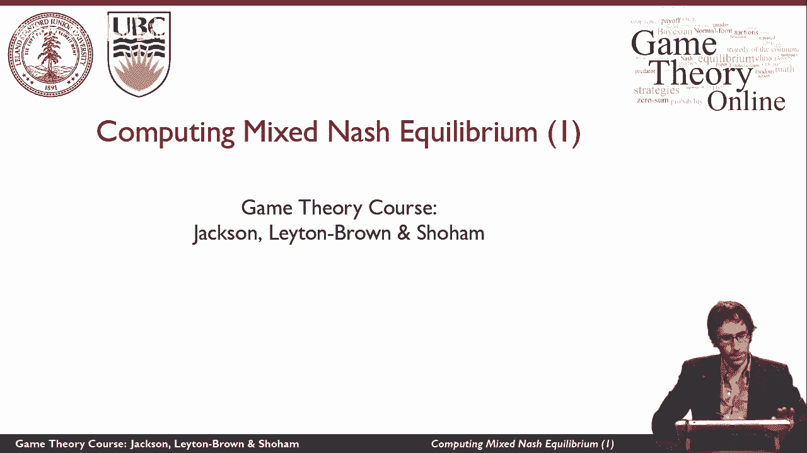
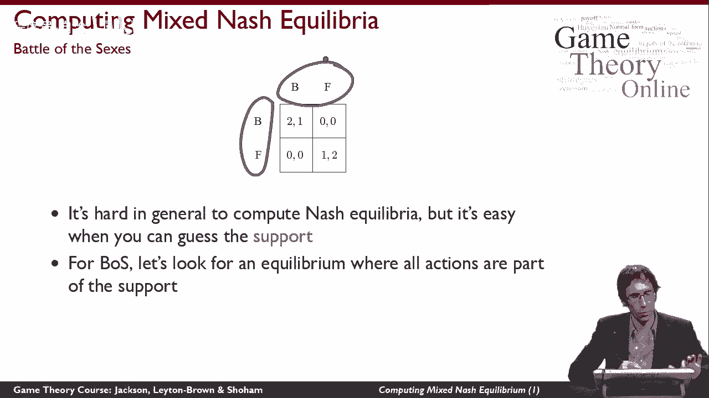
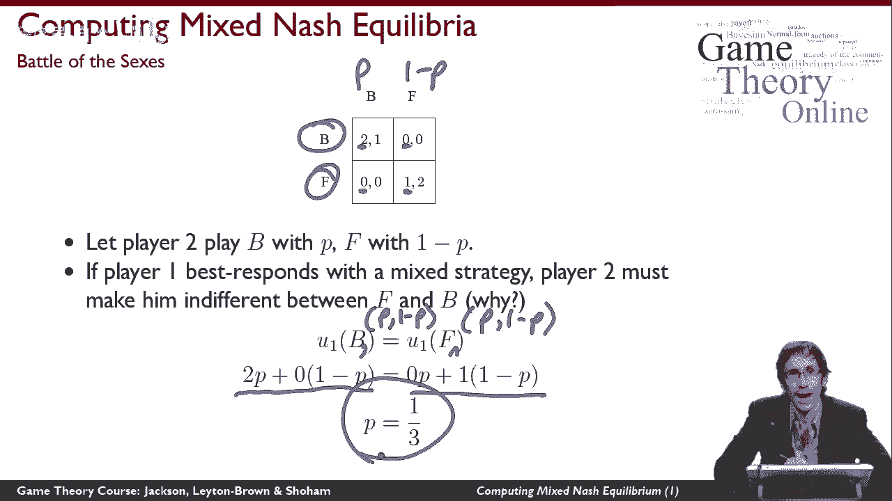
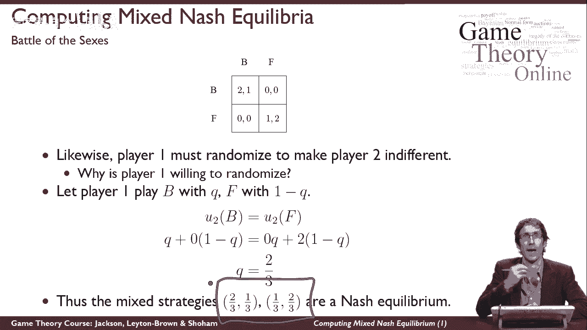
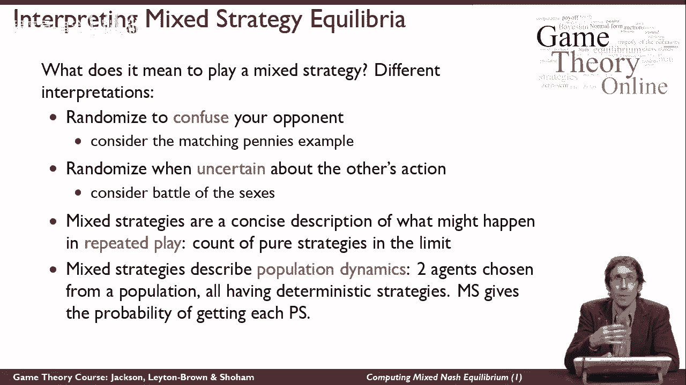

# 14：计算纳什均衡的复杂性 🧮

在本节课中，我们将学习如何计算正规形式博弈中的混合策略纳什均衡。我们将通过经典的“性别之战”博弈作为例子，介绍一种基于“支撑”猜测的计算方法，并探讨混合策略均衡背后的直观含义。

---

## 概述：计算混合策略纳什均衡

纳什定理告诉我们，在有限博弈中至少存在一个纳什均衡，但它并未提供寻找均衡的具体方法。本节将介绍一种计算均衡的起点方法：先猜测均衡的“支撑”，然后通过数学推理求解概率。这种方法对于小型博弈是有效的。

---

## 第一步：理解“支撑”概念

上一节我们介绍了纳什均衡的存在性，本节中我们来看看如何具体计算一个混合策略均衡。首先需要理解“支撑”这个概念。

**支撑** 是指在一个玩家的混合策略中，所有被赋予正概率的纯策略的集合。在均衡中，每个玩家的支撑共同构成了“均衡支撑”。

例如，在“性别之战”博弈中，我们猜测均衡支撑包含了所有可能的行动（即双方都可能以正概率选择“芭蕾”或“足球”）。

---

## 第二步：通过无差异性条件求解

如果我们猜测均衡支撑包含了所有行动，那么我们可以利用“无差异性”条件来求解均衡策略。

关键推理如下：在混合策略纳什均衡中，如果一个玩家在支撑内的多个行动之间随机选择，那么他必须对这些行动**无差异**。也就是说，给定对手的策略，他选择支撑内任何一个行动所获得的期望效用都是相等的。

以下是具体的求解过程：

1.  **设定玩家2的策略**：假设玩家2以概率 `p` 选择“芭蕾”(B)，以概率 `1-p` 选择“足球”(F)。
2.  **建立玩家1的无差异方程**：在均衡中，玩家1对选择B和F是无差异的。因此，选择B的期望效用等于选择F的期望效用。
    *   玩家1选B的期望效用：`2 * p + 0 * (1-p) = 2p`
    *   玩家1选F的期望效用：`0 * p + 1 * (1-p) = 1-p`
    *   无差异条件：`2p = 1-p`
3.  **求解玩家2的策略**：解方程 `2p = 1-p`，得到 `p = 1/3`。因此，玩家2的均衡策略是 `(1/3 B, 2/3 F)`。

同理，我们可以求解玩家1的策略：

1.  **设定玩家1的策略**：假设玩家1以概率 `q` 选择B，以概率 `1-q` 选择F。
2.  **建立玩家2的无差异方程**：
    *   玩家2选B的期望效用：`1 * q + 0 * (1-q) = q`
    *   玩家2选F的期望效用：`0 * q + 2 * (1-q) = 2(1-q)`
    *   无差异条件：`q = 2(1-q)`
3.  **求解玩家1的策略**：解方程 `q = 2(1-q)`，得到 `q = 2/3`。因此，玩家1的均衡策略是 `(2/3 B, 1/3 F)`。

我们最终得到了一个有意义的混合策略纳什均衡：`( (2/3 B, 1/3 F), (1/3 B, 2/3 F) )`。双方都愿意按此概率随机化，并且彼此让对方无差异。

---

## 第三步：混合策略的多种解释

在计算出均衡后，理解“为什么玩家要随机化”至关重要。混合策略均衡有几种不同的解释：

以下是几种常见的解释：

*   **迷惑对手**：例如在“猜硬币”游戏中，随机化是为了让对手无法预测你的行动，从而保护自己。但这不完全适用于“性别之战”。
*   **反映不确定性**：在“性别之战”中，随机化反映了玩家对对方行动的不确定性。我的最佳反应是基于对你行为的最佳猜测，而这种猜测本身具有不确定性，最终导致了一个稳定的随机化模式。
*   **长期频率的概括**：混合策略可以描述在重复博弈中，纯策略被使用的长期频率。在“性别之战”中，如果双方长期反复博弈，可能会观察到接近 `2/3` 和 `1/3` 的行动频率。
*   **群体动态**：假设存在两个玩家群体。如果一个群体中有 `2/3` 的人选择B，`1/3` 选F，另一个群体中有 `1/3` 选B，`2/3` 选F。从这两个群体中随机配对进行博弈，那么整个系统将处于均衡状态。

---

## 总结

本节课中我们一起学习了计算混合策略纳什均衡的一种基本方法：
1.  **猜测均衡支撑**：即哪些策略会以正概率出现。
2.  **利用无差异条件建立方程**：在均衡中，玩家对支撑内的所有策略必须无差异。
3.  **求解概率**：解方程得到每个玩家在支撑内各策略上的概率分布。
4.  **验证与解释**：检查求得的概率是否合理（介于0和1之间），并思考该混合策略均衡的现实含义。

这种方法为理解均衡计算提供了清晰的起点，尽管对于大型复杂博弈可能需要更高效的算法。关键在于掌握了“无差异性”这一核心逻辑，它是连接策略选择与期望效用的桥梁。