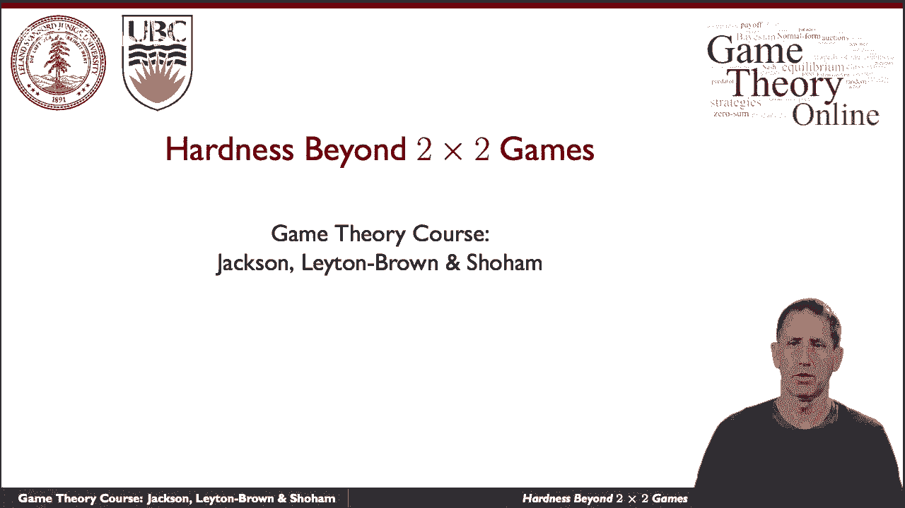
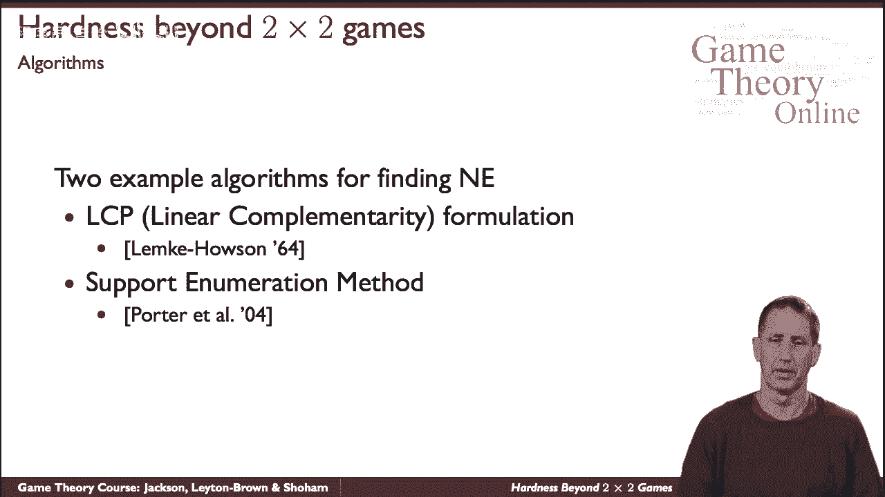
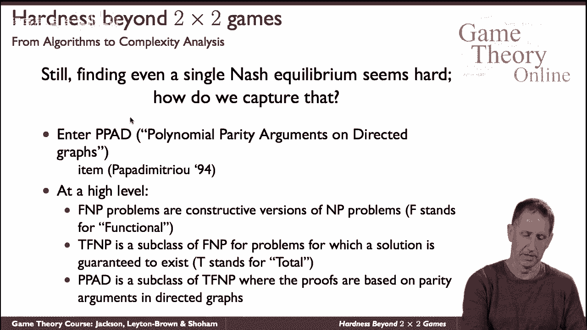
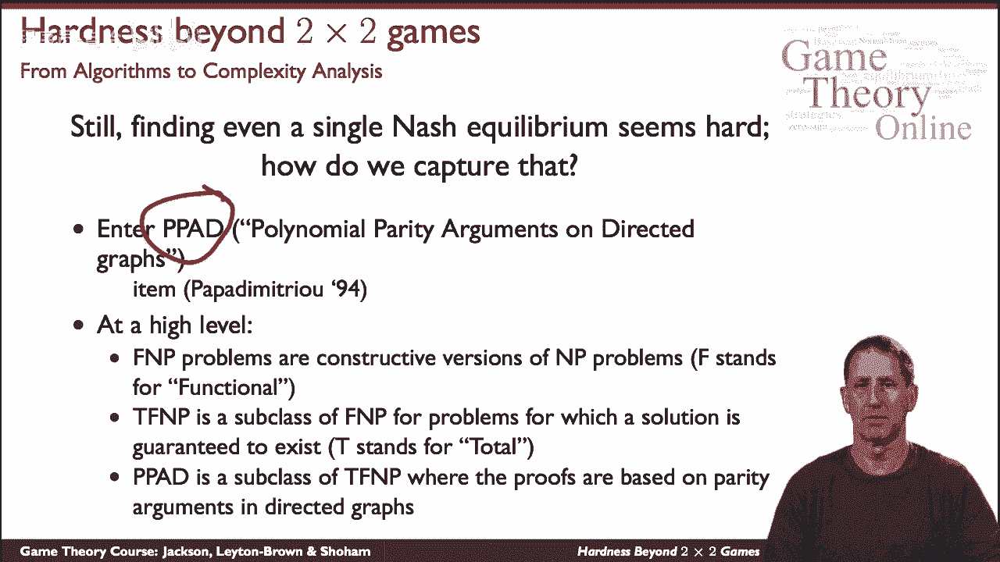
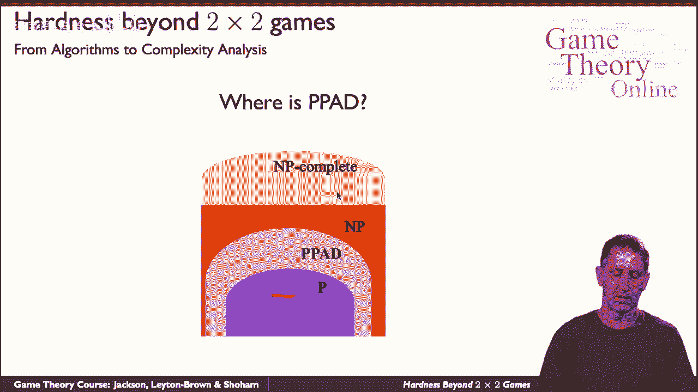
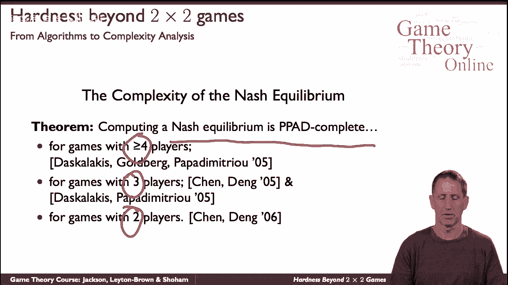

# 15：超越2x2博弈的难度 🔍

在本节课中，我们将要学习计算纳什均衡的算法复杂性。我们将探讨为什么对于一般的多人博弈，寻找纳什均衡是一个计算上困难的问题，并介绍相关的复杂性理论概念。

---

上一节我们介绍了2x2博弈中寻找纳什均衡的方法。本节中我们来看看，当博弈规模扩大时，计算纳什均衡的难度如何急剧增加。

计算一般（非零和）博弈中的纳什均衡非常困难。这是一个复杂的话题，我们将通过介绍两种特定的算法来初步了解其难度。这两种算法代表了研究该问题的一系列方法中的两个极端。

以下是两种计算纳什均衡的代表性算法：

*   **莱姆克-豪森算法**：该算法始于问题的数学公式——**线性互补问题**。一旦将问题设置为数学优化问题，就可以应用各种算法。莱姆克-豪森算法是针对双人博弈最著名的算法之一，它展示了对博弈数学结构和纳什均衡性质的深刻理解。
*   **支持枚举方法**：这种方法最近才出现，对问题结构的洞察没有那么深刻。它的核心思想是：如果你能固定玩家的**策略支持集**（即以非零概率被选择的行动集合），那么问题就变得容易解决，可以将其设置为一个线性规划并高效求解。然而，困难在于需要探索的策略支持集数量是指数级的。因此，该方法的诀窍在于使用巧妙的启发式方法来高效地枚举这些支持集。虽然这种方法不像莱姆克-豪森算法那样基于深刻的理论，但在实践中往往运行得很快。

---

我们已经看到，人们付出了巨大努力来寻找计算样本纳什均衡的算法，但这似乎非常困难。为了理解其根本原因，我们需要引入一些新的复杂性理论概念。

基本概念是一个名为 **PPAD** 的新问题类别，全称为“有向图上的多项式奇偶校验参数”。它由 Christos Papadimitriou 在1994年引入。我们不会深入细节，但你需要知道的是，PPAD 是名为 **TFNP** 的类别的一个特化，而 TFNP 又是 **FNP** 类别的一个特化。这些细节超出了我们当前讨论的范围。

---

但是，这个概念确实帮助我们定位了在复杂性层次结构中寻找样本纳什均衡的难度。

我们拥有**多项式时间（P）** 类，以及可以在多项式时间内验证解的问题类，即 **NP** 类。**PPAD** 类位于 P 和 NP 之间的某个位置。目前我们不知道整个层次结构是否会“坍塌”（即所有类别合而为一），虽然普遍相信不会，但尚无证明。

那么，这与计算纳什均衡有什么关系呢？

---

以下定理至关重要：最初的研究表明，计算纳什均衡的问题对于 **PPAD** 类是**完全的**。这意味着它是该类中最难的问题之一。该结论最初针对四名玩家的博弈证明，随后扩展到所有具有三个或更多玩家的博弈，最终覆盖了所有规模的博弈。

因此，学术界普遍认为该问题**不是多项式时间可解的**，尽管这一点同样无法被证明。

---

**总结**

本节课中我们一起学习了计算纳什均衡的算法复杂性。我们了解到，对于一般的多人非合作博弈，寻找纳什均衡是一个计算上非常困难的问题，被归类为 **PPAD-完全**问题。这解释了为什么尽管存在像莱姆克-豪森算法和支持枚举这样的算法，但在最坏情况下，我们仍无法保证在多项式时间内找到解。这一理论结果奠定了我们对博弈论算法复杂性的基本认识。