# 16：超越2x2游戏的复杂性分析 🔍

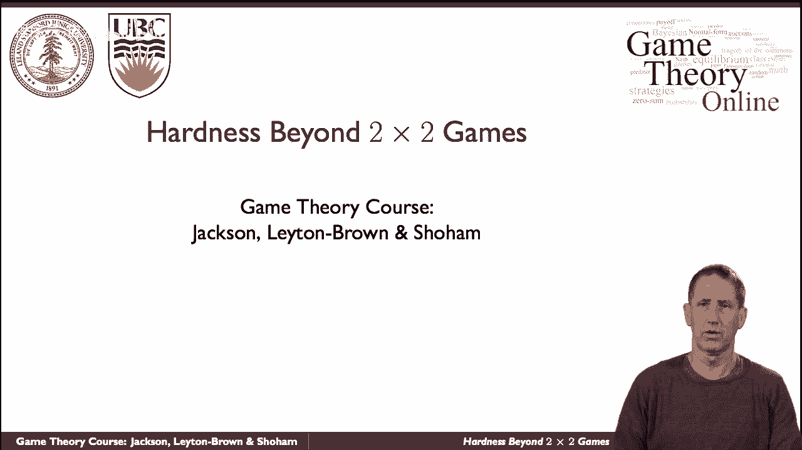

在本节课中，我们将要学习计算纳什均衡的算法复杂性。我们将从历史背景出发，介绍用于计算均衡的经典算法，并探讨为何在最坏情况下，这些算法可能是指数级的。最后，我们会从计算复杂性理论的角度，理解为何寻找纳什均衡是一个困难的问题。

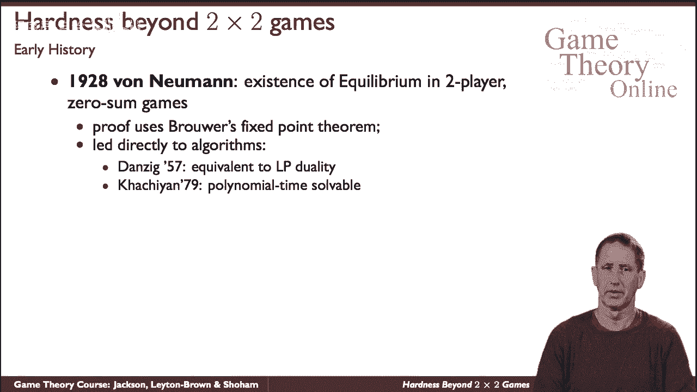

---

## 历史背景与算法起源 📜

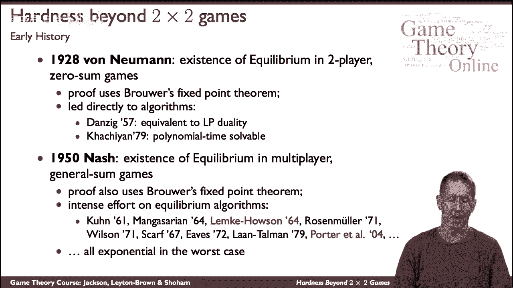

上一节我们介绍了纳什均衡的基本概念，本节中我们来看看计算它的历史与算法起源。

约翰·冯·诺依曼是现代博弈论的创始人之一。他在研究零和博弈时，证明了均衡的存在性，并运用了布劳尔不动点定理。这直接导致了在线性规划中计算不动点的算法，该算法本质上等同于现代所说的**线性规划对偶性**。这是一个指数级的过程，尽管在实践中被广泛使用。求解线性规划的多项式时间方法虽然存在，但在实际中并未被广泛采用。

**公式**：线性规划对偶性可表示为：
```
原始问题：max c^T x, 满足 Ax ≤ b, x ≥ 0
对偶问题：min b^T y, 满足 A^T y ≥ c, y ≥ 0
```

---

## 超越零和博弈：一般和博弈的均衡计算 ⚙️

当我们超越零和博弈，进入一般和博弈时，情况变得更加复杂。

约翰·纳什证明了一般和博弈中均衡的存在性，同样使用了布劳尔不动点定理。这为一系列算法提供了理论基础，其中两个著名的算法是莱姆克-豪森算法和瑞安·波特等人提出的更近期的算法。需要指出的是，在最坏情况下，所有这些算法都是指数级的。

---

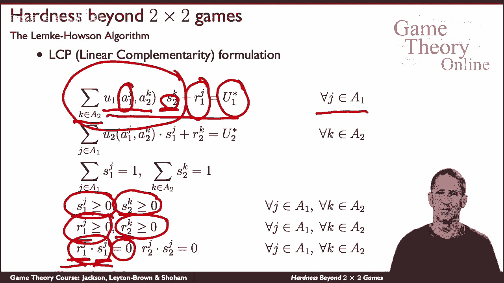

## 莱姆克-豪森算法详解 🔧

让我们从莱姆克-豪森算法开始。我们首先从双人博弈的均衡公式化表示入手。

以下是该算法的核心数学优化程序。它包含两组变量：`s` 和 `r`。变量 `s` 用于捕捉两位玩家使用的混合策略。例如，`s_{2k}` 表示二号玩家在其混合策略中赋予动作 `k` 的概率。变量 `r` 是所谓的松弛变量。

为了理解松弛变量的作用，我们来看一个等式。对于一号玩家的任何一个动作 `i`，我们考察其收益。具体来说，我们查看二号玩家所有可能的动作，并根据二号玩家的混合策略计算一号玩家选择动作 `i` 时的期望收益。在均衡状态下，每个玩家都对对手的策略做出最优反应。因此，我们设 `u` 为一号玩家在纳什均衡中（针对二号玩家策略）的收益。通常，一号玩家选择动作 `i` 的收益不会超过 `u`，但可能会更少。松弛变量 `r_i` 就用于表示这个差值，即该动作相对于最优反应的“不足”程度。

松弛变量总是非负的。在纳什均衡中，如果玩家以正概率选择某个策略，其对应的松弛变量必须为零；如果玩家以零概率选择某个策略，则其松弛变量可以不为零。这个条件通过要求概率与松弛变量的乘积为零来捕捉，这正是线性互补问题的特征。

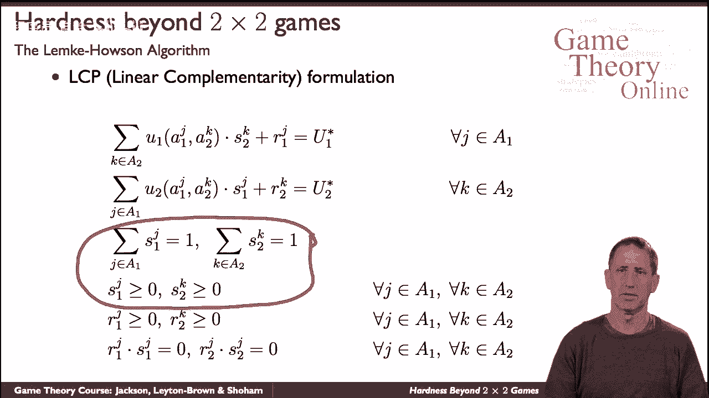

**公式**：对于一号玩家的每个动作 `i`，有：
```
∑_j (收益矩阵 A_{ij} * 二号玩家选择 j 的概率) + r_i = u
s_i * r_i = 0
s_i ≥ 0, r_i ≥ 0
∑_i s_i = 1
```
对于二号玩家也有类似的一组约束。

莱姆克-豪森算法以一种特殊的方式初始化 `s` 和 `r`（例如，都初始化为零），然后通过一个称为“旋转”的过程，依次调整 `s` 和 `r` 的值，直到找到一个满足所有条件的均衡点。本次课程中我们不深入该算法的细节，但重要的是理解它将寻找纳什均衡的问题转化为了一个数学优化问题，并以一种系统的方式在变量空间中进行搜索。

---

## 基于支撑集搜索的启发式方法 🧠

现在，让我们来看一个非常不同的方法。这个方法不像莱姆克-豪森算法那样深入均衡的结构，而是通过启发式搜索来补偿。

以下是该方法的两个阶段：

**第一阶段：固定支撑集求解**
首先注意到，当我们固定一个策略组合的支撑集时，判断在该支撑集上是否存在纳什均衡是一个简单的问题。一个策略的支撑集是指玩家在混合策略中赋予正概率的所有动作的集合。

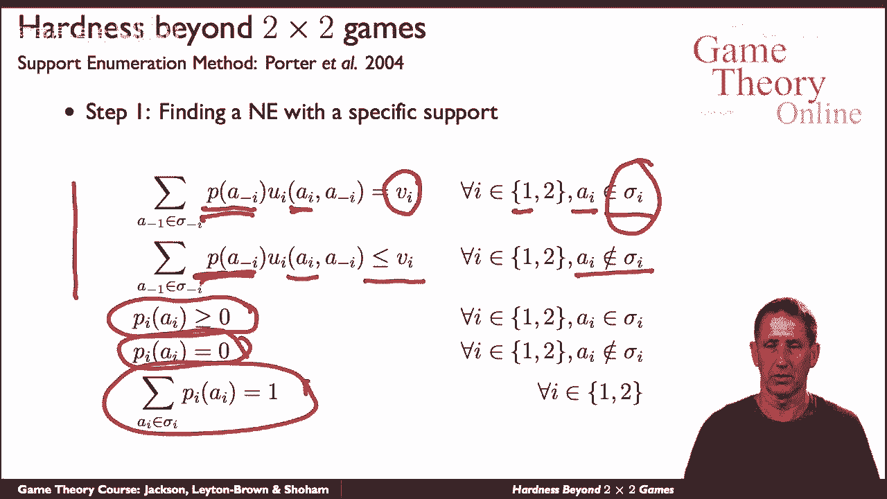

对于双人博弈，我们可以为每位玩家（例如一号玩家）列出以下条件：对于支撑集中的每个动作 `i`，我们希望玩家选择该动作的期望收益等于一个最优反应值 `v_i`；对于支撑集外的动作，其期望收益不应超过 `v_i`。同时，支撑集内的概率之和为1，且所有概率非负。这形成了一个线性规划问题，可以在多项式时间内求解。

**代码**（概念性描述）：
```
输入：博弈收益矩阵， 玩家1的支撑集 S1， 玩家2的支撑集 S2
求解线性规划：
  变量：玩家1在S1上的概率分布p， 玩家2在S2上的概率分布q， 最优反应值v1, v2
  约束：
    对于所有 i 在 S1 中： (A * q)_i = v1
    对于所有 i 不在 S1 中： (A * q)_i ≤ v1
    对于所有 j 在 S2 中： (p^T * B)_j = v2
    对于所有 j 不在 S2 中： (p^T * B)_j ≤ v2
    p, q 是概率分布（元素和=1， 元素≥0）
输出：如果可行解存在，则返回均衡策略 (p, q)；否则返回无解。
```

**第二阶段：探索支撑集**
问题在于，可能的支撑集数量是指数级的。该方法的第二部分就是系统地探索这些支撑集。基本思想是偏向于探索大小相近的支撑集（即不从一个玩家只考虑两种策略而另一个玩家考虑很多策略开始）。在搜索过程中，还会使用“条件占优”等技巧来剪枝。尽管在最坏情况下该过程仍是指数级的，但它在实践中表现良好，并且优于其他许多具有指数最坏情况复杂度的算法。

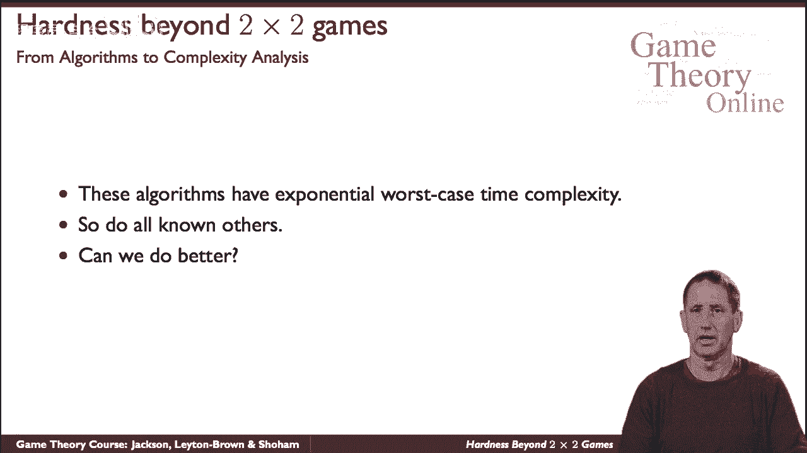

这就引出了一个核心问题：我们能否做得更好？是否存在在最坏情况下低于指数复杂度的算法？

---

## 计算复杂性视角：纳什均衡的硬度 🔬

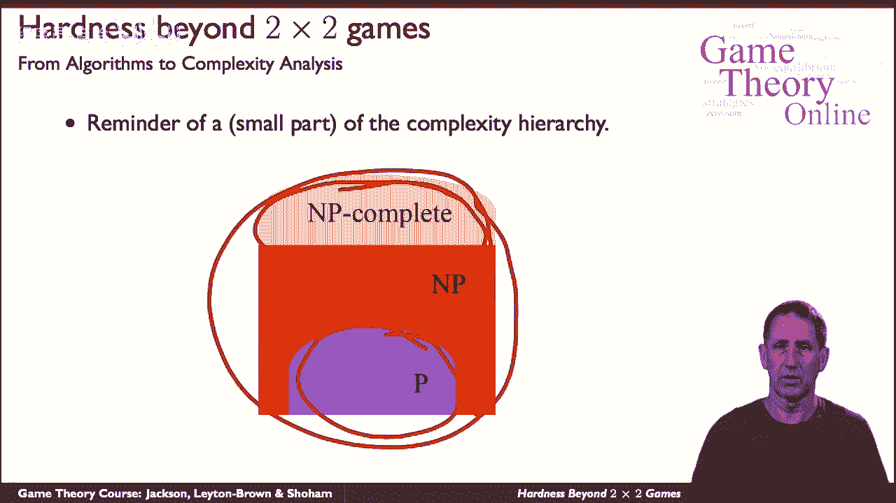

这让我们从算法领域进入计算复杂性分析领域。

首先，我们回顾一下复杂性分析的基本框架。我们关注的是整个问题类别，例如“所有博弈”的类别，以及“在这些博弈中找到一个样本纳什均衡”这个具体问题。我们想知道解决这个类别的问题有多难。

以下是复杂性层次结构的一小部分：
*   **P类**：存在多项式时间解法的问题。
*   **NP类**：其解可以在多项式时间内验证，但不一定能在多项式时间内找到的问题。
*   **NP完全类**：NP类中最难的问题，所有NP问题都可以归约到这些问题。

理论计算机科学中最大的未解之谜是P是否等于NP。人们普遍认为P ≠ NP，但尚未被证明。

现在，我们可以问：寻找纳什均衡的问题位于复杂性层次结构的何处？首先，严格来说，我们不能问“纳什均衡是否存在”，因为根据纳什定理，它总是存在。所以答案是平凡的“是”。因此，我们需要从不同角度看待这个问题，例如：
*   寻找具有特定属性的纳什均衡（例如，是否是唯一的？是否保证某玩家获得最低收益？是否排除了某些动作？）。
*   但更基本的问题是：仅仅找到一个样本纳什均衡有多难？

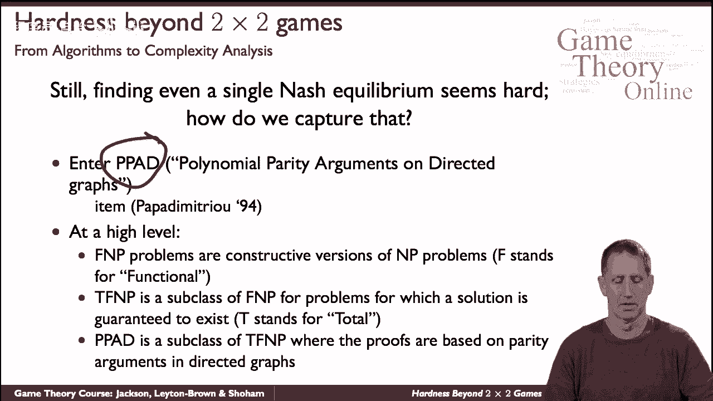

我们已经看到了一些算法，并且人们为寻找计算样本纳什均衡的算法付出了巨大努力，但这看起来确实很难。为了理解其难度，我们需要引入一个新概念：**PPAD类**（有向图上的多项式奇偶校验参数）。它由克里斯托斯·帕帕迪米特里乌于1994年提出。PPAD是TFNP类的一个子类，而TFNP又是FNP类的一个子类。

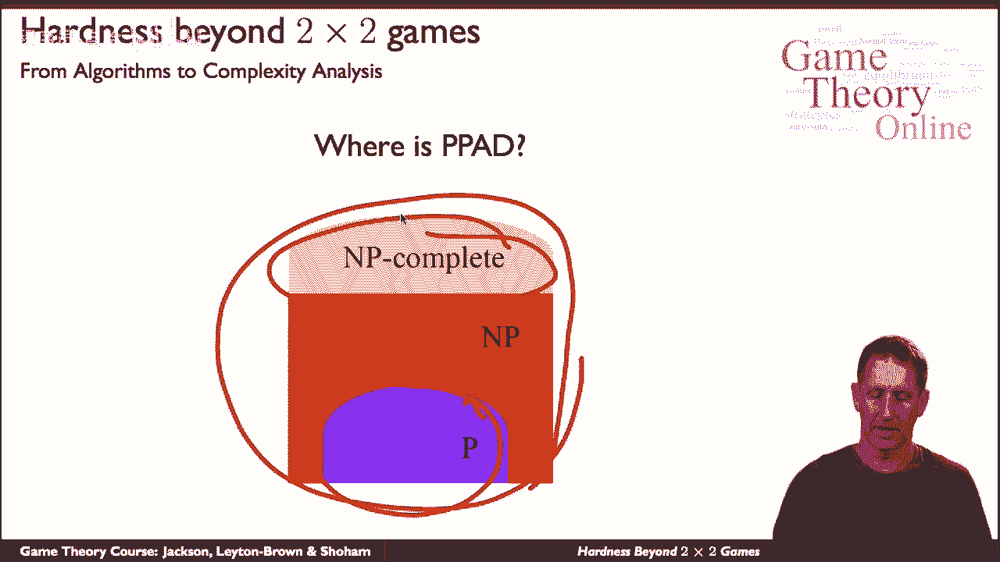

在复杂性层次结构中，PPAD被认为位于P和NP之间的某个位置（同样，假设P ≠ NP）。关键定理表明：**计算纳什均衡的问题是PPAD完全的**。这意味着它是PPAD类中最难的问题之一。该结论最初针对四名玩家的博弈证明，后来扩展到三名或更多玩家的博弈，最终在所有规模的博弈中成立。因此，人们普遍认为该问题不存在多项式时间解法（尽管这无法被证明）。

---

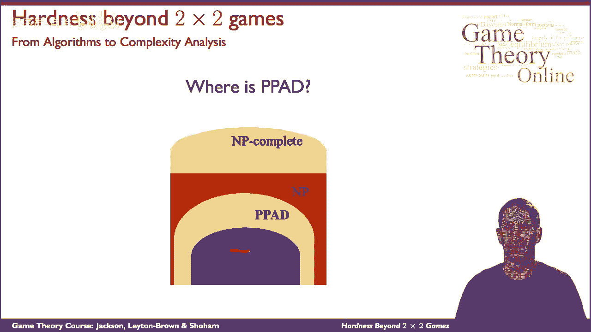

## 总结 📝

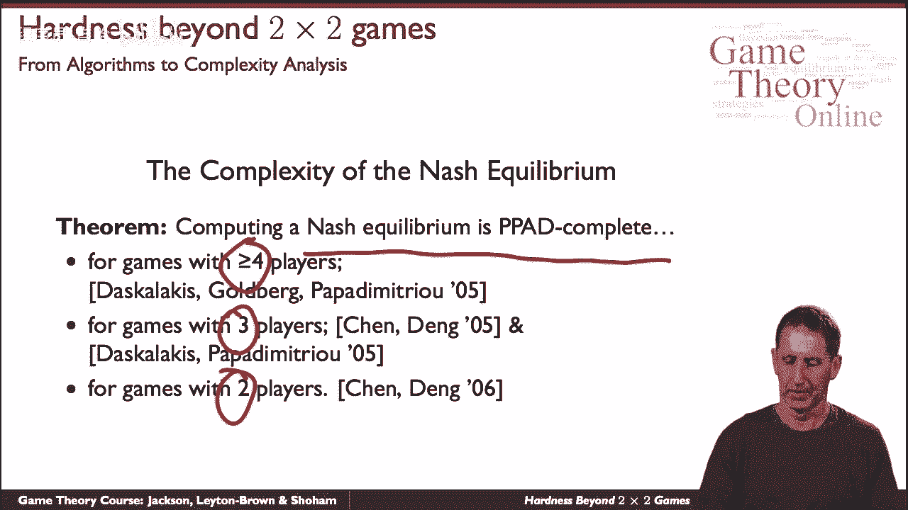

本节课中我们一起学习了计算纳什均衡的算法复杂性。我们从历史算法（如莱姆克-豪森算法）出发，了解了它们在最坏情况下的指数级复杂度。接着，我们探讨了基于支撑集搜索的启发式方法，该方法在实践中有效但理论复杂度仍高。最后，我们从计算复杂性理论的角度认识到，寻找一个样本纳什均衡是PPAD完全问题，这为理解其计算难度提供了理论基础。