# 17：混合策略纳什均衡示例 ⚽️🎯

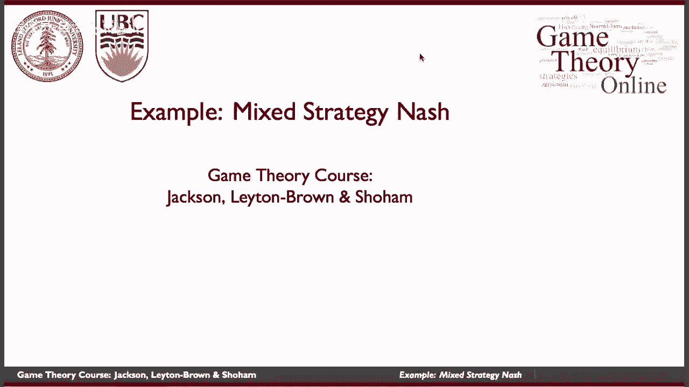

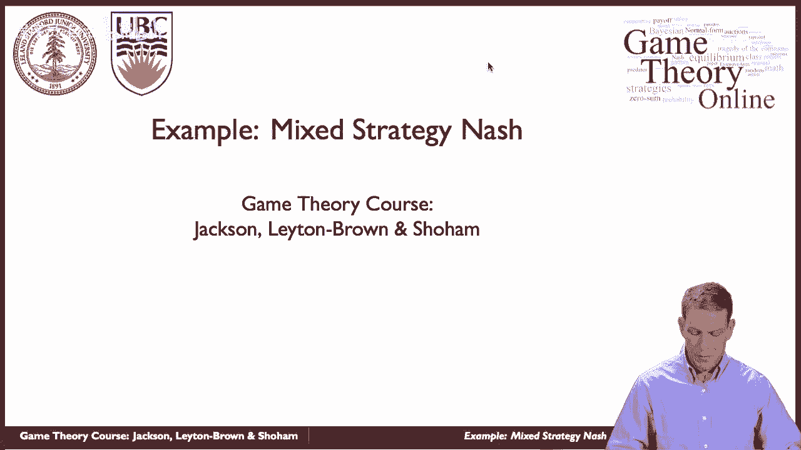

在本节课中，我们将学习混合策略纳什均衡在实践中的应用，特别是通过足球点球的例子来理解其运作机制和背后的直觉。

---

上一节我们介绍了混合策略的基本概念，本节中我们来看看它在足球点球这个经典场景中的具体应用。在体育竞技中，不可预测性往往具有重要价值，这使得混合策略成为分析此类同时行动博弈的理想工具。

## 基础模型：简化的点球博弈

首先，我们从一个简化的模型开始。假设点球博弈中只有两个参与者：**踢球者**（行玩家）和**守门员**（列玩家）。双方必须同时选择行动方向：**左**或**右**。

以下是双方的收益矩阵（假设踢球者得分收益为1，未得分收益为0；守门员反之）：

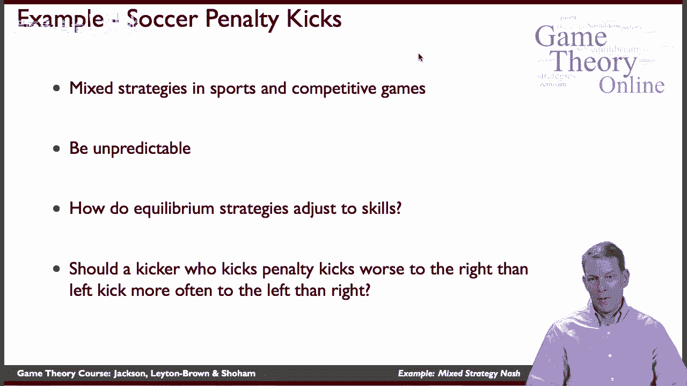

|            | 守门员扑左 | 守门员扑右 |
| :--------- | :--------- | :--------- |
| **踢向左** | 0, 1       | 1, 0       |
| **踢向右** | 1, 0       | 0, 1       |

这个博弈是“匹配便士”的一个变体。其混合策略纳什均衡是：双方都以 **50%** 的概率随机选择向左或向右。用公式表示，即：
*   踢球者策略：`P(踢左) = 0.5`, `P(踢右) = 0.5`
*   守门员策略：`P(扑左) = 0.5`, `P(扑右) = 0.5`

在这个均衡下，双方对于选择哪个方向都感到“无差异”，因为无论选择哪边，期望收益都相同。

## 引入技能差异：踢球者的弱侧

现在，让我们改变条件，引入更现实的假设：**踢球者存在“弱侧”**。假设当踢球者踢向右侧时，其射门精度下降。具体来说：
*   当守门员扑向**左**侧（即球门右侧敞开）时，踢球者踢向右的成功率从100%降至 **75%**（有25%的概率射偏）。
*   其他情况下的成功率保持不变。

那么，新的收益矩阵更新如下：

|            | 守门员扑左 | 守门员扑右 |
| :--------- | :--------- | :--------- |
| **踢向左** | 0, 1       | 1, 0       |
| **踢向右** | **0.75**, 0.25 | 0, 1       |

我们需要求解在这个新博弈中的混合策略纳什均衡。

### 步骤一：求解守门员的均衡策略

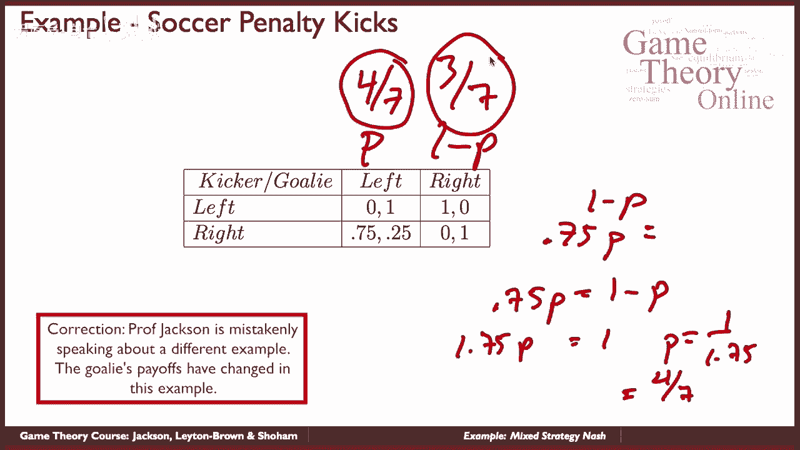

在均衡中，踢球者必须在“踢左”和“踢右”之间感到无差异。设守门员扑向左的概率为 **p**，则扑向右的概率为 **1-p**。

踢球者选择“踢左”的期望收益为：
`E(左) = 0 * p + 1 * (1-p) = 1 - p`

踢球者选择“踢右”的期望收益为：
`E(右) = 0.75 * p + 0 * (1-p) = 0.75p`

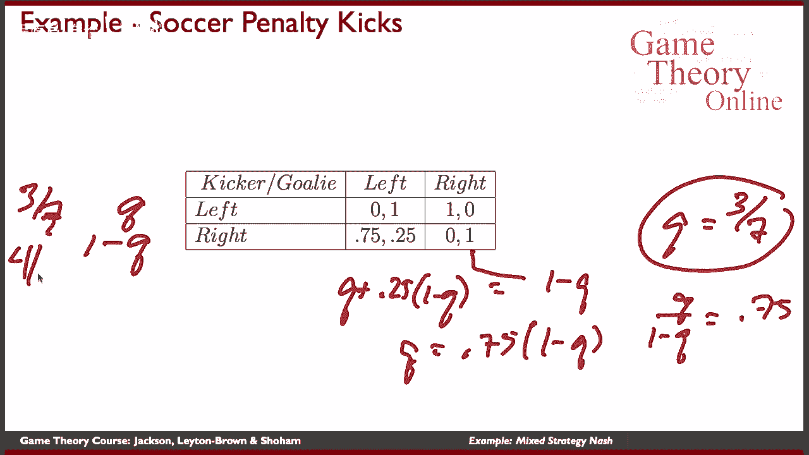

令两者相等，以使踢球者无差异：
`1 - p = 0.75p`
`1 = 1.75p`
`p = 1 / 1.75 = 4/7 ≈ 0.571`

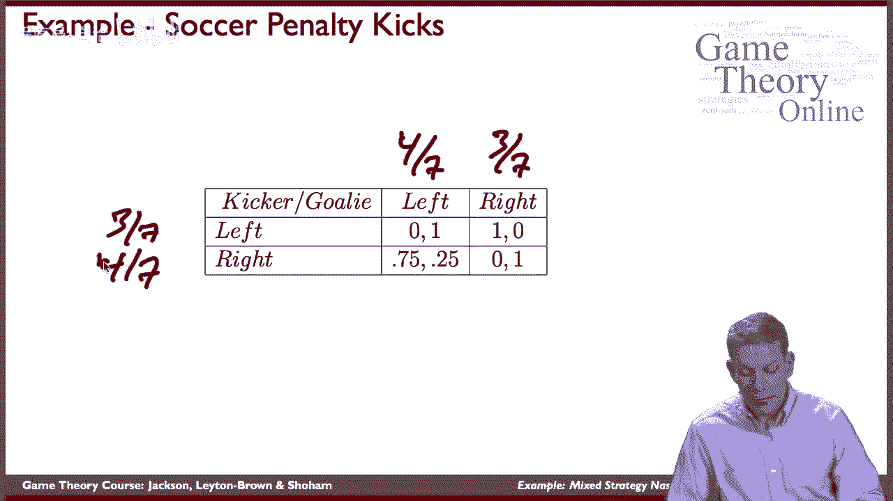

因此，守门员的新均衡策略是：以 **4/7** 的概率扑向左，以 **3/7** 的概率扑向右。

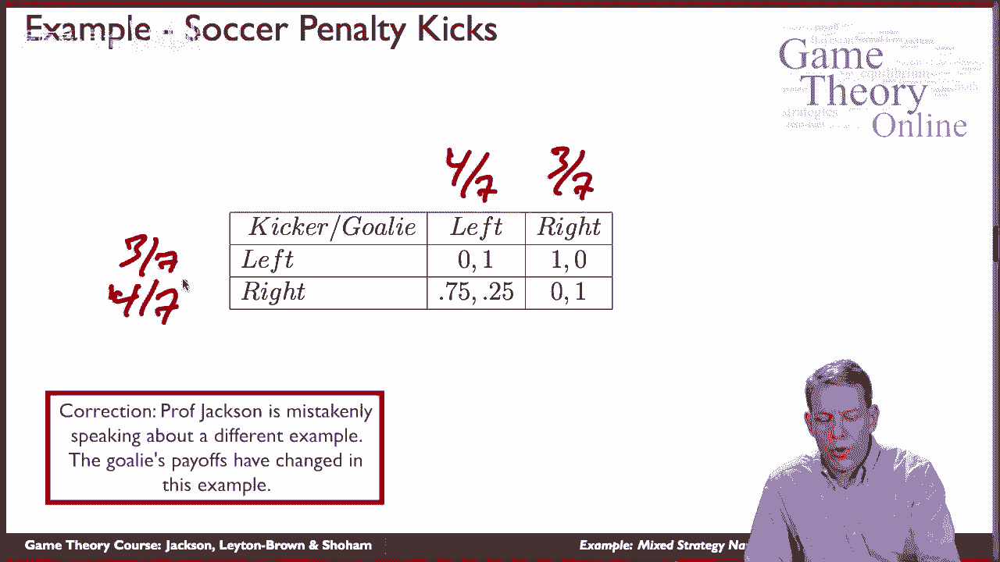

### 步骤二：求解踢球者的均衡策略

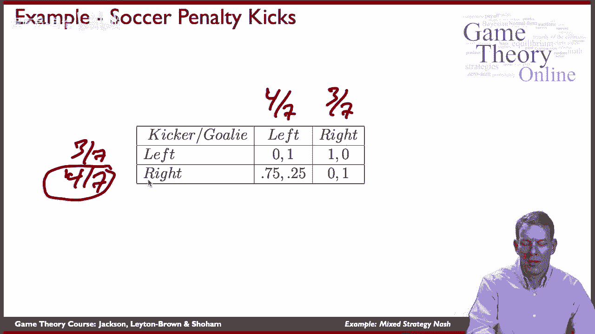

接下来，我们让守门员在“扑左”和“扑右”之间感到无差异。设踢球者踢向左的概率为 **q**，则踢向右的概率为 **1-q**。

守门员选择“扑左”的期望收益为：
`E(扑左) = 1 * q + 0.25 * (1-q) = q + 0.25(1-q)`

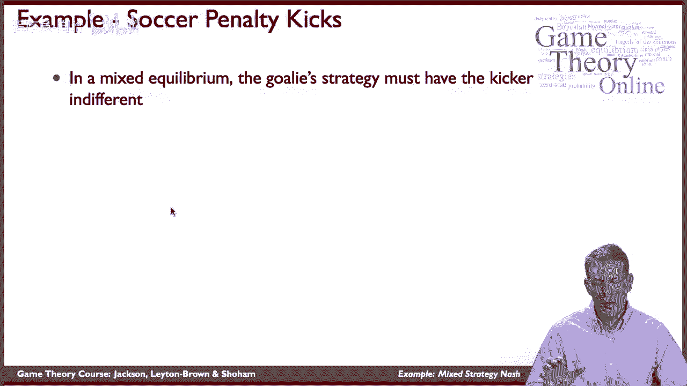

守门员选择“扑右”的期望收益为：
`E(扑右) = 0 * q + 1 * (1-q) = 1 - q`

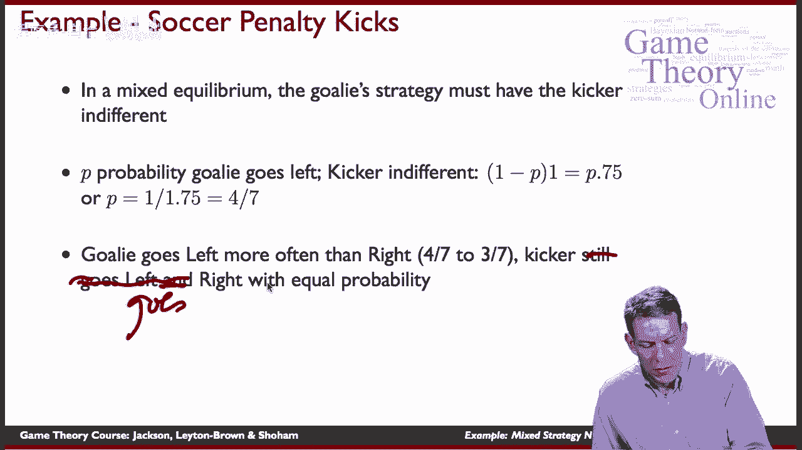

令两者相等：
`q + 0.25(1-q) = 1 - q`
`q + 0.25 - 0.25q = 1 - q`
`0.75q + 0.25 = 1 - q`
`1.75q = 0.75`
`q = 0.75 / 1.75 = 3/7 ≈ 0.429`

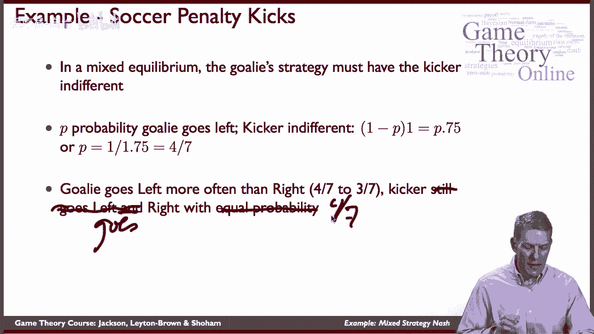

因此，踢球者的新均衡策略是：以 **3/7** 的概率踢向左，以 **4/7** 的概率踢向右。

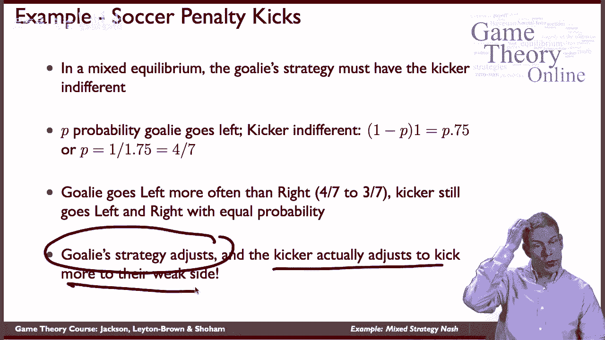

## 结果分析与直觉解读

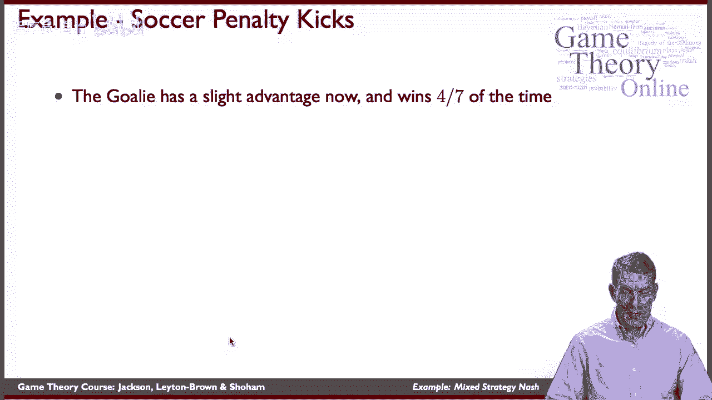

通过计算，我们得到了新的混合策略纳什均衡：
*   **踢球者**：`P(踢左) = 3/7`, `P(踢右) = 4/7`
*   **守门员**：`P(扑左) = 4/7`, `P(扑右) = 3/7`

这个结果揭示了两点有趣且看似违反直觉的现象：

1.  **守门员的收益未变，但策略必须调整**：虽然只有踢球者的收益矩阵发生了变化，但守门员不能再使用五五开的策略。她必须增加扑向左侧（踢球者强侧）的概率，以应对踢球者在左侧得分机会更高的事实。
2.  **踢球者更频繁地攻击自己的弱侧**：踢球者反而增加了踢向自己较弱右侧的频率。这是因为守门员为了防守强侧（左侧）而更多地扑向左，使得球门右侧相对更容易得分，从而将踢球者的策略“推”向了弱侧。

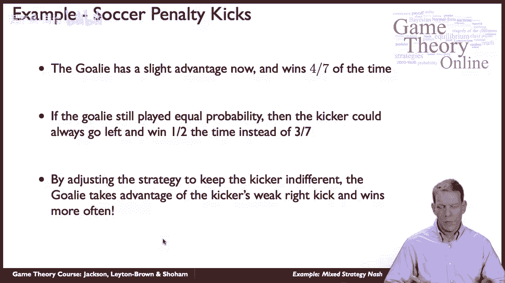

以下是背后的核心逻辑链条：
*   由于踢球者右侧变弱，守门员如果仍保持50%概率扑左，踢球者就会总是选择踢向左（强侧）以获得更高收益。
*   为了阻止这一点，守门员必须增加扑向左的概率（到4/7），以降低踢球者踢向左的期望收益。
*   这使得踢球者在左、右两侧的期望收益重新变得相等，从而愿意混合策略。
*   在这个过程中，守门员通过策略调整，实际上**利用**了踢球者的弱侧，使自己在博弈中获得了更高的整体胜率（计算可知，守门员在此均衡下的获胜概率为4/7）。

---

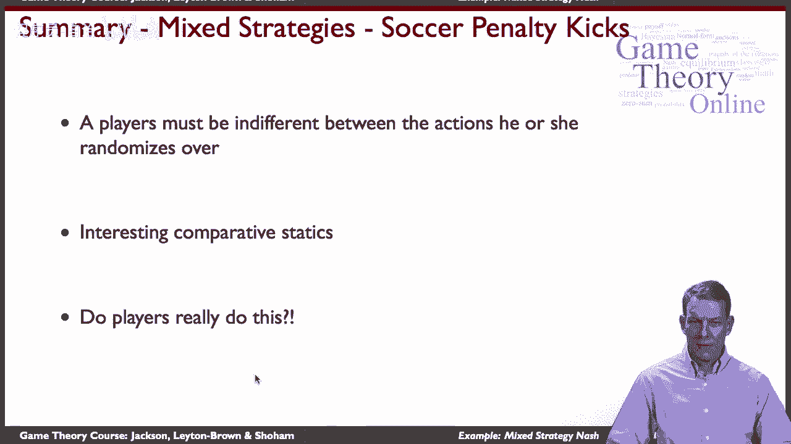

本节课中我们一起学习了混合策略纳什均衡在一个具体实例——足球点球中的计算与应用。我们看到了当玩家技能存在差异时，均衡策略会如何发生微妙且反直觉的调整：**玩家不仅会针对对手的弱点进行调整，有时甚至会更多地使用自己的弱项**。这深刻地说明了在策略互动中，保持对手的“无差异”是混合策略均衡的核心驱动力。理解这一点，对于分析各类需要随机化和不可预测性的竞技场景至关重要。