# 18：数据、职业体育与混合策略 ⚽🎾

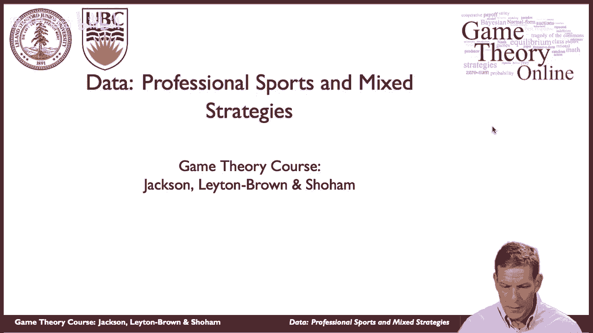

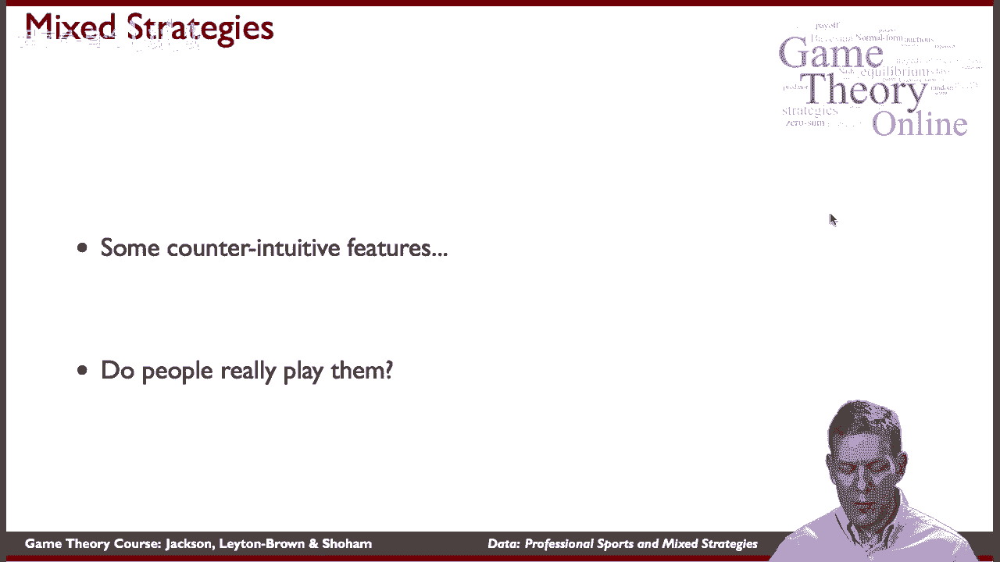

在本节课中，我们将通过职业体育中的真实数据，来检验混合策略纳什均衡的预测是否与现实行为相符。我们将重点分析足球点球和网球发球等场景，看看职业运动员是否真的在“随机化”自己的选择。

---

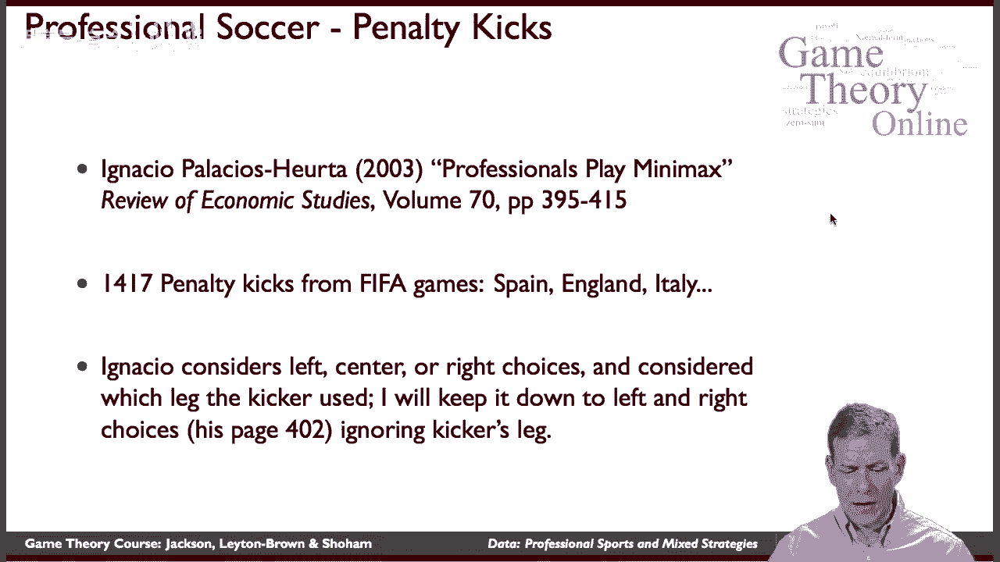

上一节我们介绍了混合策略纳什均衡的理论概念，本节中我们来看看它在真实世界中的应用。

Ignacio Palacios-Huerta收集并分析了大量职业足球点球数据。他记录了1417个高水平比赛中的点球，关注踢球者选择踢左或踢右，以及守门员选择扑左或扑右的决策。

以下是基于这些数据计算出的平均得分概率矩阵：

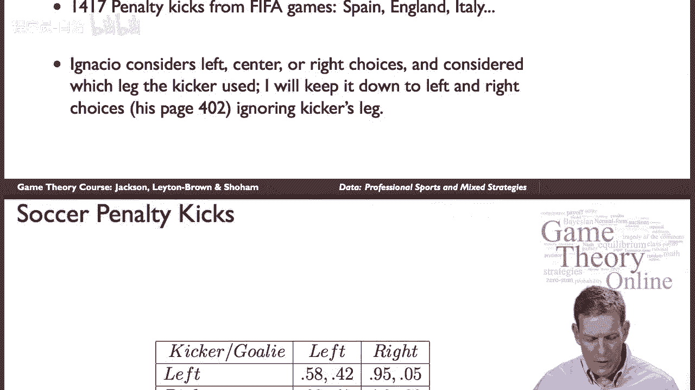

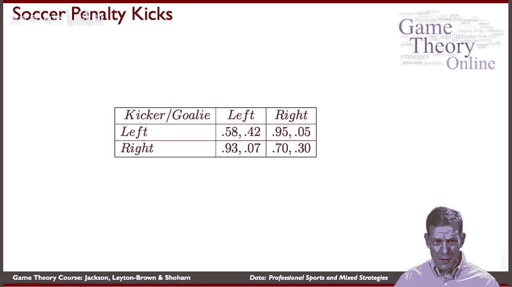

| 踢球者 \ 守门员 | 扑左 | 扑右 |
| :--- | :--- | :--- |
| **踢左** | 踢球者得分: 0.58 守门员得分: 0.42 | 踢球者得分: 0.95 守门员得分: 0.05 |
| **踢右** | 踢球者得分: 0.93 守门员得分: 0.07 | 踢球者得分: 0.70 守门员得分: 0.30 |

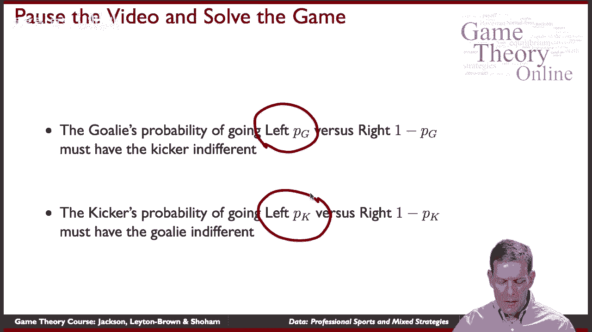

这个矩阵显示，游戏存在不对称性。例如，当踢球者踢左而守门员扑左时，踢球者得分概率（0.58）低于他踢右而守门员扑左时的得分概率（0.93）。

---

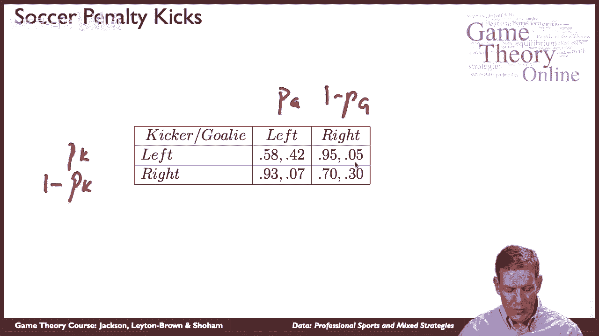

基于上述收益矩阵，我们可以求解这个零和博弈的混合策略纳什均衡（即极大极小策略）。

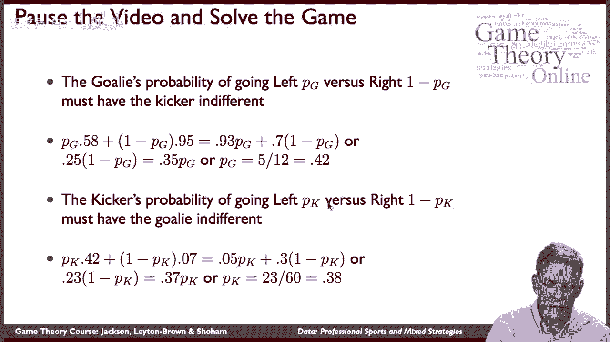

设守门员扑左的概率为 **`pg`**，扑右的概率则为 **`1 - pg`**。设踢球者踢左的概率为 **`pk`**，踢右的概率则为 **`1 - pk`**。

为了使踢球者在“踢左”和“踢右”之间无差异（即收益相等），我们需要解以下方程：
**`0.58 * pg + 0.95 * (1 - pg) = 0.93 * pg + 0.70 * (1 - pg)`**

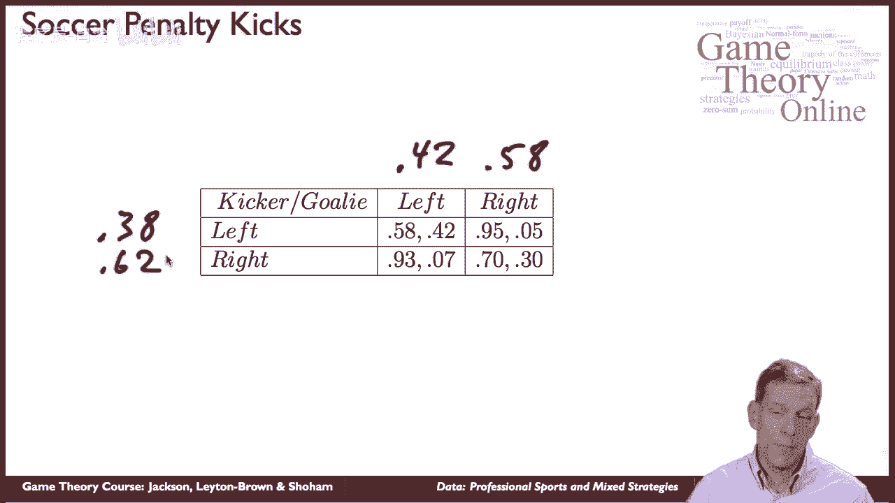

求解可得：**`pg ≈ 0.42`**。因此，守门员的最优策略是扑左约 **42%** 的时间，扑右约 **58%** 的时间。

同理，为了使守门员在“扑左”和“扑右”之间无差异，我们需要解方程：
**`0.42 * pk + 0.07 * (1 - pk) = 0.05 * pk + 0.30 * (1 - pk)`**

求解可得：**`pk ≈ 0.38`**。因此，踢球者的最优策略是踢左约 **38%** 的时间，踢右约 **62%** 的时间。

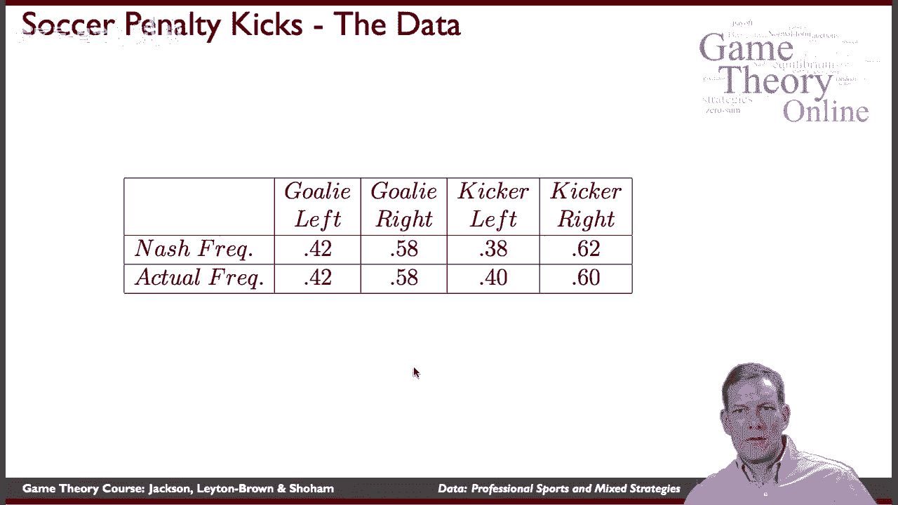

---

那么，职业运动员在现实中的行为是否与纳什均衡的预测一致呢？以下是理论预测与实际观测频率的对比：

以下是纳什均衡预测与实际观测数据的对比列表：
*   **守门员扑左**：预测 42%，实际观测 42%。
*   **守门员扑右**：预测 58%，实际观测 58%。
*   **踢球者踢左**：预测 38%，实际观测 38%。
*   **踢球者踢右**：预测 62%，实际观测 62%。

数据显示，职业运动员的行为**几乎完全符合**混合策略纳什均衡的预测。运动员并非通过直接计算矩阵来学习，而是在长期的高水平对抗中，通过调整策略、利用对手的倾向性，最终达到了使对手“无差异”的均衡状态。

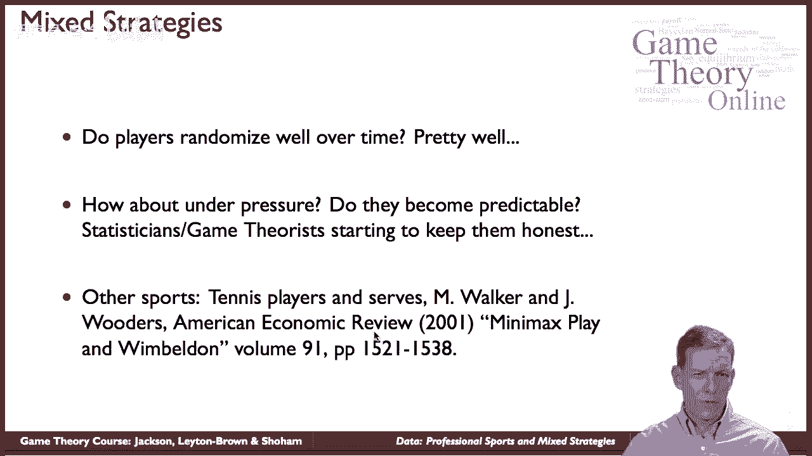

---

这种混合策略的均衡分析并不仅限于足球。在职业网球发球策略的研究中（Walker & Wooders， 2001），学者们同样发现，运动员选择发球落点（对手的正手位或反手位）的频率，与极大极小策略的预测高度吻合。

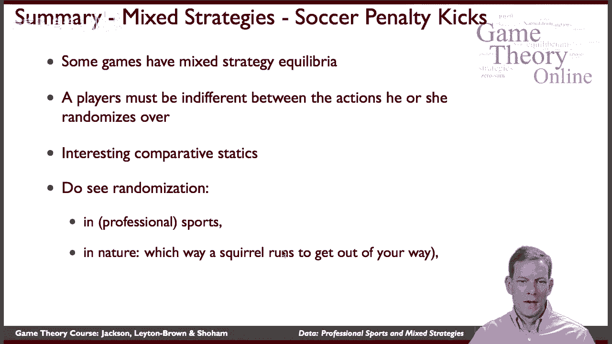

以下是混合策略纳什均衡在现实世界中的其他应用场景列表：
*   **自然界**：捕食者与猎物之间的追逐游戏，例如松鼠逃跑路线的随机化，以增加不可预测性。
*   **商业与政策**：税务机构的审计策略。由于审计有成本，无法覆盖所有人，随机审计成为一种最优的混合策略，以维持纳税人对被查概率的不确定性。

---

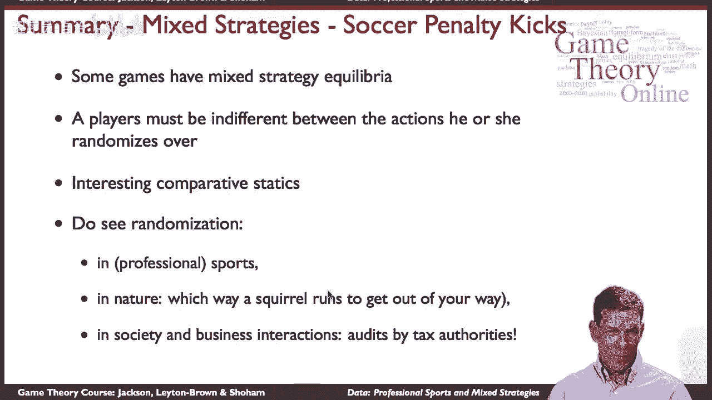

本节课中我们一起学习了如何利用真实数据检验博弈论预测。通过对职业足球点球和网球发球数据的分析，我们发现运动员在竞争性场景下的行为，与混合策略纳什均衡的预测惊人地一致。这证明了即便参与者不进行显式的数学计算，长期的学习和竞争压力也能驱动他们趋向于理论上的最优随机化策略。这种均衡思想在自然界、商业监管等多个领域都有广泛的应用。