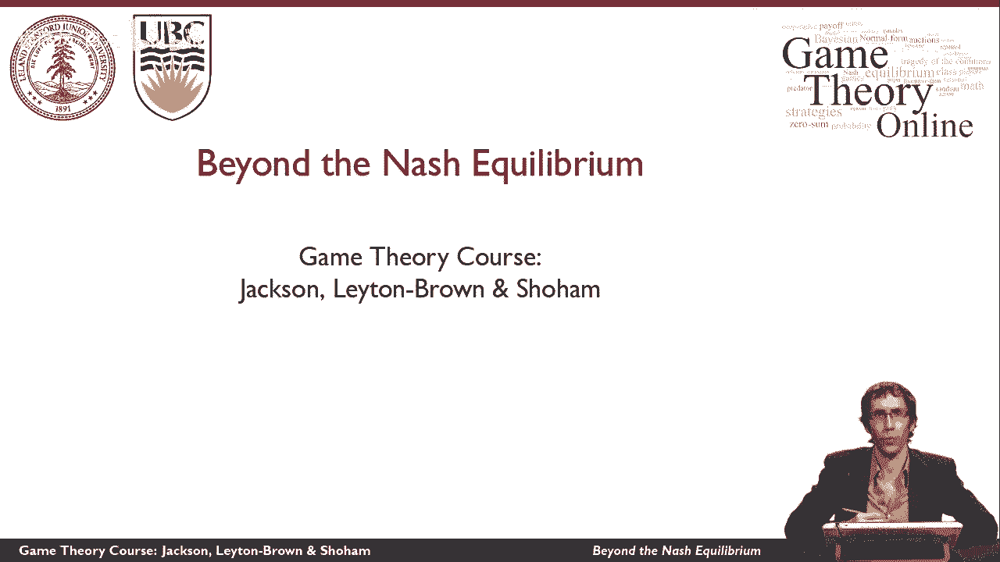
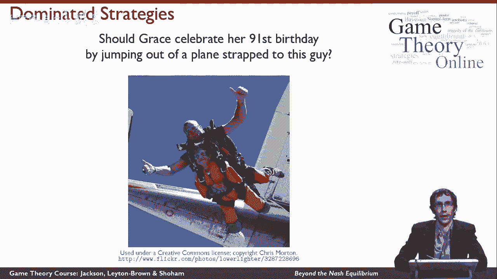

# 19：超越纳什均衡 🎯

在本节课中，我们将学习纳什均衡之外的其他博弈论解概念。我们将探讨如何通过更符合直觉的推理方式来预测博弈结果，并介绍两种重要的概念：迭代去除劣势策略和相关均衡。

---

## 迭代去除劣势策略 🧠

上一节我们介绍了纳什均衡作为预测博弈结果的核心概念。本节中，我们来看看一种基于理性推理的简化分析方法：迭代去除劣势策略。

这个概念可以通过一个例子来说明。设想格蕾丝决定跳伞庆祝91岁生日。她需要和负责打包降落伞的布鲁斯互动。格蕾丝可能会担心布鲁斯不安全地打包降落伞。如果她选择跳下而布鲁斯选择不安全打包，结果将非常糟糕。

然而，分析博弈收益可知，对布鲁斯而言，“不安全打包”是一个劣势策略。这不仅对格蕾丝不利，对布鲁斯自己也极为不利。由于格蕾丝知道布鲁斯是理性的，她可以推断布鲁斯永远不会选择这个劣势策略。

因此，格蕾丝可以通过从博弈中消除这个劣势策略来简化分析。她只需要考虑布鲁斯选择“安全打包”时剩下的博弈部分。这就是迭代去除劣势策略的核心思想：理性参与者会逐步剔除对自己明显不利的策略，并基于此预测对方行为。

以下是该思想的一个简单表述：
**公式：** 若策略A在所有情况下收益都低于策略B，则A为劣势策略，可被剔除。

---

## 零和博弈中的一致性 ⚽

在讨论了基于理性推理的策略剔除后，我们来看看一个具体应用场景：足球点球。这引出一个问题：球员罚点球时，真的在计算纳什均衡吗？

实验证据表明，纳什均衡能很好地描述点球博弈中的实际行为。但球员在场上似乎并非在进行复杂的均衡计算。他们通常只考虑如何最大化自己的得分机会，并最小化对方守门员的扑救机会。

有趣的是，在零和博弈（如点球大战）中，以下三个目标是一致的：
1.  尽可能为自己争取最好结果。
2.  尽可能伤害对手（即减少对手收益）。
3.  达到纳什均衡。

这意味着，在零和博弈中，玩家单纯追求个人利益最大化的直觉行为，自然会引导至纳什均衡的结果。因此，球员无需显式计算均衡，其竞争本能就能达成均衡状态。

以下是关键点：
**核心：** 在零和博弈中，个人利益最大化与达到纳什均衡是等价的。

---

## 相关均衡：协调的新思路 💑

我们看到了在竞争性零和博弈中，纳什均衡与直觉的一致性。但在需要协调的博弈中，如经典的“性别之战”，纳什均衡的预测则显得不尽如人意。

在性别之战中，纳什均衡要么导致不公平的结果（总是一方迁就另一方），要么导致协调失败（双方选择不同活动）。这似乎不能很好地描述现实中人们如何解决此类协调纠纷。

因此，本节我们引入一个新的解概念：**相关均衡**。相关均衡允许参与者根据一个共同的公开信号来协调行动。例如，情侣可以约定“如果下雨就看电影，如果天晴就看球赛”。这个外部信号（天气）为他们提供了协调的焦点，从而避免了纳什均衡所预测的不公平或失败的结果。

相关均衡的关键在于，它通过引入可观察的、相关的随机事件，拓展了策略选择的维度，使得参与者能够达成更有效率且更公平的协调结果。

---

## 总结 📝

本节课我们一起学习了超越经典纳什均衡的博弈论思想。

我们首先介绍了**迭代去除劣势策略**，这是一种基于参与者共同理性的逐步推理过程，可以简化博弈分析。

接着，我们探讨了在**零和博弈**中，参与者追求自身利益最大化的直觉行为与达到纳什均衡的结果是一致的。

最后，我们引入了**相关均衡**的概念，它通过利用外部公共信号，为解决协调博弈中的困境提供了更符合现实、更有效率的方案。

这些概念扩展了我们分析策略互动的工具箱，使我们能更好地理解和预测不同情境下的决策行为。