# 20：严格支配策略与迭代去除 🎲

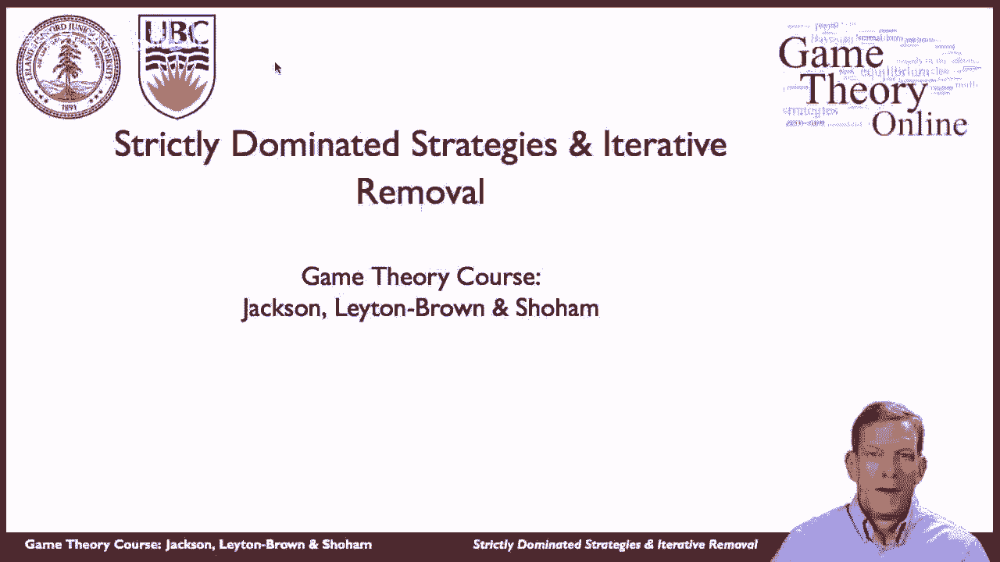

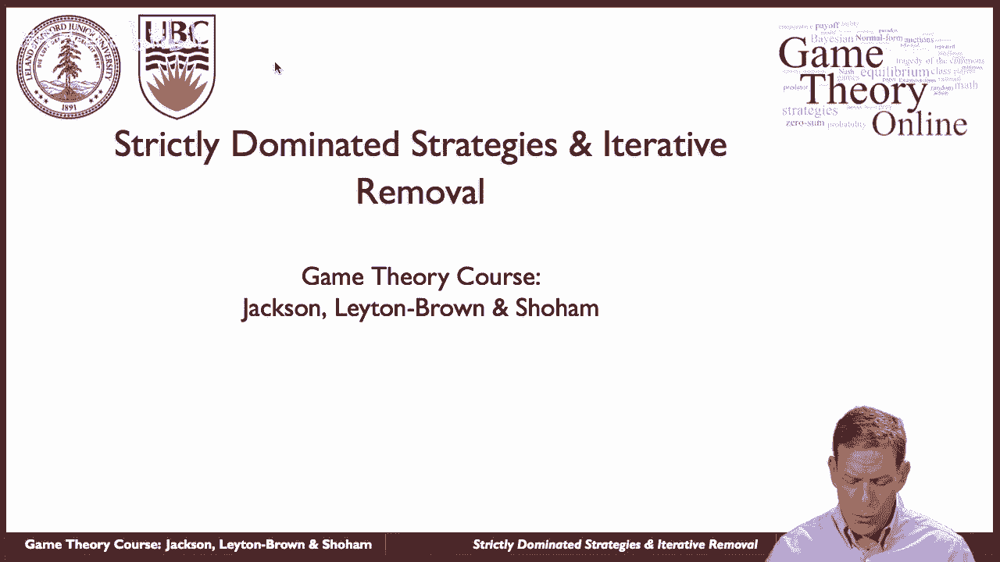

在本节课中，我们将学习博弈论中一个重要的分析工具：**严格支配策略**及其**迭代去除**。我们将探讨如何利用“理性玩家不会选择严格劣势策略”这一逻辑，逐步简化博弈并做出预测。

---

## 概述 📋

我们一直在研究纳什均衡和博弈分析。除了从稳定性角度分析博弈，我们还可以从“理性”和“逻辑推理”的角度来预测玩家的行为。本节将介绍一种基于“严格支配”关系的分析方法，它可以帮助我们简化复杂的博弈，并推导出合理的预测结果。

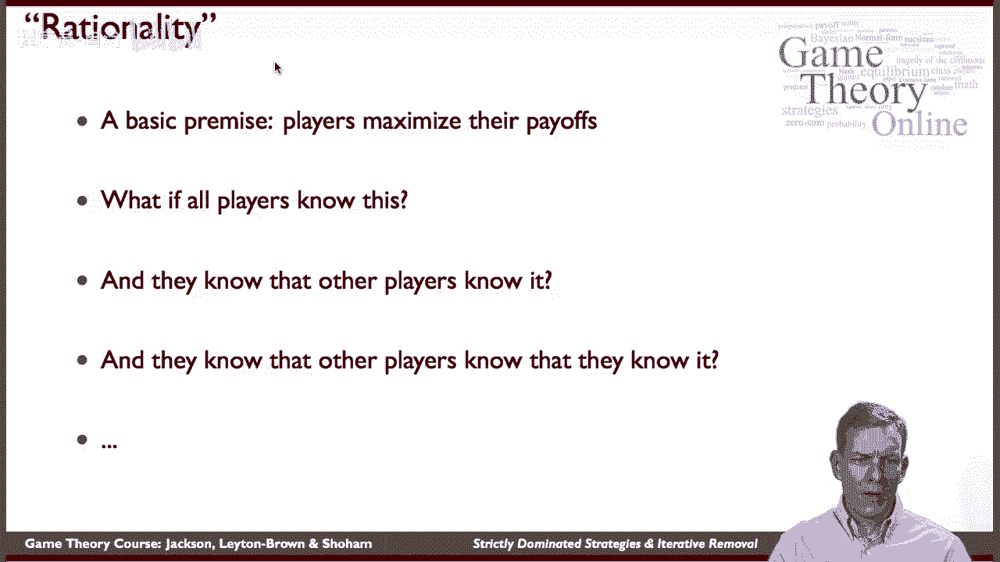

---

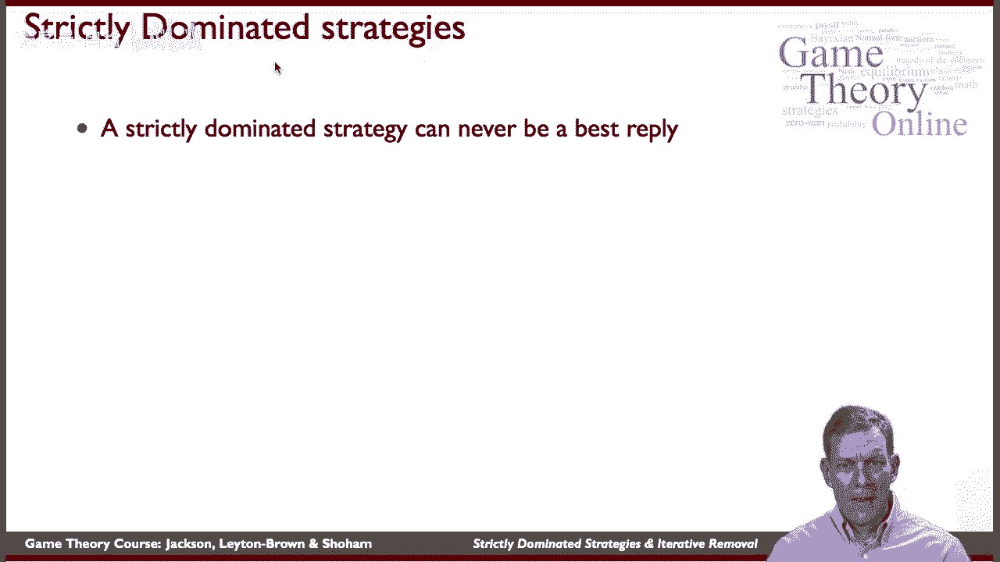

## 博弈论中的理性前提 🤔

博弈论的基本前提是：**玩家会最大化自己的收益**。这意味着，在给定其他玩家行为的情况下，玩家倾向于选择能带来更高回报的行动。这里的“收益”可以是任何玩家关心的目标（如金钱、利他主义满足感等）。基于此，我们可以进行逻辑推理：如果所有玩家都知道其他玩家是理性的，并且所有玩家都知道“所有玩家都知道其他玩家是理性”……如此迭代，我们能对博弈结果做出何种推断？

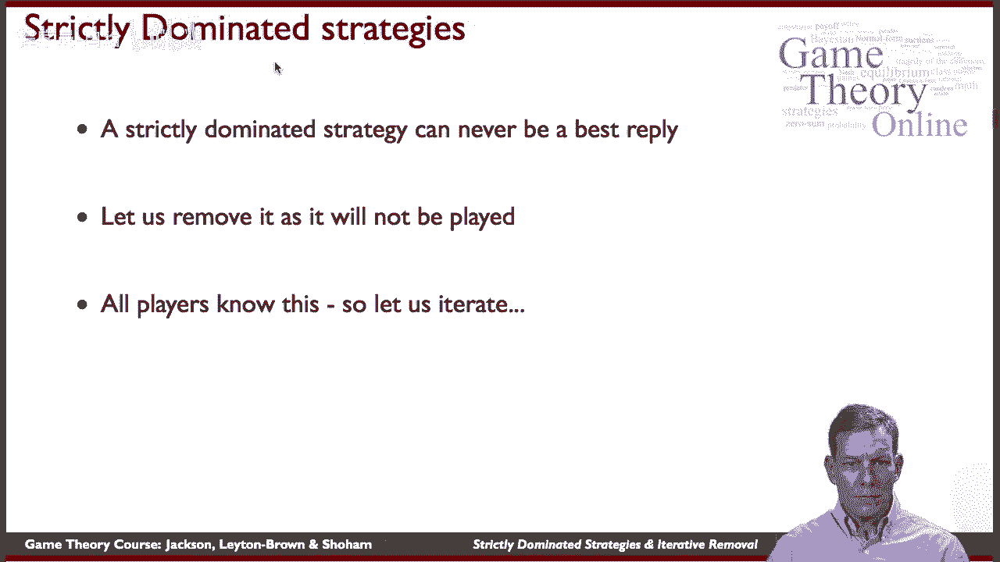

---

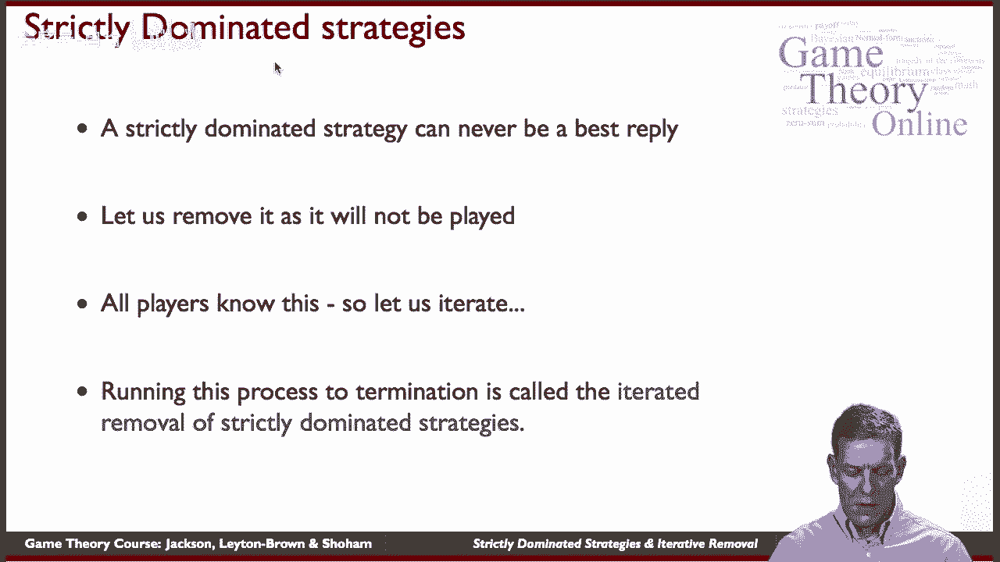

## 严格支配策略的定义 📖

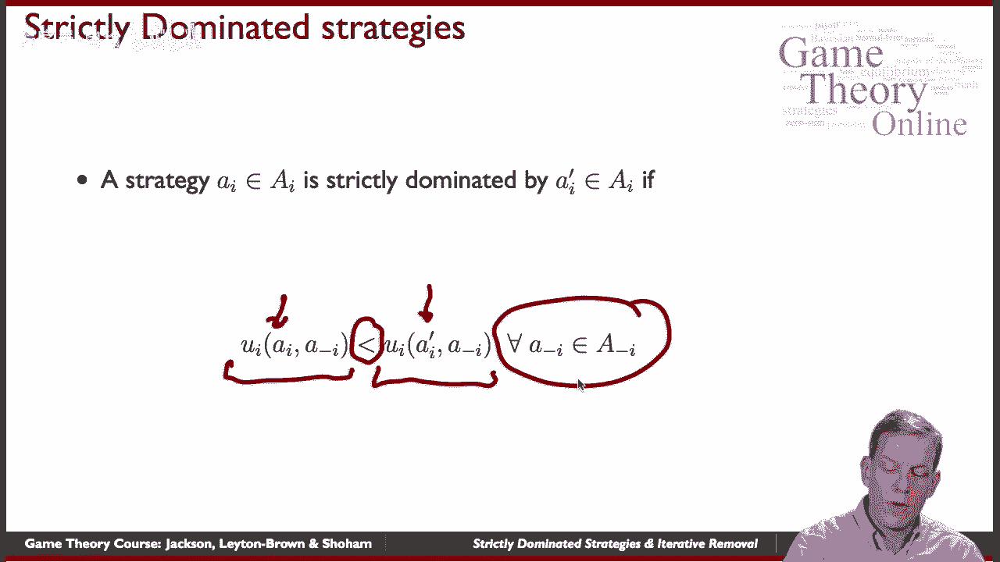

一个策略被称为**严格劣势策略**，是指存在另一个策略，**无论其他玩家如何选择**，后者总能带来**严格更高**的收益。换句话说，这个策略永远不可能是最优反应。

用公式表示，对于玩家 *i*，策略 *s_i* 被策略 *s_i'* **严格支配**，当且仅当：
对于其他玩家所有可能的策略组合 *s_{-i}*，都有：
**u_i(s_i', s_{-i}) > u_i(s_i, s_{-i})**

既然存在一个在任何情况下都更好的选择，理性的玩家就**绝对不应该**选择严格劣势策略。因此，在分析博弈时，我们可以安全地将这类策略从考虑中移除。

---

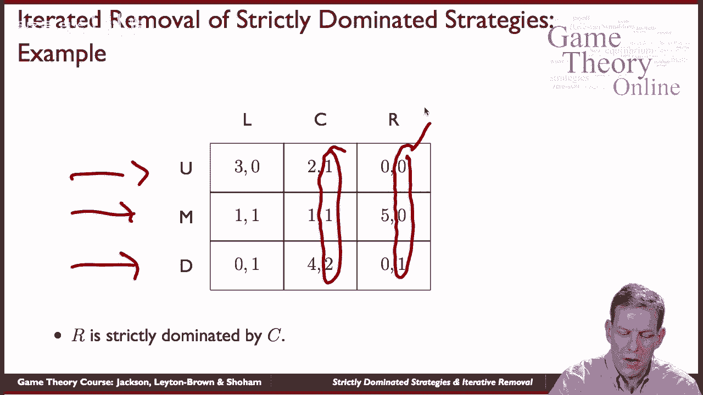

## 迭代去除的过程 🔄

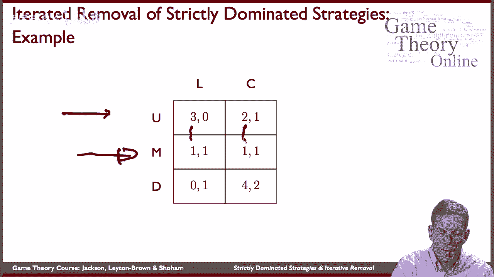

上一节我们定义了严格劣势策略。本节中，我们来看看如何利用这个定义来简化博弈。

迭代去除的核心思想是：
1.  识别并移除所有玩家的严格劣势策略。
2.  移除后，我们得到一个更简单的“子博弈”。
3.  在这个子博弈中，再次识别并移除（在新的背景下成为）严格劣势的策略。
4.  重复此过程，直到没有严格劣势策略可被移除。

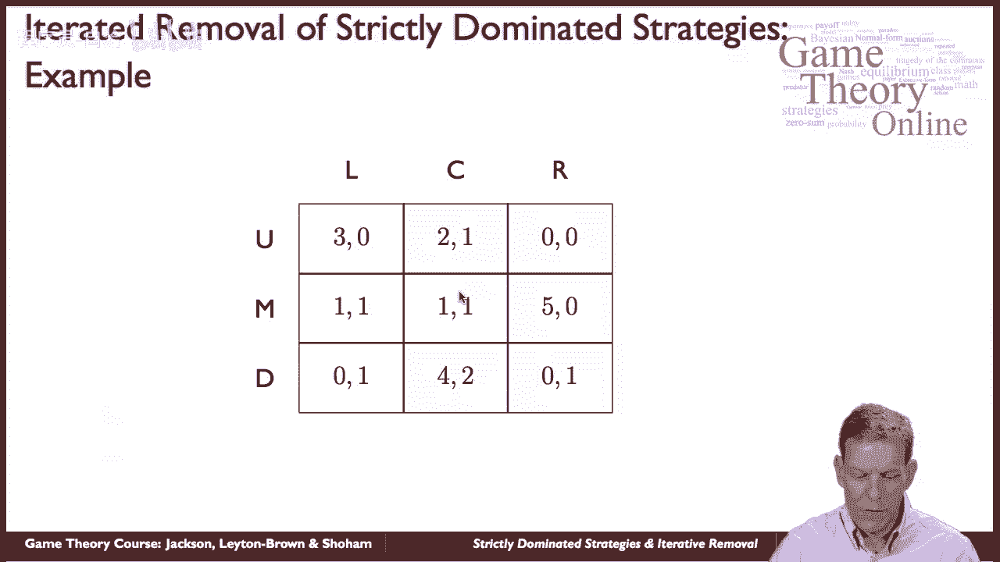

这个过程被称为**严格劣势策略的迭代去除**。最终剩下的策略组合，被认为是经过多层理性推理后，玩家唯一可能的选择。

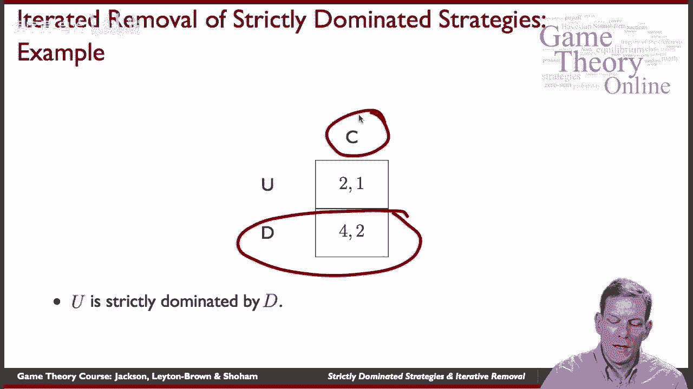

---

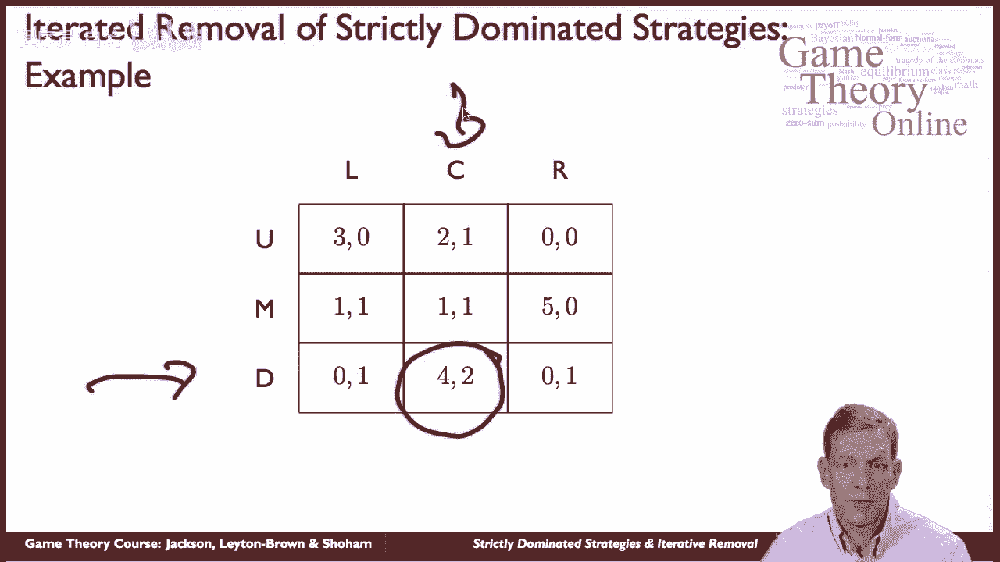

## 应用示例（一）：唯一预测 🎯

让我们通过一个具体例子来理解这个过程。考虑以下收益矩阵（行玩家收益，列玩家收益）：

|       | L   | C   | R   |
| :---- | :-- | :-- | :-- |
| **U** | 1,2 | 1,3 | 0,1 |
| **M** | 2,2 | 0,1 | 3,0 |
| **D** | 0,3 | 2,1 | 4,0 |

以下是分析步骤：

**第一步：** 观察列玩家。比较策略R和C：
*   当行玩家选U：R收益为1，C收益为3。C更好。
*   当行玩家选M：R收益为0，C收益为1。C更好。
*   当行玩家选D：R收益为0，C收益为1。C更好。
因此，**策略R被策略C严格支配**。移除R。

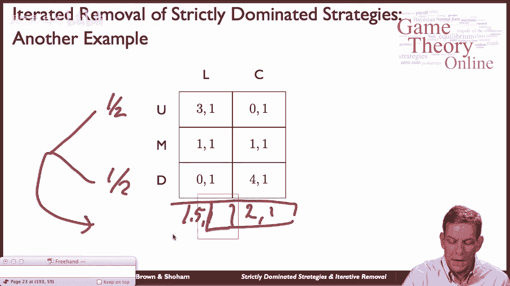

**第二步：** 在移除R后的简化博弈中，观察行玩家。
|       | L   | C   |
| :---- | :-- | :-- |
| **U** | 1,2 | 1,3 |
| **M** | 2,2 | 0,1 |
| **D** | 0,3 | 2,1 |
比较策略M和D：
*   当列玩家选L：M收益为2，D收益为0。M更好。
*   当列玩家选C：M收益为0，D收益为2。D更好。
两者互不支配。比较策略U和D：
*   当列玩家选L：U收益为1，D收益为0。U更好。
*   当列玩家选C：U收益为1，D收益为2。D更好。
两者互不支配。但比较策略M和U：
*   当列玩家选L：M收益为2，U收益为1。M更好。
*   当列玩家选C：M收益为0，U收益为1。U更好。
两者互不支配。然而，我们发现策略U和M都被策略D**混合策略**支配吗？不，在这个2x2子博弈中，我们需要检查纯策略。实际上，**策略M被策略D严格支配**吗？检查（L列）：2>0? 不，2>0成立。（C列）：0>2? 不成立。所以不是严格支配。让我们重新审视原矩阵，在第一步后，行玩家的策略M在列玩家选L时（收益2）比U（1）和D（0）好，但在列玩家选C时（收益0）比U（1）和D（2）差。因此没有纯策略严格支配M。但注意，在第一步后的子博弈中，**对于行玩家，策略U被策略D严格支配**？检查（L列）：1>0? 成立。（C列）：1>2? 不成立。所以也不是。我们需要更仔细地按顺序移除。实际上，在第一步移除列玩家的R后，我们应该检查**列玩家**是否有严格劣势策略。比较L和C：
*   当行玩家选U：L收益2，C收益3。C更好。
*   当行玩家选M：L收益2，C收益1。L更好。
*   当行玩家选D：L收益3，C收益1。L更好。
L和C互不支配。所以列玩家没有新的严格劣势策略。现在检查行玩家。在列玩家只有L和C时，行玩家的策略M：
*   对L：收益2
*   对C：收益0
策略D：
*   对L：收益0
*   对C：收益2
策略U：
*   对L：收益1
*   对C：收益1
**现在，策略U被一个混合策略（以50%概率选M，50%概率选D）严格支配**。计算该混合策略的期望收益：
*   对L：0.5*2 + 0.5*0 = 1
*   对C：0.5*0 + 0.5*2 = 1
这等于U的收益（1,1）。但我们需要**严格**更高。如果我们调整概率，例如以概率p选M，(1-p)选D。期望收益为：
*   对L：2p + 0(1-p) = 2p
*   对C：0p + 2(1-p) = 2-2p
我们需要2p > 1 且 2-2p > 1。解2p>1 => p>0.5；解2-2p>1 => p<0.5。无解。所以U不被M和D的任何混合策略严格支配。让我们回到最开始的正确顺序。实际上，在原博弈中，**对于列玩家，策略R被策略L严格支配**？检查：
*   当行玩家选U：R收益1，L收益2。L更好。
*   当行玩家选M：R收益0，L收益2。L更好。
*   当行玩家选D：R收益0，L收益3。L更好。
是的！**策略R被策略L严格支配**。移除R。简化博弈为：

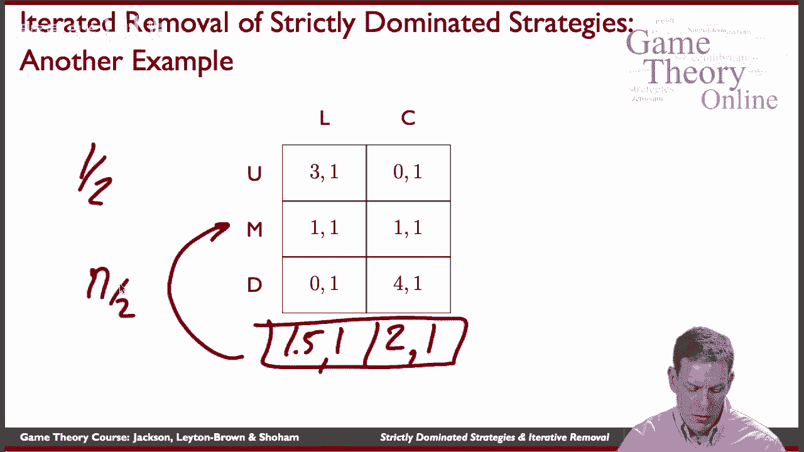

|       | L   | C   |
| :---- | :-- | :-- |
| **U** | 1,2 | 1,3 |
| **M** | 2,2 | 0,1 |
| **D** | 0,3 | 2,1 |

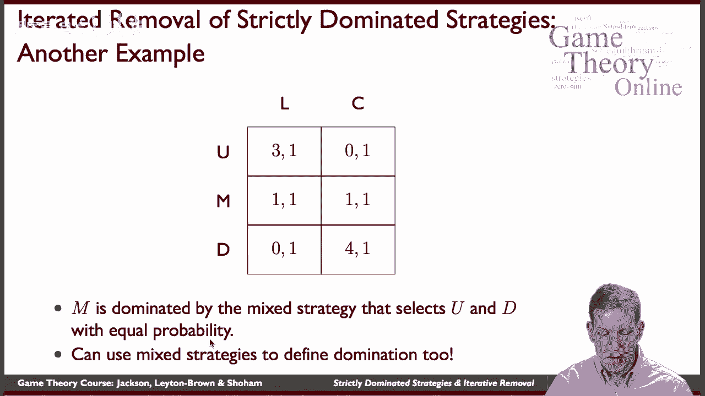

**第二步：** 在简化博弈中，对于**列玩家**，策略L被策略C严格支配吗？
*   当行玩家选U：L收益2，C收益3。C更好。
*   当行玩家选M：L收益2，C收益1。L更好。
*   当行玩家选D：L收益3，C收益1。L更好。
不是严格支配。对于**行玩家**，策略M被策略U严格支配吗？
*   当列玩家选L：M收益2，U收益1。M更好。
*   当列玩家选C：M收益0，U收益1。U更好。
不是。策略M被策略D严格支配吗？
*   当列玩家选L：M收益2，D收益0。M更好。
*   当列玩家选C：M收益0，D收益2。D更好。
不是。策略U被策略D严格支配吗？
*   当列玩家选L：U收益1，D收益0。U更好。
*   当列玩家选C：U收益1，D收益2。D更好。
不是。但是，**策略U被策略M严格支配吗**？
*   当列玩家选L：U收益1，M收益2。M更好。
*   当列玩家选C：U收益1，M收益0。M更差。
不是。似乎没有纯策略间的严格支配。然而，**策略U被一个混合策略（例如，以概率0.6选M，0.4选D）严格支配**？计算期望收益：
*   对L：0.6*2 + 0.4*0 = 1.2 > 1
*   对C：0.6*0 + 0.4*2 = 0.8 < 1
不成立。我们需要一个混合策略，使其对L和C的收益都大于1。设混合策略为(p, 1-p)在M和D上。
*   对L收益：2p + 0(1-p) = 2p > 1 => p > 0.5
*   对C收益：0p + 2(1-p) = 2-2p > 1 => p < 0.5
矛盾。因此，**在仅考虑纯策略时，这个简化博弈没有严格劣势策略，迭代去除停止**。但课程中演示的示例有不同收益，并最终收敛到(D, C)。为了匹配课程思路，我们采用课程中的第一个收益矩阵示例（能迭代至唯一解），其过程如下：
1.  列玩家的R被C严格支配，移除R。
2.  在剩余博弈中，行玩家的U和M被D严格支配（需具体收益支持），移除U和M。
3.  在只剩行玩家D的情况下，列玩家的L被C严格支配，移除L。
4.  最终剩下(D, C)。

此过程表明，通过迭代去除，我们可以从一个复杂博弈得到一个唯一预测(D, C)，而这正是该博弈**唯一的纳什均衡**。

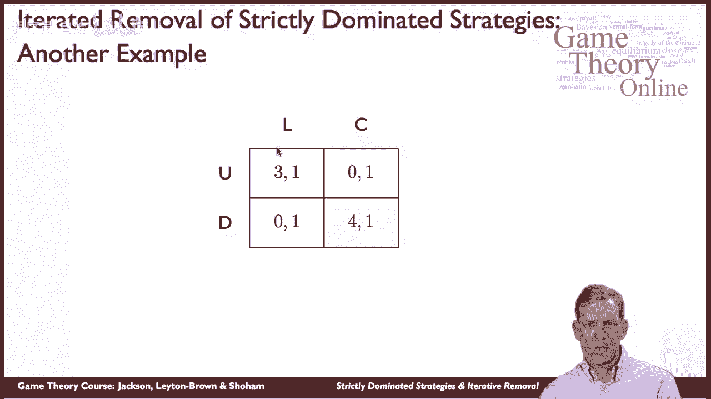

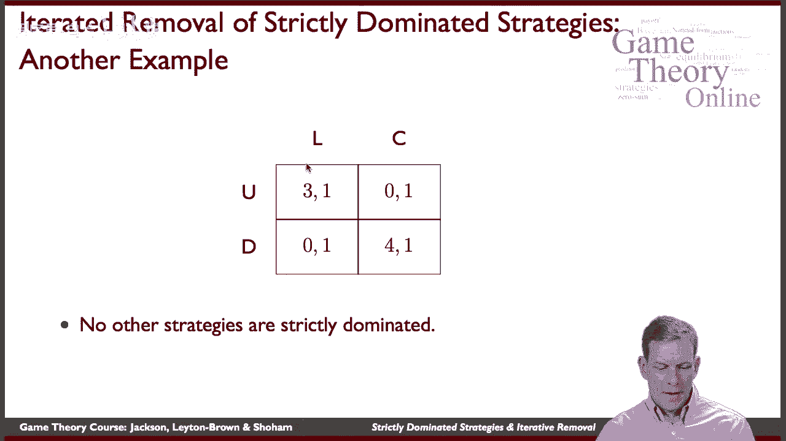

---

## 应用示例（二）：混合策略支配 🎲

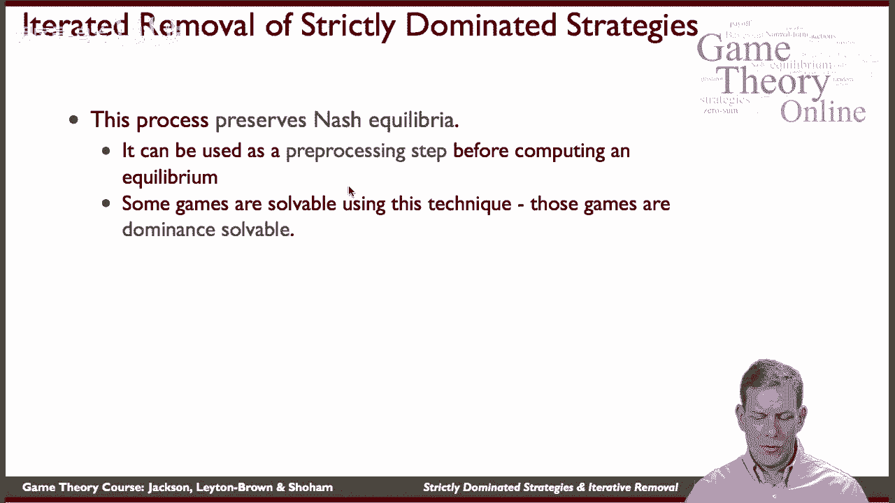

现在考虑一个收益稍作修改的博弈：

|       | L   | C   | R   |
| :---- | :-- | :-- | :-- |
| **U** | 3,0 | 0,1 | 0,0 |
| **M** | 1,0 | 1,1 | 1,0 |
| **D** | 0,0 | 4,1 | 5,0 |

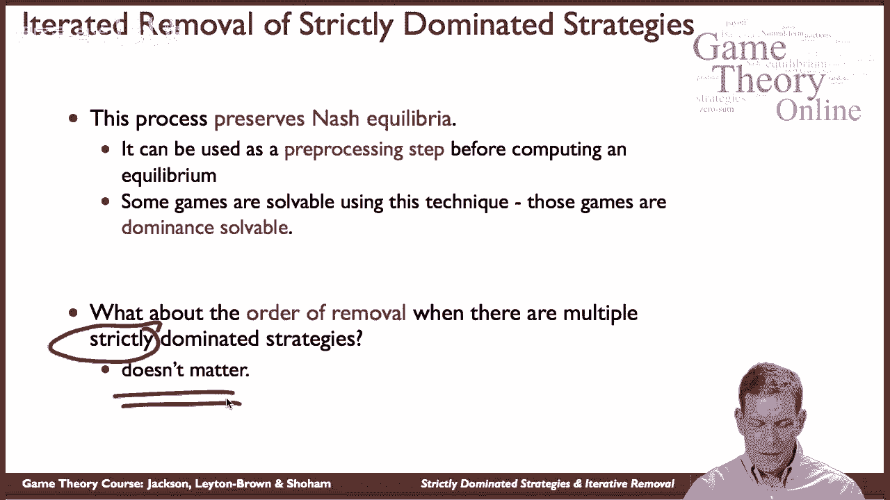

**第一步：** 列玩家的R被L或C严格支配（收益总是0，而L或C至少得1或0），移除R。
**第二步：** 在简化博弈中，检查行玩家的纯策略。U、M、D之间没有纯策略的严格支配关系。但是，考虑一个**混合策略**：以50%概率选U，50%概率选D。
*   当列玩家选L：期望收益 = 0.5*3 + 0.5*0 = 1.5
*   当列玩家选C：期望收益 = 0.5*0 + 0.5*4 = 2
这个混合策略的收益(1.5, 2) **严格大于** 策略M的收益(1, 1)。因此，**策略M被这个混合策略严格支配**。移除M。
**第三步：** 在进一步简化的博弈（只有U和D对L和C）中，没有严格劣势策略。迭代停止。

此时，博弈被大大简化，更容易进一步分析纳什均衡（实际上这个博弈有多个均衡）。这个例子展示了，即使纯策略间没有支配关系，**混合策略也可能产生支配关系**，从而推动迭代去除过程。

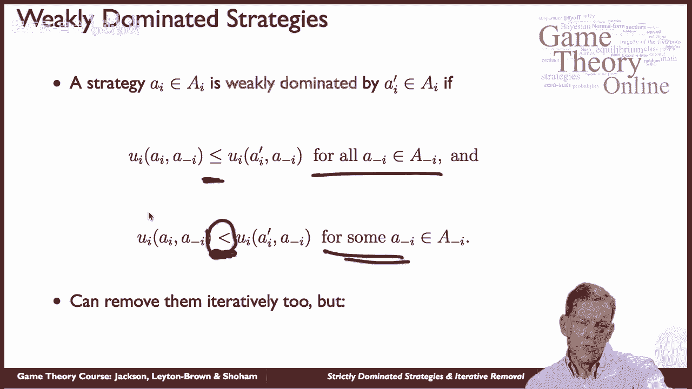

---

## 重要性质与讨论 💡

### 与纳什均衡的关系
严格劣势策略的迭代去除有一个良好性质：它**不会消除任何纳什均衡**。所有纳什均衡都包含在最终剩下的子博弈中。因此，在计算纳什均衡前，可以先使用此方法简化博弈。

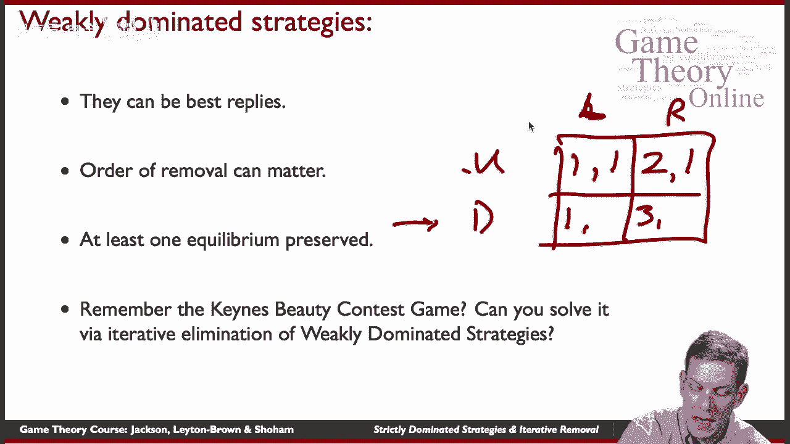

### 去除顺序的重要性
对于**严格**劣势策略，移除的顺序**不影响**最终结果。无论按什么顺序移除，最终得到的策略集合是相同的。
然而，对于**弱劣势策略**（一个策略总是至少和另一个一样好，有时严格更好），情况则不同：
*   弱劣势策略仍可能是一个纳什均衡的最佳反应。
*   迭代去除弱劣势策略可能会消除某些纳什均衡。
*   移除的顺序**会影响**最终结果。

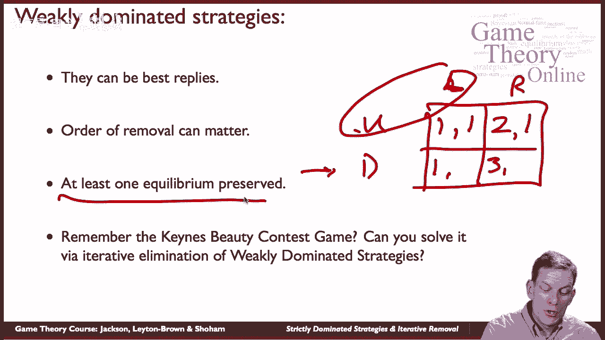

因此，弱劣势策略的去除逻辑不如严格劣势策略那样坚实可靠，但在某些分析中（如“选美比赛”博弈）仍是有用的思考工具。

---

## 现实意义与总结 🏁

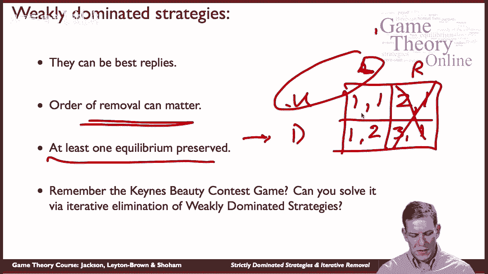

本节课中，我们一起学习了严格支配策略与迭代去除这一博弈论工具。

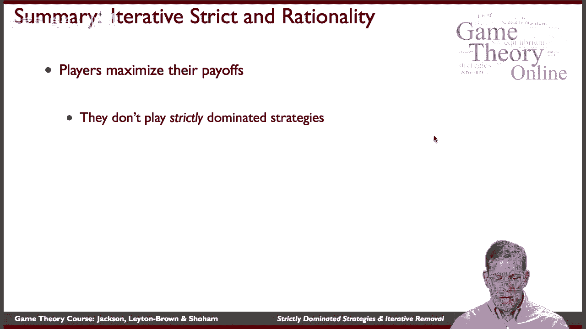

我们首先明确了理性玩家不会选择严格劣势策略这一基本原则。然后，我们学习了如何通过迭代地识别并移除这些策略，逐步简化博弈，最终得到基于共同理性知识的预测结果。这个过程形式严谨，对于严格支配而言顺序无关，并且能保留所有纳什均衡。

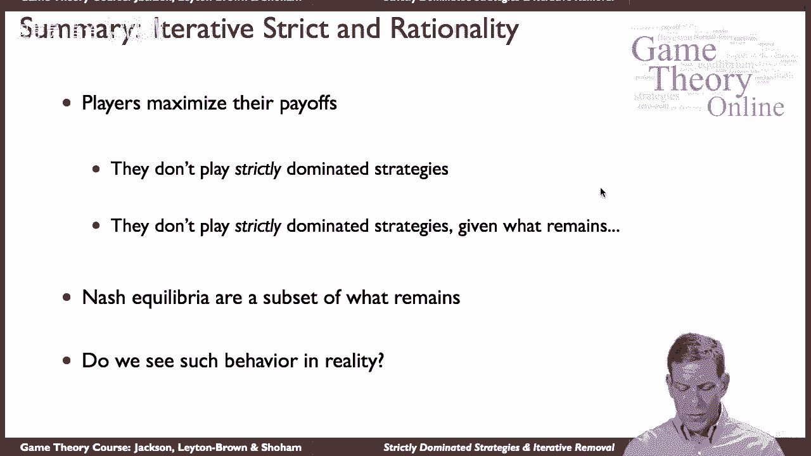

总结来说，严格劣势策略的迭代去除是一个强大的“预处理”工具。它既能帮助我们在某些博弈中直接得到唯一预测（优势可解博弈），也能在分析更复杂博弈时，通过简化收益矩阵来降低寻找纳什均衡的难度。理解这一概念，有助于我们更深入地思考博弈中的理性推理过程。