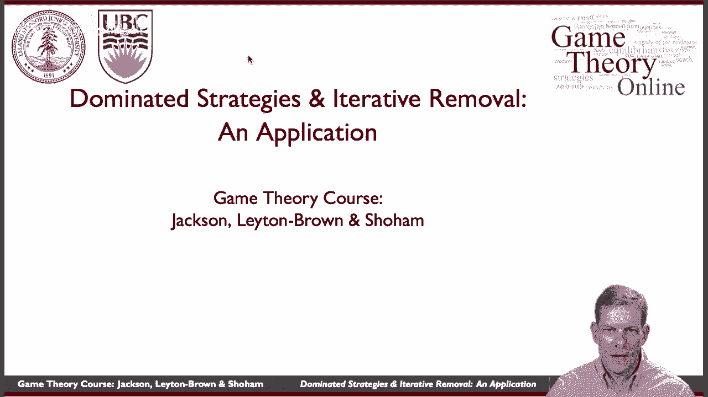
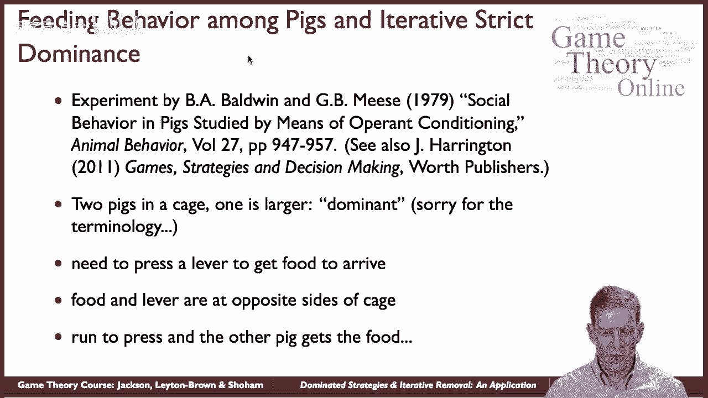
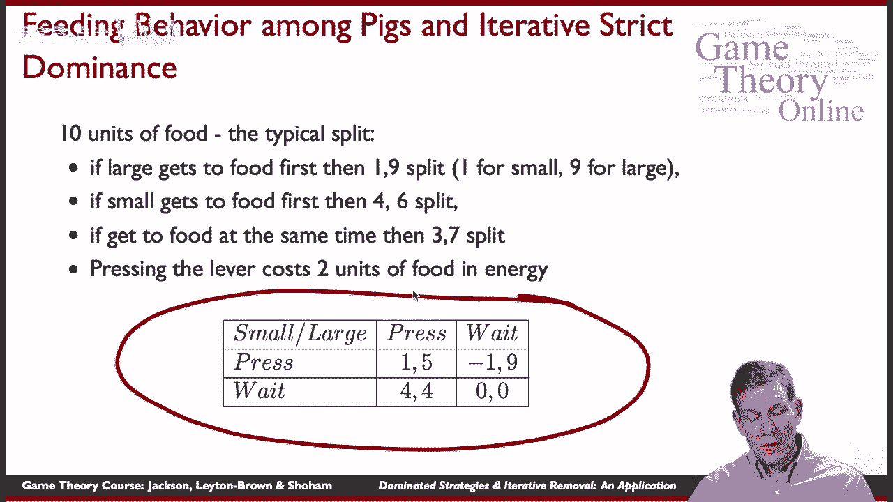
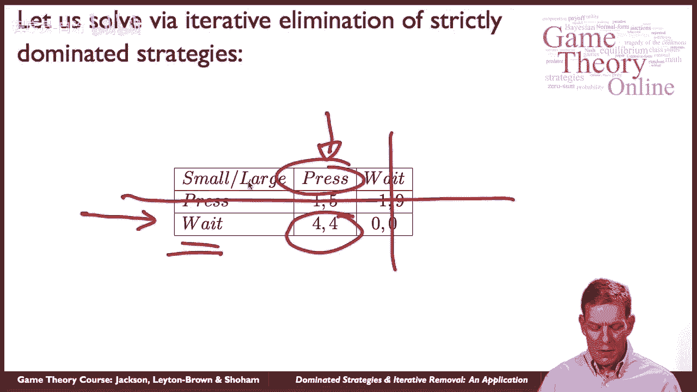
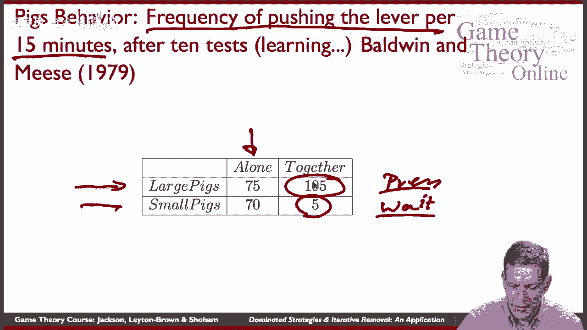
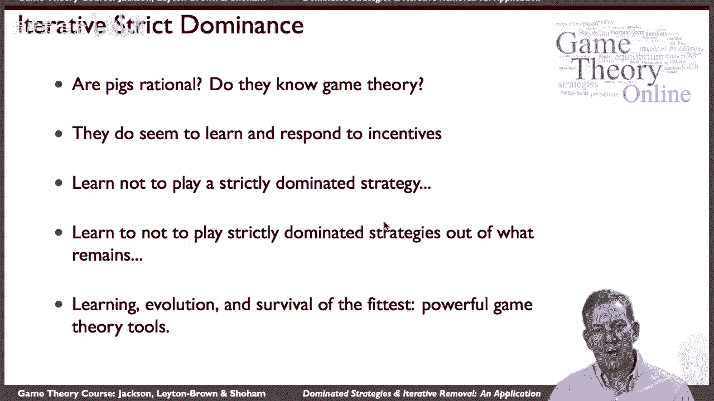

# 21：优势策略与迭代去除的一个应用 🐷

在本节课中，我们将学习如何应用“严格占优策略的迭代消除”这一博弈论工具，来分析一个关于猪的社会行为的经典实验。我们将通过一个简单的矩阵游戏来理解猪的行为，并验证理论预测是否与实际观察相符。

## 实验背景与游戏设定

上一节我们介绍了严格占优策略的概念，本节中我们来看看它在现实中的一个有趣应用。这个应用基于鲍德温和米斯在20世纪70年代末进行的一个实验，旨在观察猪的社会行为。

实验场景如下：一个笼子里关着两头猪，一头较大，一头较小。笼子一侧有一个控制杆，按下后食物会出现在笼子的另一侧。猪需要跑到一侧按下杠杆，再跑回另一侧才能吃到食物。关键在于，当两头猪都在笼中时，较大的猪在争夺食物时具有优势。

以下是关于收益的基本设定：
*   食物总量为10个单位。
*   如果大猪先吃到食物，分配比例是9:1（大猪得9，小猪得1）。
*   如果小猪先吃到食物，分配比例是6:4（大猪得6，小猪得4）。
*   如果两头猪同时吃到食物，分配比例是7:3（大猪得7，小猪得3）。
*   此外，跑过去按压杠杆需要消耗能量，相当于损失2个单位的食物。

## 构建博弈矩阵

基于以上设定，我们可以为两头猪构建一个简单的标准式博弈。每头猪都有两个策略：**按压杠杆**或**等待**。

收益矩阵如下（收益顺序为：`小猪, 大猪`）：

| 小猪 \ 大猪 | 按压杠杆 | 等待 |
| :--- | :--- | :--- |
| **按压杠杆** | (1, 5) | (-1, 9) |
| **等待** | (4, 4) | (0, 0) |

**收益计算示例**：
*   **（按压，按压）**：同时吃到，按7:3分配，但各自消耗2。小猪收益：`3 - 2 = 1`；大猪收益：`7 - 2 = 5`。
*   **（按压，等待）**：小猪按压，大猪等待。大猪先吃，按9:1分配，但小猪消耗2。小猪收益：`1 - 2 = -1`；大猪收益：`9 - 0 = 9`。
*   **（等待，按压）**：大猪按压，小猪等待。小猪先吃，按6:4分配。小猪收益：`4 - 0 = 4`；大猪收益：`6 - 2 = 4`。
*   **（等待，等待）**：无人按压，无食物。收益为 `(0, 0)`。

## 应用迭代消除严格劣势策略

现在，我们使用“迭代消除严格劣势策略”来分析这个博弈。

首先，观察小猪的策略。无论大猪选择“按压”还是“等待”，小猪选择“等待”的收益（4或0）总是高于选择“按压”的收益（1或-1）。因此，对小猪而言，“按压杠杆”是一个**严格劣势策略**。

根据理性人假设，小猪不会选择严格劣势策略。因此，我们可以从博弈中剔除小猪的“按压”策略。

剔除后的简化博弈如下：

| 小猪 \ 大猪 | 按压杠杆 | 等待 |
| :--- | :--- | :--- |
| **等待** | (4, 4) | (0, 0) |

现在，大猪面临一个简单的选择。在小猪必然“等待”的前提下，大猪选择“按压”的收益是4，选择“等待”的收益是0。因此，大猪的理性选择是**按压杠杆**。

通过迭代消除严格劣势策略，我们得到的预测结果是：**小猪选择等待，大猪选择按压杠杆**。

## 实验结果与理论预测对比

理论分析给出了清晰的预测。那么，实验中的猪的实际行为是否符合呢？

实验分为两个阶段：
1.  让猪单独在笼中学习按压杠杆获取食物。
2.  将两头猪放在一起观察其行为。

以下是每15分钟内按压杠杆的频率数据：
*   **单独时**：大猪约75次，小猪约70次。它们都积极地按压杠杆。
*   **在一起时**：大猪按压约80次，小猪按压仅约5次。

实验结果与博弈论的预测高度一致：当两头猪共处时，**主要由大猪承担按压杠杆的工作，而小猪则多数时间在食槽边等待**。小猪学会了不玩那个对自己不利的“按压”策略，而大猪则在剩下的策略中选择了对自己更有利的“按压”。

## 课程总结

本节课中，我们一起学习了如何将“严格占优策略的迭代消除”应用于分析一个具体的生物行为实验。

我们首先根据实验设定构建了收益矩阵，然后通过逐步剔除严格劣势策略，推导出理性的行为预测。最后，我们将理论预测与实验结果对比，发现二者高度吻合。

这个案例表明，即使参与者（如猪）并不懂得博弈论公式，但在重复的互动中，它们能够通过经验学习并避免总是带来更低回报的策略，其行为最终会收敛于理论预测的均衡。这展示了博弈论基本工具在解释和预测互动行为方面的强大力量。