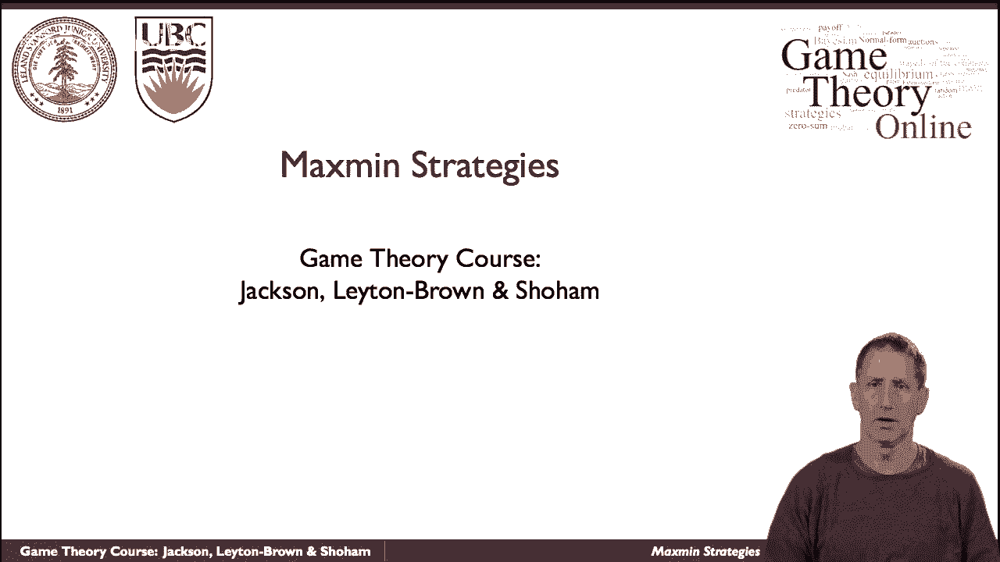
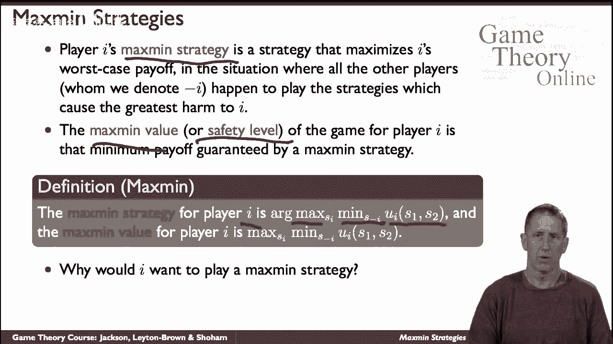
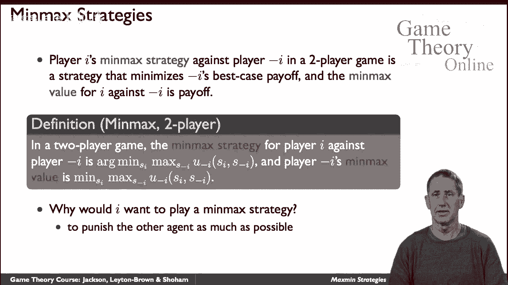
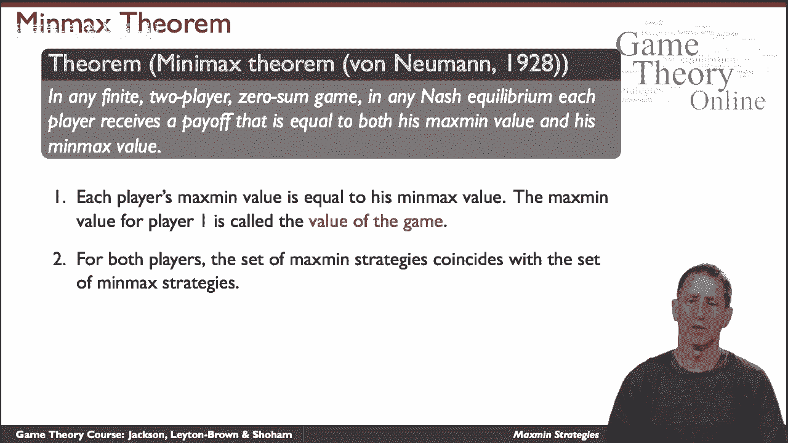
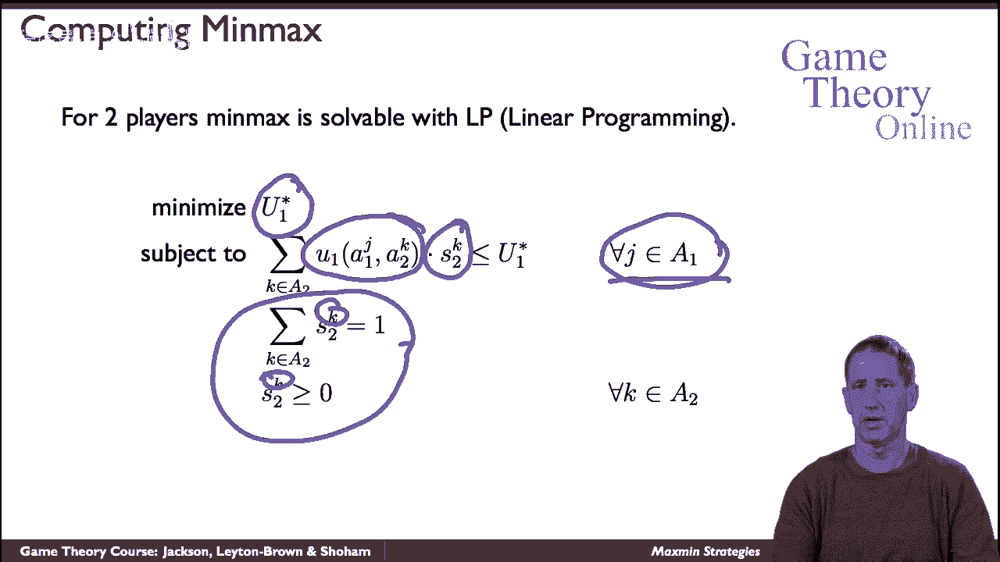

# 22：最大最小策略 🎲

在本节课中，我们将要学习博弈论中的两个核心概念：**最大最小策略**与**最小最大策略**。我们将探讨它们的定义、区别、在零和博弈中的意义，以及如何通过线性规划来求解。

---

## 最大最小策略：保护最坏情况

上一节我们介绍了博弈的基本概念，本节中我们来看看**最大最小策略**。这种策略在零和博弈的背景下特别有意义，但也适用于所有类型的博弈。

**最大最小策略**是一种策略，它旨在最大化玩家在最坏情况下的收益。换句话说，玩家假设对手会采取行动来最小化自己的收益，并据此选择能保证自己获得最高“最低收益”的策略。

以下是最大最小策略的正式定义：

*   设玩家 *i* 的收益函数为 *u_i*。
*   玩家 *i* 的**最大最小策略** *s_i* 满足：
    *s_i* ∈ arg max_{s_i} min_{s_{-i}} u_i(s_i, s_{-i})*
*   该策略所保证的收益值称为**最大最小值**：
    *v_i = max_{s_i} min_{s_{-i}} u_i(s_i, s_{-i})*

为什么我们要考虑这种策略？原因有很多：可能是出于谨慎，假设对手会犯错或并非完全理性；也可能是因为我们不完全了解对手的收益函数；或者简单地出于一种“偏执”的假设，认为对手就是来针对你的。

---

## 最小最大策略：限制对手最佳情况

理解了如何保护自己后，我们再来看看如何主动限制对手。**最小最大策略**是针对双人博弈中另一名玩家的策略，其目标是**最小化对手的最大可能收益**。这里假设对手会试图最大化他们自己的收益。

以下是玩家 *i* 的最小最大策略的正式定义：

*   玩家 *i* 的**最小最大策略** *s_i* 满足：
    *s_i* ∈ arg min_{s_i} max_{s_{-i}} u_{-i}(s_i, s_{-i})*
*   该策略给对手带来的最高收益值称为**最小最大值**。

你可能会问，为什么一个玩家会想去伤害另一个玩家？一种可能是出于恶意。但在**零和博弈**中，情况变得非常自然：因为一方的收益等于另一方的损失（*u_1 + u_2 = 0*），所以**最小化对手的收益，就等同于最大化自己的收益**。

---

## 零和博弈中的等价性与鞍点

在零和博弈中，最大最小策略和最小最大策略有着深刻而优美的联系。这由约翰·冯·诺依曼的**最小最大定理**所揭示。

该定理指出：在两人零和博弈中，任何纳什均衡下，玩家1的收益都等于他的最大最小值，也等于玩家2的最小最大值。这个共同的值被称为**博弈的值**。

这意味着：
1.  最大最小策略集与最小最大策略集是相同的。
2.  任何最大最小策略组合（或最小最大策略组合）都构成一个纳什均衡。
3.  所有纳什均衡的收益都相同，即博弈的值。

我们可以通过图形来直观理解。以“猜硬币”游戏为例，其唯一的纳什均衡是双方各以50%的概率随机选择“正面”或“反面”。在收益函数的三维图像中，这个均衡点像一个**鞍点**：在一个方向上（玩家1的视角）它是最大值点，在另一个方向上（玩家2的视角）它是最小值点，因此双方都没有动机单方面偏离。

---

## 通过线性规划求解

理论上，我们可以利用最小最大定理，通过求解一个**线性规划**问题来计算零和博弈的均衡及其值。

以下是从玩家2的视角构建的线性规划，目标是**最小化博弈的值 *u***（即玩家1的收益）：

**目标**：最小化 *u*
**约束条件**：
1.  对于玩家1的每一个纯策略 *j*：
    *Σ_k (p_k * payoff_1(j, k)) ≤ u*
    （即：无论玩家1选择哪种纯策略，其期望收益都不超过 *u*）
2.  *Σ_k p_k = 1*
    （玩家2的混合策略概率之和为1）
3.  *p_k ≥ 0* 对于所有 *k*
    （概率非负）

这个线性规划的最优解 *u\** 就是博弈的值，而对应的 *{p_k}* 就是玩家2在均衡中的混合策略（即最小最大策略）。我们可以为玩家1构建一个对称的线性规划来求解其策略。

线性规划是有效可解的，这为我们提供了一种计算零和博弈均衡的通用方法。

---

## 总结

本节课中我们一起学习了：
1.  **最大最小策略**：一种保守策略，旨在最大化自身在最坏情况下的收益。
2.  **最小最大策略**：一种攻击性策略，旨在最小化对手在最佳情况下的收益。
3.  在**零和博弈**中，这两者是等价的，共同定义了**博弈的值**，并且其策略组合构成**纳什均衡**。
4.  我们可以通过求解**线性规划**来具体计算零和博弈的均衡解。

理解这些概念是分析冲突、竞争和策略互动情境的基石。