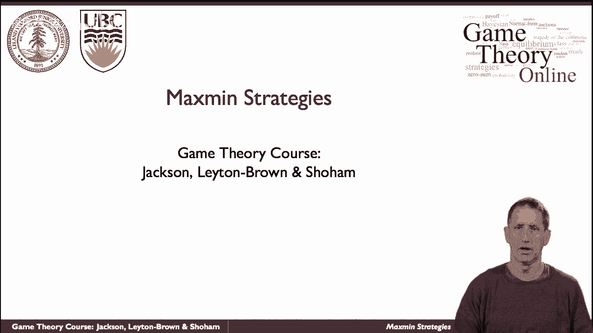
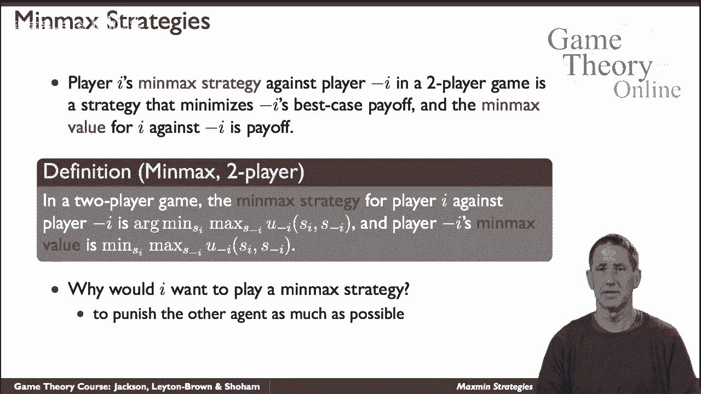
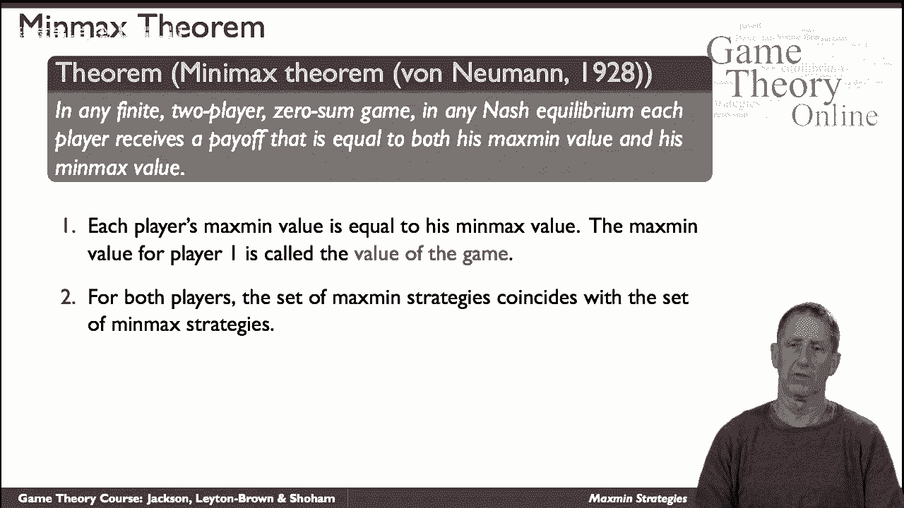
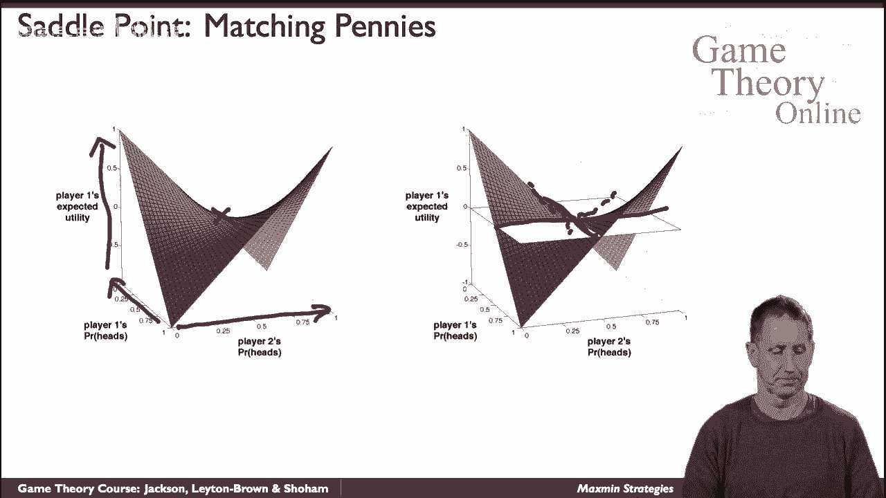
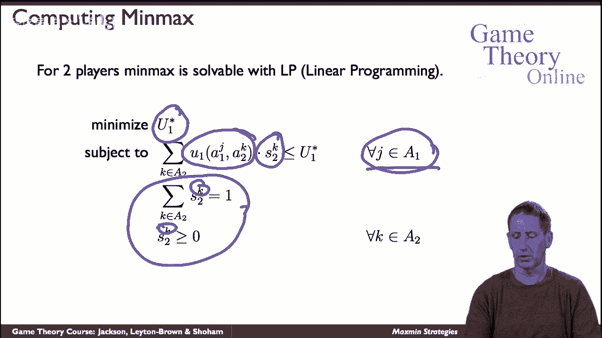

# 23：最大最小策略 🎲

在本节课中，我们将学习博弈论中的一个核心概念——最大最小策略。我们将探讨它在零和博弈中的特殊意义，并学习如何通过它来求解纳什均衡。

## 概述

最大最小策略是一种决策方法，它假设对手总是试图最小化你的收益。我们将首先定义最大最小策略和最小最大策略，然后通过一个具体的点球游戏示例，展示如何利用这些概念来计算零和博弈的均衡解。

## 什么是最大最小策略？

最大最小策略是一种旨在最大化玩家在最坏情况下收益的策略。它基于一个假设：对手总是会采取行动来最小化你的收益。

**公式定义**：
对于玩家 i，其最大最小策略 `s_i*` 满足：
`s_i* = argmax_{s_i} min_{s_{-i}} u_i(s_i, s_{-i})`
其中，`u_i` 是玩家 i 的收益函数，`s_{-i}` 表示除 i 以外所有其他玩家的策略组合。

该策略所保证的收益值，称为**最大最小值**。

## 什么是最小最大策略？

与最大最小策略相对应的是最小最大策略。它是指玩家 i 选择一种策略，以最小化对手在试图最大化其自身收益时所能获得的收益。

**公式定义**：
对于玩家 i，其最小最大策略 `s_i*` 满足：
`s_i* = argmin_{s_i} max_{s_{-i}} u_{-i}(s_i, s_{-i})`
其中，`u_{-i}` 是玩家 i 的对手的收益函数。

该策略对应的值称为**最小最大值**。

## 为何在零和博弈中特别重要？

在零和博弈中，一方的收益等于另一方的损失。因此，最大化自己的最坏情况收益（最大最小策略）与最小化对手的最佳情况收益（最小最大策略）本质上是同一件事。

根据冯·诺依曼的最小最大定理，在两人零和博弈中，任何纳什均衡下玩家的收益都等于其最大最小值，也等于其最小最大值。这个值被称为**博弈的值**。这意味着，在零和博弈中，最大最小策略集与最小最大策略集是相同的，并且任何这样的策略组合都构成一个纳什均衡。

## 示例：点球游戏

为了具体理解，我们来看一个点球游戏的例子。游戏中有两名玩家：踢球者（玩家1）和守门员（玩家2）。这是一个零和博弈。

**收益矩阵**如下（收益为踢球者进球的概率）：

|            | 守门员向左 | 守门员向右 |
| :--------- | :--------: | :--------: |
| 踢球者向左 |    0.6     |    0.9     |
| 踢球者向右 |    0.7     |    0.4     |

假设踢球者以概率 `p` 踢向左，守门员以概率 `q` 扑向左。

### 踢球者的最大最小策略

踢球者要选择 `p` 以最大化其最坏情况下的收益。守门员会选择 `q` 来最小化踢球者的收益。

踢球者的期望收益 `U1` 为：
`U1(p, q) = p * [q*0.6 + (1-q)*0.9] + (1-p) * [q*0.7 + (1-q)*0.4]`

整理后，得到关于 `q` 的表达式：
`U1(p, q) = q * [0.6p + 0.7(1-p) - 0.9p - 0.4(1-p)] + [0.9p + 0.4(1-p)]`
`= q * [-0.3p + 0.3(1-p)] + [0.9p + 0.4(1-p)]`
`= q * (0.3 - 0.6p) + (0.4 + 0.5p)`

对于踢球者选定的任何一个 `p`，守门员都会选择 `q` 来最小化 `U1`。观察上式，`q` 的系数是 `(0.3 - 0.6p)`。
*   若系数为正，守门员令 `q = 0` 以最小化收益。
*   若系数为负，守门员令 `q = 1` 以最小化收益。
*   若系数为零，守门员的任何选择对收益无影响。

踢球者为了最大化这个被最小化后的收益，最佳选择是让系数为零，即 `0.3 - 0.6p = 0`，解得 `p = 0.5`。

因此，踢球者的最大最小策略是**以50%的概率随机选择踢向左或右**。此时博弈的值 `v = 0.4 + 0.5*0.5 = 0.65`。

### 守门员的最小最大策略

守门员要选择 `q` 以最小化踢球者的最大可能收益。踢球者会对任何 `q` 选择 `p` 来最大化自己的收益。

再次使用收益函数 `U1(p, q)`，但这次整理成关于 `p` 的表达式：
`U1(p, q) = p * [0.6q + 0.9(1-q) - 0.7q - 0.4(1-q)] + [0.7q + 0.4(1-q)]`
`= p * [0.2 - 0.6q] + (0.4 + 0.3q)`

对于守门员选定的任何一个 `q`，踢球者都会选择 `p` 来最大化 `U1`。观察 `p` 的系数 `(0.2 - 0.6q)`。
*   若系数为正，踢球者令 `p = 1` 以最大化收益。
*   若系数为负，踢球者令 `p = 0` 以最大化收益。
*   若系数为零，踢球者的任何选择对收益无影响。

守门员为了最小化这个被最大化后的收益，最佳选择是让系数为零，即 `0.2 - 0.6q = 0`，解得 `q = 1/3 ≈ 0.333`。

因此，守门员的最小最大策略是**以约1/3的概率扑向左，2/3的概率扑向右**。可以验证，此时踢球者的最大收益也是 `0.65`。

## 线性规划求解法

对于更一般的零和博弈，我们可以通过线性规划来高效地求解最大最小策略（即纳什均衡）。

从玩家1（最大化者）的角度，可以构建如下线性规划模型：
**目标**：最大化博弈的值 `V`
**约束条件**：
1.  对于玩家2的每一个纯策略 `j`，玩家1的期望收益不超过 `V`：`∑_{i} (p_i * u1(i, j)) ≤ V`， 其中 `p_i` 是玩家1选择行动 `i` 的概率。
2.  概率分布约束：`∑_{i} p_i = 1`， 且 `p_i ≥ 0`。

求解这个线性规划，得到的最优解 `p_i*` 就是玩家1的最大最小策略，最优目标值 `V*` 就是博弈的值。类似地，可以从玩家2的角度构建另一个线性规划来求解其策略。

## 总结

本节课我们一起学习了博弈论中的最大最小策略与最小最大策略。
*   我们明确了它们的定义：最大最小策略旨在最大化自身的最坏情况收益；最小最大策略旨在最小化对手的最佳情况收益。
*   我们了解到，在两人零和博弈中，这两个概念通过**最小最大定理**统一起来，其策略集相同，并构成纳什均衡，对应的收益称为**博弈的值**。
*   我们通过**点球游戏**的实例，一步步演示了如何计算双方的最大最小策略与最小最大策略，并验证了它们如何达成均衡。
*   最后，我们介绍了求解一般零和博弈均衡的**线性规划方法**，这为分析更复杂的场景提供了工具。

理解最大最小策略是分析竞争性、对抗性局面的基础，它提供了一种稳健的、基于安全边际的决策思路。