# 24：博弈的相关均衡 🎲

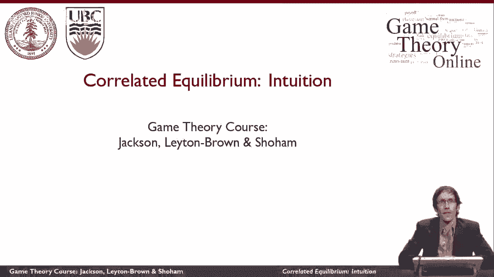

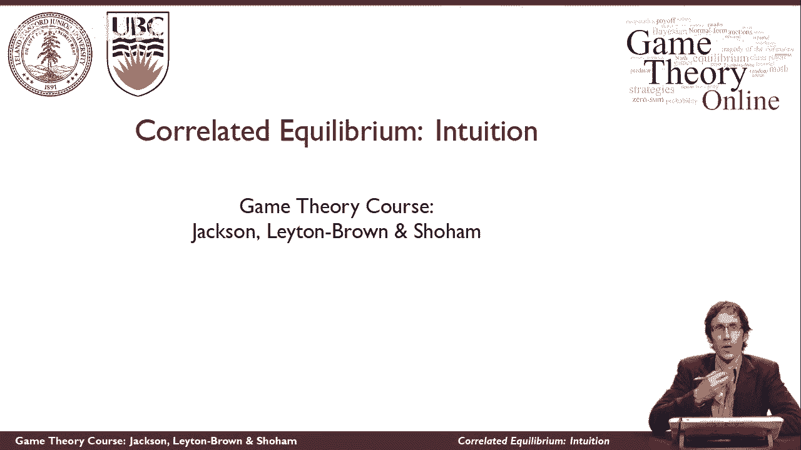

在本节课中，我们将学习博弈论中的一个重要解概念——**相关均衡**。我们将通过经典的“性别之战”和“交通博弈”例子，直观地理解为什么纳什均衡有时并不令人满意，以及如何通过引入一个外部随机装置（如抛硬币或交通灯）来协调行动，实现更公平、更有效率的结果。最后，我们会正式定义相关均衡，并理解它如何推广了纳什均衡的概念。

---

## 从“性别之战”看纳什均衡的局限 🤔

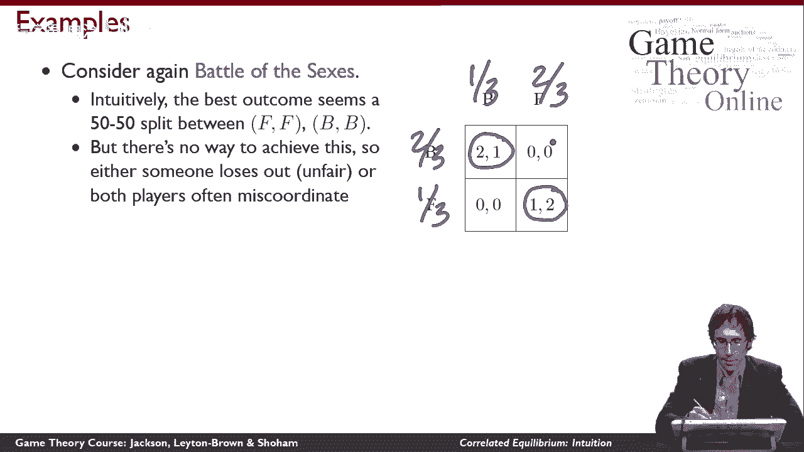

上一节我们介绍了纳什均衡。现在，让我们再回顾一下“性别之战”游戏，并思考它的纳什均衡。

在“性别之战”中，存在两个纯策略纳什均衡：（芭蕾，芭蕾）和（足球，足球）。此外，还存在一个混合策略纳什均衡，即双方参与者以特定概率随机选择行动。这意味着在混合均衡下，所有四种可能的结果（包括双方选择不一致的“错误协调”结果）都可能以一定的概率发生。

从直观上看，对于真正想在一起的伴侣来说，最理想的结果是公平地轮流满足彼此的偏好，即一半时间一起看芭蕾，一半时间一起看足球。然而，混合策略纳什均衡并不能保证这种公平性，因为它允许“错误协调”发生。双方之所以愿意坚持混合策略，是因为任何单方面偏离都不会带来额外收益，但这并不意味着结果本身是稳定或令人满意的。

---

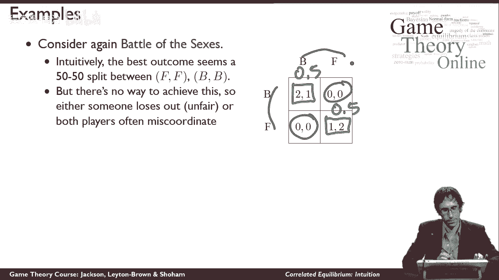

## “交通博弈”与协调的直觉 🚗

为了更深入地理解这个问题，我们可以看看另一个例子：“交通博弈”。

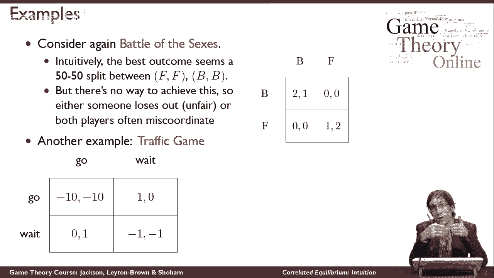

这个模型模拟了两辆车同时到达十字路口的情况。每辆车必须决定是“等待”还是“通过”。以下是可能的回报：
*   如果一方“通过”而另一方“等待”，则“通过”方获得高回报。
*   如果双方都“等待”，则双方获得较低的回报（因为都在浪费时间）。
*   如果双方都“通过”，则会发生最糟糕的碰撞，双方获得负回报。

与“性别之战”类似，这个博弈有两个不对称的纯策略纳什均衡：（通过，等待）和（等待，通过），以及一个混合策略均衡。

但在现实世界中，我们如何解决这个协调问题呢？我们使用**交通灯**。交通灯作为一个公平的随机装置，向司机**推荐行动**：它告诉一方“通过”，同时告诉另一方“等待”。由于交通灯是公平的（例如，通过时间分配），它完全避免了最坏的碰撞结果，并实现了公平的协调。

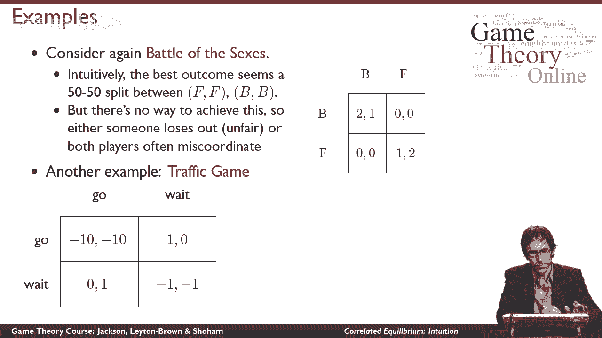

我们可以将同样的思路应用于“性别之战”：丈夫和妻子可以抛一枚公平的硬币。如果是正面，硬币“推荐”双方都选择“芭蕾”；如果是反面，则“推荐”双方都选择“足球”。这样，双方就能公平地轮流满足彼此的偏好。

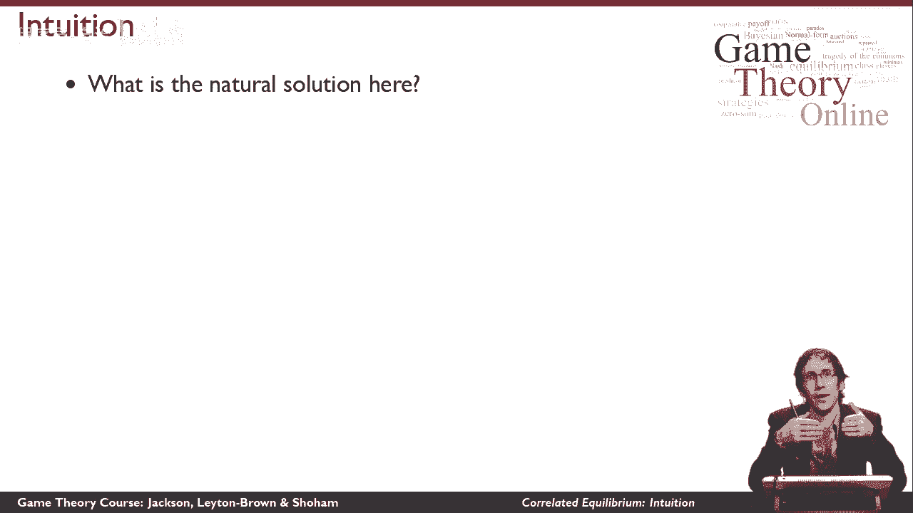

---

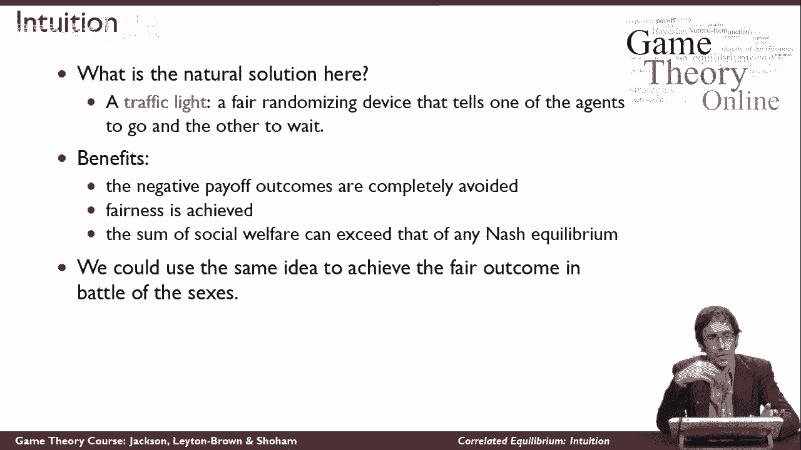

## 相关均衡的核心思想 💡

以上例子引出了**相关均衡**的核心思想。相关均衡是指，存在一个对参与者行动建议的**随机分配**（可能相关），使得每个参与者在得知给自己的建议后，都愿意遵循这个建议，而不是单方面偏离。

用更形式化的语言描述：
*   存在一个**随机化装置**（如硬币、交通灯）。
*   该装置以一定的概率分布，向所有参与者**发送可能相关的行动建议**。
*   对于每个参与者来说，在给定装置的建议分布以及其他参与者会遵循建议的信念下，**遵循建议**是最优反应。

在“性别之战”的抛硬币例子中，随机装置（硬币）的建议是：以50%概率推荐（芭蕾，芭蕾），以50%概率推荐（足球，足球）。给定对方会遵循建议，如果我单方面偏离（例如，当建议看芭蕾时我偏要去看足球），我的回报会从正数变为0。因此，我没有偏离的动机。

---

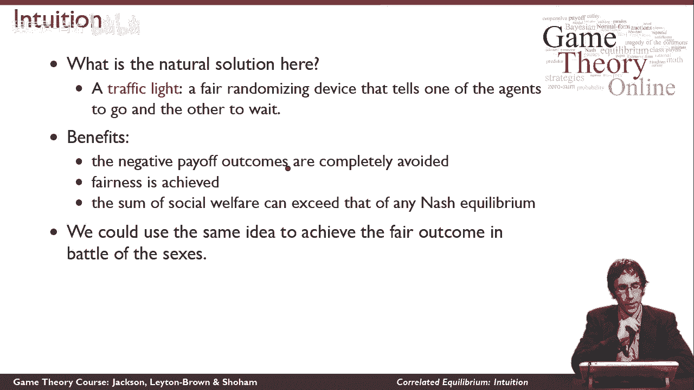

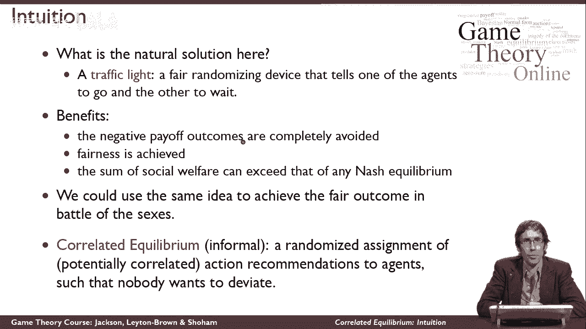

## 相关均衡与纳什均衡的关系 ⚖️

相关均衡是纳什均衡概念的**推广**。

*   如果随机装置发出的行动建议是**相互独立**的，那么相关均衡就退化为我们熟悉的**混合策略纳什均衡**。
*   如果行动建议是**相关的**（如抛硬币例子中，双方的建议总是相同），那么我们就可以得到**新的、非纳什的均衡结果**，这些结果可能更公平或具有更高的社会福利。

因此，相关均衡集合包含了所有纳什均衡，并且通常更大。它是一个“更弱”但“更广”的解概念，为我们分析和设计协调机制提供了更强大的工具。

---

## 本节总结 📚

本节课中，我们一起学习了**相关均衡**这一概念。

1.  我们首先从“性别之战”和“交通博弈”入手，发现了纳什均衡（尤其是混合策略均衡）在解决协调问题时可能无法实现公平或高效的结果。
2.  接着，我们观察到现实中通过引入外部随机装置（如交通灯、抛硬币）可以有效地协调行动，这引出了相关均衡的直觉。
3.  然后，我们正式定义了相关均衡：它是一个由随机装置生成的可能相关的行动建议分布，其中每个参与者都自愿遵循给予自己的建议。
4.  最后，我们明确了相关均衡与纳什均衡的关系：相关均衡是纳什均衡的推广，它包含了所有纳什均衡，并能产生更多样化的协调结果。

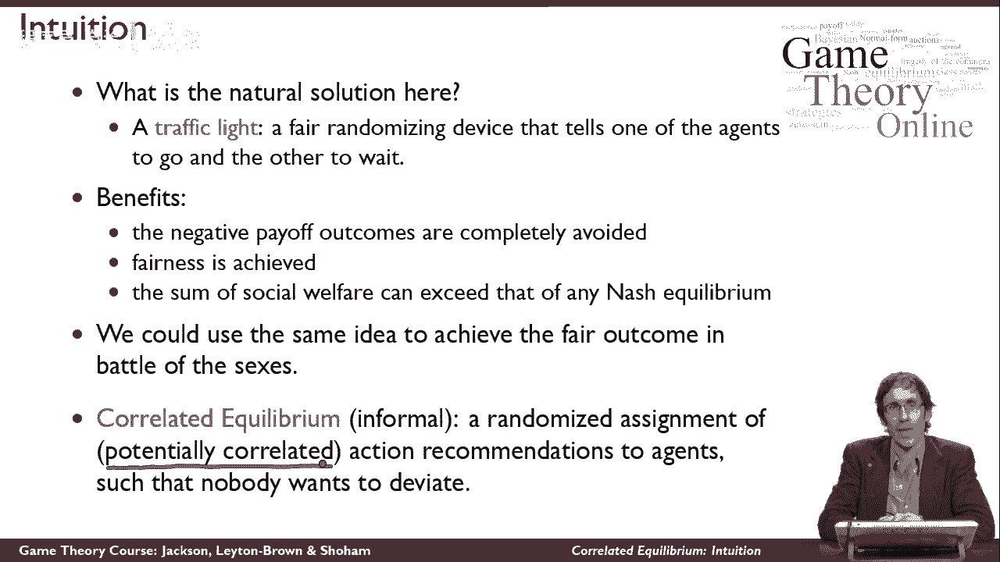

理解相关均衡，有助于我们思考如何在存在多重均衡的博弈中，通过设计简单的公共信号或机制，引导参与者走向更理想的结果。