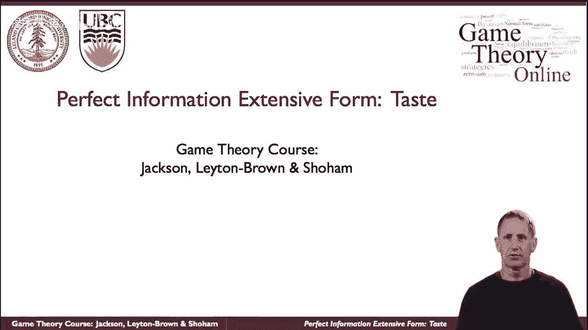
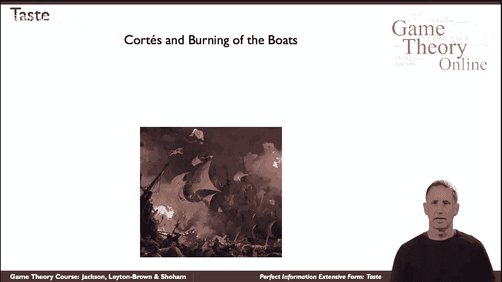
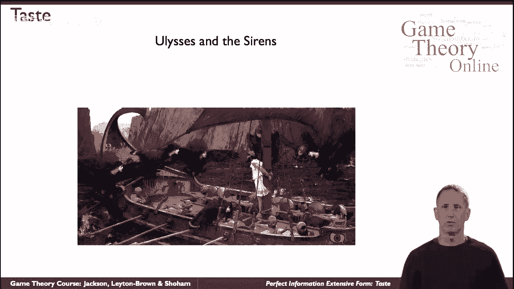

# 25：完美信息扩展式博弈入门 🎲

在本节课中，我们将学习博弈论中一个重要的建模工具——**扩展式博弈**。我们将探讨当博弈行动按时间顺序展开，并且参与者能观察到先前行动时，如何分析这种“动态”的战略互动。课程将通过著名的历史故事（如科尔特斯焚船和尤利西斯与塞壬）来阐释核心概念。

---



## 动态战略互动的重要性 ⏳

上一节我们介绍了战略形势的基本概念。本节中我们来看看**时间因素**如何对博弈产生关键影响。

有时在战略形势下，时间起着重要的作用。事情是一步一步发生的。参与者不仅按顺序行动，并且他们知道行动会按顺序发生。


时间顺序影响了参与者的行为。一个历史案例是1519年，西班牙人埃尔南·科尔特斯带领一支由11艘船和大约六百人组成的船队，即将入侵被称为美洲的大陆。他们寡不敌众，很清楚面临的巨大困难。

众所周知，当他们登陆时，科尔特斯下令烧毁船只。这一行动是否在全员协调同意下进行尚有争议，但无论如何，其背后的逻辑是清晰的：面对巨大困难时，士兵们可能会想上船逃走。通过“烧毁退路”这个行动，科尔特斯消除了选项，从而增强了部队战斗的决心。

这个例子表明，不仅行动之间存在时间间隔，而且参与者对时间顺序的认知会反过来影响战略形势的发展。我们看到，这种情况不仅出现在多个参与者（如科尔特斯和他的士兵，或两组行为者）交织的互动中，即使只有一个参与者，行动随时间展开的事实也会影响局势。

---

## 单参与者的跨期决策：承诺策略 🔗

理解了多参与者动态互动后，我们来看看即使只有一个参与者，如何通过现在的行动影响未来的选择。



另一个著名的历史故事是《尤利西斯与塞壬》。尤利西斯的船即将穿过海妖的海峡。众所周知，塞壬的歌声极具诱惑力，会使人（特别是尤利西斯自己）做出不符合自身最大利益的行为，例如跳海或使船触礁。

因此，根据传说，他命令所有船员用蜡封住耳朵。而他自己想听歌声，于是命令船员将他绑在桅杆上，并严令无论如何不能松开他。就这样，他们驶过海峡。当尤利西斯听到歌声时，他一时精神失常并试图挣脱束缚，但失败了，最终安全通过。


这里再次展示了一个单一参与者（尤利西斯）通过对未来的推理，在现在采取行动（命令捆绑自己），以改变未来的战略形势，确保最优结果。

---

## 建模工具：扩展式博弈 📊

为了形式化地模拟上述动态战略互动的情况，我们转向**扩展式博弈**这一工具。

扩展式博弈通过树状图来刻画博弈进程。以下是其核心组成部分的简要介绍：

以下是扩展式博弈的关键要素列表：
*   **节点**：表示博弈中的决策点或终点。
*   **分支**：从一个节点出发，代表一个可能的行动。
*   **信息集**：包含一个参与者无法区分的决策节点集合（在完美信息博弈中，每个信息集只包含一个节点）。
*   **支付**：在终端节点，为每位参与者标注的收益。

在**完美信息**的扩展式博弈中，每个参与者在做决策时，都完全清楚此前所有的行动历史。我们可以用以下方式简要表示一个简单的两阶段博弈：

```
博弈开始
├─ 参与者A行动 (选择左或右)
│   ├─ 左 -> 参与者B行动 -> (支付A, 支付B)
│   └─ 右 -> 参与者B行动 -> (支付A, 支付B)
└─ 博弈结束
```

这种表示法清晰地描绘了行动的先后顺序和对应的结果。

---

## 总结与回顾 🎯

本节课中，我们一起学习了博弈论中用于分析动态互动的**扩展式博弈**模型。



我们首先通过科尔特斯焚船和尤利西斯自缚两个历史案例，理解了行动按时间顺序展开以及参与者对未来进行预判的重要性。接着，我们引入了**扩展式博弈**作为形式化建模工具，并简要介绍了其基本构成要素，如节点、分支和支付。在**完美信息**的设定下，参与者对博弈历史有完全了解，这为我们后续分析解概念（如逆向归纳法）奠定了基础。

掌握扩展式博弈是分析序贯行动、承诺、威胁等动态战略现象的关键第一步。